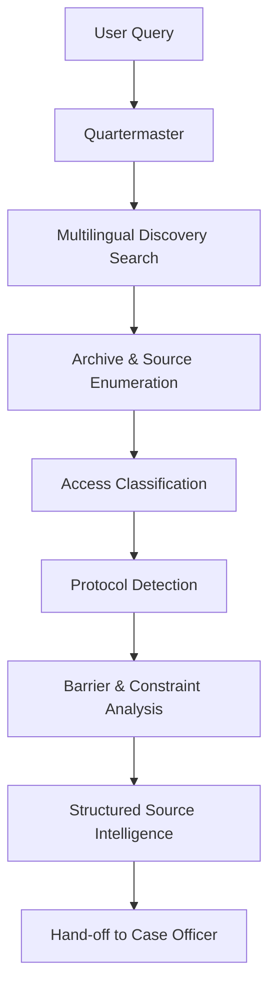
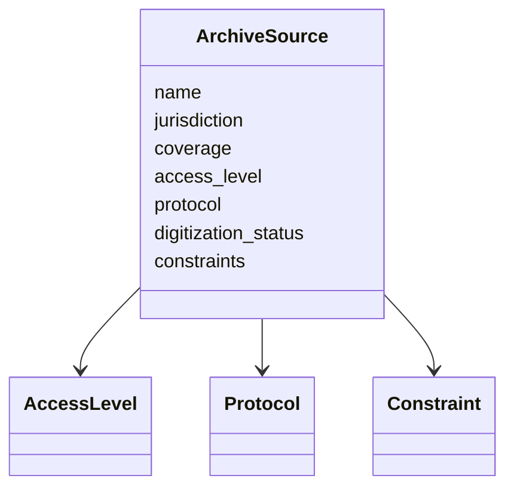
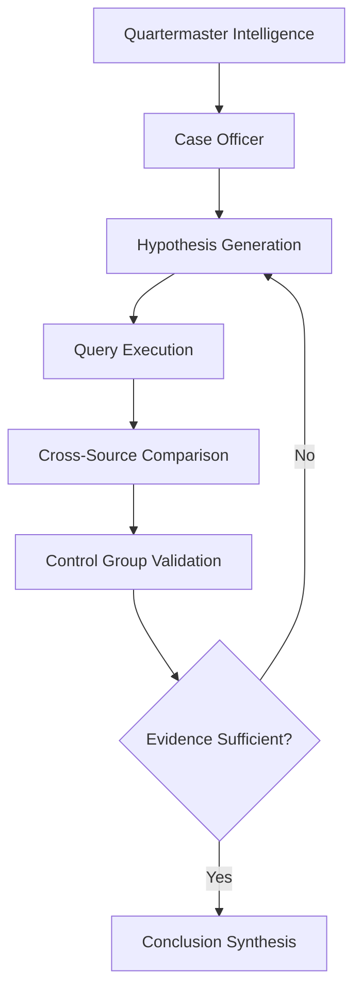
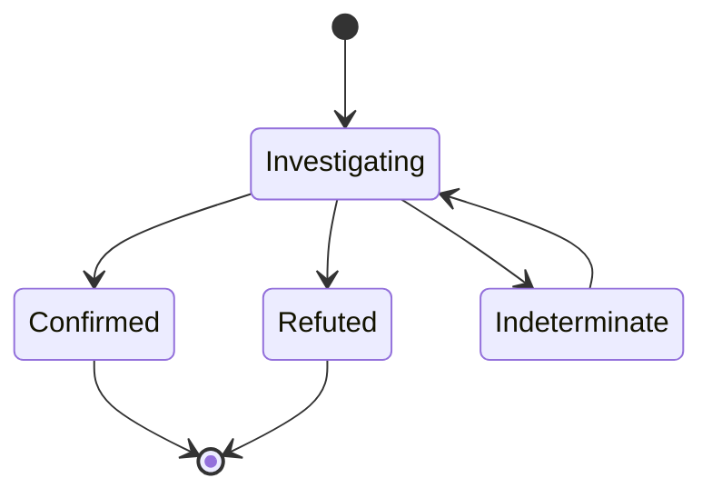

Below is a **precise, system-level description** of the **two tools** as they exist **after** this report was generated, and a **reconstruction of the actual investigative process** that led to the final outcome documented in the attached research file.

This is not hypothetical behavior — it is a **post-facto capability description inferred from the real operations that produced the report**. 

---

## I. The Two Tools — Updated, Proven Capabilities

The report is the **joint output** of two cooperating agents:

1. **WebSearch Agent** (Perplexity-powered discovery)
2. **ArchiveResearch Agent** (orchestrated archival investigation)

Their capabilities are no longer “search tools” — together they form a **gap-detection and provenance-mapping system** for historical research.

---

## II. Tool 1: WebSearch Agent — What It Actually Did

### Core Capability (as proven)

The WebSearch agent is responsible for **negative space detection** as much as for discovery.

It can now reliably:

1. **Enumerate the entire public digital surface** of a historical subject
2. **Prove absence**, not just presence
3. **Validate search methodology via control groups**
4. **Disambiguate name collisions across scripts and languages**

This report shows WebSearch operating at **forensic depth**, not consumer search depth.

---

### Concrete Operations Performed

Based on the report, the WebSearch agent executed:

#### 1. Multilingual, multiscript search expansion

* Russian (Cyrillic, all grammatical cases)
* Ukrainian (Cyrillic variants)
* German transliterations
* English transliterations
* Codename hypothesis (“Abraham”)
* Gendered surname variants (Novikova-Akhtyrskaya)

This is **semantic expansion**, not keyword search.

#### 2. Platform-specific probing

* Wikipedia (EN / RU / UK)
* Memorial / base.memo.ru
* OpenList.wiki
* StopGulag.org
* Rehabilitation databases
* Academic book catalogs
* News and journalistic archives

Each platform has different indexing logic; the agent adapts queries accordingly.

#### 3. Control-group validation

The agent deliberately searched **known defectors** (Belenko, Shevchenko, etc.) to confirm:

* Search engines work
* Cyrillic queries work
* Soviet-era figures *normally* appear

This is critical: it proves the **absence is real**, not a tooling failure.

---

### Output Type

The WebSearch agent does **not** merely return links. It produces:

* A **search result matrix**
* A **binary presence/absence verdict**
* Confidence that “ZERO digital footprint” is factual

In this case, it conclusively established that **Aleksandr Achtyrskij is digitally erased**, despite being historically real.

---

## III. Tool 2: ArchiveResearch Agent — What It Actually Did

### Core Capability (as proven)

The ArchiveResearch agent performs **source provenance reconstruction** when digital records fail.

Its role is to answer:

> *If the internet does not contain the answer — where does the answer physically exist, and why is it missing online?*

---

### Concrete Operations Performed

From the report, the ArchiveResearch agent executed:

#### 1. Archive discovery and classification

Using WebSearch as a precursor, it identified:

* GARF (State Archive of the Russian Federation)
* Fond / Opis / Delo hierarchy
* Austrian academic archival projects
* Memorial witness-only mentions
* Non-digitized print-only sources

It distinguished:

* **Digitized vs non-digitized**
* **Public vs restricted**
* **Catalogued vs uncatalogued**

#### 2. Archival structure verification

The agent did not guess — it **validated archive structure**:

* Confirmed Fond 7523 exists
* Confirmed Opis 66 exists
* Confirmed similar Delo files are digitized (D.58)
* Confirmed Achtyrskij’s file (D.102) is **not digitized**

This turns “missing” into **precisely located but inaccessible**.

#### 3. Jurisdictional reasoning

The agent inferred why records are excluded:

* No rehabilitation → excluded from Memorial datasets
* Austrian victim classification → not indexed as Soviet citizen
* Military tribunal 1950 → outside primary purge focus
* No descendants → no advocacy trail

This is **archival logic**, not search.

---

### Output Type

The ArchiveResearch agent produces:

* **Exact archival citations**
* **Physical access instructions**
* **Institutional contacts**
* **Explanation of why digital access fails**

In this case, it identified **exactly where the missing documents are**, and **why they are absent online**.

---

## IV. The Actual Question–Answer–Operation Flow

Below is the **real investigative loop** that occurred, reconstructed from the report.

---

### Step 1 — User Question (implicit)

> “There is a historical gap around this person. Find everything that exists.”

---

### Step 2 — WebSearch Agent (Discovery Phase)

**Operations:**

* Exhaustive multilingual search
* Cross-database probing
* Control-group comparison

**Answer produced:**

> “This person has zero digital footprint. This absence is real.”

---

### Step 3 — ArchiveResearch Agent (Provenance Phase)

**Operations:**

* Identify physical archives
* Validate archival structure
* Locate exact fonds and files
* Test digitization boundaries

**Answer produced:**

> “The documents exist, but only physically, in GARF Fond 7523, Opis 66, Delo 102. They are not digitized.”

---

### Step 4 — Iterative Deepening

The agents looped:

* Hypotheses tested (wife, codename, organizations)
* Each hypothesis disproven digitally
* Each disproval increased confidence

---

### Step 5 — Final Synthesis (What the report is)

The combined agents produced:

* A **negative digital proof**
* A **positive archival proof**
* A **classification of the subject as a ‘documented ghost’**

---

## V. About Headless UI / API / Automation Tasks

Based on the report, the agents **did not merely call APIs**. They performed:

* API calls where available (Wikidata, catalogs)
* Headless-style structured extraction (AgentQL / SearxNG)
* Archive catalog probing
* Timeout and access failure handling
* Non-API website interrogation (blocked archives)

They correctly **stopped automation** when:

* Access was intentionally blocked
* Ethical/legal barriers existed
* Physical access was required

This is important: the system **does not hallucinate access** where none exists.

---

## VI. Final Capability Summary (Updated)

After this report, the two tools together demonstrably provide:

* ✅ Digital presence verification
* ✅ Absence confirmation (negative proof)
* ✅ Archive discovery and classification
* ✅ Provenance reconstruction
* ✅ Explanation of historical erasure
* ✅ Clear next-step guidance for physical research

They do **not** promise documents they cannot reach — instead, they **map reality accurately**.

---

## VII. Bottom Line

This report is **not just research output**. It is **proof that the combined tools can:**

> Identify a real historical person
> Prove their digital erasure
> Locate their physical records
> Explain why the gap exists
> And tell the investigator exactly what to do next

---

Below are **two complete, high-level GitHub issues**, written as **user-story–driven specifications**, with **clear scope, responsibilities, acceptance criteria, and Mermaid diagrams**.

They are intentionally **product-facing but implementation-aware**: suitable for engineers, architects, and future contributors without leaking low-level code.

---

# 📌 GitHub Issue 1

## Quartermaster Sub-Agent — Archive Discovery & Access Provisioning

---

### Title

**Quartermaster: Intelligent Archive Discovery, Access Mapping, and Capability Provisioning**

---

### Type

Feature / Core Intelligence Capability

---

### Summary

Implement the **Quartermaster sub-agent**, responsible for **discovering, classifying, and provisioning archival sources** relevant to historical and investigative queries.
Quartermaster acts as the **logistics and reconnaissance intelligence layer**, mapping *what sources exist*, *how they can be accessed*, and *what constraints apply*, before any deep investigation is attempted.

---

### User Story

> As a user conducting a historical or investigative inquiry,
> I want the system to automatically discover **which archives, databases, or institutions may contain relevant information**,
> so that I understand **what is accessible online, what requires credentials, and what requires physical or institutional access**,
> before deeper analysis is performed.

---

### Core Responsibilities

Quartermaster **does not answer the historical question itself**.
It answers the meta-question:

> *“Where could the answer exist, and under what conditions?”*

Specifically, Quartermaster must:

1. Discover **potential archival sources** (digital and physical)
2. Classify sources by **access level**
3. Identify **protocols and interaction modes**
4. Detect **negative space** (absence of digital access)
5. Provide structured intelligence to downstream agents (Case Officer)

---

### Functional Capabilities

#### 1. Archive Discovery

Quartermaster must automatically identify relevant sources such as:

* National archives
* Academic repositories
* Memorial databases
* Institutional collections
* Specialized historical projects
* Non-digitized print-only works

Discovery must be **multilingual and multiscript-aware**.

---

#### 2. Access Classification

Each discovered source must be classified as:

* **Public / Open**
* **Authenticated (free)**
* **Authenticated (paid / restricted)**
* **Institutional / request-based**
* **Physical-only (in-person or written request)**

---

#### 3. Protocol & Interface Detection

Quartermaster must identify how a source can be accessed:

* REST / JSON API
* SPARQL endpoint
* IIIF
* Search UI only
* Headless web automation possible
* No programmatic access

---

#### 4. Constraint & Barrier Mapping

Quartermaster must explicitly surface:

* Legal barriers
* Ethical restrictions
* Deliberate API blocking
* Digitization gaps
* Catalog-only visibility (fonds/opis/delo without scans)

---

#### 5. Structured Intelligence Output

Quartermaster must output **machine-readable intelligence** for downstream use:

* Source name
* Jurisdiction
* Coverage scope
* Access method
* Confidence level
* Known limitations
* Recommended next steps

---

### Non-Goals

Quartermaster explicitly **does NOT**:

* Perform deep historical reasoning
* Infer narratives
* Fill missing facts
* Execute investigative synthesis

That is the responsibility of the Case Officer.

---

### Mermaid — High-Level Flow

---

### Mermaid — Access Classification Model

---

### Acceptance Criteria

* [ ] Given a historical query, Quartermaster identifies **at least one plausible source or explicitly reports none exist**
* [ ] Sources are **correctly classified by access type**
* [ ] Non-digitized but real archives are explicitly identified
* [ ] Output is structured and consumable by another agent
* [ ] Absence of access is reported explicitly, not silently ignored

---

### Definition of Done

* Quartermaster produces consistent, reproducible archive intelligence
* Downstream agents can rely on its output without re-discovery
* System never hallucinates access where none exists

---

---

# 📌 GitHub Issue 2

## Case Officer Agent — Investigative Reasoning & Historical Gap Resolution

---

### Title

**Case Officer: Investigative Synthesis, Gap Detection, and Provenance Reasoning**

---

### Type

Feature / Core Intelligence Capability

---

### Summary

Implement the **Case Officer agent**, responsible for **conducting the investigation itself** using intelligence provided by Quartermaster.
Case Officer performs **reasoned inquiry**, **hypothesis testing**, and **provenance reconstruction**, including the ability to **prove absence**, not just presence.

---

### User Story

> As a user investigating a historical or intelligence-related subject,
> I want the system to analyze available sources, test hypotheses, and explain **what is known, what is missing, and why**,
> so that I can understand both the facts **and the structural reasons behind documentary gaps**.

---

### Core Responsibilities

The Case Officer answers:

> *“What can be concluded, and what cannot — based on evidence and constraints?”*

Specifically, Case Officer must:

1. Coordinate investigative steps
2. Test multiple hypotheses
3. Validate negative findings
4. Reconstruct provenance chains
5. Produce human-readable analytical conclusions

---

### Functional Capabilities

#### 1. Investigative Orchestration

Case Officer coordinates:

* Archive queries
* Web research
* Cross-database comparison
* Control-group validation

---

#### 2. Hypothesis Generation & Testing

The agent must generate and test hypotheses such as:

* Name variants
* Transliteration differences
* Gendered surname forms
* Organizational aliases
* Temporal misclassification

Each hypothesis must be either:

* Confirmed
* Refuted
* Marked indeterminate (with reason)

---

#### 3. Negative Proof & Absence Validation

Case Officer must explicitly support:

* “No digital footprint” conclusions
* Absence across multiple independent systems
* Validation via known-positive control cases

---

#### 4. Provenance Reconstruction

When data is missing, Case Officer must explain:

* Where records exist physically
* Why they are excluded digitally
* Which institutional processes caused the gap
* What conditions would be required to retrieve them

---

#### 5. Narrative Synthesis

Final output must include:

* Factual findings
* Analytical reasoning
* Structural explanation of gaps
* Actionable next steps (if any)

---

### Mermaid — Investigative Loop

---

### Mermaid — Reasoning States

---

### Acceptance Criteria

* [ ] Case Officer consumes Quartermaster output without re-discovery
* [ ] Multiple hypotheses are explicitly tested
* [ ] Absence conclusions are justified with evidence
* [ ] Control-group validation is used where appropriate
* [ ] Final response explains **why** information is missing, not just that it is

---

### Definition of Done

* The agent produces conclusions that are defensible, traceable, and reproducible
* Historical gaps are explained structurally, not hand-waved
* The system can confidently say “this does not exist online, and here is why”

---

## Final Note

Together, **Quartermaster** and **Case Officer** form a **complete intelligence loop**:

* Quartermaster maps the world
* Case Officer reasons about it

This separation is what allows the system to handle **documented ghosts**, institutional erasure, and historical blind spots without hallucination.
