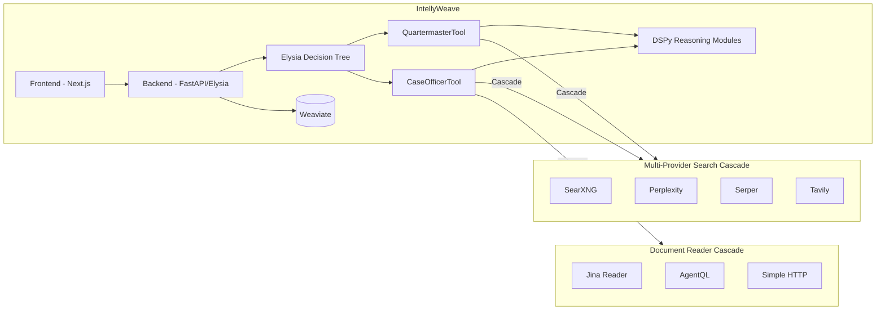
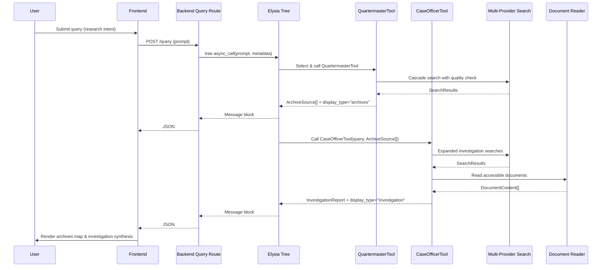

# Feature: Quartermaster and Case Officer — Archive Discovery and Investigative Reasoning

## Summary

Two decision-tree consumable tools for IntellyWeave (Elysia-based agentic RAG system):

- **Quartermaster**: Maps the information landscape (archives, databases, academic projects) relevant to a query, classifying each source by access level, protocol, digitization status, and constraints. Outputs structured, machine-readable archive intelligence with authentication parameters.

- **Case Officer**: Consumes Quartermaster intelligence to conduct the investigation itself—hypothesis generation, evidence gathering, document reading, and narrative synthesis—producing a documented report with citations and actionable next steps.

Both tools leverage a **multi-provider search cascade** (SearXNG → Perplexity → Serper → Tavily) and a **document reader cascade** (Jina → AgentQL → HTTP) for comprehensive archive discovery and content extraction.

---

## Architecture Overview

### System Integration



### Investigative Sequence



---

## Backend Implementation

### Directory Structure

```
backend/elysia/tools/archives/
├── __init__.py
├── quartermaster_tool.py
├── case_officer_tool.py
├── types.py
├── config_loader.py
└── dspy_programs.py

backend/elysia/api/services/
├── sofia_service.py          # Multi-provider search cascade
└── document_reader_service.py # Multi-reader document extraction

backend/config/
└── archive_domains.yaml       # Curated archive configuration
```

### Multi-Provider Search Cascade (SofiaService)

Tries providers in order until results are found:
1. SearXNG (if `SEARXNG_API_URL` is set)
2. Perplexity (if `PERPLEXITY_API_KEY` is set)
3. Serper (if `SERPER_API_KEY` is set)
4. Tavily (if `TAVILY_API_KEY` is set)

### Document Reader Cascade (DocumentReaderService)

Tries readers in order until content is extracted:
1. Jina Reader (if `JINA_API_KEY` is set)
2. AgentQL (if `AGENTQL_API_KEY` is set)
3. Simple HTTP (always available)

### QuartermasterTool

**Provider Retry with Quality Check:**
1. Try default cascade (SearXNG first)
2. Evaluate result quality using LLM
3. If garbage, retry with next provider + custom research prompt
4. Continue until quality results or all providers exhausted

**Source Classification:**
- `INSTITUTIONAL`: From archive_domains.yaml (vetted, high-quality)
- `DISCOVERED`: Found during search, LLM determined as relevant with relevance_score

### CaseOfficerTool

**Active Investigation Capabilities:**
1. Consumes Quartermaster archive mapping
2. Performs expanded searches beyond Quartermaster domains
3. Reads publicly accessible documents via DocumentReaderService
4. Context budget management (80K tokens, per-document limits)
5. Generates hypotheses with status (CONFIRMED/REFUTED/INDETERMINATE/PENDING)
6. Synthesizes investigation report with citations
7. Generates next steps with structured access instructions

### DSPy Modules

| Module | Purpose |
|--------|---------|
| `HypothesisGenerator` | Generate investigation hypotheses from evidence and gaps |
| `InvestigationSynthesizer` | Synthesize findings into comprehensive report |
| `EvidenceEvaluator` | Evaluate evidence against hypotheses |
| `NextStepsGenerator` | Generate actionable next steps with access instructions |

---

## Archive Configuration (archive_domains.yaml)

### Current Structure

```yaml
groups:
  soviet_repression:
    description: "Russian/Soviet archives and memorial databases"
    priority: 1
    domains:
      - domain: garf.ru
        name: "GARF - State Archive of the Russian Federation"
        default_access_level: PHYSICAL_ONLY
        default_digitization_status: PARTIALLY_DIGITIZED
        default_protocol: READING_ROOM_ONLY
        notes: "Primary source for clemency petitions"
```

### Required Enhancement: Authentication Parameters

Each domain entry must support authentication credentials for automated access:

```yaml
groups:
  soviet_repression:
    description: "Russian/Soviet archives and memorial databases"
    priority: 1
    domains:
      - domain: garf.ru
        name: "GARF - State Archive of the Russian Federation"
        default_access_level: PHYSICAL_ONLY
        default_digitization_status: PARTIALLY_DIGITIZED
        default_protocol: READING_ROOM_ONLY
        notes: "Primary source for clemency petitions"

        # Authentication parameters (stored in clear text, encrypted externally)
        authentication:
          type: "credentials"  # or "api_key", "oauth", "none"
          api_key: ""
          username: ""
          password: ""
          client_id: ""
          client_secret: ""

        # Access instructions (forwarded to Case Officer for automated/manual access)
        access_instructions:
          type: "physical_archive"  # physical_archive | subscription | restricted | general
          steps:
            - "Navigate to archives.gov.ru"
            - "Find reading room access information"
            - "Submit researcher access request"
            - "Visit the physical location"
            - "Request documents by fond/opis/delo reference"

      - domain: jstor.org
        name: "JSTOR - Academic Database"
        default_access_level: SUBSCRIPTION
        default_digitization_status: FULLY_DIGITIZED
        default_protocol: WEB_DIGITAL_REPOSITORY
        notes: "Scholarly articles on Cold War intelligence"

        authentication:
          type: "api_key"
          api_key: "jstor_api_key_here"
          username: ""
          password: ""
          client_id: ""
          client_secret: ""

        access_instructions:
          type: "subscription"
          steps:
            - "Navigate to jstor.org"
            - "Create an account if required"
            - "Subscribe or request institutional access"
            - "Search for relevant documents"
            - "Download and upload to IntellyWeave"
```

### Authentication Types

| Type | Required Fields | Use Case |
|------|-----------------|----------|
| `none` | - | Public open access |
| `api_key` | `api_key` | Programmatic API access |
| `credentials` | `username`, `password` | Web portal login |
| `oauth` | `client_id`, `client_secret` | OAuth2 authentication |

### Access Instruction Types

| Type | Description |
|------|-------------|
| `physical_archive` | Requires in-person visit to facility |
| `subscription` | Paid database access required |
| `restricted` | Government/institutional access requirements |
| `general` | Open web resources, no special access |

---

## Frontend Implementation

### Display Components

```
frontend/app/components/chat/displays/
├── Archive/
│   ├── index.ts
│   ├── ArchiveDisplay.tsx
│   ├── ArchiveCard.tsx
│   └── ArchiveView.tsx
└── Investigation/
    ├── index.ts
    ├── InvestigationDisplay.tsx
    ├── NextStepCard.tsx
    ├── NextStepView.tsx
    └── HypothesisCard.tsx
```

### Type Definitions

```typescript
// ArchivePayload
type ArchivePayload = {
  id: string;
  name: string;
  domain: string;
  group: string;
  summary: string;
  access_level: "PUBLIC_OPEN" | "PHYSICAL_ONLY" | "RESTRICTED" | "SUBSCRIPTION" | "PHYSICAL_OR_SUBSCRIPTION";
  digitization_status: "FULLY_DIGITIZED" | "PARTIALLY_DIGITIZED" | "NOT_DIGITIZED" | "N_A";
  protocol: "WEB_DIGITAL_REPOSITORY" | "READING_ROOM_ONLY" | "SEARCH_UI_ONLY" | "WIKI_COLLABORATIVE" | "HTML_CONTENT" | "LIBRARY_CATALOGS" | "API";
  constraints: ArchiveConstraint[];
  notes: string;
  source_urls: string[];
  classification: "INSTITUTIONAL" | "DISCOVERED";
  relevance_score?: number;
  relevance_reasoning?: string;
};

// InvestigationHypothesis
type InvestigationHypothesis = {
  id: string;
  description: string;
  status: "CONFIRMED" | "REFUTED" | "INDETERMINATE" | "PENDING";
  confidence: number;
  reasoning: string;
  evidence?: Array<{
    source_id: string;
    content: string;
    relevance_score: number;
    is_positive: boolean;
  }>;
};

// NextStep with access_instructions
type NextStep = {
  text: string;
  query: string;
  reasoning: string;
  priority: "high" | "medium" | "low";
  access_instructions: {
    type: "physical_archive" | "subscription" | "restricted" | "general";
    steps: string[];
  };
};
```

---

## Environment Variables

### Backend

```bash
# Multi-Provider Search (at least one required)
SEARXNG_API_URL=http://localhost:8081
PERPLEXITY_API_KEY=pplx-...
SERPER_API_KEY=...
TAVILY_API_KEY=tvly-...

# Document Reader (optional, improves content extraction)
JINA_API_KEY=jina_...
AGENTQL_API_KEY=...

# Weaviate
WCD_URL=...
WCD_API_KEY=...

# LLM Provider
OPENAI_API_KEY=...
```

---

## Definition of Done

### Backend - Core Tools

- [x] QuartermasterTool returns `ArchiveSource[]` with `display_type="archives"`
- [x] CaseOfficerTool consumes Quartermaster output and emits `display_type="investigation"`
- [x] Multi-provider search cascade (SearXNG → Perplexity → Serper → Tavily)
- [x] Provider retry with LLM quality evaluation
- [x] Source classification (INSTITUTIONAL vs DISCOVERED) with relevance scoring
- [x] Inter-tool communication via `hidden_environment`

### Backend - Case Officer Capabilities

- [x] Document reader cascade (Jina → AgentQL → HTTP)
- [x] Expanded search beyond Quartermaster domains
- [x] Context budget management (80K tokens total, per-document limits)
- [x] Preflight content size checks
- [x] Files for user review tracking (skipped large/binary files)
- [x] Hypothesis generation with status/confidence
- [x] Investigation report synthesis
- [x] Next steps generation with access instructions
- [x] Source URL mapping for clickable citations

### Backend - DSPy Modules

- [x] `HypothesisGenerator` - Generate hypotheses from evidence/gaps
- [x] `InvestigationSynthesizer` - Synthesize investigation report
- [x] `EvidenceEvaluator` - Evaluate evidence against hypotheses
- [x] `NextStepsGenerator` - Generate actionable next steps
- [ ] `ArchiveQueryVariants` - Multilingual/multiscript query expansion (transliterations)
- [ ] `ClassifyArchiveSource` - DSPy-based source classification from landing pages

### Backend - Configuration

- [x] `archive_domains.yaml` with groups and domain entries
- [x] Config loader for archive domains
- [ ] Authentication parameters in archive_domains.yaml (api_key, username, password, client_id, client_secret)
- [ ] Access instructions structure in archive_domains.yaml
- [ ] Forward authentication parameters from Quartermaster to Case Officer

### Backend - Infrastructure

- [ ] Redis caching for search responses
- [ ] Control-group validation (known-positive figures search)
- [ ] Weaviate cross-check for internal documents
- [ ] Docker Compose integration for Sofia + SearXNG services

### Backend - Testing

- [ ] Unit tests for DSPy modules (mocked LLM)
- [ ] Unit tests for archive classification parsing
- [ ] Unit tests for hypothesis evaluation logic
- [ ] Integration tests for Sofia search cascade
- [ ] Integration tests for decision tree routing

### Frontend - Display Components

- [x] `ArchiveDisplay` component with cards/list view
- [x] `ArchiveCard` with access level badges
- [x] `InvestigationDisplay` with sections for findings/gaps/next steps
- [x] `NextStepCard` with access instructions
- [x] `HypothesisCard` with status/confidence visualization
- [x] Central renderer routing by `display_type`
- [x] Source URL mapping for clickable citations
- [x] Files for review display

### Frontend - Type Definitions

- [x] `ArchivePayload` type with classification/relevance fields
- [x] `InvestigationHypothesis` type
- [x] `InvestigationPayload` type
- [x] `NextStep` type with access_instructions

### Documentation

- [ ] Environment variables reference in docs
- [ ] Archive domains configuration guide
- [ ] Authentication setup guide

---

## Risks & Mitigations

| Risk | Mitigation |
|------|------------|
| Search provider rate-limiting | Multi-provider cascade with fallback |
| DSPy output variability | Strict prompts, mocked LLM for tests, schema validation |
| Archive domain changes | `archive_domains.yaml` as versioned config |
| Large document context saturation | Context budget management, preflight size checks |
| Authentication credential security | External encryption mechanism (not in scope) |

---

## Dependencies

- Multi-provider search (at least one: SearXNG, Perplexity, Serper, Tavily)
- DSPy installed in backend
- Weaviate for internal document cross-checks (optional)
- Document reader APIs (Jina, AgentQL) for enhanced content extraction (optional)

---

## Out of Scope

- Headless browser automation for complex JavaScript sites
- SPARQL integration for structured data queries
- Bulk ingest of external archive corpora
- End-to-end credential management and encryption (handled by external system)
- Real-time archive availability monitoring
