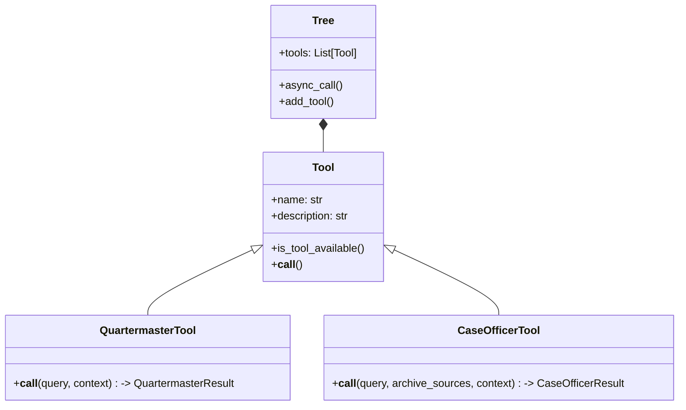
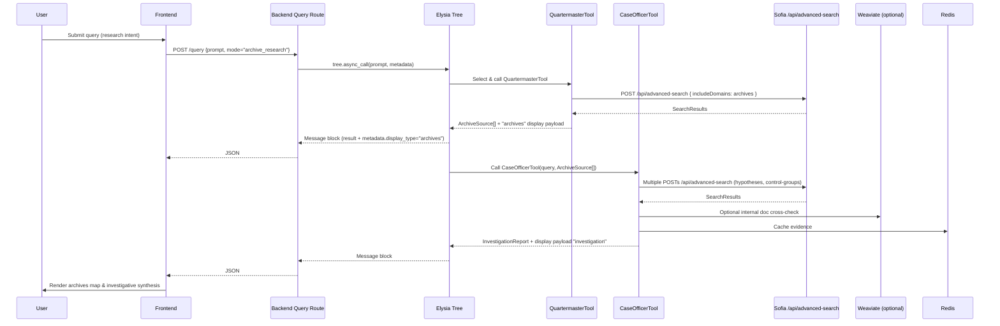

# Feature: Quartermaster and Case Officer — Archive Discovery and Investigative Reasoning (Backend + Frontend)

## Summary

Implement two decision-tree consumable tools for IntellyWeave (Elysia-based agentic RAG system):

- Quartermaster: a system tool/agent that maps the information landscape (archives, commemorative databases, academic projects) relevant to a query, classifying each source by access level, protocol, digitization status, and constraints. Outputs structured, machine-readable archive intelligence.

- Case Officer: a system tool/agent that consumes Quartermaster intelligence to conduct the investigation itself—hypothesis generation, negative-proof validation, provenance reconstruction, and narrative synthesis—producing a documented report (with citations and next steps).

Both tools will leverage Sofia’s SearXNG advanced search backend via Docker Compose for curated, domain-constrained web/archives search, while remaining fully aligned with Elysia’s decision-tree best practices and IntellyWeave’s RAG architecture.

## Motivation

Recent investigations (e.g., documented “digital ghost” cases) require:

- Gap-aware analysis that proves absence (negative proof) as rigorously as presence.
- Structured mapping of archives (digitized vs physical-only; public vs restricted).
- Reproducible investigative reasoning with provenance and operational next steps.

Quartermaster and Case Officer together provide a complete loop:

- Quartermaster maps “where the answers could exist.”
- Case Officer reasons “what can be concluded and why,” including explaining gaps.

## Goals

- Backend:
  - Add two decision-tree tools: QuartermasterTool and CaseOfficerTool (Python, Elysia).
  - Integrate DSPy modules for query expansion, archive classification, hypothesis handling, and report synthesis.
  - Call Sofia’s `/api/advanced-search` with includeDomains to restrict searches to curated archives.
  - Provide stable API responses that serialize conversation messages in IntellyWeave’s display schema (e.g., `type: "result"` + `metadata.display_type`).

- Frontend:
  - Add two display types: `archives` (for Quartermaster output) and `investigation` (for Case Officer synthesis).
  - Implement `ArchiveDisplay` (cards/list) and `InvestigationDisplay` (multi-section report + structured evidence/hypotheses).
  - Ensure compatibility with existing conversation rendering (e.g., `productExample.ts` pattern), without introducing a separate “searchbar”.

- Infra:
  - Extend IntellyWeave `docker-compose.yaml` to add Sofia (and optionally SearXNG) services.
  - Configure environment variables across backend/frontend for stable service discovery.

## Non-Goals

- Building a new search UI paradigm; IntellyWeave remains RAG-driven by queries routed through the decision tree.
- Duplicating SearXNG logic inside IntellyWeave; we reuse Sofia’s advanced search façade.
- Implementing headless crawling or SPARQL clients inside this issue (can be future enhancements).

---

## Architecture Overview

### System Integration (IntellyWeave + Sofia + SearXNG)

```mermaid
flowchart LR
    subgraph IW[IntellyWeave]
      FE[Frontend (Next.js)]
      BE[Backend (FastAPI/Elysia)]
      Tree[Elysia Decision Tree]
      QM[QuartermasterTool]
      CO[CaseOfficerTool]
      DSPy[DSPy Reasoning Modules]
      WVT[(Weaviate)]
      REDIS[(Redis)]
    end

    subgraph SOFIA[Sofia AI Search UI]
      XUI[Next.js API (/api/advanced-search)]
      SX[SearXNG]
      SREDIS[(Redis)]
    end

    FE --> BE
    BE --> Tree
    Tree --> QM
    Tree --> CO
    QM --> DSPy
    CO --> DSPy
    BE --> WVT
    BE --> REDIS

    QM -->|HTTP POST| XUI
    CO -->|HTTP POST| XUI
    XUI --> SX
    XUI --> SREDIS
```

- IntellyWeave backend calls Sofia’s advanced search endpoint for archive-constrained queries.
- Quartermaster emits structured `ArchiveSource[]` and conversation messages with `display_type: "archives"`.
- Case Officer consumes `ArchiveSource[]`, runs hypotheses and control-group validation, and emits an `InvestigationReport` with `display_type: "investigation"`.

### Decision Tree Integration



### Investigative Sequence



---

## Backend Implementation Plan (FastAPI + Elysia + DSPy)

### 1) Directory Structure & Files

- New tool module for archives:
  - `backend/elysia/tools/archives/quartermaster_tool.py`
  - `backend/elysia/tools/archives/case_officer_tool.py`
  - `backend/elysia/tools/archives/types.py` (ArchiveSource, AccessLevel, Protocol, etc.)
  - `backend/elysia/tools/archives/config_loader.py` (YAML loader)
  - `backend/elysia/tools/archives/dspy_programs.py` (DSPy modules)

- Config:
  - `backend/config/archive_domains.yaml` (curated archive domains and groups)

### 2) Config: `archive_domains.yaml`

- Structure (suggested):

  - `groups`: domain sets (e.g., `soviet_repression`, `national_archives`, `academic_projects`)
  - `archives`: flat list of entries with `id`, `name`, `domain`, `group`, `priority`, `notes`

- Loader:
  - Parse into a list of minimal `ArchiveSource` skeletons (`access_level=UNKNOWN`, etc.).
  - Provide `archive_domains = [entry.domain for entry in archives]` for Sofia `includeDomains`.

### 3) Sofia Advanced Search Integration

- Env var in backend:
  - `SOFIA_ADV_SEARCH_URL=http://sofia:3000/api/advanced-search`

- HTTP client:
  - Use async requests with retries/timeouts.
  - JSON body:
    - `query`, `maxResults`, `searchDepth` (basic/advanced), `includeDomains`, `excludeDomains`

- Caching:
  - Cache raw responses keyed by sanitized queries & domain filters in Redis.

### 4) DSPy Modules (Reasoning)

- `ArchiveQueryVariants`: multilingual/multiscript expansion (e.g., ru/uk/de/en transliterations).
- `ClassifyArchiveSource`: classify access level, protocol, digitization status, constraints from landing/about pages.
- `GenerateHypotheses`: produce hypotheses (name variants, transliterations, codename, organizational links, temporal misclassification).
- `EvaluateHypothesis`: assess evidence and control groups to set `status` (CONFIRMED/REFUTED/INDETERMINATE).
- `SynthesizeInvestigationReport`: generate final narrative + structured findings.

### 5) QuartermasterTool (Elysia Tool)

- `is_tool_available()`: ensure `SOFIA_ADV_SEARCH_URL` present.
- `__call__(query, context)`:
  1. `ArchiveQueryVariants` → produce robust variants.
  2. For each variant: POST `SOFIA_ADV_SEARCH_URL` with `includeDomains=archive_domains`.
  3. Cluster by domain; fetch landing/about pages; `ClassifyArchiveSource` → populate fields.
  4. Return `QuartermasterResult` with:
     - `archive_sources: list[ArchiveSource]`
     - A conversation `result` message with `payload.type="archives"` and `metadata.display_type="archives"`.

### 6) CaseOfficerTool (Elysia Tool)

- `is_tool_available()`: ensure `SOFIA_ADV_SEARCH_URL` present.
- `__call__(query, archive_sources, context)`:
  1. If `archive_sources` missing, call QuartermasterTool or read from Tree state.
  2. `GenerateHypotheses` from query + archive context.
  3. For each hypothesis:
     - Build archive-focused queries (plus transliterations).
     - POST `SOFIA_ADV_SEARCH_URL` with relevant `includeDomains` subset.
     - Transform results into `Evidence[]`.
  4. Control-group searches for known-positive figures (same pipeline).
  5. `EvaluateHypothesis` to set statuses.
  6. Optional Weaviate cross-check (internal docs).
  7. `SynthesizeInvestigationReport` for final narrative and recommendations.
  8. Return `CaseOfficerResult` with messages:
     - `text_with_citations` (synthesis)
     - Optional `result` with structured hypotheses/evidence.

### 7) Decision Tree & Routing

- Ensure both tools are appended to `Tree.tools` for `branch_initialisation="default"`.
- Extend DomainRouter or prompt-based decision nodes to select these tools when:
  - `mode="archive_research"`, or
  - Query intent matches archival/gap investigation patterns.

### 8) API & Serialization

- The backend `query` route should serialize conversation messages like in `frontend/app/types/display/*Example.ts`:
  - `type: "User"`, `type: "text"`, `type: "result"`, `type: "text_with_citations"`, `type: "suggestion"`
  - For Quartermaster: `payload.type="archives"`, `metadata.display_type="archives"`
  - For Case Officer: `payload.type="investigation_report"`, `metadata.display_type="investigation"`

### 9) Testing

- Unit tests:
  - DSPy modules (mock LLM; deterministic prompts).
  - Archive classification parsing.
  - Hypothesis evaluation logic with mock evidence.

- Integration tests:
  - Sofia search call (mock HTTP).
  - Decision tree routing conditions (archive research intent).
  - Frontend display payload shape validation.

---

## Frontend Implementation Plan (Next.js)

### 1) New Display Types & Example Mocks

- Add example mocks mirroring `productExample.ts` structure:
  - `frontend/app/types/display/archiveExample.ts` (provided as draft earlier).
  - Optional `frontend/app/types/display/investigationExample.ts` (for Case Officer synthesis).

### 2) Components

- `ArchiveDisplay`:
  - Card/list view:
    - `name`, `domain`, `summary`, badges for `access_level`, `digitization_status`, `protocol`, constraints indicator.
  - Group filters (optional): `soviet_repression`, `national_archives`, etc. (simple client-side filters).
  - Link out to external sources where appropriate.

- `InvestigationDisplay`:
  - Sections:
    - Summary (findings)
    - Gap analysis & negative proof explanation
    - Provenance reconstruction (physical archives, why not digitized)
    - Next steps (suggestions list)
    - Optional hypotheses & evidence table/cards

- Central renderer:
  - Extend the display resolver:
    - If `metadata.display_type === "archives"` → render `ArchiveDisplay`
    - If `metadata.display_type === "investigation"` → render `InvestigationDisplay`

### 3) UX Notes

- Preserve RAG conversation flow (no separate “searchbar” paradigm).
- Maintain consistency with existing display types (`ecommerce`, `tickets`, `intelligence`, `table`).
- Provide minimal interactivity (expand/collapse; copy links; badges tooltips).

### 4) Accessibility

- Ensure badges and constraint indicators have aria-labels.
- Provide semantic headings and lists in `InvestigationDisplay`.

---

## Docker Compose Integration (Sofia + SearXNG)

### 1) Services

- Add Sofia (Next.js) as a service, e.g.:

  - `SOFIA_ADV_SEARCH_URL=http://sofia:3000/api/advanced-search`
  - Env for Sofia:
    - `SEARXNG_API_URL=http://searxng:8080`
    - `SEARCH_API=searxng`
    - `USE_LOCAL_REDIS=true`
    - `LOCAL_REDIS_URL=redis://redis:6379`
    - `SEARXNG_MAX_RESULTS`, `SEARXNG_DEFAULT_DEPTH`, `SEARXNG_ENGINES`, etc.

- Optionally add SearXNG service (if not already deployed elsewhere).

### 2) Networking

- Place both Sofia and IntellyWeave backend on the same compose network.
- Ensure stable hostnames (e.g., `sofia`, `searxng`, `redis`) for service discovery.

### 3) Environment Variables

- Backend:
  - `SOFIA_ADV_SEARCH_URL=http://sofia:3000/api/advanced-search`
- Frontend:
  - No direct call to Sofia; all traffic goes via backend.

---

## Environment Variables Reference

- IntellyWeave Backend:
  - `SOFIA_ADV_SEARCH_URL` (required)
  - `REDIS_URL` (recommended for caching)
  - Weaviate (`WCD_URL`, `WCD_API_KEY`, etc.) as already documented

- Sofia:
  - `SEARXNG_API_URL`
  - `SEARXNG_DEFAULT_DEPTH`, `SEARXNG_MAX_RESULTS`, `SEARXNG_CRAWL_MULTIPLIER`, `SEARXNG_ENGINES`, `SEARXNG_TIME_RANGE`
  - `USE_LOCAL_REDIS`, `LOCAL_REDIS_URL` or Upstash equivalents

---

## Acceptance Criteria

- Backend:
  - [ ] QuartermasterTool returns `ArchiveSource[]` and emits a `result` message with `payload.type="archives"`, `metadata.display_type="archives"`.
  - [ ] CaseOfficerTool consumes Quartermaster output and emits a `text_with_citations` message with `payload.type="investigation_report"`, `metadata.display_type="investigation"`.
  - [ ] Calls to Sofia advanced search include `includeDomains` from `archive_domains.yaml`.
  - [ ] DSPy modules produce deterministic structures (when mocked) for variants/classification/hypotheses/report.

- Frontend:
  - [ ] `ArchiveDisplay` renders archive cards with badges and summaries from the `archives` payload.
  - [ ] `InvestigationDisplay` renders narrative sections, citations, and optional structured hypotheses/evidence.
  - [ ] Central renderer correctly routes `display_type` to components, coexisting with existing display types.

- Infra:
  - [ ] `docker-compose` starts Sofia and makes `/api/advanced-search` reachable from IntellyWeave backend.
  - [ ] Env variables documented and respected in both services.

---

## Milestones

1. Config & DSPy scaffolding (Backend) — 3–4 days
   - `archive_domains.yaml`, loader, `types.py`
   - DSPy signatures/modules stubs

2. Sofia integration & Quartermaster — 5–7 days
   - HTTP client with retries
   - Aggregation/classification → `ArchiveSource[]`
   - Serialization to `archives` payload

3. Case Officer & synthesis — 7–10 days
   - Hypotheses, control-group evaluation
   - Report synthesis with citations/next steps

4. Frontend display components — 4–6 days
   - `ArchiveDisplay`, `InvestigationDisplay`
   - Renderer wiring; mock data tests

5. Tests & docs — 3–5 days
   - Unit & integration tests
   - README/docs updates

---

## Risks & Mitigations

- Risk: SearXNG rate-limiting or domain engine inconsistencies
  - Mitigation: caching in Sofia; conservative `SEARXNG_MAX_RESULTS`; retries

- Risk: DSPy outputs variability
  - Mitigation: strict prompts; mocked LLM for unit tests; output schema validation

- Risk: Archive domain changes / legal constraints
  - Mitigation: `archive_domains.yaml` maintained as a versioned config; constraints surfaced in UI

---

## Dependencies

- Sofia AI Search UI (advanced search route configured and reachable)
- SearXNG (engines and domain filters tuned appropriately)
- DSPy installed in backend
- Redis (caching)
- Weaviate (optional for internal doc cross-checks)

---

## Out of Scope

- Implementing headless browser automation or SPARQL integration in this issue.
- Bulk ingest of external archive corpora.
- End-to-end credential management for restricted archives.

---

## Reference: Display Schema Compatibility

Conform payloads to existing frontend display schema patterns (`productExample.ts`, `ticketsExample.ts`, `intelligenceAgentExample.ts`, `tableExample.ts`):
- Conversation timeline with `messages[]`
- Each content block with `payload.type` and `metadata.display_type`
- Result objects array named `objects[]` with normalized fields

This ensures `archives` and `investigation` display types plug in cleanly without UI paradigm changes.