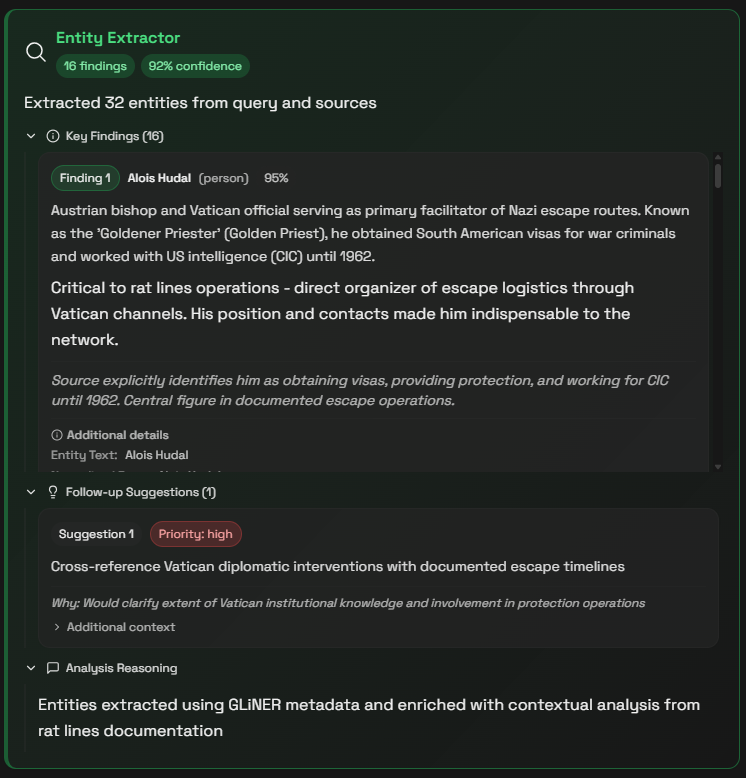
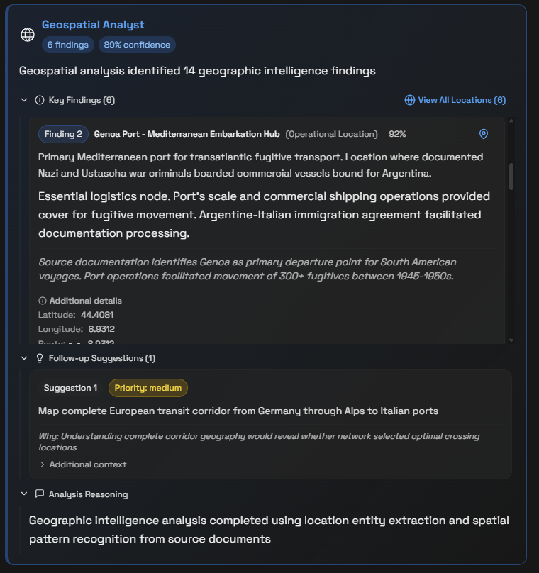
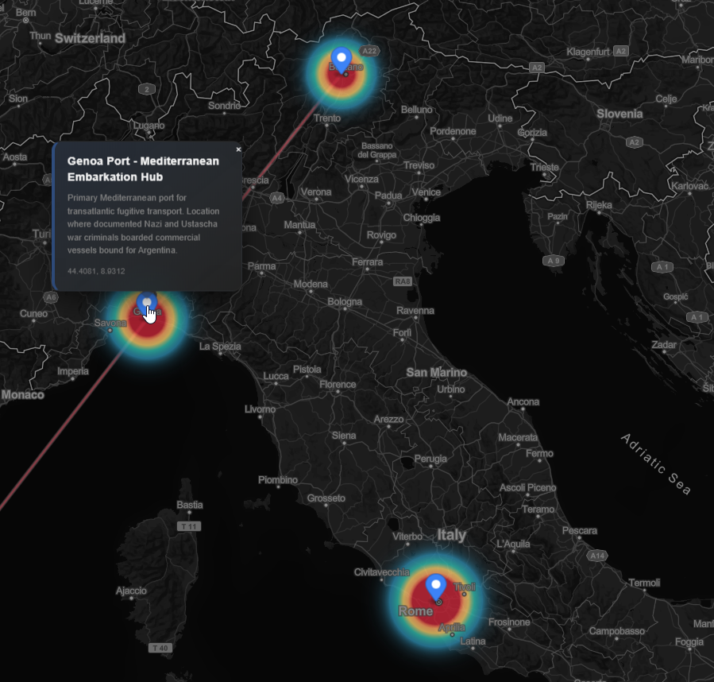
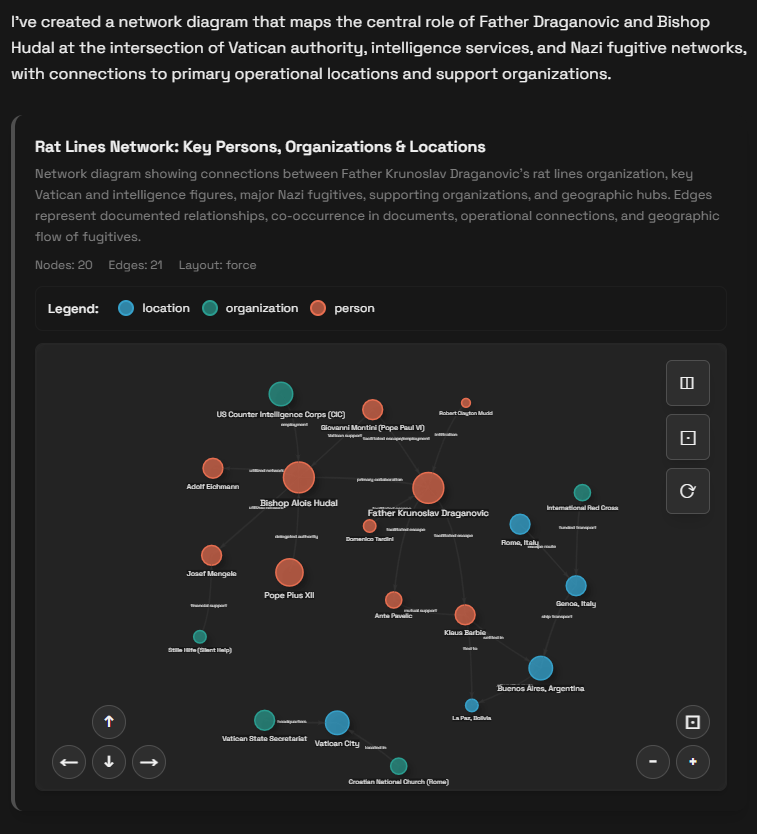
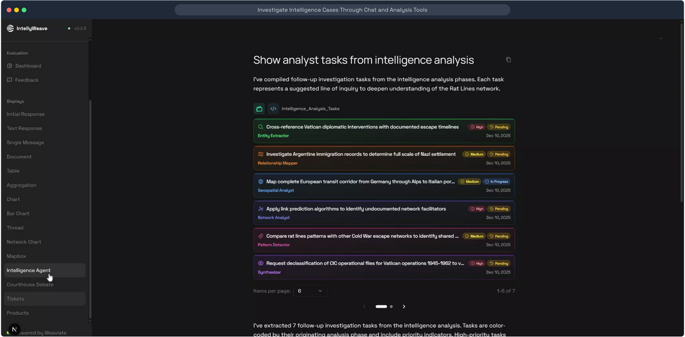
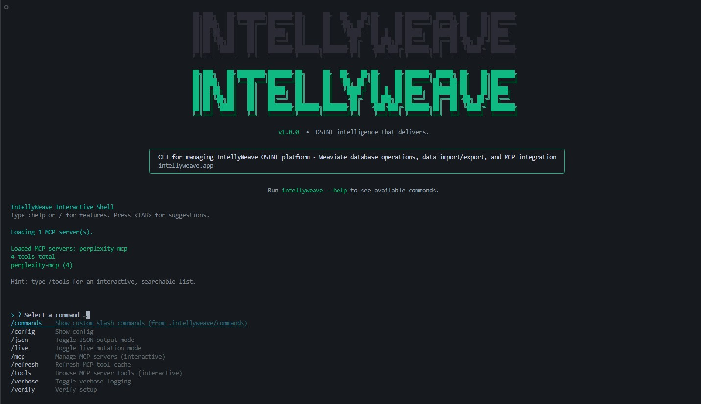

# IntellyWeave

<div align="center">

<p align="center">
    
</p>

[](LICENSE)

[](https://github.com/weaviate/elysia)
[](https://github.com/vericle/intellyweave)

</div>

**AI-powered OSINT platform that transforms document chaos into actionable intelligence through entity extraction, geospatial analysis, archive discovery, and hypothesis-driven investigation.**

---

[Quick Start](docs/getting-started/index.md) | [Installation](docs/getting-started/installation.md) | [Feature Guides](docs/guides/entity-extraction/index.md) | [Live Demo](https://app.supademo.com/embed/cmizklvt10rwr14g48e8zgl73)

---

## What is IntellyWeave?

IntellyWeave is an **Open-Source Intelligence (OSINT) analysis platform** that automatically extracts entities from documents, visualizes relationships on maps and network graphs, and employs multiple AI agents that debate complex questions to deliver well-reasoned answers with source citations.

Upload your documents. Ask questions in natural language. Get intelligence.

## Mission

IntellyWeave democratizes intelligence analysis by making professional-grade OSINT workflows accessible through AI automation. We eliminate the manual labor of entity extraction, relationship mapping, and geographic analysis—transforming months of work into minutes.

## Who Should Use This?

**IntellyWeave is for teams who need to:**

- **Intelligence Analysts** — Conduct OSINT research, connect disparate sources, build comprehensive assessments
- **Historical Researchers** — Explore archives, declassified documents, and primary sources for patterns and narratives
- **Investigators** — Track entities across documents, piece together evidence, build case narratives
- **Research Professionals** — Extract structured data from unstructured sources, discover non-obvious relationships

## Scope

### In Scope

- Automatic entity extraction (persons, organizations, locations, dates, events, laws, cryptonyms)
- Geospatial visualization with interactive 3D maps
- Network relationship analysis and graph visualization
- Archive discovery and hypothesis-driven investigation (Quartermaster + Case Officer)
- Multi-agent reasoning for complex analytical questions
- Multi-format document processing (PDF, DOCX, TXT, Markdown)
- Multi-provider LLM support (OpenAI, Anthropic, Google, local models)

### Out of Scope

- Legal case analysis (that's [Spectre's](https://github.com/Siddharth-Khattar/specter-backend) domain)
- Real-time surveillance or monitoring
- Automated decision-making without human review

## Key Features

### Entity Extraction (GLiNER)

Automatic identification of 7 entity types from multilingual documents using zero-shot recognition. No training required.

<p align="center">
    
</p>

*Entity Extractor identifying key persons with 92% confidence, enriched with contextual analysis and follow-up suggestions.*

| Entity Type | Examples |
|-------------|----------|
| Persons | Klaus Barbie, Josef Mengele |
| Organizations | Vatican, CIA, ODESSA |
| Locations | Buenos Aires, Rome, Damascus |
| Dates | May 1945, 1960s |
| Events | Nuremberg Trials |
| Laws | Decreto-Lei 7967/1945 |
| Cryptonyms | Operation Paperclip |

[Entity Extraction Guide](docs/guides/entity-extraction/index.md)

### Geospatial Intelligence

Interactive 3D maps powered by Mapbox GL. Plot extracted locations, visualize routes, explore geographic patterns.

<p align="center">
    
</p>

*Geospatial Analyst extracting operational locations with coordinates, route data, and strategic intelligence assessments.*

<p align="center">
    
</p>

*Interactive Mapbox heatmap showing location intensity across Italy—key embarkation points for transatlantic escape routes.*

[Geospatial Mapping Guide](docs/guides/geospatial-mapping/index.md)

### Network Analysis

Relationship graphs with physics-based layouts using vis-network. Discover hidden connections between entities.

<p align="center">
    
</p>

*Force-directed network graph revealing the rat lines organization: persons (orange), organizations (green), and locations (blue) with documented relationship edges.*

[Network Analysis Guide](docs/guides/network-analysis/index.md)

### Archive Research

Two-agent investigative system for archival discovery and hypothesis-driven research:

| Agent | Role |
|-------|------|
| **Quartermaster** | Maps the information landscape—discovers archives, classifies access levels, identifies digitization status |
| **Case Officer** | Conducts the investigation—tests hypotheses, gathers evidence, synthesizes reports with actionable next steps |

<p align="center">
    
</p>

*Case Officer generates structured hypotheses with evidence tracking: Confirmed (85%), Indeterminate (45%), Pending, or Refuted—each with supporting and contradicting evidence.*

**Key capabilities:**
- Curated archive sources (30+ institutions across 10 geographic regions)
- Access level classification (Public, Subscription, Physical-Only, Restricted)
- Hypothesis generation with confidence scoring and evidence citations
- Step-by-step access instructions for restricted archives
- Intelligent PDF preview with AI-inferred schema
- Documents flagged for manual review with rich metadata for follow-up

[Archive Research Guide](docs/guides/archive-research/index.md) | [Configuration Guide](docs/guides/archive-research/configuration.md)

### Intelligence Orchestrator

Automated 6-phase analysis pipeline that transforms uploaded documents into comprehensive intelligence assessments with actionable follow-up tasks:

| Phase | Agent | Output |
|-------|-------|--------|
| **1. Extraction** | Entity Extractor | Persons, organizations, locations, dates, events, laws, cryptonyms |
| **2. Mapping** | Relationship Mapper | Entity connections with relationship types and confidence scores |
| **3. Geospatial** | Geospatial Analyst | Location coordinates, routes, movement patterns |
| **4. Network** | Network Analyst | Graph structures, centrality metrics, cluster detection |
| **5. Patterns** | Pattern Detector | Cross-document correlations, temporal sequences, anomalies |
| **6. Synthesis** | Synthesizer | Executive summary, key findings, unresolved questions |

<p align="center">
    
</p>

*Intelligence Orchestrator generates follow-up investigation tasks from each analysis phase—color-coded by originating agent with priority indicators (High, Medium) and status tracking.*

**Key capabilities:**
- Automatic task generation from each analysis phase
- Priority-weighted investigation queue
- Provenance tracking (which agent generated each finding)
- Confidence accumulation across phases
- Executive summary with evidence citations

[Intelligence Analysis Guide](docs/guides/intelligence-analysis/index.md) | [Ticket Display Guide](docs/guides/ticket-display/index.md)

### LLM Support

Multi-provider support including OpenAI, Anthropic Claude, Google Gemini, and local models via Ollama. Configurable reasoning effort controls for complex analysis tasks.

[LLM Configuration Guide](docs/guides/llm-configuration/index.md)

### IntellyWeave CLI

<p align="center">
    
</p>

**Operations backbone for IntellyWeave**—manage Weaviate databases, migrate data, configure archives, and query with AI from the command line.

| Capability | Description |
|------------|-------------|
| **Weaviate Management** | Collections, objects, hybrid search, stats |
| **Data Migration** | Export/import with mutation safety (`--live` flag) |
| **Archive Configuration** | Add sources for [Quartermaster](docs/guides/archive-research/configuration.md) |
| **AI Shell** | Natural language queries with Claude + MCP integration |

```bash
# Clone and start interactive shell
git clone https://github.com/vericle/intellyweave-cli.git
cd intellyweave-cli && npm install && npm run dev shell
```

[CLI Documentation](docs/architecture/cli.md) | [GitHub Repository](https://github.com/vericle/intellyweave-cli)

---

## See It In Action

### Nazi Rat Lines Demo

Explore how IntellyWeave analyzes 17 historical documents to uncover Nazi escape networks to South America (1945-1962).

[](https://app.supademo.com/embed/cmizklvt10rwr14g48e8zgl73)

**[Launch Interactive Demo](https://app.supademo.com/embed/cmizklvt10rwr14g48e8zgl73)** — Click through a guided tour without installing anything.

**What you'll discover:**
- How a single name (Father Draganovic) unravels an entire network
- Three distinct escape routes from Europe to South America
- A courthouse debate on whether Brazilian immigration law was exploited

[Full Demo Documentation](docs/demos/rat-lines/index.md) | [Step-by-Step Walkthrough](docs/demos/rat-lines/walkthrough.md)

---

## Quick Start

```bash
# 1. Start local Weaviate
docker compose up -d weaviate

# 2. Setup dependencies
scripts/setup.sh

# 3. Configure API keys
cp backend/.env.example backend/.env
# Edit backend/.env with your LLM provider key

# 4. Launch
cd backend && source .venv/bin/activate && elysia start

# 5. Open http://localhost:8000
```

[Detailed Installation Guide](docs/getting-started/installation.md) | [First Query Guide](docs/getting-started/first-query.md)

### Enable Entity Extraction

```bash
cd backend && source .venv/bin/activate
pip install torch --index-url https://download.pytorch.org/whl/cpu
pip install -e ".[ner]"
```

---

## Documentation

### Getting Started

| Guide | Description |
|-------|-------------|
| [Quick Start](docs/getting-started/index.md) | 5-minute setup |
| [Installation](docs/getting-started/installation.md) | Detailed configuration |
| [First Query](docs/getting-started/first-query.md) | Your first analysis |

### Feature Guides

| Guide | Description |
|-------|-------------|
| [Entity Extraction](docs/guides/entity-extraction/index.md) | GLiNER (7 entity types) |
| [Geospatial Mapping](docs/guides/geospatial-mapping/index.md) | Mapbox 3D maps |
| [Network Analysis](docs/guides/network-analysis/index.md) | vis-network graphs |
| [Archive Research](docs/guides/archive-research/index.md) | Quartermaster + Case Officer |
| [Document Processing](docs/guides/document-processing/index.md) | Pipeline & watchdog |
| [Courthouse Debate](docs/guides/courthouse-debate/index.md) | Multi-agent reasoning |
| [Intelligence Analysis](docs/guides/intelligence-analysis/index.md) | 6-phase orchestrator |
| [LLM Configuration](docs/guides/llm-configuration/index.md) | Multi-provider support |
| [Agents](docs/guides/agents/index.md) | Domain routing, custom agents |

### Reference

| Document | Description |
|----------|-------------|
| [Architecture](docs/architecture/index.md) | System design |
| [API Endpoints](docs/reference/api-endpoints.md) | REST API |
| [Environment Variables](docs/reference/environment-variables.md) | Configuration |
| [CLI Commands](docs/reference/cli-commands.md) | Command line |

---

## Technical Stack

| Layer | Technology |
|-------|------------|
| **Backend** | Python 3.12, FastAPI, Weaviate, DSPy, LiteLLM |
| **Frontend** | Next.js 15, React 18, TypeScript, Tailwind CSS |
| **CLI** | TypeScript, Commander.js, Vercel AI SDK, MCP |
| **Entity Extraction** | GLiNER multi-v2.1 (zero-shot NER) |
| **Geospatial** | Mapbox GL 3.16 with 3D controls |
| **Network Graphs** | vis-network 10.0.2 with ForceAtlas2 |
| **LLM Providers** | OpenAI, Anthropic, Google, Ollama |

---

## Support

- **[GitHub Issues](https://github.com/vericle/intellyweave/issues)** — Bug reports and feature requests
- **[GitHub Discussions](https://github.com/vericle/intellyweave/discussions)** — Questions and community discussion

## Contributing & Governance

| Document | Description |
|----------|-------------|
| [Contributing Guide](CONTRIBUTING.md) | How to contribute |
| [Code of Conduct](CODE_OF_CONDUCT.md) | Community standards |
| [Security Policy](SECURITY.md) | Vulnerability reporting |
| [Governance](docs/GOVERNANCE.md) | Decision-making process |
| [Maintainers](docs/MAINTAINERS.md) | Project maintainers |
| [Roadmap](docs/ROADMAP.md) | Project direction |

---

## License

BSD 3-Clause License — see [LICENSE](LICENSE) for details.

## Acknowledgments

IntellyWeave is built on:

- **[Weaviate Elysia](https://github.com/weaviate/elysia)** — Agentic AI framework with decision tree architecture
- **[Weaviate](https://weaviate.io/)** — Vector database for semantic search
- **[Spectre](https://github.com/Siddharth-Khattar/specter-backend)** — Agentic Legal AI system (based on Elysia)
- **[new/s/leak](https://github.com/uhh-lt/newsleak)** — Open-source investigative journalism platform (Hamburg University, TU Darmstadt, Der Spiegel) — the original inspiration and foundation for IntellyWeave's document analysis capabilities
- **[GLiNER](https://github.com/urchade/GLiNER)** — Zero-shot named entity recognition
- **[Mapbox GL](https://www.mapbox.com/)** — Interactive 3D mapping
- **[vis-network](https://visjs.github.io/vis-network/docs/network/)** — Network graph visualization

---

**IntellyWeave** — Where intelligence meets insight.
