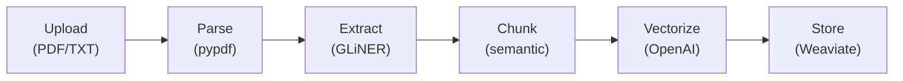
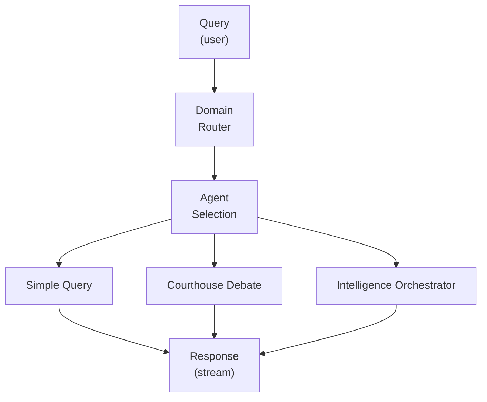
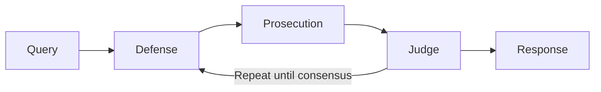
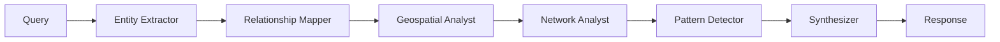
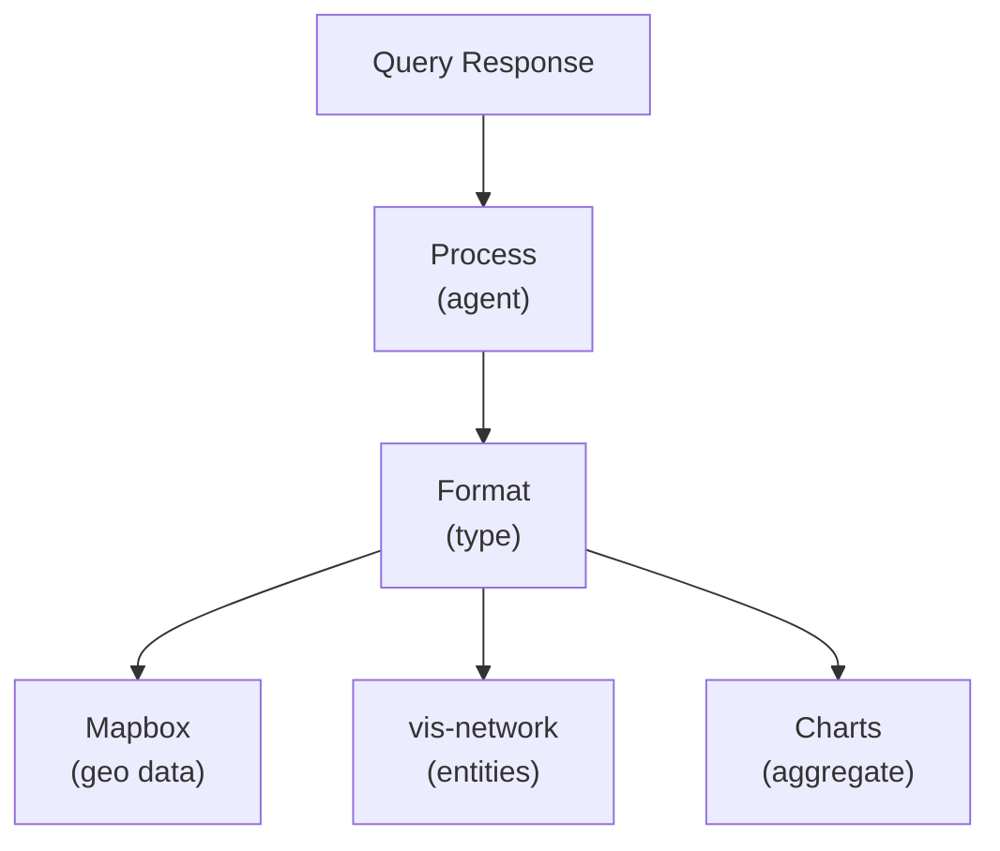

# Data Flow

**How documents flow through IntellyWeave from upload to query response.**

## Overview

IntellyWeave processes data through three main flows:

1. **Document Ingestion** - Upload to storage
2. **Query Processing** - Question to answer
3. **Visualization** - Data to visual representation

## 1. Document Ingestion Flow



### Stage Details

| Stage | Input | Output | Component |
|-------|-------|--------|-----------|
| **Upload** | File (PDF/TXT/DOCX) | Raw bytes | `api/routes/documents.py` |
| **Parse** | Raw bytes | Plain text | `pypdf`, `python-docx` |
| **Extract** | Plain text | Entities + text | `api/utils/ner.py` (GLiNER) |
| **Chunk** | Text + entities | Semantic chunks | `preprocessing/collection.py` |
| **Vectorize** | Chunks | Embeddings | OpenAI `text-embedding-3-small` |
| **Store** | Embeddings + metadata | Weaviate objects | Weaviate client |

### Entity Extraction Detail

```text
Input Text: "Klaus Barbie fled to Buenos Aires in 1951..."

GLiNER Output:
├── persons: ["Klaus Barbie"]
├── locations: ["Buenos Aires"]
├── dates: ["1951"]
└── events: []

Stored as chunk metadata arrays
```

## 2. Query Processing Flow



### Agent Selection

| Query Type | Agent | Trigger |
|------------|-------|---------|
| Simple factual | Default | Most queries |
| Interpretive | Courthouse Debate | "Debate...", ambiguous evidence |
| Comprehensive | Intelligence Orchestrator | "Full analysis...", entity discovery |
| Domain-specific | Custom Agent | Matches agent's domain |

### Courthouse Debate Flow



### Intelligence Orchestrator Flow



## 3. Visualization Flow



### Visualization Mapping

| Data Type | Visualization | Component |
|-----------|---------------|-----------|
| Locations with coordinates | Mapbox 3D Map | `MapboxMap` |
| Entity relationships | Network Graph | `NetworkGraph` |
| Counts/distributions | Bar/Line Chart | `BarChart` |
| Structured data | Table | `TableView` |

## Data Storage Schema

### Weaviate Collections

```text
ELYSIA_UPLOADED_DOCUMENTS
├── filename: string
├── content: text
├── upload_date: date
└── user_id: string

ELYSIA_CHUNKED_{collection_name}
├── text: string (chunk content)
├── document_id: reference
├── chunk_index: int
├── persons: string[] (GLiNER)
├── organizations: string[] (GLiNER)
├── locations: string[] (GLiNER)
├── dates: string[] (GLiNER)
├── events: string[] (GLiNER)
├── laws: string[] (GLiNER)
└── cryptonyms: string[] (GLiNER)
```

## Performance Considerations

| Stage | Bottleneck | Mitigation |
|-------|------------|------------|
| Upload | Large files | Chunked upload |
| GLiNER | Model loading | Lazy initialization |
| Vectorize | API calls | Batch processing |
| Query | LLM latency | Streaming responses |
| Visualization | Large datasets | Pagination, aggregation |

## See Also

- [Backend Architecture](backend.md) - Component details
- [Entity Extraction Guide](../guides/entity-extraction/index.md) - GLiNER usage
- [Reference > API Endpoints](../reference/api-endpoints.md) - API details
