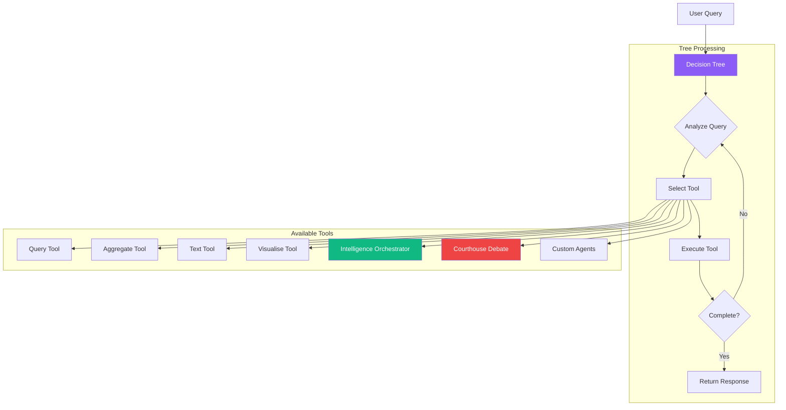
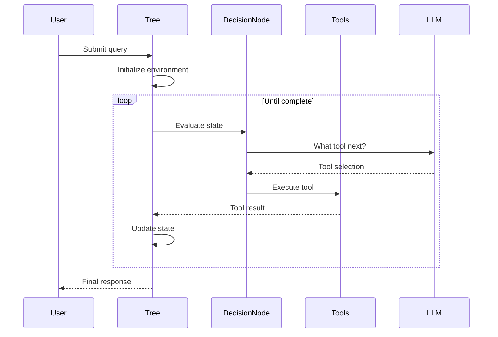
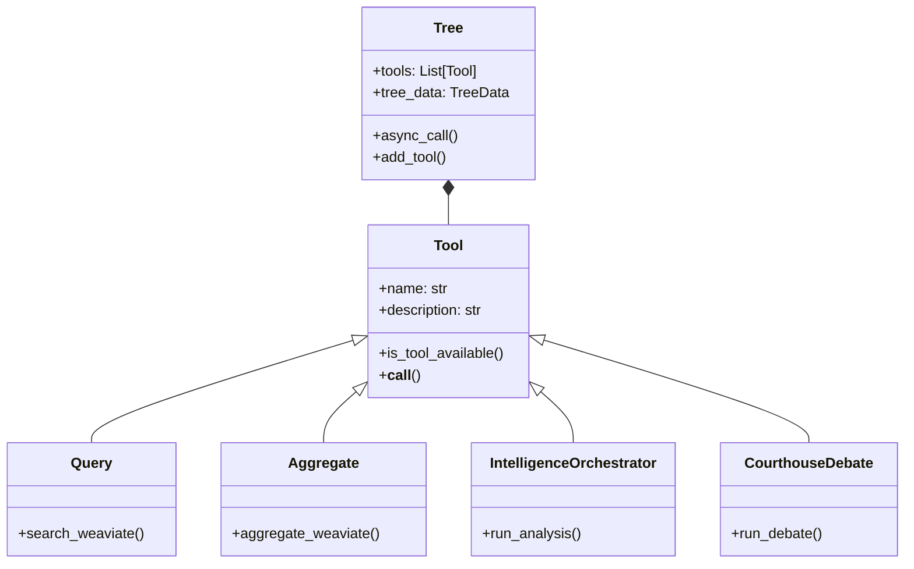

# Decision Tree Architecture

**Core orchestration system that dynamically selects and executes tools based on user queries and context.**

## What It Does

The Decision Tree is IntellyWeave's central orchestration engine. It:

- **Analyzes queries** to determine the best approach
- **Selects tools** dynamically based on context
- **Manages state** across multi-turn conversations
- **Coordinates agents** for complex analysis tasks



## Use When

- Understanding how IntellyWeave processes queries
- Adding custom tools to the decision tree
- Debugging query routing issues
- Extending the orchestration system

---

## Core Concepts

### Tree Class

The `Tree` class is the main entry point:

```python
from elysia.tree.tree import Tree

tree = Tree(
    branch_initialisation="default",
    user_id="user123",
    conversation_id="conv456"
)

# Execute a query
response = await tree.async_call(
    prompt="What organizations are mentioned?",
    collection_names=["ELYSIA_UPLOADED_DOCUMENTS"]
)
```

### Initialization Modes

| Mode | Description |
|------|-------------|
| `default` | Full tool suite (recommended) |
| `one_branch` | Single-branch simplified tree |
| `multi_branch` | Multi-branch parallel processing |
| `empty` | No tools (add manually) |

---

## Decision Flow

### Query Processing Cycle



### Decision Node

The DecisionNode evaluates which tool to use next:

```python
class DecisionNode:
    """Decides which tool to execute based on current state."""

    async def decide(self, tree_data: TreeData) -> Decision:
        # Analyze current state
        # Evaluate tool availability
        # Return decision with selected tool
```

### Tool Selection Criteria

The decision considers:

1. **Query intent** - What is the user asking for?
2. **Available data** - What collections/documents exist?
3. **Previous results** - What has already been retrieved?
4. **Tool availability** - Which tools can handle this?

---

## Built-in Tools

### Core Retrieval Tools

| Tool | Purpose | Triggers |
|------|---------|----------|
| **Query** | Semantic search in Weaviate | Questions about content |
| **Aggregate** | Statistical aggregations | "How many...", "Count..." |

### Response Tools

| Tool | Purpose | Triggers |
|------|---------|----------|
| **Text** | Generate text responses | General questions |
| **CitedSummarizer** | Summarize with citations | "Summarize..." |
| **Visualise** | Generate charts | "Show chart...", "Plot..." |

### Multi-Agent Tools

| Tool | Purpose | Triggers |
|------|---------|----------|
| **IntelligenceOrchestrator** | 6-phase intelligence analysis | "Run intelligence analysis" |
| **CourthouseDebate** | Adversarial debate | Complex interpretive questions |
| **DomainRouter** | Route to custom agents | Domain-specific queries |

---

## State Management

### TreeData

Central state container:

```python
@dataclass
class TreeData:
    environment: Environment      # Shared state
    atlas: Atlas                  # Collection metadata
    results: List[Result]         # Tool results
    conversation_id: str
    query_id: str
    user_id: str
```

### Environment

Tracks conversation state:

```python
@dataclass
class Environment:
    # Visible state
    collection_data: Dict[str, CollectionData]
    previous_queries: List[str]
    previous_summaries: List[str]

    # Hidden state (for agents)
    hidden_environment: Dict[str, Any]
```

### Result Types

Tools return typed results:

```python
class Result:
    """Base result from a tool"""

class Text(Result):
    """Text response"""

class Warning(Result):
    """Warning message"""

class Error(Result):
    """Error occurred"""

class Completed(Result):
    """Processing complete"""
```

---

## Tool Integration

### Adding a Custom Tool

```python
from elysia.objects import Tool, Result

class MyCustomTool(Tool):
    name = "my_custom_tool"
    description = "Does something useful"

    async def is_tool_available(
        self,
        tree_data: TreeData,
        decision_context: str
    ) -> bool:
        """Return True if this tool can handle the query"""
        return "custom" in tree_data.environment.current_query.lower()

    async def __call__(
        self,
        tree_data: TreeData,
        **kwargs
    ) -> AsyncGenerator[Result, None]:
        """Execute the tool"""
        yield Text(text="Custom tool result")
        yield Completed()
```

### Registering the Tool

```python
tree = Tree(branch_initialisation="default")
tree.add_tool(MyCustomTool())
```

---

## Architecture

### Backend Structure

```text
backend/elysia/
├── tree/
│   ├── tree.py              # Main Tree class
│   ├── objects.py           # TreeData, Environment, Atlas
│   ├── util.py              # DecisionNode, helpers
│   └── prompt_templates.py  # LLM prompts for decisions
├── objects.py               # Tool, Result base classes
└── tools/
    ├── retrieval/           # Query, Aggregate
    ├── text/                # Text, CitedSummarizer
    ├── visualisation/       # Visualise
    ├── intelligence/        # IntelligenceOrchestrator
    ├── courthouse/          # CourthouseDebate
    └── domain/              # DomainRouter, CustomAgents
```

### Class Hierarchy



---

## Execution Modes

### Synchronous

```python
tree = Tree()
response, objects = tree(
    prompt="What are the key findings?",
    collection_names=["documents"]
)
```

### Asynchronous

```python
tree = Tree()
async for result in tree.async_call(
    prompt="Run intelligence analysis",
    collection_names=["documents"]
):
    # Handle streaming results
    if isinstance(result, Text):
        print(result.text)
```

### WebSocket Streaming

The API uses async streaming for real-time responses:

```python
@router.websocket("/ws/query")
async def query_websocket(websocket: WebSocket):
    tree = Tree(user_id=user_id)

    async for result in tree.async_call(prompt=prompt):
        await websocket.send_json(result.to_dict())
```

---

## Configuration

### Tree Parameters

| Parameter | Default | Description |
|-----------|---------|-------------|
| `branch_initialisation` | `"default"` | Tool set to load |
| `low_memory` | `False` | Optimize for low memory |
| `use_elysia_collections` | `True` | Use Elysia collection naming |

### Environment Variables

```bash
# Timeouts
TREE_TIMEOUT=300          # Max tree execution time (seconds)
CLIENT_TIMEOUT=60         # LLM client timeout

# Iterations
MAX_TREE_ITERATIONS=10    # Max decision cycles
```

---

## Debugging

### Enable Verbose Logging

```bash
LOGGING_LEVEL=DEBUG
```

### Decision Logging

The tree logs decisions:

```text
INFO: Decision cycle 1: Selected tool 'query'
INFO: Query tool returned 15 results
INFO: Decision cycle 2: Selected tool 'text'
INFO: Text tool generated response
INFO: Decision cycle 3: Completed
```

### State Inspection

```python
# Access current state
print(tree.tree_data.environment.collection_data)
print(tree.tree_data.results)
```

---

## Troubleshooting

### Tool Not Selected

**Cause:** Tool's `is_tool_available()` returns False.

**Solution:**

- Check tool's availability conditions
- Verify query triggers tool selection
- Enable DEBUG logging

### Infinite Loop

**Cause:** Tool never returns `Completed`.

**Solution:**

- Ensure tool yields `Completed()` when done
- Check `MAX_TREE_ITERATIONS` setting
- Add timeout handling

### Missing Results

**Cause:** Results not yielded correctly.

**Solution:**

- Tools must be async generators
- Use `yield` not `return`
- Ensure `Completed()` is yielded last

---

## Performance

| Operation | Typical Time |
|-----------|-------------|
| Decision cycle | 0.5-2 seconds |
| Query tool | 1-3 seconds |
| Intelligence Orchestrator | 30-90 seconds |
| Courthouse Debate | 30-60 seconds |

---

## See Also

- [Agents Documentation](../guides/agents/) - Agent tools
- [Intelligence Analysis](../guides/intelligence-analysis/) - 6-phase orchestrator
- [Courthouse Debate](../guides/courthouse-debate/) - Adversarial debate
- [LLM Configuration](../guides/llm-configuration/) - Model setup
