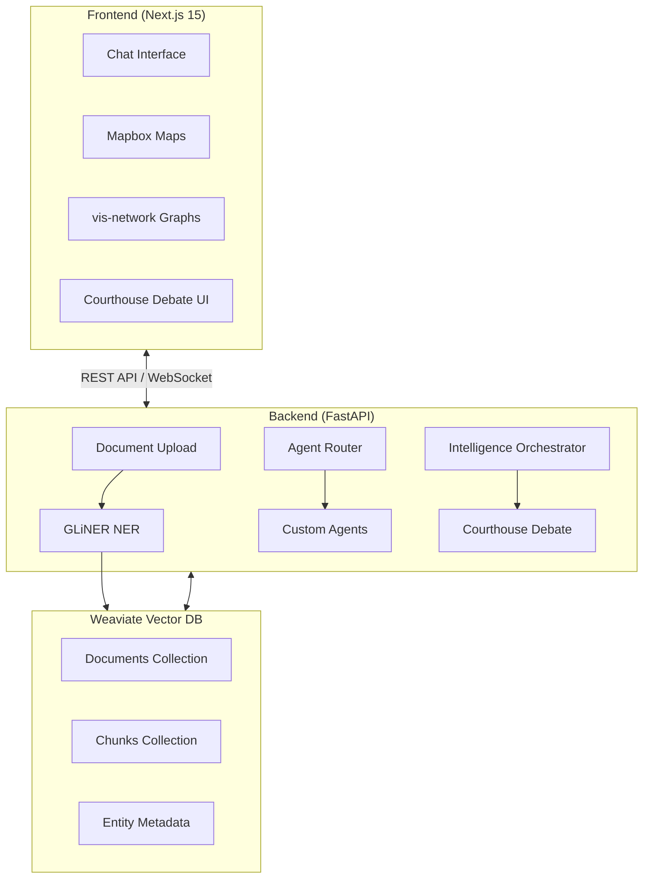

# Architecture Overview

**Technical deep-dives into IntellyWeave's backend, frontend, and data flow.**

## What It Does

This section provides architectural documentation for developers who need to understand IntellyWeave's internal structure, extend functionality, or contribute to the codebase.

## Architecture Documents

| Document | Description |
|----------|-------------|
| [Backend Architecture](backend.md) | Python/FastAPI backend, Weaviate integration, agent system |
| [Frontend Architecture](frontend.md) | Next.js 15, React components, visualization libraries |
| [Data Flow](data-flow.md) | Document processing pipeline, entity extraction, query flow |
| [CLI](cli.md) | Operations CLI for database management, data migration, AI shell |

## High-Level Architecture

## Tech Stack Summary

### Backend

| Component | Technology | Purpose |
|-----------|------------|---------|
| Framework | FastAPI | REST API and WebSocket |
| Database | Weaviate | Vector storage and search |
| LLM Orchestration | DSPy | AI agent coordination |
| Entity Extraction | GLiNER | Named entity recognition |
| Multi-provider LLM | LiteLLM | OpenAI, Anthropic, etc. |

### Frontend

| Component | Technology | Purpose |
|-----------|------------|---------|
| Framework | Next.js 15 | React server components |
| UI Components | Radix UI | Accessible primitives |
| Styling | Tailwind CSS | Utility-first CSS |
| Maps | Mapbox GL 3.16 | 3D geospatial visualization |
| Graphs | vis-network | Relationship visualization |
| Animations | Framer Motion | UI transitions |

## See Also

- [Getting Started](../getting-started/index.md) - Quick setup guide
- [Contributing](../contributing/index.md) - Development setup
- [Reference](../reference/index.md) - API and configuration
