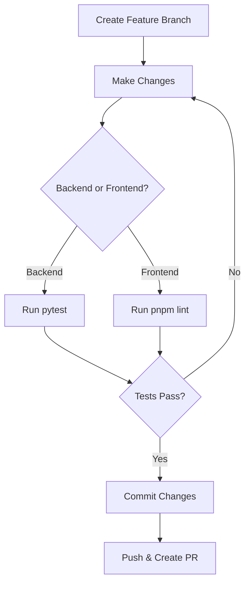

# Development Setup

**Complete guide to setting up your IntellyWeave development environment.**

## Prerequisites

| Software | Version | Check Command |
|----------|---------|---------------|
| Python | 3.12 | `python3.12 --version` |
| Node.js | 18+ | `node --version` |
| pnpm | Latest | `pnpm --version` |
| Docker | Latest | `docker --version` |
| Git | Latest | `git --version` |

## Quick Setup

The fastest way to get started:

```bash
git clone https://github.com/vericle/intellyweave.git
cd intellyweave
scripts/setup.sh
```

## Manual Setup

### 1. Clone Repository

```bash
git clone https://github.com/vericle/intellyweave.git
cd intellyweave
```

### 2. Start Local Weaviate

```bash
docker compose up -d weaviate
```

Verify it's running:

```bash
curl http://localhost:8080/v1/.well-known/ready
```

### 3. Set Up Backend

```bash
cd backend

# Create virtual environment
python3.12 -m venv .venv
source .venv/bin/activate

# Install dependencies
pip install --upgrade pip
pip install -e ".[dev]"

# Optional: Install NER support
pip install -e ".[ner]"

# Create environment file
cp .env.example .env
```

Edit `backend/.env` with your API keys:

```bash
WEAVIATE_IS_LOCAL=True
OPENAI_API_KEY=sk-proj-your-key
```

### 4. Set Up Frontend

```bash
cd ../frontend

# Install dependencies
pnpm install

# Optional: Configure Mapbox
cp .env.example .env.local
# Edit with your Mapbox token
```

## Running Development Servers

### Option 1: Combined (Recommended)

```bash
scripts/dev.sh
```

This starts both servers:
- Frontend: http://localhost:3000
- Backend: http://localhost:8000

### Option 2: Separate Terminals

**Terminal 1 - Backend:**

```bash
cd backend
source .venv/bin/activate
elysia start
```

**Terminal 2 - Frontend:**

```bash
cd frontend
pnpm run dev
```

## Development Workflow



### 1. Create Feature Branch

```bash
git checkout -b feat/your-feature
```

### 2. Make Changes

Edit files in `backend/` or `frontend/`.

### 3. Test Changes

```bash
# Backend tests
cd backend && pytest tests/

# Frontend lint
cd frontend && pnpm test
```

### 4. Commit

```bash
git add .
git commit -m "feat: description of change"
```

### 5. Push and PR

```bash
git push origin feat/your-feature
```

Create PR on GitHub.

## IDE Setup

### VS Code

Recommended extensions:

- Python (Microsoft)
- Pylance
- ESLint
- Tailwind CSS IntelliSense
- Prettier

**Settings (.vscode/settings.json):**

```json
{
  "python.defaultInterpreterPath": "./backend/.venv/bin/python",
  "python.formatting.provider": "black",
  "editor.formatOnSave": true,
  "[python]": {
    "editor.defaultFormatter": "ms-python.black-formatter"
  }
}
```

### PyCharm

1. Open `backend/` as project root
2. Set interpreter to `backend/.venv/bin/python`
3. Mark `backend/elysia` as Sources Root

## Environment Variables

### Required for Development

| Variable | Purpose |
|----------|---------|
| `WEAVIATE_IS_LOCAL=True` | Use local Docker |
| `OPENAI_API_KEY` | At least one LLM |

### Optional

| Variable | Purpose |
|----------|---------|
| `MAPBOX_ACCESS_TOKEN` | Enable maps |
| `ANTHROPIC_API_KEY` | Alternative LLM |
| `LOGGING_LEVEL=DEBUG` | Verbose logs |

## Common Issues

### Port Already in Use

```bash
scripts/kill-process.sh 8000
scripts/kill-process.sh 3000
```

### Virtual Environment Issues

```bash
rm -rf backend/.venv
cd backend
python3.12 -m venv .venv
source .venv/bin/activate
pip install -e ".[dev]"
```

### Weaviate Connection Failed

```bash
# Check if running
docker compose ps

# Restart
docker compose restart weaviate

# Check logs
docker compose logs weaviate
```

### pnpm Errors

```bash
cd frontend
rm -rf node_modules pnpm-lock.yaml
pnpm install
```

## See Also

- [Testing](testing.md) - Run and write tests
- [Environment Variables](../reference/environment-variables.md) - All config options
- [Architecture](../architecture/index.md) - Technical overview
