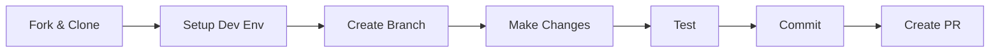

# Contributing to IntellyWeave

**How to set up your development environment, run tests, and contribute code.**

## Overview

IntellyWeave welcomes contributions! This section covers everything you need to get started as a contributor.

## Contributing Documents

| Document | Description |
|----------|-------------|
| [Development Setup](development-setup.md) | Set up your dev environment |
| [Testing](testing.md) | Run and write tests |
| [Upstream Syncing](upstream-syncing.md) | Sync with Weaviate Elysia |
| [Git Subtree Governance](git-subtree.md) | How we manage upstream |

## Quick Start for Contributors



### 1. Fork and Clone

```bash
git clone https://github.com/YOUR_USERNAME/intellyweave.git
cd intellyweave
```

### 2. Set Up Development Environment

```bash
scripts/setup.sh
```

### 3. Create a Feature Branch

```bash
git checkout -b feat/your-feature-name
```

### 4. Make Changes and Test

```bash
# Run backend tests
cd backend && source .venv/bin/activate && pytest tests/

# Run frontend lint
cd frontend && pnpm test
```

### 5. Commit with Conventional Commits

```bash
git commit -m "feat: add new entity extraction type"
```

### 6. Create Pull Request

Push your branch and create a PR against `main`.

## Commit Message Convention

| Prefix | Use For |
|--------|---------|
| `feat:` | New features |
| `fix:` | Bug fixes |
| `docs:` | Documentation |
| `refactor:` | Code restructuring |
| `test:` | Test changes |
| `chore:` | Maintenance |

**Examples:**

```bash
feat: add cryptonym entity extraction
fix: resolve WebSocket connection timeout
docs: update installation guide
refactor: reorganize agent tools
test: add courthouse debate integration tests
chore: update dependencies
```

## Pull Request Process

1. **Ensure tests pass** - All CI checks must be green
2. **Update documentation** - If you changed behavior
3. **Follow code style** - See AGENTS.md for conventions
4. **Sign commits** - DCO sign-off required

## Code Review

All PRs require review before merge. Reviewers check for:

- Code quality and style consistency
- Test coverage
- Documentation updates
- Security considerations

## See Also

- [CONTRIBUTING.md](../../CONTRIBUTING.md) - Root contributing guide
- [AGENTS.md](../../AGENTS.md) - Code style and conventions
- [Architecture](../architecture/index.md) - Technical overview
