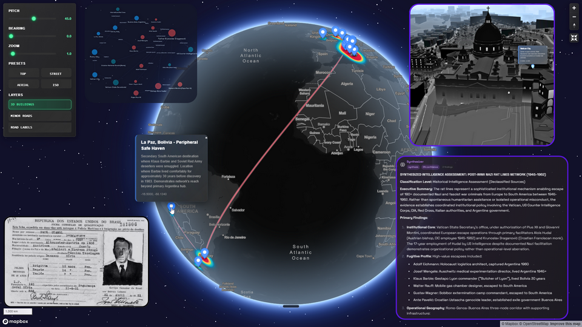

# Demos

**See IntellyWeave transform document chaos into actionable intelligence.**

---

## Why Demos Matter

Reading about OSINT analysis is one thing. **Watching it uncover hidden networks** is another.

These demos use real historical datasets to demonstrate what IntellyWeave can do:

- Extract entities from multilingual documents
- Map relationships that span organizations and continents
- Visualize geographic patterns on interactive 3D maps
- Debate ambiguous questions with multi-agent reasoning

Each demo tells a story. You're not just learning software — you're conducting an investigation.

---

## Available Demos

### IntellyWeave Evolution: Platform Story

**[Explore the Demo](intellyweave-evolution/)** | The platform evolution story

| Aspect | Details |
|--------|---------|
| **Focus** | Seven-year journey from Newsleak to IntellyWeave |
| **Content** | Platform history, architecture, use cases |
| **Key topics** | Hamburg origins, Cyrillic problem, vector search, multi-agent reasoning |

**What you'll discover:**
- How real investigative needs drove each platform evolution
- The three-layer inheritance architecture (Elysia → Spectre → IntellyWeave)
- Target users and use case examples
- Technical capabilities with links to feature guides

---

### Ingeborg Investigation: A Cold War Mystery

**[Explore the Demo](ingeborg-investigation/)** | The human story

| Aspect | Details |
|--------|---------|
| **Focus** | Cold War espionage investigation that drove platform development |
| **Documents** | Declassified CIA files, SMERSH records, I.R.O. archives |
| **Era** | 1950-1954 |
| **Key entities** | Ingeborg Louzek, Veniamin Kolesnikov, CIC, SMERSH, Arolsen Archives |

**What you'll discover:**
- A real investigation into a missing Austrian intelligence agent
- How the investigation pushed each platform generation to its limits
- The investigative methodology using SPARQL, Cyrillic NER, biometric analysis
- Documentary evidence that challenges the official Soviet narrative

---

### Nazi Rat Lines: Uncovering Post-War Escape Networks

[](rat-lines/)

**[Explore the Demo](rat-lines/)** | The flagship demonstration

| Aspect | Details |
|--------|---------|
| **Focus** | Historical OSINT analysis of Nazi escape routes to South America |
| **Documents** | 17 sources in German, Portuguese, and English |
| **Era** | 1945-1962 |
| **Key entities** | Eichmann, Mengele, Draganovic, Vatican, CIC, ODESSA |

**What you'll discover:**
- How a single name (Father Draganovic) unravels an entire network
- Three distinct escape routes from Europe to South America
- The institutional actors who made mass escape possible
- A courthouse debate on whether Brazilian immigration law was deliberately exploited

---

## What Each Demo Includes

| Component | Description |
|-----------|-------------|
| **Overview** (`index.md`) | Compelling narrative introduction with visual journey |
| **Walkthrough** (`walkthrough.md`) | Step-by-step queries that build progressively |
| **Multimedia** (`multimedia.md`) | Podcast, video, and presentation summaries |
| **Images** (`images/`) | Screenshots and visualizations |

---

## Capabilities Demonstrated

| Capability | How It's Shown |
|------------|----------------|
| **Entity Extraction** | 7 types automatically identified from multilingual text |
| **Network Analysis** | Relationship graphs revealing hidden connections |
| **Geospatial Intelligence** | Interactive 3D maps showing escape corridors |
| **Multi-Agent Reasoning** | Courthouse debate on contested questions |
| **Source Traceability** | Every finding linked to source documents |

---

## Interactive Walkthrough

Can't clone the repo? Try the interactive Supademo:

[](https://app.supademo.com/embed/cmizklvt10rwr14g48e8zgl73)

> **[Launch Interactive Demo](https://app.supademo.com/embed/cmizklvt10rwr14g48e8zgl73)** — Click through a guided tour without installing anything.

---

## Source Data

Demo datasets live in `examples/` at the repository root:

```text
examples/
├── cleaned/          # Documents ready for ingestion
├── multimedia/       # Audio, video, presentations
│   ├── audio/       # Podcast with Italian transcription
│   ├── video/       # Video walkthrough with Italian transcription
│   ├── pdf/         # Presentation slides
│   └── supademo/    # Interactive demo assets
└── README.md        # Dataset documentation and scoring methodology
```

**Source data stays in `examples/`** while user-facing documentation lives here in `docs/demos/`.

---

## The Question That Remains

These demos analyze historical networks — the documents are declassified, the actors long identified.

But the methodology applies to any document corpus. The same AI that illuminates the past could map the hidden networks of the present.

**What could you discover?**

---

## See Also

- [Getting Started](../getting-started/) — Set up IntellyWeave
- [Entity Extraction](../guides/entity-extraction/) — GLiNER deep dive
- [Intelligence Analysis](../guides/intelligence-analysis/) — 6-phase orchestrator
- [Contributing](../../CONTRIBUTING.md) — Add your own demos
