# The Ingeborg Investigation: A Cold War Mystery That Built IntellyWeave

> *"The investigation that pushed each generation of the platform to its limits now has a tool capable of processing its complexities."*

---

## Prologue: Vienna, August 1950

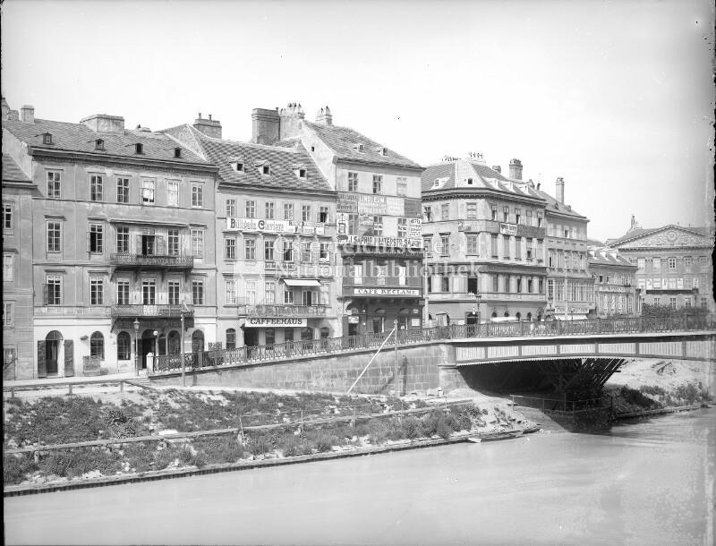
*Post-war Vienna—a city divided among four occupying powers, where espionage was a way of life*

The summer of 1950 was tense in Vienna. The city had been divided since 1945 among American, British, French, and Soviet occupying forces. Spies moved through the shadowy streets of the Innere Stadt. The Iron Curtain was hardening. And somewhere in this divided city, a 23-year-old Austrian woman was living a double life.

Her name was Ingeborg Louzek. By day, she was an unremarkable young woman from a working-class family. By night, she was an agent of the U.S. Army's Counter Intelligence Corps, helping Soviet defectors escape to the West through clandestine networks that would later become known as the "ratlines."

On August 12, 1950, Ingeborg walked toward Vienna's Ostbahnhof—the Eastern Station—and vanished into history.

---

## Part One: The Official Narrative

### What the Kremlin Revealed

For decades, Ingeborg's fate remained a complete mystery. Her family in Vienna knew only that she had disappeared. The Americans who had recruited her said nothing. The Soviets, of course, revealed nothing at all.

Then, in 2009, the Kremlin declassified a trove of SMERSH and NKVD documents as part of a broader opening of Cold War archives. Among them were files that finally revealed what had happened to Ingeborg Louzek.

According to these documents:

- **August 12, 1950**: Ingeborg was arrested by Soviet military intelligence while en route to the Ostbahnhof
- **October 21, 1950**: A Soviet military tribunal in Baden bei Wien sentenced her to death for "espionage on behalf of the United States of America" under Article 58-6 of the Soviet criminal code
- **January 9, 1951**: The sentence was carried out by firing squad in Moscow's infamous Lubyanka Prison

The documents were analyzed by Professor Barbara Stelzl-Marx and her team at the Ludwig Boltzmann Institute for Research on the Consequences of War in Graz, Austria. Their findings were published in the book *"Stalins letzte Opfer"* (Stalin's Last Victims), which documented the fates of 86 Austrians who disappeared into the Soviet system after 1945.

But the official narrative contained troubling inconsistencies.

---

## Part Two: The Investigation Begins

### A Family's Search for Truth

The investigation into Ingeborg's fate was not conducted by professional historians or intelligence agencies. It was conducted by family—specifically, by her nephew, who had grown up hearing fragments of a story that never quite made sense.

The questions multiplied:

- **Why was the timeline inconsistent?** Documents suggested Ingeborg was already helping Soviet defectors escape *before* her supposed recruitment by the CIC. How did a civilian Austrian woman have access to such resources?

- **What about Veniamin Kolesnikov?** The Soviet defector she loved had escaped from a Soviet military prison under circumstances so mysterious that he was the only person *ever* to escape that facility. How?

- **Where were the CIC records?** The Americans had detailed files on their agents and operations, but these had been declassified without being digitized. What did they contain?

- **And most troubling:** If Ingeborg was executed in Moscow on January 9, 1951, how did a woman with her name, her birthdate, and her face appear on a Brazilian immigration document dated July 21, 1954?

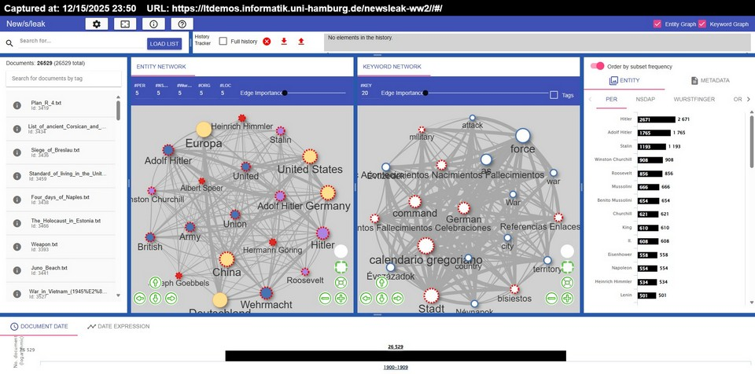
*The original new/s/leak platform—where the digital investigation began*

### The Tools That Existed

In 2020, the investigation turned to digital tools. The most promising was **new/s/leak**, an open-source platform developed by the Language Technology group at Hamburg University in cooperation with Der Spiegel and TU Darmstadt.

new/s/leak had been created for exactly this kind of work: analyzing massive document collections to find patterns that human readers would miss. It had been funded by the Volkswagen Foundation under their "Science and Data Journalism" initiative, designed to help investigative journalists make sense of document leaks like the Afghan War Diary and the U.S. Embassy cables.

The platform offered:
- **Named Entity Recognition** using the Epic system to identify persons, organizations, and locations
- **Temporal expression extraction** using Heideltime
- **Network visualization** showing entity co-occurrence
- **Full-text search** powered by Elasticsearch

But when the investigation loaded documents in Russian—the SMERSH interrogation protocols, the trial transcripts, the NKVD internal communications—the platform failed. The Epic NER system could identify "Ingeborg Louzek" in German documents, but not "Ингеборга Лузек" in Cyrillic script.

**The investigation needed better tools. And so the journey of building them began.**

---

## Part Three: The Woman in the Photographs

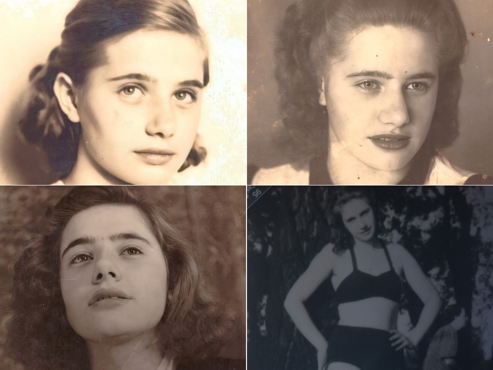
*Ingeborg Louzek at different ages: childhood portrait (top left), teenage years (top right), young woman in Vienna (bottom left), and the controversial beach photograph from Brazil (bottom right)*

### A Life Shaped by Trauma

To understand Ingeborg's story, you must understand the world that shaped her.

She was born in Vienna on July 4, 1927, to Antonin Louzek—a Czech postal worker—and Elizabeth Hutz, an Austrian woman. The family lived on Margaretenstrasse, in a working-class neighborhood that would later fall within the Soviet occupation zone.

Antonin Louzek was not merely a postal clerk. According to documents recovered from the Arolsen Archives, he was arrested by the Gestapo in August 1943 for "anti-Nazi actions" and "illegal money harvesting"—the latter a euphemism suggesting he had been serving as a financial conduit for resistance activities.

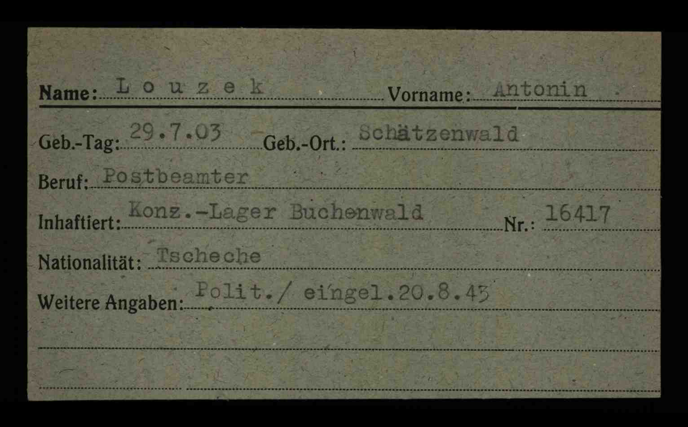
*Antonin Louzek's Buchenwald concentration camp card: prisoner #16417, Czech postal worker, political prisoner*

Antonin was sent first to Auschwitz, then transferred to Buchenwald, where he was assigned prisoner number 16417. His liberation document, recovered during the investigation, bears the signature of Captain Leonard L. Bessman of the U.S. Army Counter Intelligence Corps.

This connection may not have been coincidental. When Ingeborg was later recruited by the CIC, she may have followed a path her father had already walked.

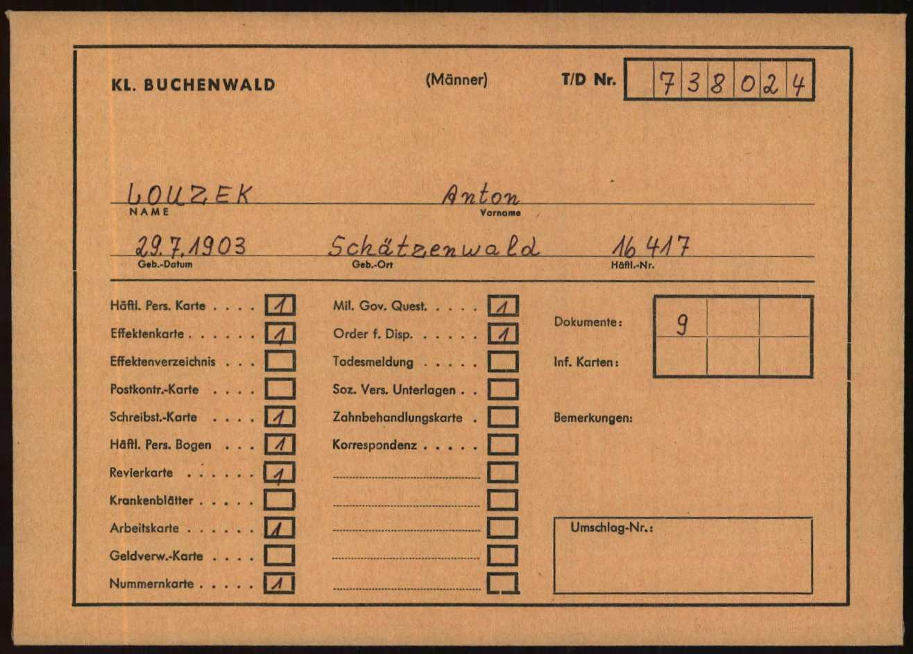
*One of eleven Arolsen Archives documents tracing Antonin Louzek's journey through the Nazi concentration camp system*

### The Continental Cabaret

In April 1946, at the Continental cabaret on Vienna's Taborstrasse, Ingeborg met a man who would change her life.

Veniamin Kolesnikov was a 29-year-old Soviet artillery captain from Omsk, Siberia. He had survived the Eastern Front. He had seen what the Soviet system did to its own people. And now, in the ruins of Vienna, he wanted out.

The two fell in love. It was, by all accounts, intense and immediate. But it was also dangerous. Kolesnikov was a Soviet officer. Fraternization with Austrian civilians was forbidden. And escape from the Soviet system was punishable by death.

In the spring of 1947, Kolesnikov's term of service expired, and he was ordered to return to the USSR for demobilization. Instead, he hid in Ingeborg's mother's apartment on Margaretenstrasse—deep within the Soviet occupation zone.

For two months, Ingeborg concealed a Soviet deserter in her own home, in territory patrolled by the very forces hunting him.

Then, in April 1947, a Soviet military police patrol raided the apartment. Kolesnikov was arrested and imprisoned in the Soviet military prison at Gießhübl, near Perchtoldsdorf.

What happened next defies explanation.

---

## Part Four: The Impossible Escape

### From Gießhübl to Freedom

Two months after his arrest, Veniamin Kolesnikov escaped from the Soviet military prison at Gießhübl.

This was, by all accounts, impossible.

The prison at Gießhübl was part of the Soviet military infrastructure in occupied Austria, connected to the headquarters known as "Army Unit No. 32750" in Baden. According to Vadim Birstein's *"SMERSH: Stalin's Secret Weapon"*, these facilities were carefully constructed with multiple layers of security. The investigation cells were upstairs; the holding cells were in converted basements. Guards were everywhere.

No one else ever escaped from Gießhübl during its entire period of operation.

Yet Kolesnikov did.

**The official version** (as reconstructed by the Ludwig Boltzmann Institute): Ingeborg contacted a former schoolmate who was in a relationship with an American officer. This schoolmate somehow obtained the necessary documents for Kolesnikov to reach the American zone of occupation.

**The unofficial question**: How did a civilian Austrian woman, not yet formally recruited by American intelligence, have the connections and resources to extract a prisoner from a Soviet military prison? And why was Kolesnikov the only person ever to accomplish this?

The investigation found no definitive answer. But it found a pattern: Ingeborg's activities before her "official" recruitment looked remarkably similar to her activities after it.

### The Wels Refugee Camp

After his escape, Kolesnikov adopted a new identity: Weniamin Nowak. He and Ingeborg traveled to Wels, in the American occupation zone, where they registered with the International Refugee Organization.

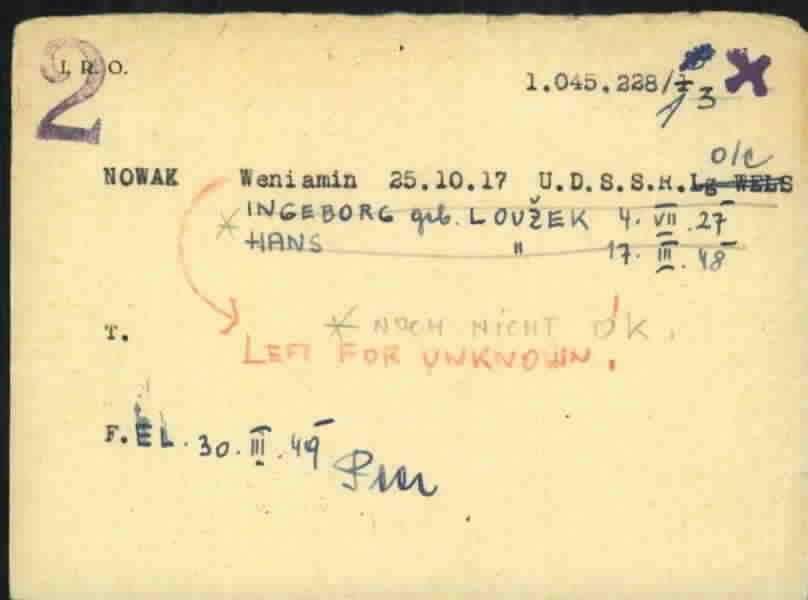
*The I.R.O. card that rewrote history: "NOWAK Weniamin 25.10.17 U.D.S.S.R. / INGEBORG geb. LOUZEK 4.VII.27 / HANS 17.III.48"*

The investigation recovered this I.R.O. registration card from the Arolsen Archives (DocID: 68436595). It documents:

- **Weniamin Nowak**: born October 25, 1917, USSR, located at Lager (Camp) Wels
- **Ingeborg née Louzek**: born July 4, 1927
- **Hans**: born March 17, 1948

They had a child. They were building a life.

Then comes the notation that changes everything:

**"Left for unknown"** — dated March 30, 1949

The Nowak family vanished from the displaced persons system. Not transferred to another camp. Not repatriated. Not resettled. Simply... gone.

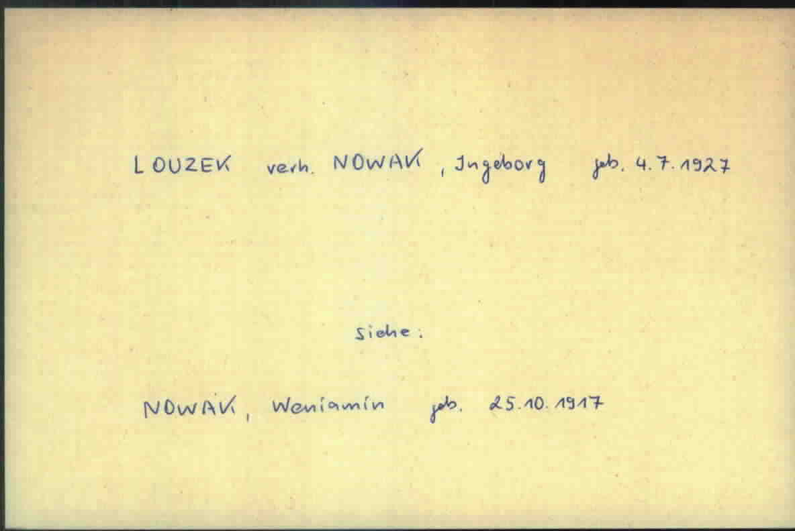
*The archival cross-reference proving the marriage: "LOUZEK verh. NOWAK, Ingeborg geb. 4.7.1927" with reference "Siehe: NOWAK, Weniamin geb. 25.10.1917"*

---

## Part Five: The Newsleak Evolution

### Hamburg, 2016: Building Tools for Journalism

While the Ingeborg investigation would not begin for another four years, the foundations for its digital tools were being laid in Hamburg.

The Language Technology group at Hamburg University had identified a critical problem: investigative journalists were drowning in data. The Afghan War Diary alone contained 91,000 documents. The U.S. Embassy cables numbered over 250,000. No human could read them all—but the patterns within them could change history.

In partnership with **Der Spiegel** (Germany's leading news magazine) and **TU Darmstadt** (for information visualization), they built **new/s/leak: Network of Searchable Leaks**.

The platform was built on:

| Component | Technology | Purpose |
|-----------|------------|---------|
| **NLP Pipeline** | Java + Apache UIMA | Same infrastructure as IBM Watson |
| **Entity Recognition** | Epic NER | Identify persons, organizations, locations |
| **Temporal Extraction** | Heideltime | Find dates and time expressions |
| **Search** | Elasticsearch | Full-text indexing and retrieval |
| **Backend** | Scala + Play Framework | Web application server |
| **Frontend** | JavaScript | Interactive network visualizations |
| **Database** | PostgreSQL | Metadata storage |

By 2018, new/s/leak 2.0 supported over **40 languages** and offered public demos on three datasets:
- The **Enron email corpus**: 125,000 corporate emails
- The **NSU murder case**: 12,000 German parliamentary reports
- **World War II**: 27,000 multilingual Wikipedia articles

The platform was published in peer-reviewed venues including ACL, EMNLP, and SocInfo. It was, at the time, the state of the art for investigative document analysis.

Then the Hamburg project went dormant. The repository sat unchanged on GitHub, accumulating stars but no commits. The investigation into Ingeborg Louzek would reveal its limitations—and demand its resurrection.

### The 2022 Revival: DeepPavlov and Cyrillic

When the Ingeborg investigation loaded Russian-language SMERSH documents into new/s/leak, the platform failed. The Epic NER system, trained primarily on Western European languages, could not process Cyrillic script.

**The solution**: Replace Epic with **DeepPavlov**, a Russian AI research library from the Moscow Institute of Physics and Technology. The selected model—`ner_ontonotes_bert_mult_torch`—was a multilingual BERT transformer trained on the OntoNotes 5.0 corpus, capable of identifying 18 entity types across any language BERT supported.

The revival also integrated **Hoover**, a companion platform for document ingestion:
- **Apache Tika** for text extraction from PDFs, Word documents, and email archives
- **RabbitMQ** for task queuing
- **Background workers** for automated processing
- **Flower** for task monitoring

The architecture now ran two Docker Compose stacks in parallel:
- Hoover's Elasticsearch 6.2.4 for document ingestion
- Newsleak's Elasticsearch 2.4.6 for the legacy preprocessing pipeline

It was a pragmatic compromise—and it worked. The SMERSH documents became processable. Names like Вениамин Колесников could finally be extracted and linked to their Western counterparts.

**But significant limitations remained:**
- No semantic search (only keyword matching)
- Legacy Java/Scala architecture
- Dual Elasticsearch complexity
- No geospatial visualization

### The 2024 Modernization: Weaviate and GLiNER

The next evolution replaced the most problematic components entirely:

**Hoover → Python Pipeline**
- The nine-container Hoover stack was replaced with a Python watchdog script
- Documents dropped into `processing/` directories were automatically sent to the **Unstructured API** for extraction
- State management became directory-based: files moved from `processing/` to `processed/` upon completion

**Elasticsearch → Weaviate**
- **Weaviate 1.25.8** added vector search capability
- Documents were embedded using OpenAI's `text-embedding-3-small`
- Queries could now find conceptually related documents, not just keyword matches

**Epic/DeepPavlov → GLiNER**
- **GLiNER multi-v2.1** enabled zero-shot entity recognition
- Any entity type could be identified with just a label—no training required
- The 0.3B parameter model outperformed ChatGPT on standard NER benchmarks

The modernized platform could finally answer questions like "find documents about escape routes for Soviet defectors" even if the documents used terms like "ratlines" or "exfiltration networks."

---

## Part Six: The Brazilian Discovery

### Following the Ratlines

By 1949, the Nowak family had vanished from the European refugee system. The investigation's hypothesis: if the CIC wanted to protect a valuable defector and the agent who knew their secrets, they might have used the same ratlines that moved other high-value assets to South America.

The "ratlines" were clandestine escape routes operated by various actors—American intelligence, the Vatican, Croatian Ustasha networks—that smuggled people from post-war Europe to South America. Originally intended for intelligence assets and anti-communist refugees, these routes were notoriously exploited by Nazi war criminals seeking to escape justice.

According to Colonel James V. Milano's *"Soldiers, Spies, and the Rat Line"*, the CIC's ratline operation involved:
- **Document fabrication** by Dominic Del Greco and his team
- **Bribes** to Austrian, Italian, and transit country officials
- **Extreme compartmentalization** so defectors knew nothing about each other
- **Minimal paper trails** to protect identities

The destination countries were chosen for their non-extradition policies and less stringent immigration controls. Brazil, Argentina, and Paraguay were favored destinations.

### The Passport

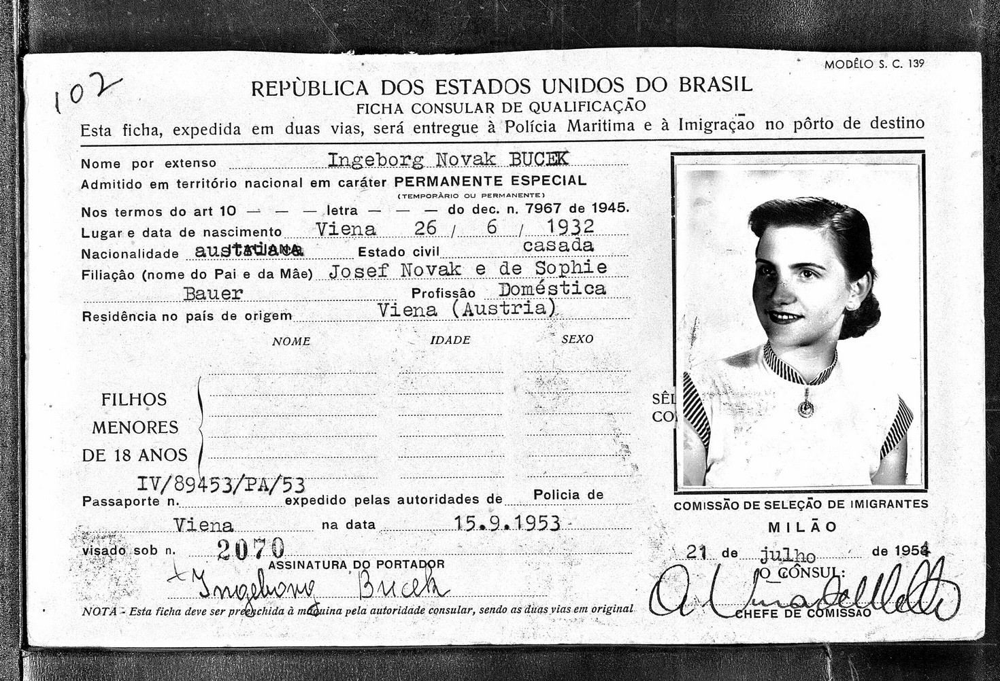
*Brazilian "Ficha Consular de Qualificação" for "Ingeborg Novak Bucek"—dated July 21, 1954*

The investigation uncovered a Brazilian immigration document that defied the official Soviet narrative:

**Name**: Ingeborg Novak BUCEK
**Birth date**: June 26, 1932, Vienna
**Nationality**: Austrian
**Marital status**: Married (casada)
**Parents**: Josef Novak and Sophie Bauer
**Profession**: Doméstica (domestic worker)
**Entry provision**: Article 10, Decreto-Lei Nº 7.967 (1945)
**Status**: Permiso Permanente Especial
**Issue date**: July 21, 1954
**Consular location**: Milan

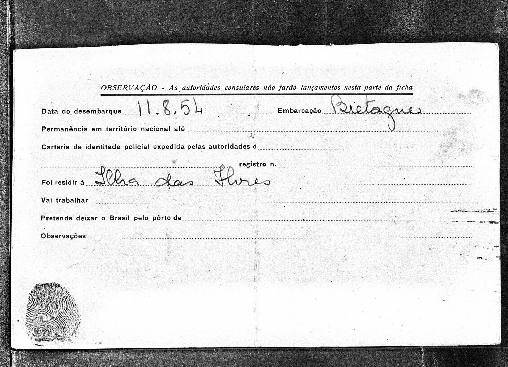
*The reverse of the document showing entry details and administrative stamps*

Several details demand attention:

1. **The date**: July 21, 1954—three and a half years after Ingeborg's reported execution in Moscow

2. **The birth year discrepancy**: The document lists 1932, but Ingeborg was born in 1927. A five-year age reduction would make her appear younger for a new life—a common technique in identity fabrication

3. **The parents' names**: "Josef Novak and Sophie Bauer" are not Ingeborg's actual parents (Antonin Louzek and Elizabeth Hutz). This is a fabricated identity.

4. **The surname "Bucek"**: Neither Louzek nor Novak/Nowak. Possibly a third identity layer, or a marriage to someone in Brazil.

5. **The legal provision**: Article 10 of Decreto-Lei 7.967 allowed admission of foreigners excluded from regular immigration quotas through a "selective process." This was the same provision used by known ratline travelers.

### The Ratline Signature

*For comparison: Brazilian immigration document for Franz Paul Stangl, Nazi war criminal who escaped via the Vatican ratlines*

The side-by-side comparison is striking:

| Element | Ingeborg Novak Bucek | Paul Stangl |
|---------|---------------------|-------------|
| **Document type** | Ficha Consular de Qualificação | Ficha Consular de Qualificação |
| **Legal provision** | Decreto-Lei n. 7967 | Decreto-Lei n. 7967 |
| **Article** | Art. 10 | Art. 9º |
| **Status** | Permanente Especial | Permanente |
| **Processing** | Milan consulate | Beirut consulate |
| **Year** | 1954 | 1951 |

The same document format. The same legal framework. The same system that moved Nazi war criminals to Brazil also, it appears, moved a young Austrian intelligence agent.

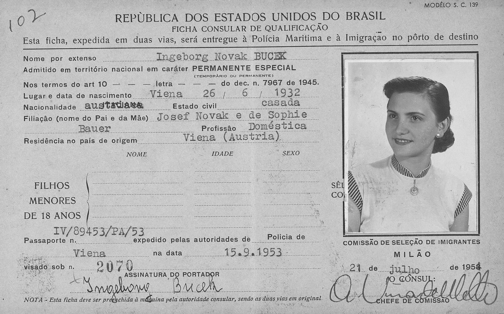
*Enhanced scan of the Brazilian immigration document*

---

## Part Seven: Biometric Verification

### Can the Same Person Exist in Two Places?

The Soviet documents say Ingeborg Louzek was executed in Moscow on January 9, 1951.
The Brazilian documents show Ingeborg Novak Bucek entering Brazil on August 11, 1954.

If these are the same person, one set of documents is false. The investigation turned to biometric analysis to determine: **Is the woman in the Brazilian passport the same person as Ingeborg Louzek?**

### AI Facial Analysis

*AI facial landmark mapping comparing Ingeborg Louzek at age 12 (left) with the Brazilian passport photo (right)*

Modern AI facial recognition maps dozens of landmark points on a face—eye corners, nose bridge, lip boundaries, jawline contours—and measures the geometric relationships between them. These relationships remain relatively stable even as faces age.

The analysis compared photographs spanning 14+ years:

**Ingeborg Louzek (childhood/teenage photos from Vienna)**
vs.
**Ingeborg Novak Bucek (1954 Brazilian passport photo)**

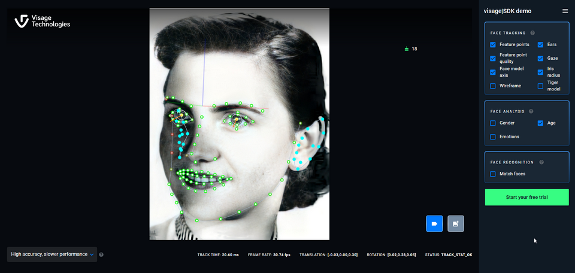
*Visage facial tracking software analyzing the Brazilian passport photograph*

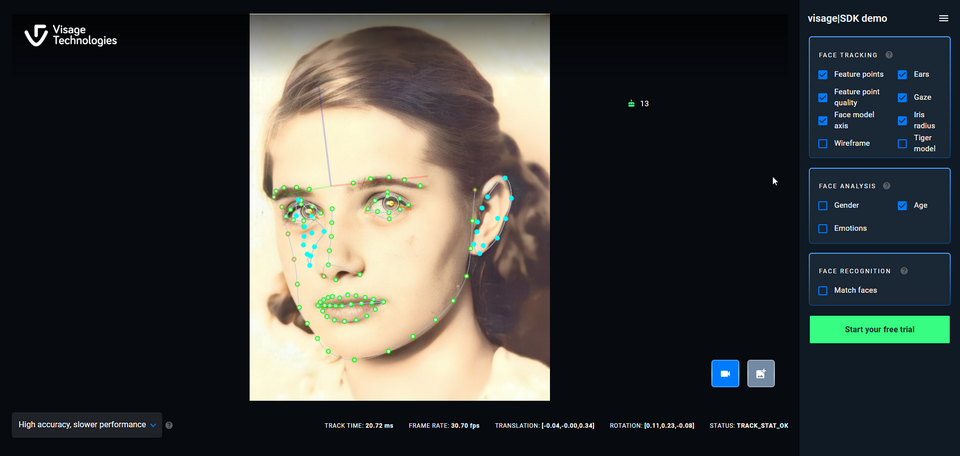
*Visage analysis of known photographs of young Ingeborg Louzek*

**Findings:**
- **Eye spacing and shape**: Consistent across images
- **Nasal bridge structure**: Similar narrow bridge with rounded tip
- **Jawline contour**: Oval face shape maintained
- **Ear biometrics**: Helix curvature, lobe attachment, tragus shape all consistent
- **Forehead proportions**: Stable hairline position and width

### Dental Analysis

*Dental analysis comparing Ingeborg at 16 (left) with the passport photo (right)*

Dental characteristics are particularly valuable for identification because they change little over time (absent dental work) and are highly individual.

The analysis identified a distinctive feature: **rotation of the lateral incisors** inward toward the centerline. This characteristic is visible in both the teenage photographs of Ingeborg Louzek and the 1954 Brazilian passport photo.

**Overall biometric assessment**: High probability of identity match.

### AI Face Restoration

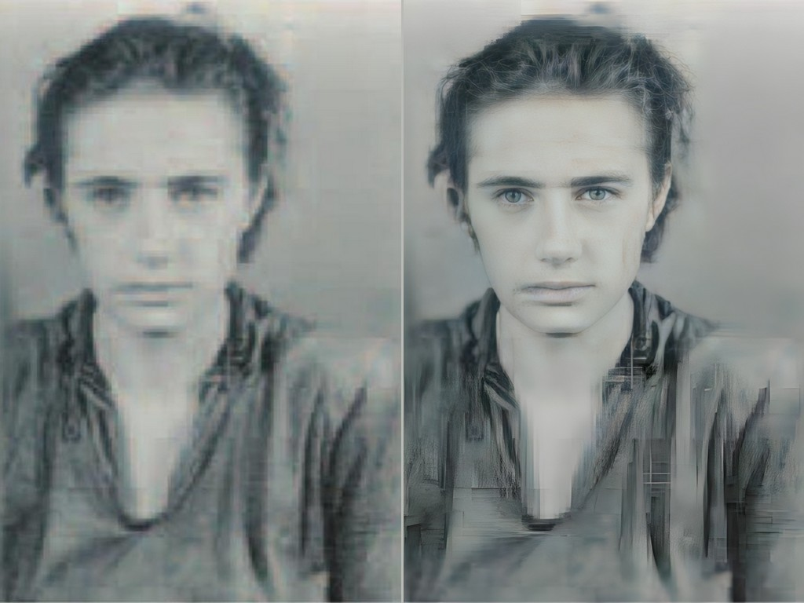
*AI restoration and enhancement of historical photographs for analysis*

Modern AI restoration tools can enhance degraded historical photographs, improving the clarity of facial features for analysis. The investigation used these tools to process damaged or low-resolution images from the archive collections.

---

## Part Eight: The Platform That Emerged

### IntellyWeave: From Investigation to Product

The Ingeborg investigation demanded capabilities that no single tool provided:

| Requirement | Available in 2020? | IntellyWeave Solution |
|-------------|-------------------|----------------------|
| Cyrillic NER | ❌ | DeepPavlov → GLiNER |
| Semantic search | ❌ | Weaviate vector database |
| Geospatial visualization | ❌ | Mapbox GL 3D |
| Network analysis | Partial | vis-network with ForceAtlas2 |
| Multi-agent reasoning | ❌ | 6-phase intelligence orchestrator |
| Zero-shot entity types | ❌ | GLiNER multi-v2.1 |
| Temporal analysis | Partial | Enhanced date extraction |
| Document automation | Partial | Python watchdog pipeline |

### The Three-Layer Architecture

IntellyWeave emerged as a verticalization of Weaviate's Elysia framework, incorporating patterns from Spectre (a legal AI system) and lessons learned from the Newsleak revival:

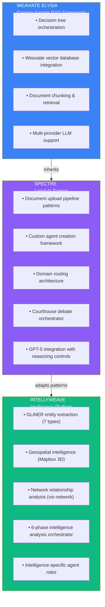

### Seven Entity Types for Intelligence Work

Where the original Newsleak recognized three entity types (persons, organizations, locations) and DeepPavlov's OntoNotes model recognized eighteen, IntellyWeave focuses on **seven intelligence-specific types**:

| Entity Type | Example from Ingeborg Investigation |
|-------------|-------------------------------------|
| **Persons** | Ingeborg Louzek, Veniamin Kolesnikov, Barbara Stelzl-Marx |
| **Organizations** | CIC, SMERSH, I.R.O., Ludwig Boltzmann Institute |
| **Locations** | Vienna, Baden bei Wien, Wels, Moscow, São Paulo |
| **Dates** | August 12, 1950; January 9, 1951; August 11, 1954 |
| **Events** | arrest, trial, execution, escape, border crossing |
| **Laws** | Article 58-6, Decreto-Lei 7.967, Art. 17-58-6 |
| **Cryptonyms** | Rat Line, Army Unit No. 32750, Operation CounterSnatch |

These types emerged directly from the investigation's needs. "Cryptonyms" in particular—code names and classified designations—were essential for understanding intelligence documents where operational security obscured identities and activities.

### The Six-Phase Intelligence Orchestrator

IntellyWeave's multi-agent reasoning system mirrors professional analytical tradecraft:

| Phase | Agent | What It Does |
|-------|-------|--------------|
| 1 | **ExtractorAgent** | Contextualizes GLiNER entities with LLM analysis, adds confidence scores |
| 2 | **MapperAgent** | Builds relationship graphs—who knew whom, who commanded whom |
| 3 | **GeospatialAgent** | Generates coordinates, routes, heatmaps from location entities |
| 4 | **NetworkAgent** | Analyzes graph structure—clusters, key nodes, anomalies |
| 5 | **PatternAgent** | Detects recurring patterns, behavioral signatures, timeline anomalies |
| 6 | **SynthesizerAgent** | Integrates all findings into comprehensive assessment |

Run on the Ingeborg collection, this orchestrator would automatically flag the temporal anomaly: **execution date (January 9, 1951) followed by passport issuance (July 21, 1954)**.

---

## Part Nine: Timeline Reconstruction

### Mapping the Conspiracy

*Aeon Timeline's "Subway" visualization tracking the complex relationships*

The investigation required tracking dozens of interconnected people across multiple years:

**Soviet Side:**
- Valentin Klimenko, Yuri Kosisew (KGB agents)
- Veniamin Kolesnikov (defector)
- SMERSH interrogators and tribunal judges

**American Side:**
- CIC handlers and officers
- Aleksandr Achtyrsky (CIC agent who recruited Ingeborg)
- The unnamed "schoolmate" and her American officer boyfriend

**Criminal Networks:**
- The Benno Blum Gang (Vienna underworld figures)
- Marcus Aronowicz, Baranowsky, Nicolaj Agajew

**Institutions:**
- Counter Intelligence Corps (CIC)
- SMERSH (Soviet military counterintelligence)
- International Refugee Organization
- Ludwig Boltzmann Institute

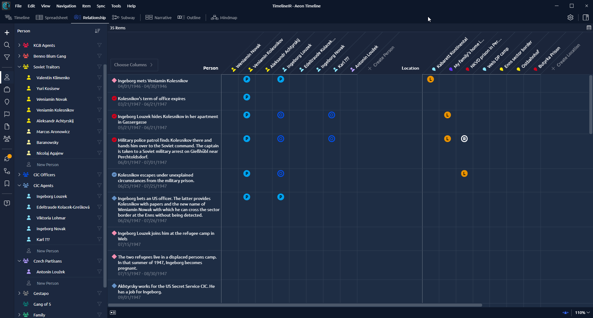
*Relationship mapping showing connections between key figures*

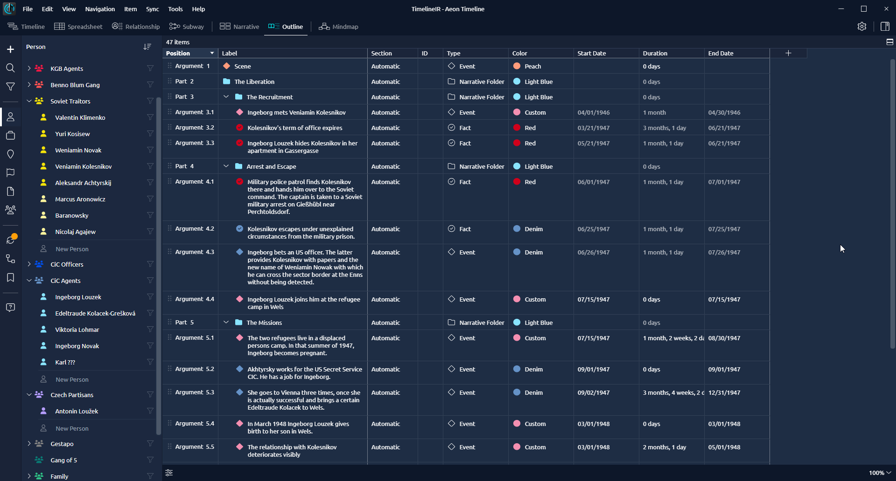
*Chronological outline of investigation events*

### Key Timeline Events

| Date | Event | Significance |
|------|-------|--------------|
| **Aug 20, 1943** | Antonin Louzek imprisoned at Buchenwald | Father's resistance activities |
| **Apr 1945** | Buchenwald liberated by U.S. forces | CIC connection established |
| **Apr 1946** | Ingeborg meets Kolesnikov | Love story begins |
| **Apr 1947** | Kolesnikov arrested | Imprisoned at Gießhübl |
| **Jun 1947** | Kolesnikov escapes | Only successful escape ever |
| **1947-1949** | Nowak family at Wels camp | I.R.O. registration |
| **Mar 17, 1948** | Son Hans born | Documented in I.R.O. records |
| **Mar 30, 1949** | Family "left for unknown" | Vanished from refugee system |
| **Aug 12, 1950** | Ingeborg arrested | Official Soviet narrative |
| **Oct 21, 1950** | Death sentence | Military tribunal in Baden |
| **Jan 9, 1951** | Reported execution | Lubyanka Prison, Moscow |
| **Jul 21, 1954** | Brazilian passport issued | Milan consulate |
| **Aug 11, 1954** | Entry to Brazil | São Paulo |

The 3.6-year gap between reported execution and Brazilian passport issuance remains unexplained by the official narrative.

---

## Part Ten: What Remains Unknown

### The Questions That Demand Answers

The documentary evidence has revealed a story vastly more complex than the simple narrative of "Austrian spy executed in Moscow." But definitive proof of what actually happened remains elusive.

**Evidence supporting survival:**
- ✅ I.R.O. records prove Ingeborg married Kolesnikov under new identities
- ✅ "Left for unknown" indicates planned disappearance from refugee system
- ✅ Brazilian passport shows entry 3.5 years after "execution"
- ✅ Same legal provision used by confirmed ratline travelers
- ✅ Biometric analysis suggests identity match across decades
- ✅ Birth year discrepancy consistent with identity fabrication

**Evidence supporting execution:**
- ✅ Declassified Soviet documents describe arrest, trial, and execution
- ✅ Ludwig Boltzmann Institute researchers found the account credible
- ✅ The Soviet system executed many people under similar circumstances
- ✅ Brazil was also a destination for Nazi war criminals—not just Western assets

**Still needed:**
- CIC records at U.S. National Archives (declassified but not digitized)
- SMERSH/NKVD files in Russian state archives
- Brazilian naturalization records
- Brazilian death records (if any)

### The Investigation Continues

Did Ingeborg Louzek die in Moscow's Lubyanka Prison on January 9, 1951?

Or did she escape through the same ratlines she had helped others navigate, starting a new life in Brazil as "Ingeborg Novak Bucek"—a woman five years younger than her true age, with fabricated parents and a new surname?

The tools that might answer this question definitively—tools that can process multilingual documents, extract entities across languages, map relationships, track geographic movements, and reason about temporal anomalies—now exist.

They're called IntellyWeave.

And the "ingeborg" document collection remains the platform's constant test case: the investigation that demanded better tools, and finally received them.

---

## Continue the Journey

**[The Walkthrough →](walkthrough.md)**

Follow the step-by-step investigative methodology that built IntellyWeave, from SPARQL queries against Austrian newspaper archives to AI-powered biometric analysis.

**[Platform Evolution →](platform-evolution.md)**

A detailed technical history of the three generations of investigative software, from Hamburg's original new/s/leak through the 2022 revival, 2024 modernization, and 2025 IntellyWeave release.

**[From Newsleak to IntellyWeave →](evolution.md)**

The seven-year journey from Hamburg's original new/s/leak platform to IntellyWeave, told through the lens of the Ingeborg investigation—how each platform limitation drove the next evolution.

---

*This demo documents a real investigation conducted by IntellyWeave's creator. The "ingeborg" document collection has been the constant test case through seven years of platform evolution—from the original Hamburg University new/s/leak through the 2022 revival, 2024 modernization, and the 2025 IntellyWeave release.*
