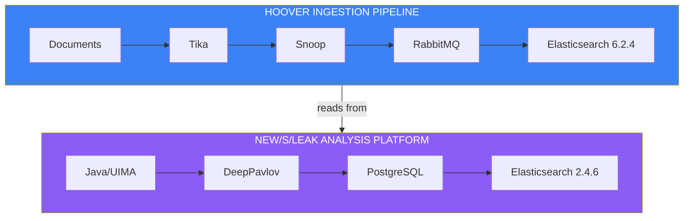

# Platform Evolution: From Newsleak to IntellyWeave

> *Seven years of development driven by a single investigation*

---

## The Origin: Hamburg University, 2016

### A Problem Worth Solving

In the mid-2010s, investigative journalists faced an unprecedented challenge. Document leaks had grown from hundreds of pages to hundreds of thousands. The Afghan War Diary alone contained 91,000 documents. The U.S. Embassy cables numbered over 250,000. The Hacking Team breach exposed 400GB of data.

No human could read it all. But somewhere in those documents were stories that would change history—if only someone could find them.

The Language Technology group at Hamburg University, led by Professor Chris Biemann, saw an opportunity. In partnership with **Der Spiegel** (Germany's leading news magazine) and **TU Darmstadt** (for information visualization), they proposed a solution: use natural language processing to automatically extract entities and relationships, then visualize them in interactive network graphs.

The Volkswagen Foundation agreed to fund the project under their "Science and Data Journalism" initiative.

They called it **new/s/leak: Network of Searchable Leaks**.

### The Technical Architecture (2016-2018)

The Hamburg team built their platform on proven enterprise technology:

**Apache UIMA Framework**
The same natural language processing infrastructure used by IBM Watson. UIMA (Unstructured Information Management Architecture) provided a robust pipeline for text analysis, allowing multiple NLP components to be chained together.

**Epic Named Entity Recognition**
A probabilistic NER system that identified persons, organizations, and locations. The algorithm considered both context-independent word likelihood (how likely is "Smith" to be a name?) and contextual factors (position in sentence, surrounding words).

**Heideltime Temporal Extraction**
A rule-based system for extracting temporal expressions—both explicit dates ("April 1, 2015") and relative references ("next Monday", "last year"). Developed at Heidelberg University, it supported multiple languages.

**Elasticsearch**
Full-text search with faceted filtering. Documents were indexed for rapid retrieval, with extracted entities stored as metadata.

**Scala + Play Framework**
The web application backend, following functional programming principles popular in the late 2010s.

**PostgreSQL**
Relational database for structured metadata, entity relationships, and user annotations.

**JavaScript Network Visualization**
Custom interactive graphs showing entity co-occurrence—who appeared in documents with whom, how frequently, and in what context.

### What It Could Do

By 2018, new/s/leak 2.0 offered:

- **40+ language support** for entity extraction
- **Network visualization** of persons, organizations, and locations
- **Temporal analysis** showing how relationships changed over time
- **Full-text search** with entity-based filtering
- **Document exploration** with highlighted entities
- **Custom dictionaries** for domain-specific terms

Three public demos showcased the platform:
1. **Enron corpus**: 125,000 corporate emails revealing fraud patterns
2. **NSU murder case**: 12,000 German parliamentary reports on right-wing terrorism
3. **World War II**: 27,000 multilingual Wikipedia articles

The project produced multiple peer-reviewed publications at ACL, EMNLP, EuroVis, and SocInfo. It was, at the time, the state of the art for investigative document analysis.

### What It Could Not Do

But for certain investigations—particularly those involving Eastern European documents—new/s/leak had critical limitations:

| Limitation | Impact |
|------------|--------|
| **Cyrillic NER failure** | Russian, Ukrainian, Bulgarian documents could not be processed |
| **Keyword-only search** | "Ratlines" wouldn't find documents about "escape routes for defectors" |
| **No geospatial** | Locations extracted but not mapped |
| **Manual ingestion** | Each document batch required command-line processing |
| **Legacy dependencies** | Elasticsearch 2.4.6, Scala 2.11, Play 2.x—all increasingly outdated |

By 2020, the Hamburg project had gone dormant. The repository sat unchanged on GitHub, accumulating stars but no commits.

---

## The First Revival: 2022-2023

### The Cyrillic Crisis

When the Ingeborg investigation attempted to process SMERSH interrogation protocols in Russian, new/s/leak failed completely. The Epic NER system, trained primarily on Western European languages, could not recognize Cyrillic characters.

Names like "Вениамин Колесников" (Veniamin Kolesnikov) went unextracted. Soviet military units like "Войсковая часть № 32750" (Army Unit No. 32750) were invisible to the system.

The investigation needed those Russian documents. They contained:
- Interrogation transcripts
- Trial proceedings
- Execution orders
- Internal NKVD communications

Without processing them, half the story remained hidden.

### DeepPavlov: The Russian Solution

**DeepPavlov** is an open-source conversational AI library developed by the Moscow Institute of Physics and Technology. Unlike Epic's rule-based approach, DeepPavlov uses deep learning—specifically, transformer models trained on massive multilingual corpora.

The selected model, `ner_ontonotes_bert_mult_torch`, was a multilingual BERT transformer trained on the OntoNotes 5.0 corpus. It could identify 18 entity types:

| OntoNotes Type | Description |
|----------------|-------------|
| PERSON | People, including fictional |
| NORP | Nationalities, religious/political groups |
| FAC | Facilities (buildings, airports, highways) |
| ORG | Companies, agencies, institutions |
| GPE | Geopolitical entities (countries, cities, states) |
| LOC | Non-GPE locations (mountain ranges, water bodies) |
| PRODUCT | Objects, vehicles, foods |
| EVENT | Named hurricanes, battles, wars, sports events |
| WORK_OF_ART | Titles of books, songs, etc. |
| LAW | Named documents made into laws |
| LANGUAGE | Any named language |
| DATE | Absolute or relative dates |
| TIME | Times smaller than a day |
| PERCENT | Percentages |
| MONEY | Monetary values |
| QUANTITY | Measurements |
| ORDINAL | First, second, etc. |
| CARDINAL | Other numerals |

The revival created a new NER microservice (`newsleak-ner-deeppavlov/`) that replaced the Epic system:

```python
from deeppavlov import configs, build_model

# Load multilingual BERT NER model
ner_model = build_model(configs.ner.ner_ontonotes_bert_mult_torch, download=True)

# Entity mapping: OntoNotes → Newsleak
# B-PERSON, I-PERSON → PER
# B-ORG, I-ORG → ORG
# B-LOC, I-LOC, B-GPE, I-GPE → LOC
```

With DeepPavlov in place, the SMERSH documents became processable. Names in Cyrillic could finally be extracted and linked to their Western counterparts.

### Hoover Integration

The original new/s/leak required manual document processing—running command-line scripts for each batch. The revival integrated **Hoover**, a companion platform developed for document search:

**Hoover Components:**
- **Apache Tika** for text extraction (PDF, DOCX, email archives)
- **RabbitMQ** for task queuing
- **Snoop workers** for background processing
- **Flower** for task monitoring
- **Elasticsearch 6.2.4** for document storage

The architecture now ran two Docker Compose stacks:



The dual Elasticsearch architecture was a pragmatic compromise. Hoover required ES 6.x for modern features. The legacy Newsleak Java preprocessing JAR was compiled against ES 2.4.x APIs. Upgrading would have required weeks of refactoring.

### Revival Achievements

By 2023, the revived Newsleak had:

- ✅ **Cyrillic NER** via DeepPavlov BERT
- ✅ **Automated ingestion** via Hoover
- ✅ **Multi-language support** expanded to Ukrainian, Russian, Polish, Slovak, Italian
- ✅ **Docker containerization** for all services
- ✅ **Enhanced date extraction**

### Revival Limitations

But significant technical debt remained:

- ❌ **No semantic search** (still keyword-only)
- ❌ **Legacy frontend** (AngularJS 1.x, Bower)
- ❌ **Dual Elasticsearch** complexity
- ❌ **No geospatial visualization**
- ❌ **Scala 2.11 / Play 2.x** increasingly unmaintained

---

## The Modernization: 2024

### Replacing Complexity with Simplicity

The 2024 modernization took a different approach. Rather than patching legacy components, it replaced them entirely while preserving what worked.

### Hoover → Python Watchdog

The nine-container Hoover stack was replaced with a single Python watchdog script:

```python
# Simplified architecture
processing/     # Drop files here
    ↓
watchdog detects new file
    ↓
Unstructured API extracts text
    ↓
Index to Elasticsearch
    ↓
Generate embeddings
    ↓
Store in Weaviate
    ↓
processed/     # File moved here when done
```

**Unstructured API** replaced Apache Tika for document parsing:
- Advanced layout analysis (tables, headers, footnotes)
- Multi-format support (PDF, DOCX, HTML, emails)
- Better OCR for scanned documents
- Cloud service with API access

### Elasticsearch → Weaviate

The modernization added **Weaviate 1.25.8**, an open-source vector database:

**What Weaviate Enabled:**
- **Semantic search**: Find conceptually related documents, not just keyword matches
- **Vector embeddings**: OpenAI's `text-embedding-3-small` captured meaning
- **Hybrid search**: Combined BM25 keyword matching with vector similarity

For the Ingeborg investigation, this meant queries like "find documents about escape routes for Soviet defectors" would return relevant results even if documents used terms like "ratlines" or "exfiltration networks."

### Epic/DeepPavlov → GLiNER

**GLiNER** (Generalist and Lightweight Named Entity Recognition) was published at NAACL 2024. Unlike traditional NER models trained on fixed entity types, GLiNER uses zero-shot learning:

- Given any label—"cryptonym," "military unit," "legal statute"—GLiNER identifies matching entities
- No training data required for new entity types
- 0.3B parameters (lightweight compared to LLMs)
- Outperformed ChatGPT on standard NER benchmarks

The modernization added a GLiNER microservice:

```python
from gliner import GLiNER

model = GLiNER.from_pretrained("urchade/gliner_multi-v2.1")

# Extract any entity type with just a label
entities = model.predict_entities(
    text,
    ["location", "person", "cryptonym", "law"],
    threshold=0.5
)
```

### Modernization Achievements

The 2024 textmining project achieved:

- ✅ **Automated ingestion** via Python watchdog
- ✅ **Vector search** via Weaviate
- ✅ **Zero-shot NER** via GLiNER
- ✅ **Modern document parsing** via Unstructured API
- ✅ **Unified container** architecture
- ✅ **Directory-based state** management

---

## IntellyWeave: 2025

### A Complete Rewrite

IntellyWeave represents not a modernization but a complete architectural rewrite. Built on **Weaviate's Elysia framework**, it inherited battle-tested patterns while adding intelligence-specific capabilities.

### The Elysia Foundation

Elysia is Weaviate's open-source agentic platform designed to use tools in a decision tree. Unlike agent architectures that give LLMs unrestricted tool access, Elysia features pre-defined decision nodes where each node determines available next steps.

**Key Elysia Features:**
- Decision-tree orchestration for auditable reasoning
- Native Weaviate vector database integration
- FastAPI backend with production-ready Python
- React/Next.js frontend with modern TypeScript
- Multi-provider LLM support (OpenAI, Anthropic, Google, local)

### The Spectre Inheritance

IntellyWeave also inherited patterns from **Spectre**, a legal AI system built on Elysia:

- **Document upload pipeline**: Battle-tested ingestion patterns
- **Custom agent framework**: User-defined agents with domain knowledge
- **Domain routing**: Query intent analysis and specialist selection
- **Courthouse debate orchestrator**: Multi-agent reasoning (adapted for intelligence analysis)
- **GPT-5 integration**: Reasoning effort and verbosity controls

### Seven Intelligence Entity Types

Where original Newsleak had three entity types and OntoNotes had eighteen, IntellyWeave focuses on **seven types specifically chosen for intelligence work**:

| Type | Why It Matters |
|------|----------------|
| **Persons** | Core to any investigation—who did what |
| **Organizations** | Agencies, companies, groups—institutional actors |
| **Locations** | Geographic context—where events occurred |
| **Dates** | Temporal analysis—when things happened |
| **Events** | What happened—arrests, meetings, operations |
| **Laws** | Legal instruments—statutes, treaties, provisions |
| **Cryptonyms** | Code names—operational security obscures identities |

These types emerged from the Ingeborg investigation. "Cryptonyms" in particular was essential—intelligence documents are full of code names like "Rat Line" and classified designations like "Army Unit No. 32750."

### Six-Phase Intelligence Orchestrator

IntellyWeave's multi-agent system mirrors professional analytical tradecraft:

**Phase 1: ExtractorAgent**
- Takes raw GLiNER entity output
- Contextualizes with LLM analysis
- Adds confidence scores
- Resolves ambiguities

**Phase 2: MapperAgent**
- Builds relationship graphs
- Identifies who knew whom
- Maps command structures
- Traces organizational affiliations

**Phase 3: GeospatialAgent**
- Generates coordinates from location entities
- Resolves historical place names ("Saigon" → Ho Chi Minh City)
- Creates routes and movement patterns
- Produces heatmaps of entity density

**Phase 4: NetworkAgent**
- Analyzes graph structure
- Identifies clusters and communities
- Finds key nodes (most connected entities)
- Detects anomalies in network patterns

**Phase 5: PatternAgent**
- Detects recurring patterns
- Identifies behavioral signatures
- Flags timeline anomalies
- Recognizes operational tradecraft

**Phase 6: SynthesizerAgent**
- Integrates all previous findings
- Produces comprehensive assessment
- Includes confidence scores
- Provides reasoning chains with source attribution

### Geospatial Intelligence

IntellyWeave finally addresses the gap that existed since original Newsleak: **geospatial visualization**.

**Backend Pipeline:**
- LLM-enhanced location normalization
- Mapbox Geocoding API v6 for coordinates
- Geographic queries via Weaviate geo-filter
- Location type classification

**Frontend Visualization (Mapbox GL 3.16):**
- 3D globe projection with atmospheric effects
- Heatmap layers for entity density
- Route visualization for movement patterns
- DEM terrain with 1.5x exaggeration
- Camera controls: pitch (0-85°), bearing (0-360°), zoom (0-24)

### Network Visualization

**vis-network 10.0.2** with ForceAtlas2 physics:

- Force-directed layout automatically clusters connected entities
- Entity-type color coding
- Edge width indicates relationship strength
- Interactive controls for exploration
- Hierarchical layout option for organizational structures

### Tech Stack Summary

| Layer | Technology |
|-------|------------|
| **Backend** | Python 3.12, FastAPI |
| **Vector Database** | Weaviate (native) |
| **LLM Orchestration** | DSPy |
| **Entity Extraction** | GLiNER multi-v2.1 |
| **Frontend** | Next.js 15, React 18, TypeScript 5 |
| **Styling** | Tailwind CSS 3.4.1 |
| **Geospatial** | Mapbox GL 3.16 |
| **Network Graphs** | vis-network 10.0.2 |
| **Charts** | Recharts 2.15.3 |
| **3D Globe** | Three.js |

---

## Evolution Summary

```mermaid
flowchart TB
    subgraph Original["2016-2018: ORIGINAL NEWSLEAK"]
        O1["Hamburg University + Der Spiegel + TU Darmstadt"]
        O2["Java/UIMA + Epic NER + Heideltime"]
        O3["Scala/Play + AngularJS + PostgreSQL"]
        O4["Elasticsearch 2.4.6 • 3 entity types"]
        O5["❌ No Cyrillic, no semantic search"]
    end

    subgraph Revival["2022-2023: REVIVAL"]
        R1["DeepPavlov BERT for Cyrillic"]
        R2["Hoover integration for ingestion"]
        R3["Docker containerization"]
        R4["18 OntoNotes entity types"]
        R5["❌ Still keyword-only search"]
    end

    subgraph Modern["2024: MODERNIZATION"]
        M1["Python watchdog replaces Hoover"]
        M2["Weaviate adds vector search"]
        M3["GLiNER enables zero-shot NER"]
        M4["Unstructured API for parsing"]
        M5["❌ No multi-agent reasoning"]
    end

    subgraph IW["2025: INTELLYWEAVE"]
        I1["Complete Python/FastAPI rewrite"]
        I2["Elysia framework foundation"]
        I3["7 intelligence-specific entity types"]
        I4["6-phase intelligence orchestrator"]
        I5["Mapbox 3D + vis-network"]
        I6["✅ Production-ready platform"]
    end

    Original -->|"Dormant 2018-2022"| Revival
    Revival --> Modern
    Modern --> IW

    style Original fill:#6b7280,color:#fff
    style Revival fill:#3b82f6,color:#fff
    style Modern fill:#8b5cf6,color:#fff
    style IW fill:#10b981,color:#fff
```



---

## The Constant: The Ingeborg Collection

Through seven years and four platform generations, one thing remained constant: the "ingeborg" document collection.

This collection—declassified CIA files, SMERSH interrogation protocols, I.R.O. refugee records, Austrian newspaper clippings, biometric analyses—served as the test case for every platform phase.

When new features were added, they were tested against the Ingeborg documents.
When limitations were discovered, they were discovered through the Ingeborg investigation.
When capabilities were expanded, it was to serve the Ingeborg research.

The investigation that demanded better tools finally received them. IntellyWeave exists because a family's search for truth pushed each generation of software to its limits—and beyond.

---

**[← Back to Overview](index.md)**

**[The Walkthrough →](walkthrough.md)**
