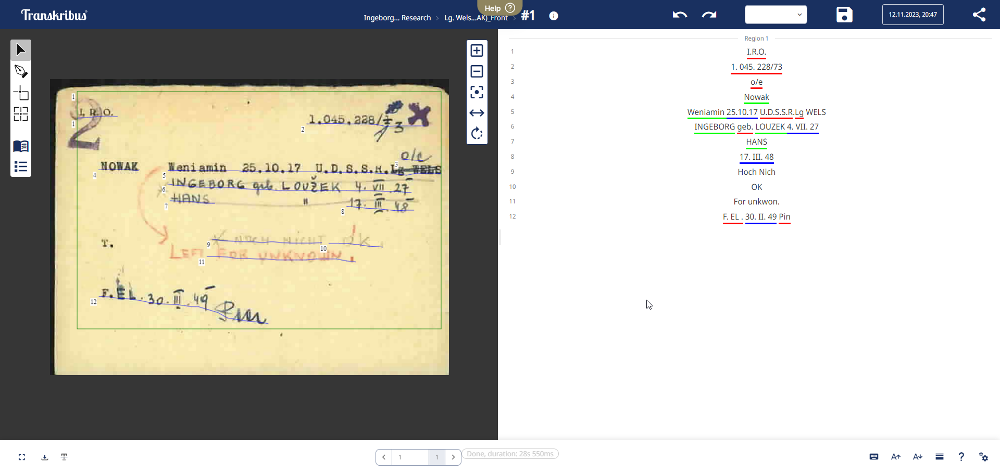
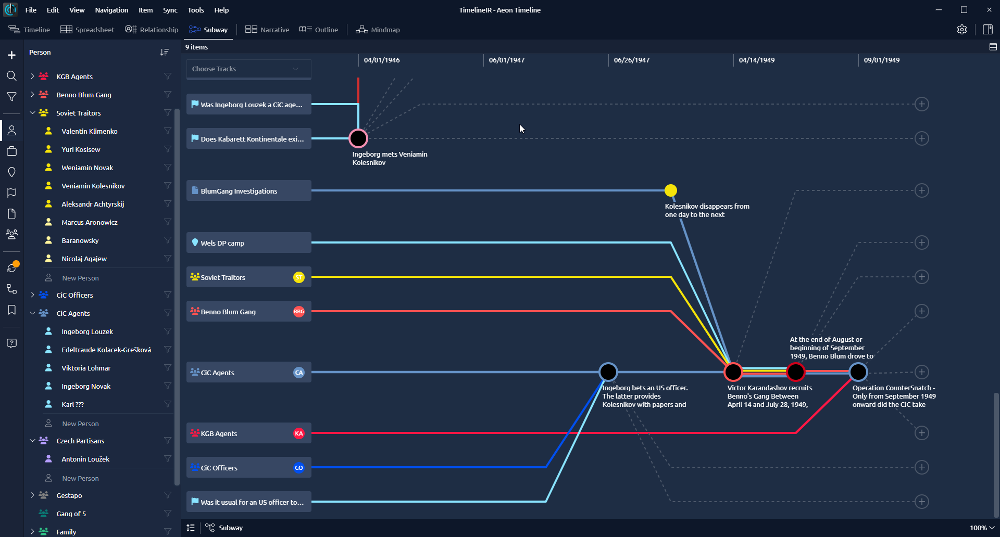
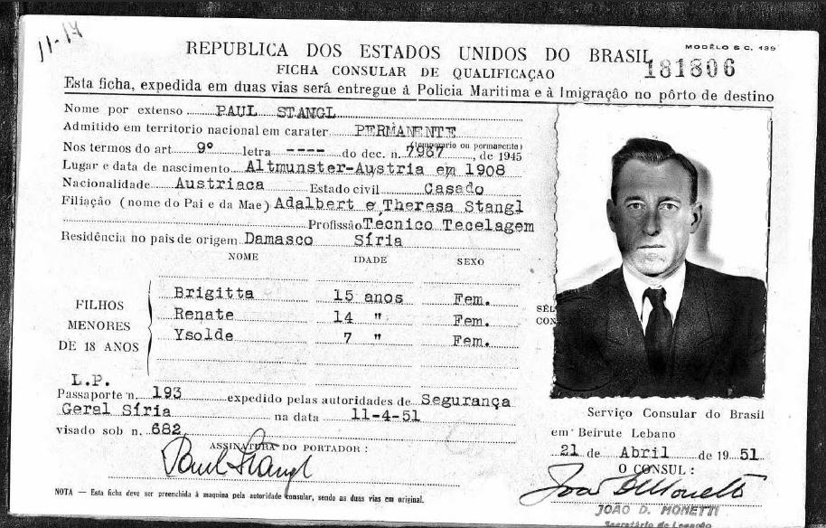
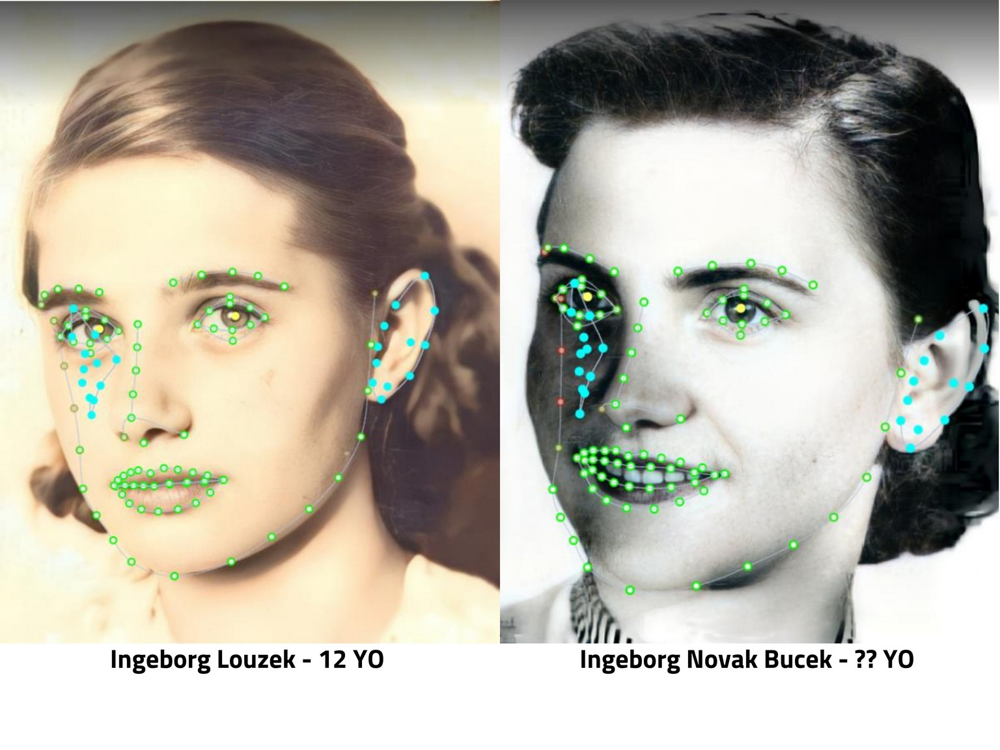
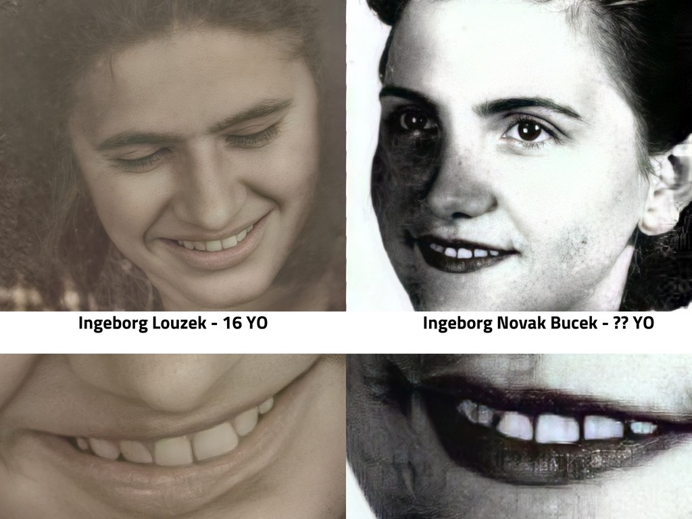

# Investigation Walkthrough: The Tools Behind the Discovery

> *A step-by-step journey through the technologies that uncovered a Cold War mystery—and shaped the development of IntellyWeave*

---

## Prologue: The Starting Point

Every investigation begins with a question. In this case, it was a family mystery that had haunted three generations:

**What really happened to Ingeborg Louzek?**

The official story—execution by firing squad in Moscow on January 9, 1951—came from declassified Soviet documents released in 2009. But the Kremlin's narrative raised more questions than it answered. The timeline didn't add up. The circumstances of her arrest were suspicious. And certain details about her trial seemed deliberately obscured.

This walkthrough traces the investigative journey that demanded new tools at every turn—and ultimately built IntellyWeave.

---

## Phase 1: Querying the Austrian Archives

### The SPARQL Breakthrough

The investigation began where many historical investigations start: with digitized newspaper archives. The Austrian National Library maintains a vast collection of OCR-processed newspapers accessible via SPARQL endpoints—a query language for linked data.

**The technique:** Construct queries that search for names, places, and events mentioned in the declassified Soviet documents, then cross-reference with contemporary Austrian news coverage.

```sparql
# Example: Finding references to Soviet military activities in Vienna
SELECT ?article ?date ?content
WHERE {
  ?article a schema:NewsArticle ;
           schema:datePublished ?date ;
           schema:text ?content .
  FILTER(CONTAINS(?content, "Baden") &&
         CONTAINS(?content, "sowjetisch") &&
         ?date > "1945-01-01"^^xsd:date &&
         ?date < "1955-12-31"^^xsd:date)
}
```

**What was discovered:** References to events, places, and persons that provided context for the official documents—including news coverage of Soviet military tribunals in Baden and reports of displaced persons moving through Austrian refugee camps.

**The limitation:** SPARQL could find keyword matches, but couldn't understand that "Sowjetische Besatzungszone" and "Russian-occupied Vienna" referred to the same concept. The investigation needed semantic search.

---

## Phase 2: Processing Multilingual Documents

### The Cyrillic Problem

The Soviet SMERSH and NKVD documents were critical—they contained the interrogation protocols and trial records. But these documents were in Russian, written in Cyrillic script.

The original Newsleak platform (University of Hamburg, 2018) could process documents in 40+ languages, but its Epic NER system struggled with Cyrillic text. Names like "Вениамин Колесников" (Veniamin Kolesnikov) went unrecognized.

**The solution (2022 Revival):** Integrate DeepPavlov, a Russian AI research library, using the `ner_ontonotes_bert_mult_torch` model—a multilingual BERT transformer trained on the OntoNotes corpus.

```python
from deeppavlov import configs, build_model

# Load multilingual BERT NER model
ner_model = build_model(configs.ner.ner_ontonotes_bert_mult_torch)

# Process Russian text
text = "Ингеборга Лузек была арестована в августе 1950 года"
entities = ner_model([text])
# Output: [('Ингеборга Лузек', 'PER')]
```

**What was discovered:** With Cyrillic NER working, the Russian documents revealed the names of interrogators, the specific charges under Soviet law (Article 58-6), and details about the military tribunal that tried Ingeborg.

**The limitation:** The investigation could now extract entities from Russian, but still couldn't search semantically across languages. A query for "escape routes for Soviet defectors" wouldn't find documents about "ratlines" unless that exact term appeared.

---

## Phase 3: The Arolsen Archives

### Searching the World's Largest Holocaust Archive

The Arolsen Archives (formerly International Tracing Service) hold the world's most comprehensive collection of Nazi persecution and displaced persons records—over 30 million documents.

**The technique:** Search the digitized archive for any records matching the key identities: Ingeborg Louzek, Veniamin Kolesnikov, and their known aliases.

**The breakthrough:** Two critical documents emerged:

1. **DocID 668118362** — An I.R.O. (International Refugee Organization) family card showing "NOWAK" family at Wels refugee camp
2. **DocID 68436595** — An index card cross-referencing "LOUZEK verh. NOWAK, Ingeborg" with "NOWAK, Weniamin"

These documents proved that Ingeborg had married Kolesnikov under his new identity "Weniamin Nowak," that they had a son named Hans, and that the family had "Left for unknown" on March 30, 1949—more than a year before Ingeborg's reported arrest.

**The limitation:** The handwritten cards required manual transcription. Character-by-character reading of 80-year-old handwriting was slow and error-prone.

---

## Phase 4: AI-Powered Document Reading

### Transkribus: Teaching AI to Read History


*Transkribus processing the I.R.O. family card with color-coded text recognition*

Transkribus is an AI-powered platform for handwritten text recognition, developed at the University of Innsbruck. It uses neural networks trained on historical handwriting styles to transcribe documents that traditional OCR cannot handle.

**The technique:** Upload archival images and apply trained models for German administrative handwriting (the style used in most Austrian refugee records).

**The result:** Automated transcription of the critical I.R.O. cards, with high accuracy on the key fields:
- Names: NOWAK, Weniamin / INGEBORG geb. LOUZEK / HANS
- Dates: 25.10.17 / 4.VII.27 / 17.III.48
- Location: Lg WELS (Lager Wels = Wels Camp)
- Status: "Left for unknown"

**The insight:** This technology demonstrated what would later become core to IntellyWeave—using AI to make unstructured historical documents searchable and analyzable.

---

## Phase 5: Timeline Reconstruction

### Mapping the Conspiracy

With entities extracted from documents in multiple languages, the investigation had hundreds of data points: people, organizations, locations, dates, events. But understanding how they connected required visualization.


*The investigation mapped in Aeon Timeline's subway visualization*

**The tool:** Aeon Timeline, a timeline software designed for writers and researchers that supports multiple parallel tracks and relationship mapping.

**The technique:** Create tracks for different entity groups—CIC Agents, Soviet Traitors, KGB Agents, Organizations—and plot events along a temporal axis. Use the "Subway" visualization to see how different threads intersect.

**What emerged:** The visualization revealed patterns invisible in the raw data:
- Ingeborg met Kolesnikov in April 1946, shortly after her father was liberated from Buchenwald by CIC officers
- Kolesnikov's escape from Soviet military prison coincided with known CIC operations in the area
- The family's disappearance from the I.R.O. system preceded Operation CounterSnatch, a CIC initiative to extract valuable defectors

**The limitation:** Timeline software is excellent for visualization but requires manual data entry. The investigation needed automated entity extraction and relationship mapping.

---

## Phase 6: The Brazilian Discovery

### Following the Ratlines

The investigation had established that Ingeborg and Kolesnikov vanished from the European refugee system in 1949. But where did they go?

The "ratlines" were clandestine escape routes that moved people from Europe to South America—originally used to extract valuable intelligence assets, later infamously exploited by Nazi war criminals.

**The hypothesis:** If the CIC wanted to protect Kolesnikov (a valuable defector) and Ingeborg (who knew too much about the escape networks), they might have used the same ratlines.

**The search:** Brazilian immigration records from the 1950s.

**The discovery:** A Brazilian "Ficha Consular de Qualificação" (consular qualification form) for "Ingeborg Novak Bucek":
- **Date:** July 21, 1954
- **Entry provision:** Article 10, Decreto-Lei Nº 7.967 (1945)
- **Status:** Permiso Permanente Especial
- **Origin:** Vienna, Austria

This was three and a half years after Ingeborg's reported execution in Moscow.

### The Ratline Signature


*Paul Stangl's ratline passport showing identical document format and legal provision*

The same document format. The same legal provision. The same consular process. The Brazilian passport for "Ingeborg Novak Bucek" bore all the hallmarks of a ratline escape—identical to documents used by confirmed ratline travelers like Franz Stangl.

---

## Phase 7: Biometric Verification

### Can AI Bridge Twenty Years?

The Brazilian passport contained a photograph. But was this really Ingeborg Louzek, aged twenty years?


*AI facial landmark mapping across two decades*

**The technique:** AI-powered biometric analysis comparing photographs from the 1930s-1940s (known images of Ingeborg Louzek) with the 1954 passport photo.

**The analysis:**
- **Facial geometry:** Eye spacing, nasal bridge width, jawline contour
- **Ear biometrics:** Helix curvature, lobe attachment, tragus shape
- **Dental characteristics:** Tooth alignment, distinctive features


*Dental analysis revealing matching characteristics across the photographs*

**The finding:** The distinctive rotation of the lateral incisors—visible in both the teenage Ingeborg and the Brazilian passport photo—provided particularly strong evidence of identity continuity.

**The conclusion:** High probability of identity match, consistent with the same individual photographed 14+ years apart.

---

## Phase 8: Building Better Tools

### The Evolution

Each phase of the investigation exposed limitations in available tools:

| Phase | Tool | Limitation |
|-------|------|------------|
| 1. Austrian Archives | SPARQL | No semantic search |
| 2. Russian Documents | Newsleak | No Cyrillic NER |
| 3. Arolsen Archives | Manual search | No automated extraction |
| 4. Handwritten Records | Traditional OCR | Can't read handwriting |
| 5. Timeline Analysis | Aeon Timeline | Manual data entry |
| 6. Brazilian Records | Document search | No entity linking |
| 7. Biometric Analysis | Multiple tools | No integration |

These limitations drove three generations of platform development:

### Newsleak Revival (2022-2023)
- ✅ Added DeepPavlov BERT for Cyrillic processing
- ✅ Integrated Hoover for automated document ingestion
- ✅ Enhanced date extraction
- ❌ Still no semantic search
- ❌ Legacy Java/Scala architecture

### Textmining Modernization (2024)
- ✅ Weaviate vector database for semantic search
- ✅ GLiNER zero-shot NER for custom entity types
- ✅ Python watchdog for automated processing
- ✅ Unified containerization
- ❌ Still needed multi-agent reasoning
- ❌ No geospatial visualization

### IntellyWeave (2025)
- ✅ Complete Python/FastAPI rewrite
- ✅ Seven intelligence-specific entity types (including cryptonyms and laws)
- ✅ Six-phase multi-agent reasoning orchestrator
- ✅ Mapbox GL 3D geospatial visualization
- ✅ vis-network relationship graphs
- ✅ Real-time WebSocket streaming

---

## What IntellyWeave Enables

The investigation that once required years of manual work across dozens of tools could now be conducted through a single platform:

### Upload
Drop the document collection—CIA files, SMERSH records, I.R.O. cards, newspaper clippings—into IntellyWeave.

### Extract
GLiNER identifies seven entity types automatically:
- **Persons:** Ingeborg Louzek, Veniamin Kolesnikov, Aleksandr Achtyrsky
- **Organizations:** CIC, SMERSH, I.R.O., Ludwig Boltzmann Institute
- **Locations:** Vienna, Baden bei Wien, Wels, Moscow, São Paulo
- **Dates:** August 12, 1950; January 9, 1951; August 11, 1954
- **Events:** arrest, trial, execution, escape
- **Laws:** Article 58-6, Decreto-Lei 7967
- **Cryptonyms:** Rat Line, Army Unit No. 32750

### Analyze
The six-phase intelligence orchestrator processes the collection:
1. **ExtractorAgent** contextualizes entities with LLM analysis
2. **MapperAgent** builds relationship graphs
3. **GeospatialAgent** plots the journey from Vienna to Moscow to Brazil
4. **NetworkAgent** identifies key nodes and clusters
5. **PatternAgent** detects anomalies (execution followed by passport issuance)
6. **SynthesizerAgent** produces comprehensive assessment

### Visualize
- **Network graph** showing entity relationships
- **3D map** tracing the geographic journey
- **Timeline** reconstructing the sequence of events

---

## The Investigation Continues

IntellyWeave now provides the capabilities that the Ingeborg investigation demanded. But the mystery is not yet solved.

**Still needed:**
- Access to non-digitized CIC records at the U.S. National Archives
- Russian state archive materials from the 2009 Kremlin declassification
- Brazilian naturalization and death records (if they exist)

**The question remains:** Did Ingeborg Louzek die in Moscow on January 9, 1951—or did she escape through the ratlines and live out her days in Brazil as "Ingeborg Novak Bucek"?

The tools now exist to answer that question. The investigation continues.

---

## Try It Yourself

IntellyWeave's capabilities were forged in this investigation. When you upload your own documents, you're using tools battle-tested against one of history's most complex intelligence puzzles.

---

*This walkthrough documents actual investigative techniques used in the Ingeborg investigation.*

**[← Back to Overview](index.md)** | **[Platform Evolution →](platform-evolution.md)**
