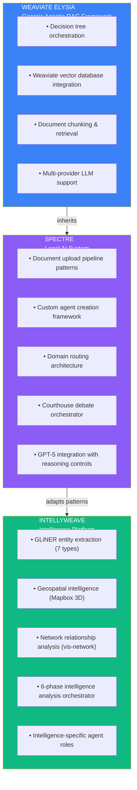

# IntellyWeave Architecture

**Three-layer inheritance from Elysia through Spectre to IntellyWeave**

---

## Foundation: Three-Layer Inheritance

IntellyWeave is built on a three-layer inheritance architecture, combining the generic agentic RAG capabilities of Weaviate's Elysia with battle-tested patterns from Spectre (a legal AI system) and intelligence-specific extensions.



### Layer 1: Weaviate Elysia

The foundation layer provides:
- **Decision tree orchestration** for predictable, auditable agent behavior
- **Weaviate vector database** for semantic search and retrieval
- **Document chunking** with semantic boundaries
- **Multi-provider LLM support** (OpenAI, Anthropic, Google, local models)

### Layer 2: Spectre Patterns

The legal AI system contributed battle-tested patterns:
- **Document upload pipeline** for multi-format ingestion
- **Custom agent framework** for domain-specific knowledge bases
- **Domain routing** for query intent analysis
- **Courthouse debate orchestrator** (adapted for intelligence analysis)

### Layer 3: IntellyWeave Extensions

Intelligence-specific capabilities:
- **GLiNER entity extraction** with 7 intelligence-specific types
- **Geospatial intelligence** via Mapbox GL 3D
- **Network analysis** via vis-network force-directed graphs
- **Six-phase intelligence orchestrator** for multi-agent reasoning

---

## Capabilities Overview

### Entity Extraction

Seven intelligence-specific entity types extracted via GLiNER zero-shot NER:
- Persons, Organizations, Locations, Dates, Events, Laws, Cryptonyms

> For implementation details, see [Entity Extraction Guide](../../guides/entity-extraction/).

### Intelligence Orchestrator

Six-phase multi-agent system mirroring professional analytical tradecraft:
1. Entity extraction and contextualization
2. Relationship mapping
3. Geospatial analysis
4. Network structure analysis
5. Pattern detection
6. Synthesis and assessment

> For phase details, see [Intelligence Analysis Guide](../../guides/intelligence-analysis/).

### Geospatial Intelligence

Mapbox GL 3.16 visualization with:
- 3D globe projection
- Heatmap layers for entity density
- Route visualization for movement patterns
- LLM-enhanced location normalization

> For mapping features, see [Geospatial Mapping Guide](../../guides/geospatial-mapping/).

### Network Analysis

vis-network 10.0.2 with ForceAtlas2 physics:
- Force-directed layout clusters connected entities
- Entity-type color coding
- Edge width indicates relationship strength
- Interactive exploration controls

> For network features, see [Network Analysis Guide](../../guides/network-analysis/).

### Document Processing

Multi-format pipeline:
- PDF, TXT, Markdown, DOCX, HTML, EML, MBOX support
- OCR detection and artifact cleanup
- Per-chunk entity extraction
- Semantic chunking with overlap

> For pipeline details, see [Document Processing Guide](../../guides/document-processing/).

---

## Tech Stack Summary

| Layer | Technology |
|-------|------------|
| **Backend** | Python 3.12, FastAPI |
| **Vector Database** | Weaviate (native) |
| **LLM Orchestration** | DSPy |
| **Entity Extraction** | GLiNER multi-v2.1 |
| **Frontend** | Next.js 15, React 18, TypeScript 5 |
| **Styling** | Tailwind CSS 3.4.1 |
| **Geospatial** | Mapbox GL 3.16 |
| **Network Graphs** | vis-network 10.0.2 |
| **Charts** | Recharts 2.15.3 |

### LLM Support

- OpenAI (GPT-5, GPT-4o, GPT-4o-mini)
- Anthropic (Claude models)
- Google Gemini
- OpenRouter (multi-provider gateway)
- Local models via Ollama

---

## Git Subtree Architecture

IntellyWeave tracks upstream Elysia via git subtrees:

```bash
# Backend from Weaviate Elysia
git subtree pull --prefix=backend upstream-backend main --squash

# Frontend from Weaviate Elysia Frontend
git subtree pull --prefix=frontend upstream-frontend main --squash
```

This allows IntellyWeave to:
- Receive upstream improvements automatically
- Maintain local customizations
- Contribute features back to the Elysia ecosystem

---

## See Also

- [Platform History](platform-history.md) - Evolution through four generations
- [Use Cases](use-cases.md) - Target users and workflows
- [Entity Extraction](../../guides/entity-extraction/) - GLiNER details
- [Intelligence Analysis](../../guides/intelligence-analysis/) - Six-phase orchestrator
- [Geospatial Mapping](../../guides/geospatial-mapping/) - Mapbox visualization
- [Network Analysis](../../guides/network-analysis/) - Relationship graphs
- [Document Processing](../../guides/document-processing/) - Upload pipeline
- [Architecture Overview](../../architecture/) - Full technical architecture
