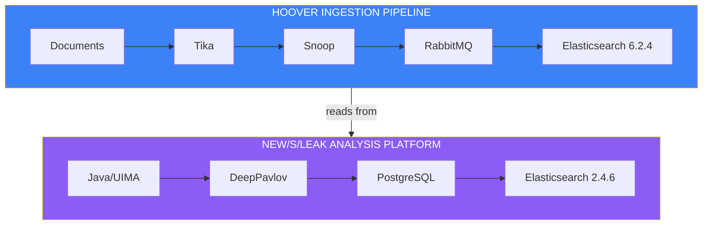

# Platform History: From Newsleak to IntellyWeave

**Seven years of development driven by real investigative needs**

---

## The Four Generations

The journey from Newsleak to IntellyWeave spans seven years and four distinct phases. Each phase addressed limitations discovered through real investigative work—particularly a Cold War espionage investigation that required processing documents in multiple languages, extracting intelligence-specific entities, and visualizing geographic movements across continents.

---

## 2016-2018: Original Newsleak

### Hamburg Builds a Platform for Investigative Journalism

In 2016, the Language Technology group at Hamburg University partnered with TU Darmstadt and **Der Spiegel** to build an open-source platform for investigative data journalism. Funded by the Volkswagen Foundation under their "Science and Data Journalism" initiative, the project was called **new/s/leak—Network of Searchable Leaks**.

The timing was not coincidental. WikiLeaks had released the Afghan War Diary in 2010, followed by the U.S. Embassy cables. Journalists were drowning in leaked documents—hundreds of thousands of pages that no human could read manually.

### Technical Stack

| Component | Technology |
|-----------|------------|
| NLP Pipeline | Java + Apache UIMA |
| Entity Recognition | Epic NER (3 types: PER, ORG, LOC) |
| Temporal Extraction | Heideltime |
| Search | Elasticsearch 2.4.6 |
| Backend | Scala + Play Framework |
| Frontend | AngularJS + JavaScript visualizations |

By 2018, new/s/leak 2.0 supported over **40 languages** and offered public demos on three datasets:
- **Enron corpus**: 125,000 corporate emails
- **NSU murder case**: 12,000 German parliamentary reports
- **World War II**: 27,000 multilingual Wikipedia articles

### Limitations Discovered

| Limitation | Impact |
|------------|--------|
| **Cyrillic NER failure** | Russian, Ukrainian documents unprocessable |
| **Keyword-only search** | No semantic understanding |
| **No geospatial** | Locations extracted but not mapped |
| **Manual ingestion** | Command-line processing required |

By 2020, the Hamburg project had gone dormant. The repository sat unchanged on GitHub, accumulating stars but no commits.

---

## 2022-2023: Revival

### Bringing Newsleak Back to Life

The decision to revive new/s/leak came from practical necessity: an ongoing investigation required processing Russian-language SMERSH documents that the original platform could not handle.

### DeepPavlov: Solving the Cyrillic Problem

The original Polyglot-based NER was replaced with **DeepPavlov**, a Russian AI research library from the Moscow Institute of Physics and Technology. The selected model (`ner_ontonotes_bert_mult_torch`) was a multilingual BERT transformer trained on the OntoNotes 5.0 corpus.

> For current entity extraction capabilities, see [Entity Extraction Guide](../../guides/entity-extraction/).

### Hoover Integration

Document ingestion was automated through **Hoover**, bringing:
- Apache Tika for text extraction
- RabbitMQ for task queuing
- Background workers for automated processing

### What the Revival Achieved

- ✅ **Cyrillic NER** via DeepPavlov BERT
- ✅ **Automated ingestion** via Hoover
- ✅ **Multi-language support** expanded to Russian, Ukrainian, Polish, Slovak, Italian
- ✅ **Docker containerization**

### Remaining Limitations

- ❌ **No semantic search** (still keyword-only)
- ❌ **Legacy frontend** (AngularJS 1.x)
- ❌ **Dual Elasticsearch** complexity
- ❌ **No geospatial visualization**

---

## 2024: Modernization

### Replacing Complexity with Simplicity

The 2024 modernization took a different approach: rather than patching legacy components, it replaced them entirely while preserving what worked.

### Python Watchdog Replaces Hoover

The nine-container Hoover stack was replaced with a Python-based ingestion pipeline:
- Single watchdog script monitors directories
- **Unstructured API** for text extraction
- Directory-based state management

> For current document processing, see [Document Processing Guide](../../guides/document-processing/).

### Weaviate: The Vector Database Revolution

**Weaviate** enabled semantic search—documents understood by meaning, not just keywords:
- Vector embeddings via OpenAI's `text-embedding-3-small`
- Hybrid search combining BM25 keyword matching with vector similarity
- Conceptual queries finally possible

> For semantic search capabilities, see [Intelligence Analysis Guide](../../guides/intelligence-analysis/).

### GLiNER: Zero-Shot Entity Recognition

**GLiNER** (published at NAACL 2024) solved a fundamental limitation: recognition of arbitrary entity types without training.

Given any label—"cryptonym," "military unit," "legal statute"—GLiNER identifies matching entities with no training examples required.

> For entity extraction details, see [Entity Extraction Guide](../../guides/entity-extraction/).

---

## 2025: IntellyWeave

### A Complete Architectural Rewrite

IntellyWeave represents the culmination of seven years of evolution. Built on **Weaviate's Elysia framework**, it's a complete rewrite designed from first principles for intelligence analysis.

| Component | 2018 Newsleak | 2025 IntellyWeave |
|-----------|---------------|-------------------|
| Backend | Java/Scala | Python 3.12 + FastAPI |
| Frontend | AngularJS 1.x | Next.js 15 + React 18 |
| Database | Elasticsearch | Weaviate (native) |
| NER | Epic (3 types) | GLiNER (7 intelligence types) |
| Search | Keyword only | Hybrid semantic + keyword |
| Visualization | Basic JS graphs | Mapbox 3D + vis-network |
| Reasoning | None | 6-phase multi-agent |

### Seven Entity Types for Intelligence Work

IntellyWeave focuses on **seven intelligence-specific entity types**:

| Type | Purpose |
|------|---------|
| **Persons** | Individual identities |
| **Organizations** | Agencies, companies, groups |
| **Locations** | Geographic references |
| **Dates** | Temporal expressions |
| **Events** | What happened |
| **Laws** | Legal instruments |
| **Cryptonyms** | Code names, classified designations |

> For entity type details, see [Entity Extraction Guide](../../guides/entity-extraction/).

### Six-Phase Intelligence Orchestrator

Multi-agent reasoning that mirrors professional analytical tradecraft:

| Phase | Agent | Purpose |
|-------|-------|---------|
| 1 | ExtractorAgent | Contextualize entities with LLM |
| 2 | MapperAgent | Build relationship graphs |
| 3 | GeospatialAgent | Generate coordinates and routes |
| 4 | NetworkAgent | Analyze graph structure |
| 5 | PatternAgent | Detect patterns and anomalies |
| 6 | SynthesizerAgent | Integrate findings |

> For orchestrator details, see [Intelligence Analysis Guide](../../guides/intelligence-analysis/).

---

## Evolution Summary

```mermaid
flowchart TB
    subgraph Original["2016-2018: ORIGINAL NEWSLEAK"]
        O1["Hamburg University + Der Spiegel + TU Darmstadt"]
        O2["Java/UIMA + Epic NER + Heideltime"]
        O3["Scala/Play + AngularJS + PostgreSQL"]
        O4["Elasticsearch 2.4.6 • 3 entity types"]
        O5["❌ No Cyrillic, no semantic search"]
    end

    subgraph Revival["2022-2023: REVIVAL"]
        R1["DeepPavlov BERT for Cyrillic"]
        R2["Hoover integration for ingestion"]
        R3["Docker containerization"]
        R4["18 OntoNotes entity types"]
        R5["❌ Still keyword-only search"]
    end

    subgraph Modern["2024: MODERNIZATION"]
        M1["Python watchdog replaces Hoover"]
        M2["Weaviate adds vector search"]
        M3["GLiNER enables zero-shot NER"]
        M4["Unstructured API for parsing"]
        M5["❌ No multi-agent reasoning"]
    end

    subgraph IW["2025: INTELLYWEAVE"]
        I1["Complete Python/FastAPI rewrite"]
        I2["Elysia framework foundation"]
        I3["7 intelligence-specific entity types"]
        I4["6-phase intelligence orchestrator"]
        I5["Mapbox 3D + vis-network"]
        I6["✅ Production-ready platform"]
    end

    Original -->|"Dormant 2018-2022"| Revival
    Revival --> Modern
    Modern --> IW

    style Original fill:#6b7280,color:#fff
    style Revival fill:#3b82f6,color:#fff
    style Modern fill:#8b5cf6,color:#fff
    style IW fill:#10b981,color:#fff
```

---

## The Constant: Real Investigation

Through seven years and four platform generations, the development was driven by a single constant: a real Cold War investigation that required capabilities no existing tool could provide.

Each platform evolution was tested against the same documents, the same questions, the same investigative needs. The investigation that demanded better tools finally received them.

> For the full investigation story, see [Ingeborg Investigation Demo](../ingeborg-investigation/).

---

## See Also

- [Architecture](architecture.md) - Three-layer inheritance diagram
- [Use Cases](use-cases.md) - Target users and workflows
- [Ingeborg Investigation](../ingeborg-investigation/) - The investigation that drove development
- [Entity Extraction Guide](../../guides/entity-extraction/) - GLiNER details
- [Intelligence Analysis Guide](../../guides/intelligence-analysis/) - Six-phase orchestrator
- [Document Processing Guide](../../guides/document-processing/) - Upload pipeline
