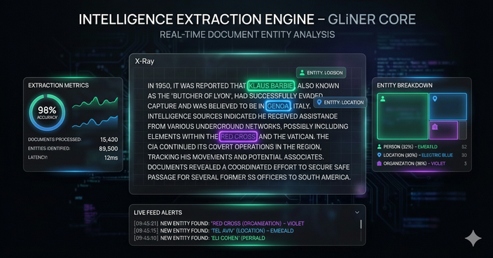
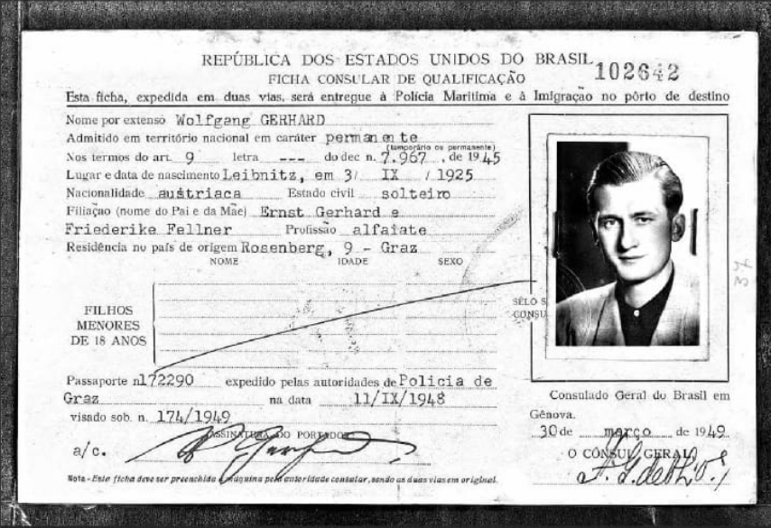
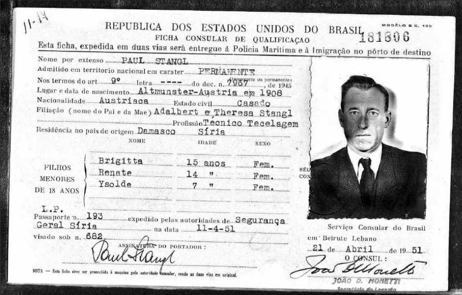

# Uncovering the Nazi Rat Lines

**What if the mysteries history buried under mountains of documents could be unearthed not with a pickaxe, but with artificial intelligence?**

---

## The Challenge

Picture yourself as a historian. Before you lies not a neatly organized archive, but chaos: piles of documents, handwritten notes, texts in German, Portuguese, English. Intelligence reports. Consular cards. Newspaper clippings. Declassified files.

Somewhere in this noise lies the truth about how Nazi war criminals escaped justice and vanished into South America.

Finding the connections by hand? That's months of work. Maybe years.

**What if you could do it in minutes?**

---

## Try It Yourself

Click the image below to explore IntellyWeave's OSINT analysis capabilities through an interactive walkthrough:

[](https://app.supademo.com/embed/cmizklvt10rwr14g48e8zgl73)

> **[Launch Interactive Demo](https://app.supademo.com/embed/cmizklvt10rwr14g48e8zgl73)** | Click through a guided tour showing how IntellyWeave transforms document chaos into structured intelligence.

---

## The Investigation

This demo analyzes **17 historical documents** about the Nazi rat lines — the clandestine escape routes that spirited war criminals from Europe to South America between 1945 and 1962.

We're not just searching for keywords. We're hunting for hidden connections.

### The Dataset

| Category | Documents | Languages |
|----------|-----------|-----------|
| Cold War intelligence | 7 | German |
| News articles | 4 | German, English |
| Passport records | 2 | Portuguese, German |
| Legal documents | 1 | Portuguese |
| Newspaper archives | 1 | German |

Each document scored for relevance (10-100) based on entity density, geolocation potential, and narrative value.

---

## The Discovery Process

### Step 1: Start with a Thread

Every investigation begins with a thread to pull. In this case: **Father Krunoslav Draganovic**.

Ask IntellyWeave: *"Who is Father Krunoslav Draganovic and what do the documents say about him?"*

The answer comes fast: He wasn't a minor player. He was the **central pivot** of the entire network. The point of contact connecting everyone else.



### Step 2: Expand the Network

One name leads to many. Ask: *"Who else is connected to Draganovic?"*

The platform doesn't just list names — it **understands** them. It distinguishes between fugitives and facilitators, organizations and individuals.

**Fugitives emerge:**
- Adolf Eichmann
- Josef Mengele
- Klaus Barbie
- Franz Stangl

**Facilitators appear:**
- Alois Hudal (Vatican)
- Juan Peron (Argentina)
- Carlos Fuldner (ODESSA)

**Organizations connect:**
- Vatican (Pontificia Commissione Assistenza)
- Red Cross (travel documents)
- CIC (US Counter Intelligence Corps)
- ODESSA, Die Spinne


### Step 3: Map the Geography

Names and organizations operate in physical space. Ask: *"Show me these locations on a map."*

This is the **aha moment**.

IntellyWeave doesn't just give you a list of cities. It takes location names scattered across documents in three languages and transforms them into an interactive operational theater.


**Departure Points:** Salzburg, Innsbruck, Rome, Genoa, Barcelona

**Transit Hubs:** Damascus (Syria), Beirut (Lebanon)

**Destinations:** Buenos Aires, Sao Paulo, Asuncion, Santiago

### Step 4: Trace the Escape Routes

The map reveals what text alone could never show. Three distinct rat lines emerge:

```text
1. NORTHERN ROUTE (Italian)
   Austria → South Tyrol → Rome → Genoa → Argentina

2. SPANISH ROUTE
   Germany → Spain → Argentina/Brazil

3. MIDDLE EASTERN ROUTE
   Austria → Syria → Lebanon → South America
```

Franz Stangl took Route 3. His Brazilian consular card — a primary source in this dataset — documents his passage through Damascus to Brazil.

---

## The Multi-Agent Debate

For questions with no simple answer, IntellyWeave deploys something remarkable: **a team of digital detectives** that analyze evidence from competing perspectives, debate their conclusions, and synthesize a reasoned verdict.

### The Question

Paul Stangl obtained a permanent Brazilian visa using Article 9 of Decreto-Lei 7967 (1945). This law gave preference to immigrants of "European ancestry."

Was this Brazilian immigration law **deliberately exploited** to help war criminals escape?

### The Debate


| Agent | Role | Argument |
|-------|------|----------|
| **Prosecution** | Argues exploitation | The "European ancestry" clause was systematically used by war criminals. Multiple documented cases. Pattern indicates deliberate use. |
| **Defense** | Argues coincidence | The law was general immigration policy, not designed for fugitives. No evidence of direct coordination with escape networks. |
| **Judge** | Synthesizes verdict | The law was likely not *designed* for fugitives, but its provisions were *exploited* by those with knowledge of the network. **Verdict: Opportunistic exploitation.** |

The system doesn't give you a simple yes or no. It gives you the reasoning. The evidence. The uncertainty.

---

## Primary Sources

The demo includes digitized passport records — primary source evidence:

| Document | Subject | Route |
|----------|---------|-------|
|  | Josef Mengele | Germany → Argentina → Brazil |
|  | Paul Stangl | Syria → Brazil (via Decreto-Lei 7967) |

---

## What IntellyWeave Demonstrates

| Capability | What You See |
|------------|--------------|
| **Entity Extraction** | 7 types automatically identified: persons, organizations, locations, dates, events, laws, cryptonyms |
| **Network Analysis** | Relationship graphs revealing hidden connections between actors |
| **Geospatial Intelligence** | Interactive 3D maps showing operational geography |
| **Multi-Agent Reasoning** | Courthouse debate system for complex analytical questions |
| **Source Traceability** | Every assertion linked to source documents |

---

## The Question That Remains

If this technology can illuminate the hidden networks of the past by analyzing historical archives...

**What networks operating today could be mapped and understood by analyzing the digital traces, documents, and open-source information we produce every day?**

The question remains open.

---

## Get Started

### Prerequisites

- IntellyWeave running locally ([Installation Guide](../../getting-started/installation.md))
- At least one LLM provider configured
- GLiNER installed for entity extraction

### Quick Start

```bash
# 1. Navigate to IntellyWeave
open http://localhost:8000

# 2. Upload documents from examples/cleaned/

# 3. Wait for processing (watch console for entity extraction)

# 4. Start asking questions
```

---

## Next Steps

| Guide | Description |
|-------|-------------|
| [Walkthrough](walkthrough.md) | Step-by-step queries with the investigative journey |
| [Multimedia](multimedia.md) | Podcast, video, and presentation resources |

## See Also

- [Dataset Documentation](../../../examples/README.md) — Full document inventory and scoring methodology
- [Getting Started](../../getting-started/) — Initial setup guide
- [Entity Extraction Guide](../../guides/entity-extraction/) — GLiNER deep dive
- [Intelligence Analysis](../../guides/intelligence-analysis/) — 6-phase orchestrator
