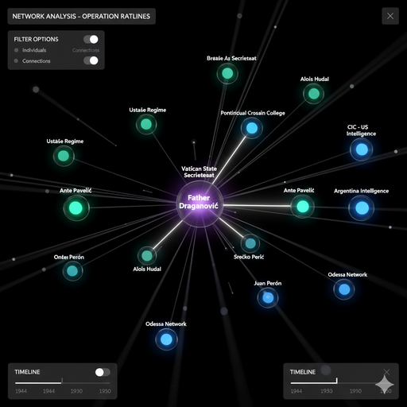
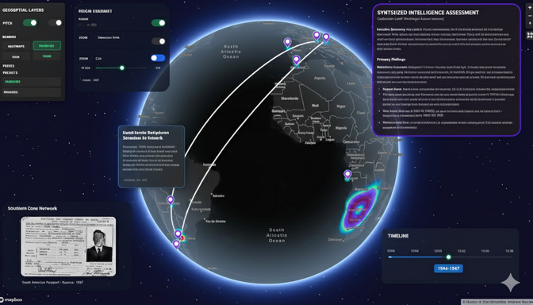
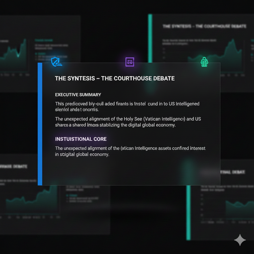

# The Investigation: A Step-by-Step Walkthrough

**Become the analyst. Follow the evidence. Uncover the network.**

This walkthrough puts you in the role of an intelligence analyst investigating the Nazi rat lines. Each query builds on the previous, progressively revealing the hidden structure of post-war escape networks.

---

## Before You Begin

### Prerequisites

1. IntellyWeave running:
   - **Development**: Frontend at `http://localhost:3000`, API at `http://localhost:8000`
   - **Production**: Full app at `http://localhost:8000`
2. Documents uploaded from `examples/cleaned/`
3. Processing complete

**Verify your documents loaded successfully:**

```text
INFO  Processing uploaded file: Rattenlinien_100.txt
INFO  NER extracted entities summary: {
  'person': 45,
  'organization': 32,
  'location': 67,
  'date': 89
}
INFO  Document processing complete
```

When you see entity extraction summaries in your console, you're ready to investigate.

---

## Phase 1: Finding the Thread

Every investigation begins with a single thread. Pull it, and the whole network unravels.

### Query 1: Identify a Key Player

```text
Who is Father Krunoslav Draganovic and what do the documents say about him?
```

**What you're doing:** Starting with a name that appears repeatedly across documents. Experienced analysts know: repetition signals importance.

**What IntellyWeave finds:**

| Finding | Detail |
|---------|--------|
| **Identity** | Croatian Catholic priest |
| **Role** | Key organizer of the Roman rat line, operating from the Collegium of San Girolamo |
| **Activities** | Helped fugitives like Klaus Barbie and Ante Pavelic obtain travel documents (often via Red Cross) and organized passage to South America |
| **Connections** | Linked to US Counter Intelligence Corps (CIC) and the Vatican |

**Why this matters:** Draganovic isn't a peripheral figure. He's the **central hub** — the node through which most connections flow. Every investigation needs an anchor point. You've found yours.

---

### Query 2: Expand to Connected Persons

```text
Who are the other persons connected to Draganovic?
```

**What you're doing:** Following the connections outward. In network analysis, this is called "expanding the ego network."

**What IntellyWeave finds:**

**Fugitives:**
- Adolf Eichmann — Architect of the Holocaust
- Josef Mengele — SS physician, Auschwitz experiments
- Klaus Barbie — "Butcher of Lyon"
- Franz Stangl — Sobibor and Treblinka commandant
- Ante Pavelic — Ustasha leader

**Facilitators:**
- Alois Hudal — Austrian bishop, Vatican liaison
- Juan Peron — Argentine president
- Carlos Fuldner — ODESSA operative

**Why this matters:** The platform doesn't just extract names — it **categorizes** them. Notice the pattern: fugitives (the escapees) versus facilitators (the helpers). This distinction reveals the network's structure.

---

### Query 3: Identify Organizations

```text
What organizations are these people connected to?
```

**What you're doing:** Moving from individuals to institutions. Organizations provide infrastructure. They make escape possible at scale.

**What IntellyWeave finds:**

| Organization | Role in Network |
|--------------|-----------------|
| **Vatican** (Pontificia Commissione Assistenza) | Provided institutional cover, safe houses, documentation assistance |
| **CIC** (US Counter Intelligence Corps) | US military intelligence; employed several facilitators |
| **ODESSA** | Nazi escape network; coordinated logistics |
| **Red Cross** | Issued travel documents (often based on false identities) |
| **Die Spinne** | SS escape organization |
| **Stille Hilfe** | "Silent Help" — postwar Nazi support network |

**Why this matters:** The involvement of official organizations — the Vatican, the Red Cross, US intelligence — transforms this from a criminal conspiracy into something with institutional dimensions.

---

## Phase 2: Geographic Intelligence

Names live in documents. Operations happen in **places**.

### Query 4: Extract Locations

```text
What locations are mentioned in relation to these people and organizations?
```

**What you're doing:** Building a geographic picture. Escape networks need physical routes.

**What IntellyWeave finds:**

| Role | Locations |
|------|-----------|
| **Departure Points** | Vienna, Innsbruck, Munich, Salzburg |
| **Transit Hubs** | Rome, Genoa, Vatican City, South Tyrol (Bolzano) |
| **Alternative Routes** | Damascus, Beirut, Barcelona |
| **Destinations** | Buenos Aires, Sao Paulo, Asuncion, La Paz, Santiago |

**Why this matters:** The locations reveal the escape infrastructure. Ports (Genoa), neutral territories (Vatican City), and distant destinations with sympathetic governments (Peron's Argentina).

---

### Query 5: Visualize the Network

```text
Show me a network diagram with the persons, organizations, and locations.
```

**What you're doing:** Transforming extracted entities into a visual relationship map.



**Interactions:**
- Drag nodes to rearrange the layout
- Click any node for entity details
- Observe clustering — who groups with whom

**Why this matters:** Visual networks reveal what text cannot: Draganovic sits at the center. The Vatican and CIC both connect to him. Fugitives cluster on the periphery. The structure is immediately apparent.

---

### Query 6: Map the Geography

```text
Show me these locations on a map.
```

**What you're doing:** Projecting extracted locations onto a 3D globe.



**This is the aha moment.**

The scattered text — city names in German, Portuguese, English — becomes a **visual operational theater**. You can see:

- European departure points clustered in Austria
- Transit hubs in Italy (Rome, Genoa)
- South American destinations spread across the continent

**Why this matters:** Geography tells a story. The map shows escape routes converging at key ports and radiating to multiple countries. This wasn't ad hoc — it was infrastructure.

---

## Phase 3: Pattern Analysis

### Query 7: Identify Escape Routes

```text
Based on this information, what were the main escape routes?
```

**What you're doing:** Asking IntellyWeave to synthesize geographic and relational data into operational patterns.

**What IntellyWeave finds:**

| Route | Path | Key Evidence |
|-------|------|--------------|
| **Northern (Italian)** | Austria → South Tyrol → Rome → Genoa → Buenos Aires | Primary route; Draganovic and Hudal operated here |
| **Spanish** | Germany → Spain → Argentina/Brazil | Secondary route via Franco's Spain |
| **Middle Eastern** | Austria → Syria → Lebanon → South America | Franz Stangl documented using this route |

**Why this matters:** Three distinct operational corridors emerge. Different facilitators, different waypoints, same destinations. This is organized escape infrastructure, not random flight.

---

## Phase 4: Deep Analysis

### Query 8: Full Intelligence Analysis

```text
Run a full intelligence analysis on this network.
```

**What you're doing:** Triggering IntellyWeave's **Intelligence Orchestrator** — a 6-phase automated analysis pipeline.

**The six phases:**

| Phase | Agent | Function |
|-------|-------|----------|
| 1 | Entity Extractor | Comprehensive entity identification |
| 2 | Relationship Mapper | Connection mapping with strength scores |
| 3 | Geospatial Analyst | Geographic pattern analysis |
| 4 | Network Analyst | Graph theory metrics (centrality, clustering) |
| 5 | Pattern Detector | Behavioral and operational patterns |
| 6 | Synthesizer | Integrated intelligence assessment |

**Output:** A structured intelligence report with:
- Key findings with confidence scores
- Source citations for every assertion
- Identified patterns
- Recommended follow-up queries

**Why this matters:** This moves beyond question-and-answer to comprehensive analysis. The orchestrator examines the data from multiple analytical perspectives simultaneously.

---

## Phase 5: Contested Analysis

### Query 9: The Courthouse Debate

```text
The Paul Stangl document shows he got a permanent visa to Brazil using Article 9 of Decreto-Lei 7967. Was the Brazilian immigration law exploited to help these people escape?
```

**What you're doing:** Posing a question with no simple answer. This triggers the **Courthouse Debate** — IntellyWeave's multi-agent reasoning system.



**How it works:**

Three AI agents analyze the same evidence from different perspectives:

| Agent | Role | Argument |
|-------|------|----------|
| **Prosecution** | Argues for exploitation | The "European ancestry" clause in Decreto-Lei 7967 was systematically used by war criminals. Multiple documented cases show a pattern, not coincidence. |
| **Defense** | Argues against exploitation | The law was standard Brazilian immigration policy aimed at increasing European migration. No evidence shows it was *designed* for fugitives. |
| **Judge** | Synthesizes | While the law wasn't designed as an escape mechanism, its provisions created a vulnerability that was systematically exploited by those with network knowledge. **Verdict: Opportunistic exploitation, not deliberate conspiracy.** |

**Why this matters:** Complex questions deserve nuanced answers. The courthouse debate surfaces the ambiguity, presents competing interpretations, and synthesizes a reasoned conclusion — all grounded in source documents.

---

## Query Patterns

### How to Structure Your Investigation

| Pattern | Example | When to Use |
|---------|---------|-------------|
| **Identify** | "Who is X?" | Starting point — establish key players |
| **Expand** | "Who is connected to X?" | Build out the network |
| **Categorize** | "What organizations...?" | Move from people to institutions |
| **Locate** | "What locations...?" | Add geographic dimension |
| **Visualize** | "Show me a network diagram" | Transform data to visual |
| **Map** | "Show on a map" | Geographic visualization |
| **Synthesize** | "What were the main routes?" | Pattern identification |
| **Orchestrate** | "Run full intelligence analysis" | Comprehensive automated analysis |
| **Debate** | Complex interpretive questions | Multi-perspective reasoning |

### Progressive Disclosure

Each query builds on previous answers:

```text
Query 1 → Identifies Draganovic (anchor)
Query 2 → Expands to connected persons
Query 3 → Adds organizational layer
Query 4 → Adds geographic layer
Query 5-6 → Visualizes accumulated data
Query 7-8 → Synthesizes patterns
Query 9 → Tests interpretations
```

---

## Response Time Expectations

| Query Type | Expected Time |
|------------|---------------|
| Simple entity lookup | 2-5 seconds |
| Visualization generation | 5-10 seconds |
| Deep analysis | 15-30 seconds |
| Courthouse debate | 30-60 seconds |

---

## Troubleshooting

| Issue | Cause | Solution |
|-------|-------|----------|
| "No results found" | Documents not processed | Check console for entity extraction confirmation |
| Empty map | Missing Mapbox token | Add `NEXT_PUBLIC_MAPBOX_ACCESS_TOKEN` to `frontend/.env.local` |
| Network graph empty | GLiNER not installed | Run `pip install -e ".[ner]"` in backend |
| Debate times out | Too many documents | Reduce dataset or simplify question |
| Unexpected entities | OCR quality issues | Re-clean documents with `ocr-cleanup` skill |

---

## The Investigation Continues

You've traced the network from a single name to a continental escape operation. You've mapped its geography, identified its institutional support, and debated its legal dimensions.

But this is historical analysis. The documents are declassified. The networks are long dissolved.

The question that remains: **What hidden networks could this methodology reveal in the present?**

---

## See Also

- [Demo Overview](index.md) — Interactive walkthrough and dataset summary
- [Multimedia](multimedia.md) — Podcast, video, and presentation resources
- [Dataset Documentation](../../../examples/README.md) — Full document inventory
