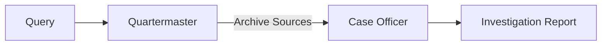

# Archive Research Agents

**Two specialized agents that work together for comprehensive investigative analysis.**

## Overview

Archive Research uses a two-agent architecture:



| Agent | Phase | Purpose | Output |
|-------|-------|---------|--------|
| [Quartermaster](quartermaster.md) | 1 | Archive discovery & mapping | Scored sources with access metadata |
| [Case Officer](case-officer.md) | 2 | Investigation synthesis | Hypotheses, findings, next steps |

## Agent Workflow

### Phase 1: Quartermaster

The Quartermaster answers: *"Where could the answer exist?"*

1. **Analyze query intent** - Determine research domain, geographic/temporal focus
2. **Detect search language** - Based on investigation context, not user's language
3. **Execute dual search** - Curated archives + open discovery in parallel
4. **Score and filter** - Only high-relevance sources passed forward

**Output**: `QuartermasterResult` with `archive_sources` sorted by score

### Phase 2: Case Officer

The Case Officer answers: *"What can be concluded from the evidence?"*

1. **Read accessible sources** - Multi-reader cascade with context budget
2. **Generate hypotheses** - DSPy-based with evidence tracking
3. **Evaluate evidence** - SUPPORTS, REFUTES, or NEUTRAL
4. **Expand if needed** - Autonomous search with model escalation
5. **Synthesize report** - Narrative findings with citations
6. **Generate next steps** - Prioritized actions with access instructions

**Output**: `CaseOfficerResult` with hypotheses, findings, and next steps

## Data Flow Between Agents

The Quartermaster stores its output in `tree_data.environment.hidden_environment`:

```python
# Quartermaster stores:
hidden_environment["quartermaster_results"] = [qm_result.to_dict()]
hidden_environment["quartermaster_intent"] = {
    "research_domain": "INTELLIGENCE",
    "search_language": "de",
    "search_query": "translated clean query",
    "geographic_focus": ["Austria"],
    # ...
}
hidden_environment["quartermaster_rejected_urls"] = ["rejected.com/url"]
```

The Case Officer consumes this context automatically.

## Configuration

Both agents require:

| Service | Required For | Environment Variable |
|---------|--------------|----------------------|
| Search Provider | Both | `PERPLEXITY_API_KEY`, `SERPER_API_KEY`, or `TAVILY_API_KEY` |
| LLM Provider | Both | `OPENAI_API_KEY`, `ANTHROPIC_API_KEY`, etc. |
| Document Reader | Case Officer | `PERPLEXITY_API_KEY`, `JINA_API_KEY`, or `AGENTQL_API_KEY` |
| PDF Reader | Case Officer | `ARYN_API_KEY` (optional) |

## See Also

- [Quartermaster Agent](quartermaster.md) - Detailed Quartermaster documentation
- [Case Officer Agent](case-officer.md) - Detailed Case Officer documentation
- [Archive Research Guide](../index.md) - Complete archive research overview
- [Archive Domains Configuration](../configuration.md) - Curated sources configuration
