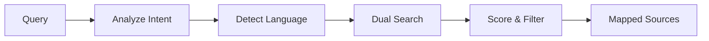

# Quartermaster Agent

**Archive discovery and mapping agent that uses DSPy-based reasoning, dual parallel search, and investigation-context language detection to find relevant sources.**

## What It Does

The Quartermaster is the **first phase** of Archive Research. It answers: *"Where could the answer exist, and under what conditions?"*



Key capabilities:

- **Query Intent Analysis** - DSPy determines research domain, geographic/temporal focus
- **Investigation-Context Language Detection** - Searches in the language of the archives, not the user's language
- **Dual Parallel Search** - Curated archives + open discovery simultaneously
- **URL-Level Relevance Scoring** - Each URL scored individually for proper ordering
- **High-Relevance Filtering** - Only sources above threshold passed to Case Officer

## Use When

- Starting an investigation that needs to discover relevant archives
- You don't know which archives might contain relevant information
- You need to map the information landscape before deep investigation
- The investigation spans multiple countries/languages/eras

## Prerequisites

- **At least one search provider** configured:
  - `PERPLEXITY_API_KEY` (recommended - AI-powered search)
  - `SERPER_API_KEY` or `TAVILY_API_KEY` (alternatives)
- **LLM provider** for DSPy reasoning (`OPENAI_API_KEY`, `ANTHROPIC_API_KEY`, etc.)

## Architecture

### Core Components

```
backend/elysia/tools/archives/
├── quartermaster_tool.py      # Main agent logic
├── config_loader.py           # Archive domains configuration
├── dspy_programs.py           # DSPy signatures and programs
└── types.py                   # ArchiveSource, QuartermasterResult
```

### DSPy Programs

| Program | Purpose | Input | Output |
|---------|---------|-------|--------|
| `QueryIntentAnalyzer` | Analyze query intent | Query + archive groups | Research domain, geographic/temporal focus |
| `ArchivePrioritizer` | Rank archives by relevance | Query + candidates | Prioritized list with scores |
| `RelevanceScorer` | Score individual results | Source + query context | Score 0.0-1.0, false positive flag |
| `ResearchLanguageDetector` | Detect optimal search language | Query + target archives | Language code, translated query |

## Key Features

### 1. Dual Parallel Search

The Quartermaster executes **two searches in parallel**:

```python
# Curated search: API-level domain filtering
curated_task = sofia_service.advanced_search(
    query=search_query,
    include_domains=curated_domains[:20],  # Max 20 per Perplexity API
    use_domain_filter=True,  # API-level filtering
)

# Open discovery: No domain filter
open_task = sofia_service.advanced_search(
    query=search_query,
    use_domain_filter=False,  # Open discovery
)

# Execute in parallel, merge with deduplication
curated_results, open_results = await asyncio.gather(curated_task, open_task)
```

**Why dual search?**

| Search Type | Purpose | Pros | Cons |
|-------------|---------|------|------|
| Curated | High precision from vetted archives | Authoritative sources guaranteed | May miss new sources |
| Open | High recall for discovery | Finds unexpected sources | May include low-quality results |

### 2. Investigation-Context Language Detection

**Critical insight**: The user's input language is *irrelevant*. What matters is *where the investigation is focused*.

```python
# User asks in Russian about Japan case → search in JAPANESE
# User asks in Italian about Austrian archives → search in GERMAN

language_info = research_language_detector.detect(
    query=query,
    research_domain=research_domain,
    target_archives=curated_domains,
    geographic_context=geographic_focus,
)

# Always use translated_query - it contains CLEAN search terms
# without meta-instructions like "Please use quartermaster to find..."
search_query = language_info["translated_query"]
```

### 3. URL-Level Relevance Scoring

**Problem**: Perplexity's Chat Completions API does NOT guarantee `search_results` ordered by relevance.

**Solution**: Each URL is scored individually using the `RelevanceScorer` DSPy program:

```python
for result in domain_results:
    url_score_result = relevance_scorer.score(
        query=query,
        source_url=result.url,
        source_content=result.content,
        curated_domains=curated_domains,
    )
    scored_results.append((result, url_score_result["score"]))

# Sort by score descending (highest first)
scored_results.sort(key=lambda x: -x[1])
```

### 4. Scoring Thresholds

```python
# Minimum score for curated domain sources (cia.gov, archives.gov, etc.)
CURATED_MINIMUM_SCORE = 0.55

# Only sources above this threshold passed to Case Officer
HIGH_RELEVANCE_THRESHOLD = 0.45

# Fallback when LLM scoring fails
FALLBACK_SCORE = 0.2
```

## Configuration

### Archive Domains

The Quartermaster uses `backend/config/archive_domains.yaml` to identify curated sources:

```yaml
groups:
  united_states_archives:
    description: "US government archives, declassified intelligence"
    domains:
      - domain: cia.gov
        name: "CIA Reading Room"
        default_access_level: PUBLIC_OPEN
        # ...
```

See [Archive Domains Configuration](../configuration.md) for full documentation.

### Environment Variables

| Variable | Required | Description |
|----------|----------|-------------|
| `PERPLEXITY_API_KEY` | Recommended | Perplexity AI search (best for research) |
| `SERPER_API_KEY` | Alternative | Google Search via Serper |
| `TAVILY_API_KEY` | Alternative | Tavily AI search |

## Output

The Quartermaster yields:

1. **Status messages** during execution (for UI progress)
2. **QuartermasterResult** with:
   - `archive_sources`: List of `ArchiveSource` objects, sorted by score descending
   - `research_domain`: Detected research domain
   - `search_language`: Language used for search
   - `rejected_urls`: URLs flagged as false positives

### ArchiveSource Structure

```python
@dataclass
class ArchiveSource:
    domain: str          # e.g., "archives.gov"
    name: str            # e.g., "National Archives (NARA)"
    urls: List[str]      # URLs found from this domain
    score: float         # Relevance score 0.0-1.0
    access_level: str    # PUBLIC_OPEN, RESTRICTED, etc.
    classification: str  # INSTITUTIONAL or DISCOVERED
    # ...
```

## Troubleshooting

### No Sources Found

**Cause**: Search providers not configured or query too specific.

**Solution**:
1. Verify at least one search provider API key is set
2. Broaden the search terms

### All Sources Low-Scored

**Cause**: Query doesn't match archive content well.

**Solution**:
1. Check the detected `research_domain` - is it correct?
2. Verify `search_language` matches expected archives
3. Try alternative name spellings or terms

### Wrong Search Language

**Cause**: Geographic context not detected correctly.

**Solution**: Be explicit about location in query:
```text
Use the Quartermaster to find Austrian State Archives (Österreichisches Staatsarchiv)
documents about post-war occupation 1945-1955.
```

### Curated Archives Not Appearing

**Cause**: Archives not in `archive_domains.yaml` for the detected groups.

**Solution**: Check `archive_domains.yaml` has the expected archives in relevant groups.

## See Also

- [Archive Research Guide](../index.md) - Complete archive research overview
- [Case Officer Agent](case-officer.md) - Investigation synthesis phase
- [Archive Domains Configuration](../configuration.md) - Curated sources configuration
- [Sofia Service](../../services/sofia-search/index.md) - Multi-provider search cascade
