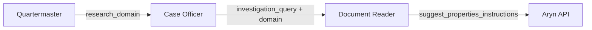

# Archive Domains Configuration

**How to configure and extend the curated archive sources used by the Quartermaster for investigative research.**

## Overview

The `archive_domains.yaml` configuration file defines curated, vetted archive sources that the Quartermaster uses to prioritize and classify search results. Sources from this file are marked as `INSTITUTIONAL` (high confidence), while sources discovered via web search are marked as `DISCOVERED` (requires relevance scoring).

**File location:** `backend/config/archive_domains.yaml`

## File Structure

```yaml
# Archive Domains Configuration for IntellyWeave
# Used by Quartermaster to constrain searches to curated archive sources
# Priority is dynamically assigned by Quartermaster based on user query intent

groups:
  group_name:
    description: "Human-readable description of this archive group"
    domains:
      - domain: example.gov
        name: "Archive Name"
        default_access_level: PUBLIC_OPEN
        default_digitization_status: PARTIALLY_DIGITIZED
        default_protocol: WEB_DIGITAL_REPOSITORY
        notes: "Important details about this archive"
        authentication:
          type: "none"
        access_instructions:
          type: "general"
          steps:
            - "Step 1: Navigate to..."
            - "Step 2: Search for..."

# Query expansion patterns for multilingual searches
query_expansion:
  transliteration_variants:
    - language: ru
      pattern: "{name_cyrillic}"
```

## Groups

Groups organize related archives by geographic region or thematic focus. The Quartermaster dynamically selects relevant groups based on query intent analysis—there is no static priority ordering.

### Current Groups

| Group ID | Focus | Example Use Cases |
|----------|-------|-------------------|
| `russian_archives` | Russian state archives, Soviet repression | Stalin-era executions, Gulag victims, GARF documents |
| `ukrainian_archives` | Ukrainian national remembrance | Soviet occupation, KGB documents |
| `austrian_archives` | Austrian state archives, national library | Post-WWII occupation, historical newspapers |
| `brazilian_archives` | Brazilian national/state archives | Immigration records, naturalization, São Paulo state |
| `italian_archives` | Italian state archives | Maritime manifests, port records |
| `united_states_archives` | US government, declassified intelligence | CIA CREST, NARA records, Holocaust documentation |
| `european_archive_aggregator` | Pan-European cultural heritage | Europeana cross-institutional search |
| `academic_projects` | University libraries, research collections | Harvard special collections, microfilm holdings |
| `historical_research_services` | Professional research services | Commissioned archive research, Arolsen Archives |
| `genealogy_research_services` | Genealogical databases | FamilySearch, Ancestry immigration records |

### Adding a New Group

```yaml
groups:
  # Add new group at the end
  german_archives:
    description: "German federal and state archives, Stasi records"
    domains:
      - domain: bundesarchiv.de
        name: "Bundesarchiv (German Federal Archives)"
        # ... domain configuration
```

## Domain Entry Fields

Each domain entry defines a single archive source with its access characteristics and instructions.

### Required Fields

| Field | Type | Description |
|-------|------|-------------|
| `domain` | string | Website domain (e.g., `cia.gov`, `archives.gov`) |
| `name` | string | Human-readable archive name |
| `default_access_level` | enum | Access classification (see below) |
| `default_digitization_status` | enum | Digitization state (see below) |
| `default_protocol` | enum | Access protocol type (see below) |
| `notes` | string | Important details, collection sizes, special features |

### Optional Fields

| Field | Type | Description |
|-------|------|-------------|
| `authentication` | object | Authentication requirements |
| `access_instructions` | object | Step-by-step access guide |

### Access Levels

| Value | Icon | Description | Typical Action |
|-------|------|-------------|----------------|
| `PUBLIC_OPEN` | 🌐 | Freely accessible online without restrictions | Direct web access |
| `SUBSCRIPTION` | 📖 | Requires paid membership or institutional access | Subscribe or use library |
| `PHYSICAL_ONLY` | 🔐 | No digital access, requires in-person visit | Travel to archive location |
| `RESTRICTED` | 🛡️ | Requires clearance, credentials, or special approval | Submit access request |
| `PHYSICAL_OR_SUBSCRIPTION` | 📖 | Multiple access paths available | Choose most convenient |

### Digitization Status

| Value | Icon | Description |
|-------|------|-------------|
| `FULLY_DIGITIZED` | ✅ | All materials available digitally |
| `PARTIALLY_DIGITIZED` | ◐ | Some materials digitized, others physical-only |
| `NOT_DIGITIZED` | ❌ | No digital copies, physical access required |
| `N_A` | — | Not applicable (e.g., research services) |

### Access Protocols

| Value | Description | Example |
|-------|-------------|---------|
| `WEB_DIGITAL_REPOSITORY` | Full documents downloadable via web | CIA Reading Room |
| `SEARCH_UI_ONLY` | Online catalog, but documents require request | GARF, Memorial databases |
| `READING_ROOM_ONLY` | Physical reading room access only | NARA non-digitized |
| `WIKI_COLLABORATIVE` | Wikipedia-style collaborative platform | OpenList.wiki |
| `HTML_CONTENT` | Standard web pages with embedded content | News sites, institutional pages |
| `LIBRARY_CATALOGS` | Library catalog system with request process | University libraries |
| `API` | Programmatic API access available | Europeana, IIIF |

## Authentication Configuration

The `authentication` block defines how to access protected resources.

### Authentication Types

#### No Authentication Required

```yaml
authentication:
  type: "none"
```

Most public archives use this. The Quartermaster and Case Officer can access resources directly.

#### API Key Authentication

```yaml
authentication:
  type: "api_key"
  api_key: "your_api_key_here"
```

For archives with programmatic APIs (e.g., Europeana). Leave `api_key` empty in the config file and set via environment variable for security.

#### Credential-Based Authentication

```yaml
authentication:
  type: "credentials"
  username: ""
  password: ""
```

For archives requiring login (e.g., Arolsen Archives free account). Users should create accounts and optionally store credentials for automated access.

#### OAuth Authentication

```yaml
authentication:
  type: "oauth"
  client_id: ""
  client_secret: ""
```

For archives with OAuth2 flows. Typically used for institutional integrations.

### Security Note

Credentials in `archive_domains.yaml` are stored in plain text. For production use:
- Keep sensitive credentials in environment variables
- Use the YAML file for structure and non-sensitive metadata
- Implement external credential management for automated access

## Access Instructions

The `access_instructions` block provides step-by-step guidance that appears in the Case Officer's "Next Steps" output.

### Instruction Types

| Type | Use When | Frontend Display |
|------|----------|------------------|
| `general` | Standard web resources, open databases | Blue badge, general steps |
| `physical_archive` | Requires in-person visit | Red badge, location details |
| `subscription` | Requires paid access or institutional login | Blue badge, subscription steps |
| `restricted` | Requires special approval or credentials | Orange badge, application process |

### Example: Physical Archive

```yaml
access_instructions:
  type: "physical_archive"
  steps:
    - "Navigate to http://statearchive.ru/383 to search online catalog"
    - "Identify relevant fonds and prepare research list"
    - "Visit GARF at 119992 Moscow, ul. Bolshaia Pirogovskaia, 17"
    - "Reading room hours: Mon/Wed 12:00-20:00, Tue/Thu 10:00-17:00"
    - "Request documents by fond/opis/delo reference in reading room"
```

### Example: Subscription Service

```yaml
access_instructions:
  type: "subscription"
  steps:
    - "Navigate to https://www.ancestry.com"
    - "Subscribe for database access"
    - "Search Brazilian collections for immigration records"
    - "Access São Paulo 1954 arrival records"
    - "Download and save relevant documents"
```

### Example: General Web Access

```yaml
access_instructions:
  type: "general"
  steps:
    - "Navigate to https://www.cia.gov/readingroom/"
    - "Use the search bar for keyword or full-text searches"
    - "Use Advanced Search for specific date ranges, document types, or collections"
    - "Browse Historical Collections for curated document sets"
    - "Download declassified documents directly as PDF"
```

## Adding a New Archive Domain

### Step 1: Identify the Appropriate Group

Choose an existing group or create a new one based on geographic/thematic fit.

### Step 2: Research the Archive

Before adding, verify:
- What is the access level? (public, subscription, physical-only)
- What percentage is digitized?
- What protocol is used? (web repository, search UI, API)
- What authentication is required?
- What are the step-by-step access instructions?

### Step 3: Add the Domain Entry

```yaml
groups:
  united_states_archives:
    domains:
      # Add new domain
      - domain: foia.state.gov
        name: "US State Department FOIA Reading Room"
        default_access_level: PUBLIC_OPEN
        default_digitization_status: PARTIALLY_DIGITIZED
        default_protocol: WEB_DIGITAL_REPOSITORY
        notes: "Declassified diplomatic cables, policy documents. FOIA request system for non-released materials. Keyword searchable."
        authentication:
          type: "none"
        access_instructions:
          type: "general"
          steps:
            - "Navigate to https://foia.state.gov"
            - "Use the search function for keyword queries"
            - "Browse by date range or document type"
            - "Download available documents as PDF"
            - "Submit FOIA request for non-released materials"
```

### Step 4: Test the Configuration

Restart the backend and verify:
1. The Quartermaster includes the new domain in relevant searches
2. The access level and digitization status display correctly
3. The access instructions appear in Case Officer next steps

## Query Expansion Patterns

The `query_expansion` section defines transliteration variants for multilingual archive searches.

```yaml
query_expansion:
  transliteration_variants:
    - language: ru
      pattern: "{name_cyrillic}"
    - language: uk
      pattern: "{name_ukrainian}"
    - language: de
      pattern: "{name_german}"
    - language: en
      pattern: "{name_english}"
    - language: pt
      pattern: "{name_portuguese}"
    - language: it
      pattern: "{name_italian}"
```

This enables the Quartermaster to search for name variants across different scripts and languages. For example, searching for "Aleksandr" might also search for "Александр" (Cyrillic) and "Alexandre" (Portuguese).

## Complete Domain Entry Example

```yaml
- domain: stalin.memo.ru
  name: "Memorial - Stalin Era Database"
  default_access_level: PUBLIC_OPEN
  default_digitization_status: FULLY_DIGITIZED
  default_protocol: SEARCH_UI_ONLY
  notes: "44,500 names from 383 Stalin-era execution lists (1937-1954). Full records viewable online. Data exportable as MySQL/CSV via GitHub."
  authentication:
    type: "none"
  access_instructions:
    type: "general"
    steps:
      - "Navigate to https://stalin.memo.ru"
      - "Use search functionality to query by name, region, or other fields"
      - "Browse regional lists or view individual person records"
      - "Optionally download datasets (MySQL, CSV) from linked GitHub repos for local analysis"
```

## Project-Specific Configuration

For project-specific investigations, you can create a separate YAML file that extends or overrides the default configuration:

### Option 1: Additional Archives File

Create `backend/config/archive_domains_project.yaml` with project-specific sources:

```yaml
# Project-specific archive domains
# These are merged with the base archive_domains.yaml

groups:
  project_specific:
    description: "Archives specific to the Ingeborg investigation"
    domains:
      - domain: specific-archive.org
        name: "Project-Specific Archive"
        # ... configuration
```

### Option 2: Environment-Based Configuration

Set `ARCHIVE_DOMAINS_PATH` environment variable to point to a custom configuration:

```bash
ARCHIVE_DOMAINS_PATH=/path/to/custom/archive_domains.yaml
```

## Best Practices

### Do

- **Be specific in notes**: Include collection sizes, date ranges, language requirements
- **Test access instructions**: Verify each step works before documenting
- **Use appropriate access levels**: Don't mark restricted archives as public
- **Include reading room hours**: For physical archives, include practical visit details
- **Document API endpoints**: For API-accessible archives, include endpoint patterns

### Don't

- **Don't guess digitization status**: Verify what's actually available online
- **Don't store real credentials in YAML**: Use environment variables for sensitive data
- **Don't add duplicate domains**: Check existing entries before adding
- **Don't forget language notes**: Many archives are language-specific (Russian, German, etc.)

## Troubleshooting

### Archive Not Appearing in Quartermaster Results

**Cause:** Group not selected based on query intent.

**Solution:** The Quartermaster dynamically selects groups. Try a query that more clearly relates to the archive's focus area, or verify the domain is in an appropriate group.

### Access Instructions Not Showing in Next Steps

**Cause:** Missing `access_instructions` block in domain entry.

**Solution:** Add the `access_instructions` block with `type` and `steps` array.

### Authentication Not Working

**Cause:** Credentials stored in YAML but not being used.

**Solution:** For security, most authentication requires environment variable configuration. Check the backend logs for authentication-related messages.

## Aryn PDF Reader

The Aryn PDF Reader provides intelligent PDF preview with context-aware property extraction. When configured, it enhances the Case Officer's ability to preview PDF documents by extracting investigation-relevant metadata.

### Setup

```bash
# Add to backend/.env
ARYN_API_KEY=your-aryn-api-key
```

Get your API key from [Aryn Console](https://console.aryn.ai/).

### How It Works

When the Case Officer encounters a high-priority PDF, it:

1. **Checks Aryn availability** via `ARYN_API_KEY` environment variable
2. **Generates domain-specific instructions** using `build_aryn_pdf_instructions()`
3. **Calls Aryn's partition API** with `suggest_properties=true`
4. **Extracts AI-inferred schema** from the response
5. **Includes schema in files_for_user_review** for rich previews

### Investigation Context Flow

The system passes investigation context from Quartermaster through Case Officer to Aryn:



### Domain-Specific Instructions

The `build_aryn_pdf_instructions()` function generates extraction instructions tailored to the research domain:

| Domain | Focus Entities |
|--------|----------------|
| `INTELLIGENCE` | Operations, agencies, codenames, personnel, classified references |
| `HISTORICAL_RESEARCH` | Historical events, dates, locations, named individuals |
| `HUMAN_RIGHTS` | Victims, perpetrators, locations, incidents, legal proceedings |
| `GENEALOGY` | Names, dates of birth/death, locations, family relationships |
| `LEGAL` | Parties, case numbers, court names, dates, legal citations |
| `JOURNALISM` | Sources, events, quotes, dates, locations, named parties |
| `ACADEMIC` | Authors, institutions, citations, methodology, findings |

### Response Schema

Aryn returns a `suggested_schema` with AI-inferred properties:

```json
{
  "properties": [
    {
      "name": "document_type",
      "type": {"type": "string", "examples": ["War Diary", "Memorandum"]}
    },
    {
      "name": "classification_level",
      "type": {"type": "string", "description": "Security classification if indicated"}
    },
    {
      "name": "main_subject",
      "type": {"type": "string", "examples": ["intelligence gathering"]}
    },
    {
      "name": "key_entities",
      "type": {
        "type": "object",
        "properties": [
          {"name": "operations", "examples": ["Project DOCTOR"]},
          {"name": "agencies", "examples": ["OSS", "CIC"]},
          {"name": "personnel", "examples": ["Allen W. Dulles"]}
        ]
      }
    },
    {
      "name": "time_period_covered",
      "type": {"type": "string", "examples": ["1944-1945"]}
    },
    {
      "name": "content_hypothesis",
      "type": {"type": "string", "description": "Relevance assessment for investigation"}
    }
  ]
}
```

### Integration with Case Officer

The Case Officer's `_try_aryn_pdf_preview()` method:

1. Only attempts Aryn for `high` priority PDFs
2. Passes `investigation_query` and `research_domain` as context
3. Logs success/failure with detailed metrics
4. Includes `suggested_schema` in the skipped file record
5. Falls back gracefully if Aryn is unavailable or fails

### Aryn Troubleshooting

#### Aryn Not Being Used

**Symptoms:** PDFs show basic preview without AI-inferred schema

**Check:**

```bash
# Verify ARYN_API_KEY is set
grep ARYN_API_KEY backend/.env

# Check logs for Aryn availability
# Look for: "[ARYN_PREVIEW] Aryn not available (no ARYN_API_KEY)"
```

**Solution:** Set `ARYN_API_KEY` in `backend/.env`

#### Schema Not Appearing in Output

**Symptoms:** `has_suggested_schema: false` in logs despite Aryn processing

**Check:** Look for these log entries:

```text
[ARYN] Response keys: ['status', 'status_code', 'page_count', 'elements', 'schema']
[ARYN] schema (suggested properties) found: {...}
```

**Note:** Aryn returns the schema in the `schema` key, not `suggested_properties`.

#### Aryn Timeout or Failure

**Symptoms:** `[ARYN_PREVIEW] FAILED` in logs

**Possible causes:**

- Network issues
- Invalid API key
- PDF too large or corrupted
- Rate limiting

**Solution:** Check Aryn console for usage/errors; verify PDF accessibility

## See Also

- [Archive Research Guide](index.md) - Main guide for using Archive Research
- [Intelligence Analysis](../intelligence-analysis/) - Multi-agent analysis for uploaded documents
- [LLM Configuration](../llm-configuration/) - Configuring LLM providers
