# Archive Research

**Two-agent investigative system that maps archival sources and synthesizes intelligence reports with hypothesis testing and actionable next steps.**

## What It Does

Archive Research coordinates two specialized agents to conduct comprehensive investigative analysis:


Unlike simple document search, this system:

- **Maps the information landscape** by discovering relevant archives, databases, and sources
- **Classifies access levels** (Public, Restricted, Physical-Only, Subscription)
- **Identifies digitization status** to set realistic expectations for retrieval
- **Generates and tests hypotheses** with evidence-based confidence scoring
- **Produces actionable next steps** with detailed access instructions
- **Flags documents for manual review** when automated processing would exceed context limits

## Use When

- You need to investigate a person, organization, or event across multiple archives
- Simple searches aren't revealing the full picture or are producing noise
- You want to understand *where* information might exist, not just *what* is available online
- You're researching historical subjects where records may be physical-only or restricted
- You need structured hypotheses with evidence tracking
- You want clear next steps with access instructions for protected sources

## Prerequisites

- At least one search provider configured (Perplexity, Serper, or Tavily API key)
- At least one document reader configured (Jina or AgentQL API key) for best results
- LLM provider configured for reasoning (OpenAI, Anthropic, or Google)
- **Optional**: Aryn API key for intelligent PDF preview with context-aware schema extraction

## How to Trigger

Ask IntellyWeave to use the Quartermaster for archive discovery:

```text
Use the Quartermaster to find information about [subject]
```

Or be more specific about your research scope:

```text
Use the Quartermaster to map archives for Paul Lyon, a Counter Intelligence Corps
officer in Austria 1945-1946, and his connections to Robert Bishop.
```

The system will automatically:
1. Run the Quartermaster to map available sources
2. Hand off findings to the Case Officer
3. Synthesize an investigation report with hypotheses and next steps

## Two-Phase Workflow

### Phase 1: Quartermaster (Archive Mapping)

The Quartermaster answers: *"Where could the answer exist, and under what conditions?"*

| Step | Action | Output |
|------|--------|--------|
| 1 | Analyze query intent | Research domain, geographic/temporal focus |
| 2 | Detect search language | Based on investigation context, not user language |
| 3 | Execute dual parallel search | Curated archives + open discovery |
| 4 | Score each URL for relevance | URL-level scoring with DSPy |
| 5 | Filter high-relevance only | Only sources above threshold passed forward |
| 6 | Map access constraints | Public, Restricted, Physical-Only, Subscription |

> **📖 Full Guide:** See [Quartermaster Agent](agents/quartermaster.md) for detailed documentation.

### Phase 2: Case Officer (Investigation Synthesis)

The Case Officer answers: *"What can be concluded, and what cannot—based on evidence and constraints?"*

| Step | Action | Output |
|------|--------|--------|
| 1 | Consume Quartermaster intel | Archive sources with access metadata |
| 2 | Read accessible sources | Multi-reader cascade with context budget |
| 3 | Expand investigation (if needed) | Autonomous search with model escalation |
| 4 | Generate hypotheses | Claims with evidence tracking |
| 5 | Evaluate evidence | CONFIRMED, REFUTED, INDETERMINATE, PENDING |
| 6 | Synthesize report | Narrative findings with citations |
| 7 | Generate next steps | Prioritized actions with access instructions |

> **📖 Full Guide:** See [Case Officer Agent](agents/case-officer.md) for detailed documentation.

### PDF Intelligence with Aryn (Optional Enhancement)

When `ARYN_API_KEY` is configured, the Case Officer uses Aryn's AI-powered PDF partitioner for intelligent document preview. This provides context-aware property extraction instead of basic text extraction.

**How it works:**


**Investigation-Aware Instructions:**

The system passes investigation context to Aryn's `suggest_properties_instructions` parameter:

```text
Analyze this document for the following investigation:

QUERY: Paul Lyon CIC officer Austria 1945-1946...
DOMAIN: INTELLIGENCE

Extract:
1. Document type and classification level
2. Main subject/topic
3. Key entities: operations, agencies, codenames, personnel, classified references
4. Time period covered
5. Source/author/agency
6. Cross-references to other documents

Provide a succinct content hypothesis about the document's relevance.
```

**Domain-Specific Focus Areas:**

| Research Domain | Extracted Entities |
|-----------------|-------------------|
| `INTELLIGENCE` | Operations, agencies, codenames, personnel, classified references |
| `HISTORICAL_RESEARCH` | Historical events, dates, locations, named individuals |
| `HUMAN_RIGHTS` | Victims, perpetrators, locations, incidents, legal proceedings |
| `GENEALOGY` | Names, dates of birth/death, locations, family relationships |
| `LEGAL` | Parties, case numbers, court names, dates, legal citations |
| `JOURNALISM` | Sources, events, quotes, dates, locations, named parties |
| `ACADEMIC` | Authors, institutions, citations, methodology, findings |

**Resulting Schema:**

Aryn returns a `suggested_schema` with AI-inferred properties:

```json
{
  "properties": [
    {"name": "document_type", "examples": ["War Diary", "Memorandum"]},
    {"name": "classification_level", "description": "..."},
    {"name": "main_subject", "examples": ["intelligence gathering"]},
    {"name": "key_entities", "properties": [
      {"name": "operations", "examples": ["Project DOCTOR"]},
      {"name": "agencies", "examples": ["OSS", "CIC"]},
      {"name": "personnel", "examples": ["Allen W. Dulles"]}
    ]},
    {"name": "time_period_covered", "examples": ["1944-1945"]},
    {"name": "content_hypothesis", "description": "...relevance assessment..."}
  ]
}
```

This schema is included in the `files_for_user_review` output, providing rich metadata for manual document review.

## Visual Presentation

### Mapped Sources (Quartermaster Output)

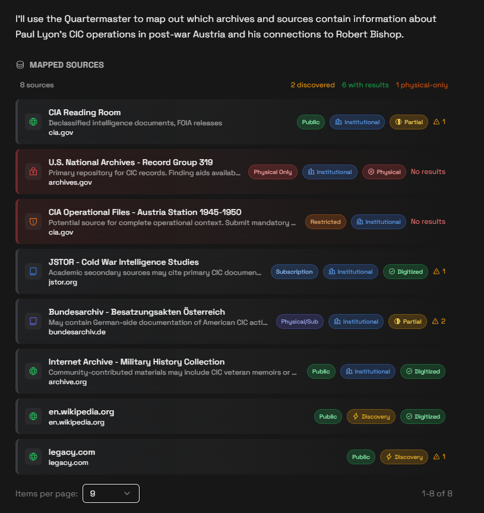

*The Quartermaster displays all discovered sources with access level badges (Public/Restricted/Physical Only/Subscription), classification (Institutional/Discovery), and digitization status.*

Key visual indicators:

| Badge | Meaning |
|-------|---------|
| 🌐 **Public** (Green) | Freely accessible online |
| 🔐 **Physical Only** (Red) | Requires in-person archive visit |
| 🛡️ **Restricted** (Orange) | Requires credentials or clearance |
| 📖 **Subscription** (Blue) | Requires paid access |
| 🏛️ **Institutional** | Vetted source from configuration |
| ⚡ **Discovery** | Found during search (lower confidence) |
| ⚠️ **Constraint count** | Number of access barriers |

### Source Detail View

Click any source to see full details:

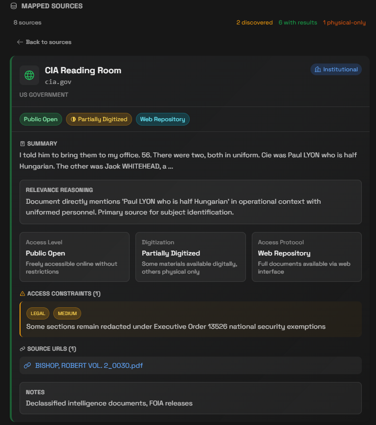

*Public source showing summary, relevance reasoning, access level explanation, constraints, and clickable source URLs.*

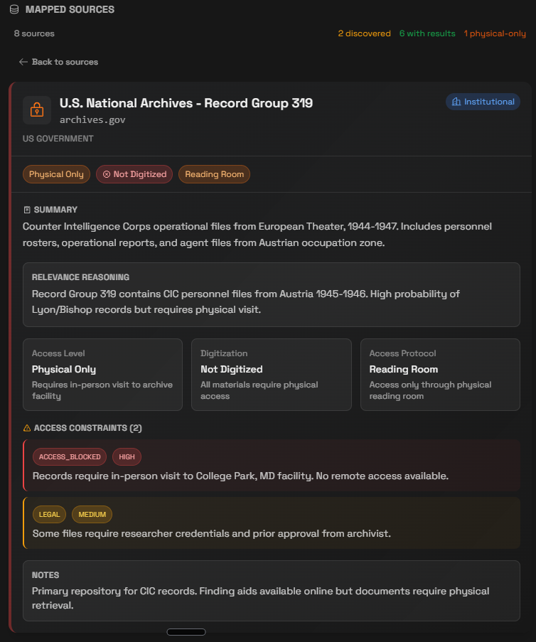

*Physical-only source showing access blocked constraints, researcher credential requirements, and notes about physical retrieval.*

### Hypotheses (Case Officer Output)

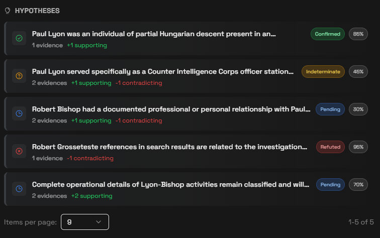

*The Case Officer generates structured hypotheses with status badges, confidence scores, and evidence counts (+supporting, -contradicting).*

| Status | Color | Meaning |
|--------|-------|---------|
| ✅ **Confirmed** | Green | Evidence supports the hypothesis |
| ❌ **Refuted** | Red | Evidence contradicts the hypothesis |
| ❓ **Indeterminate** | Amber | Insufficient evidence to determine |
| 🕐 **Pending** | Blue | Awaiting further investigation |

### Hypothesis Detail View

Click any hypothesis to see the evidence:

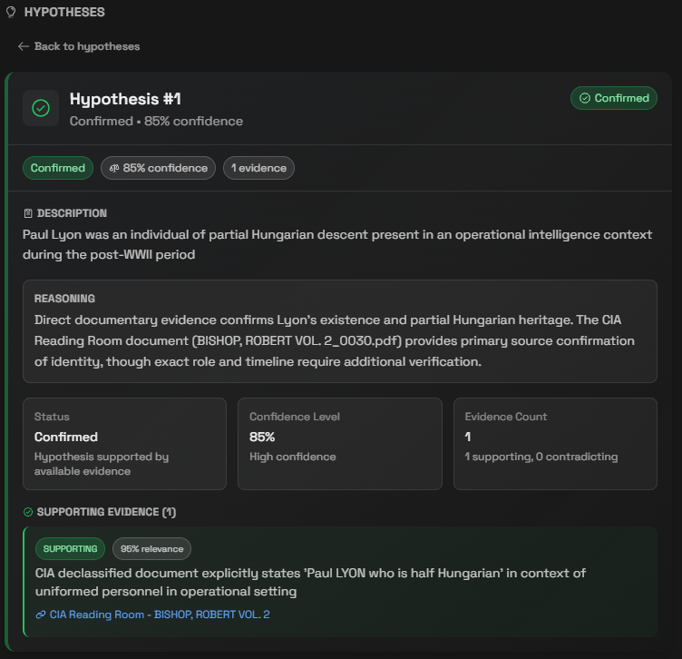

*Confirmed hypothesis showing description, reasoning, confidence metrics, and supporting evidence with source links.*

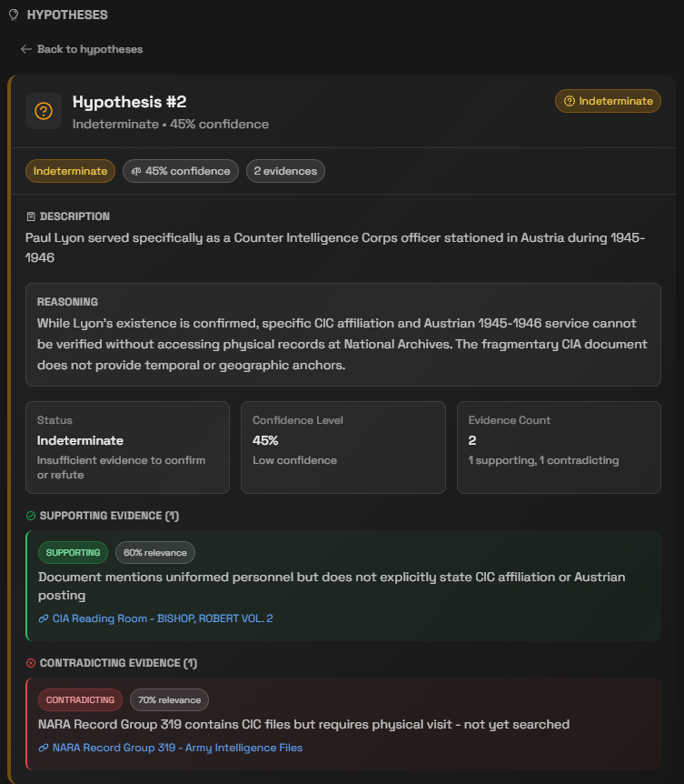

*Indeterminate hypothesis showing both supporting AND contradicting evidence, explaining why determination is not possible.*

### Recommended Next Steps

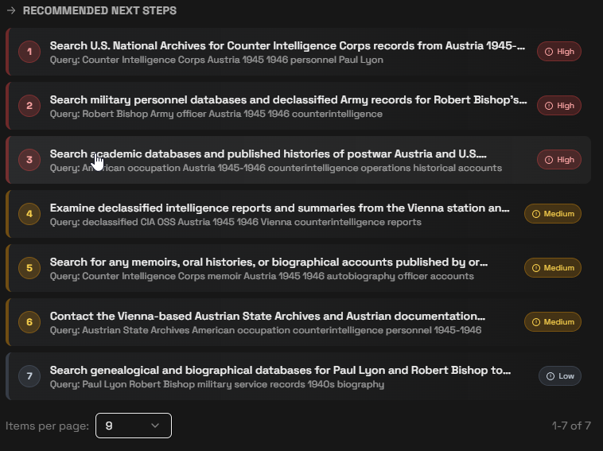

*Prioritized recommendations for continuing the investigation, with suggested search queries and priority levels.*

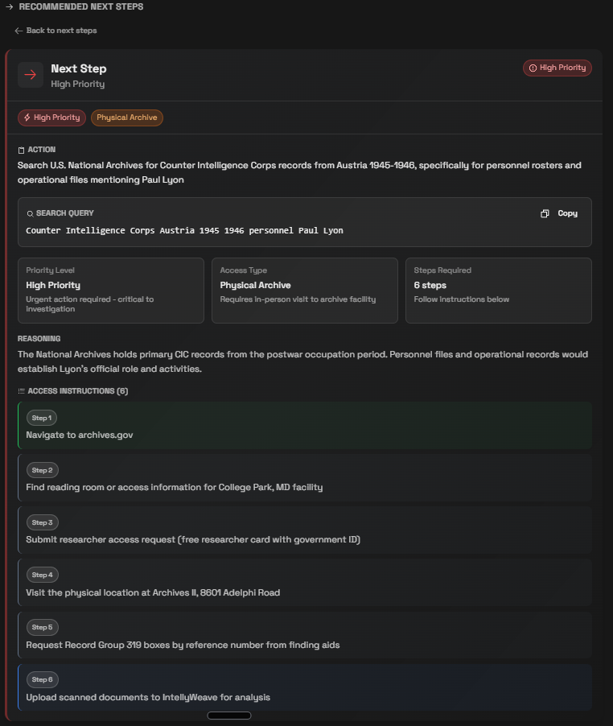

*High-priority next step showing the action, search query (copyable), access type (Physical Archive), and step-by-step instructions for accessing the resource.*

### Documents Requiring Manual Review

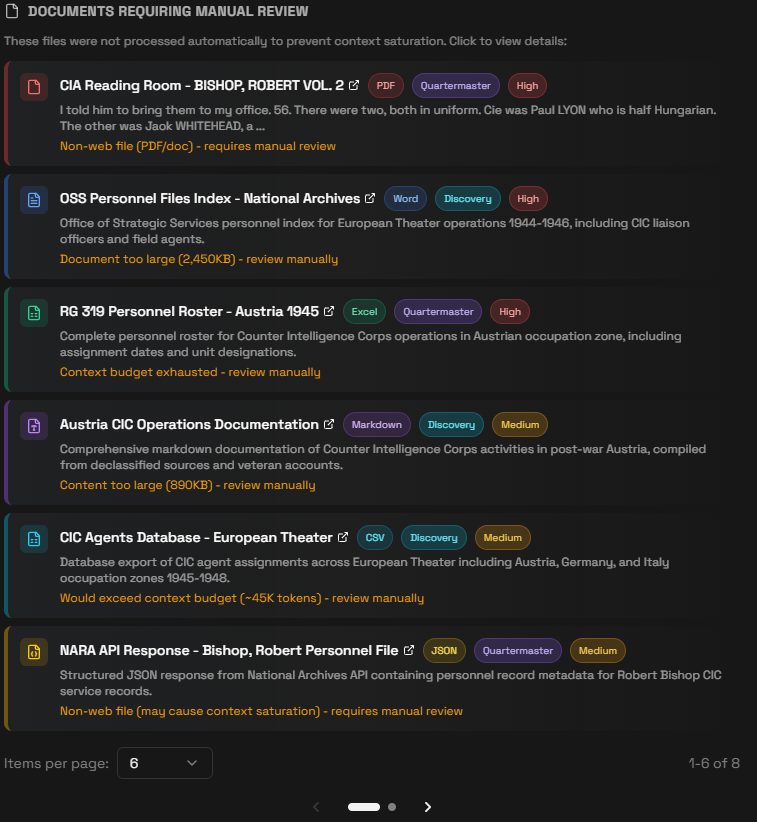

*Files that couldn't be processed automatically due to format (PDF, Excel, Word), size, or context budget limits. Color-coded by file type and priority.*

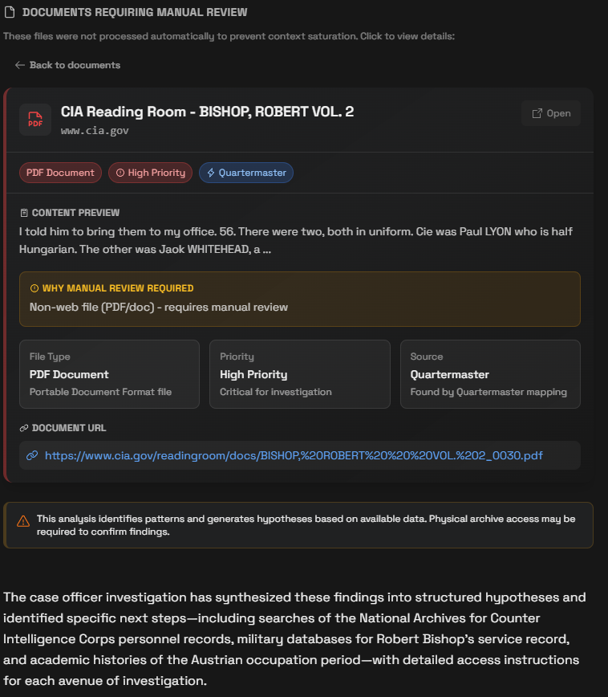

*Document detail showing file type, priority, source (Quartermaster/Discovery), URL, content preview, and reason for manual review requirement.*

### Investigation Summary

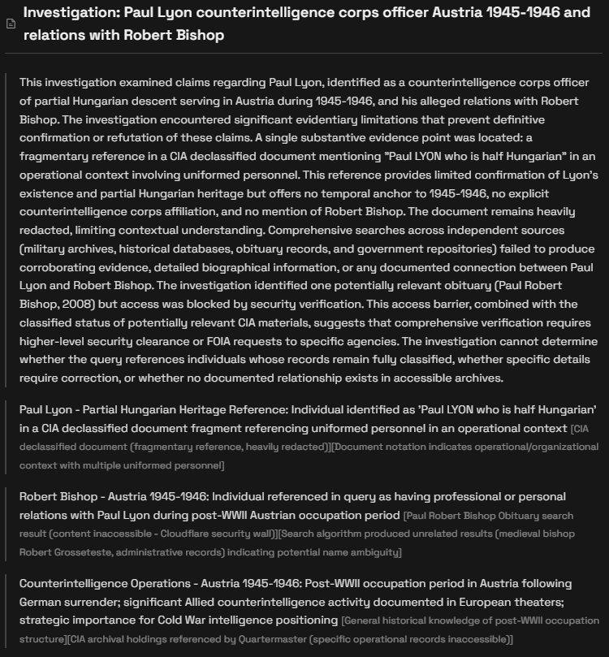

*Full narrative report synthesizing all findings, with structured sections for each investigated entity and inline citations.*

## Understanding Access Levels

| Level | Icon | Description | Action Required |
|-------|------|-------------|-----------------|
| **PUBLIC_OPEN** | 🌐 | Freely accessible online | Direct access |
| **SUBSCRIPTION** | 📖 | Requires paid membership | Subscribe or use library |
| **PHYSICAL_ONLY** | 🔐 | No digital access | Visit archive in person |
| **RESTRICTED** | 🛡️ | Requires clearance/credentials | Submit access request |
| **PHYSICAL_OR_SUBSCRIPTION** | 📖 | Multiple access paths | Choose most convenient |

## Understanding Document Skip Reasons

When the Case Officer encounters files it cannot process, it flags them for manual review:

| Reason | Explanation |
|--------|-------------|
| **Non-web file (PDF/doc)** | Binary file format cannot be read as web content |
| **Document too large** | File exceeds size threshold (e.g., >2MB) |
| **Context budget exhausted** | Reading would exceed ~80K token budget |
| **Would exceed context budget** | Estimated tokens too high for remaining budget |
| **Content too large after read** | File read but content exceeded limits |

## Example Queries

### Historical Research

```text
Use the Quartermaster to find archives about Nazi ratlines through Italy
and Vatican involvement in escape routes 1944-1950.
```

### Person Investigation

```text
Use the Quartermaster to map sources for Klaus Barbie's post-war activities
and connections to US intelligence agencies.
```

### Organization Research

```text
Use the Quartermaster to investigate Counter Intelligence Corps operations
in Austria during the Allied occupation 1945-1955.
```

## Architecture

### Backend

```text
backend/elysia/tools/archives/
├── quartermaster_tool.py      # Archive discovery, mapping, investigation context
├── case_officer_tool.py       # Investigation synthesis, Aryn PDF preview
├── types.py                   # Data structures (ArchiveSource, Hypothesis)
├── config_loader.py           # Archive domains configuration
└── dspy_programs.py           # LLM reasoning + build_aryn_pdf_instructions()

backend/elysia/api/services/
├── search_service.py          # Multi-provider search cascade
└── document_reader_service.py # Multi-reader extraction + Aryn read_pdf_preview()

backend/config/
└── archive_domains.yaml       # Curated archive configuration
```

**Key Data Flow:**

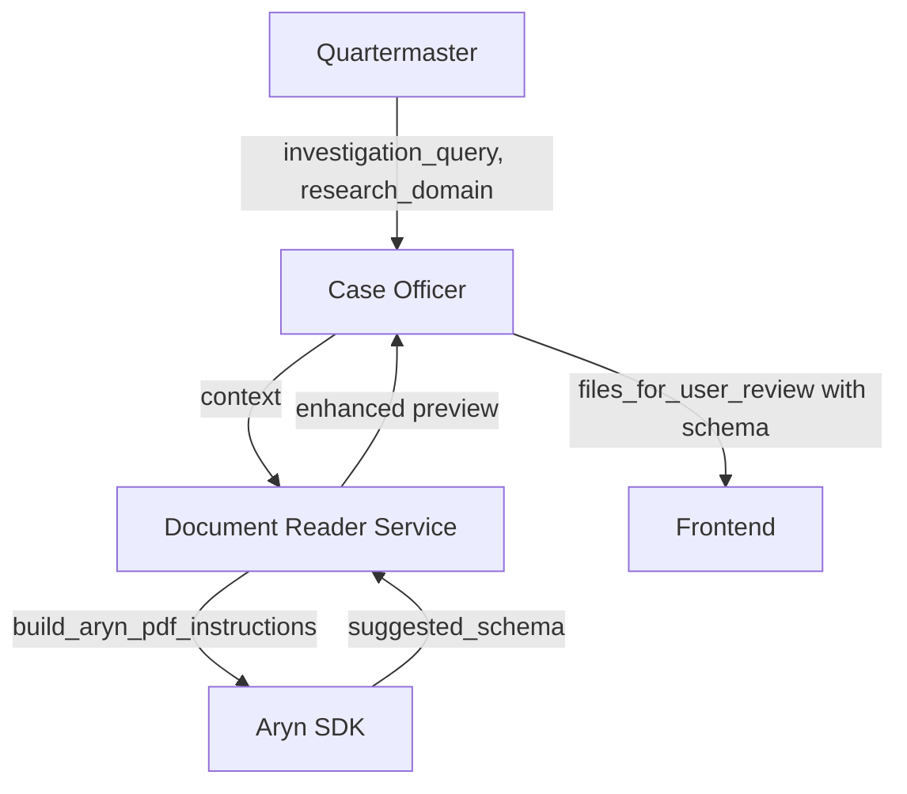

### Frontend

```text
frontend/app/components/chat/displays/
├── Archive/
│   ├── ArchiveDisplay.tsx     # Sources list with pagination
│   ├── ArchiveCard.tsx        # Source card component
│   └── ArchiveView.tsx        # Source detail view
└── Investigation/
    ├── InvestigationDisplay.tsx  # Main investigation view
    ├── HypothesisCard.tsx        # Hypothesis list item
    ├── HypothesisView.tsx        # Hypothesis detail
    ├── NextStepCard.tsx          # Next step list item
    ├── NextStepView.tsx          # Next step with instructions
    ├── DocumentCard.tsx          # Manual review file card
    └── DocumentView.tsx          # Manual review file detail + suggested_schema
```

## Configuration

### Search Providers (at least one required)

```bash
# Perplexity AI - AI-powered search with reasoning
PERPLEXITY_API_KEY=pplx-...

# Serper - Google Search API wrapper
SERPER_API_KEY=...

# Tavily - AI search optimized for LLM agents
TAVILY_API_KEY=tvly-...
```

### Document Readers (optional, improves content extraction)

```bash
# Jina Reader - Converts web pages to clean markdown
JINA_API_KEY=jina_...

# AgentQL - AI-powered web content extraction
AGENTQL_API_KEY=...
```

### Aryn PDF Reader (optional, enables intelligent PDF preview)

```bash
# Aryn - AI-powered PDF partitioning with context-aware property extraction
ARYN_API_KEY=...
```

When configured, Aryn provides:

- **Context-aware extraction**: Uses investigation query and research domain to guide extraction
- **AI-inferred schema**: Returns structured metadata tailored to the research domain
- **Content hypotheses**: Generates relevance assessments for each PDF
- **Rich previews**: Extracts title, snippet, and structured properties from first pages

> **📖 Full Guide:** See [Aryn Configuration](configuration.md#aryn-pdf-reader) for detailed setup and usage.

## Archive Domains Configuration

The Quartermaster uses a curated configuration file (`backend/config/archive_domains.yaml`) to identify and prioritize institutional archive sources. Sources from this file are marked as `INSTITUTIONAL` with higher confidence than `DISCOVERED` sources found via web search.

### Current Archive Groups

| Group | Focus | Archives |
|-------|-------|----------|
| Russian Archives | Soviet state archives, repression databases | GARF, Memorial, OpenList.wiki |
| Ukrainian Archives | National remembrance, KGB documents | UINM |
| Austrian Archives | State archives, national library | Österreichisches Staatsarchiv, ANNO |
| Brazilian Archives | Immigration, naturalization records | Arquivo Nacional, CPDOC |
| Italian Archives | Maritime manifests, port records | Archivio di Stato di Genova |
| US Archives | Declassified intelligence, Holocaust docs | NARA, CIA Reading Room, USHMM |
| European Aggregator | Pan-European heritage | Europeana |
| Academic Projects | University special collections | Harvard Library |
| Research Services | Professional archive research | Arolsen Archives, Facts & Files |
| Genealogy Services | Family history databases | FamilySearch, Ancestry |

### Adding Custom Archives

You can extend the archive configuration for project-specific investigations:

```yaml
# backend/config/archive_domains.yaml

groups:
  your_project_archives:
    description: "Archives specific to your investigation"
    domains:
      - domain: example-archive.org
        name: "Example Archive"
        default_access_level: PUBLIC_OPEN
        default_digitization_status: PARTIALLY_DIGITIZED
        default_protocol: WEB_DIGITAL_REPOSITORY
        notes: "Collection details, date ranges, special features"
        authentication:
          type: "none"
        access_instructions:
          type: "general"
          steps:
            - "Navigate to https://example-archive.org"
            - "Use search functionality"
            - "Download available documents"
```

> **📖 Full Guide:** See [Archive Domains Configuration](configuration.md) for complete documentation on configuring archive sources, authentication types, access instructions, and best practices.

## Troubleshooting

### No Sources Found

**Cause:** Search providers not configured or API keys invalid.

**Solution:** Verify at least one search provider API key is set in `.env`:

```bash
PERPLEXITY_API_KEY=pplx-...
# or
SERPER_API_KEY=...
```

### All Sources Marked "No Results"

**Cause:** Query too specific or subject not well-documented online.

**Solution:** Broaden the search terms or try alternative name spellings.

### Case Officer Not Receiving Quartermaster Intel

**Cause:** Decision tree not routing to Case Officer after Quartermaster.

**Solution:** Explicitly request both tools:

```text
Use the Quartermaster to map archives, then have the Case Officer investigate [subject].
```

### Too Many Files for Manual Review

**Cause:** Investigation found many non-web documents (PDFs, Excel files).

**Solution:** This is expected for archival research. Review high-priority files manually and upload relevant content to IntellyWeave for further analysis.

### Hypotheses All "Pending"

**Cause:** Limited publicly accessible evidence found.

**Solution:** Follow the recommended next steps to access restricted sources, then run a follow-up investigation with new information.

### Investigation Times Out

**Cause:** Too many sources to read within timeout limits.

**Solution:** Run on a more focused query or increase `TREE_TIMEOUT` in `.env`.

### Aryn PDF Preview Not Working

**Cause:** `ARYN_API_KEY` not configured or API issues.

**Solution:** Verify Aryn is configured:

```bash
grep ARYN_API_KEY backend/.env
```

Check logs for `[ARYN_PREVIEW]` entries. See [Aryn Configuration](configuration.md#aryn-pdf-reader) for detailed troubleshooting.

### PDFs Missing AI-Inferred Schema

**Cause:** Aryn returns schema in `schema` key, not `suggested_properties`.

**Solution:** This is expected behavior. Look for `has_suggested_schema: true` in logs to confirm schema extraction is working.

## See Also

### Agent Documentation

- [Quartermaster Agent](agents/quartermaster.md) - Archive discovery with dual search and language detection
- [Case Officer Agent](agents/case-officer.md) - Investigation synthesis with hypothesis evaluation
- [Agents Overview](agents/index.md) - Two-agent workflow summary

### Service Documentation

- [Sofia Search Service](../services/sofia-search/index.md) - Multi-provider search cascade
- [Document Reader Service](../services/document-reader/index.md) - URL content extraction

### Configuration

- [Archive Domains Configuration](configuration.md) - Curated archive sources
- [Environment Variables](../../reference/environment-variables.md#quartermaster--case-officer-tools) - API keys and settings

### Related Guides

- [Intelligence Analysis](../intelligence-analysis/) - Multi-agent analysis for uploaded documents
- [Courthouse Debate](../courthouse-debate/) - Adversarial multi-agent reasoning
- [Entity Extraction](../entity-extraction/) - GLiNER entity extraction from documents
- [Document Processing](../document-processing/) - Uploading and processing documents
