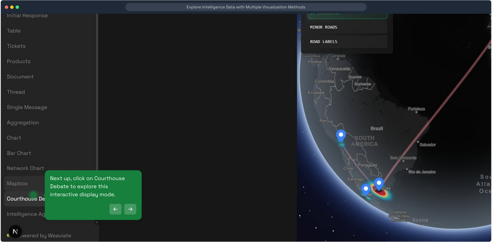
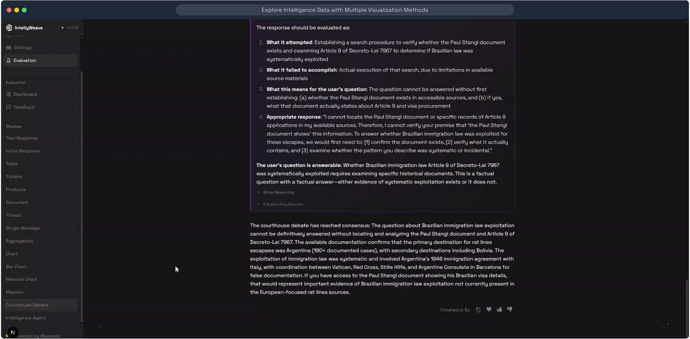

# Courthouse Debate

**Adversarial multi-agent system that refines responses through structured debate between Defense, Prosecution, and Judge agents.**

## What It Does

The Courthouse Debate system critically evaluates and refines AI responses through a structured debate process inspired by legal proceedings:

```text
Initial Response → Defense → Prosecution Challenge → Judge Evaluation → [Repeat until Consensus]
```

Unlike simple question-answering, this system:

- **Stress-tests responses** through adversarial examination
- **Identifies logical gaps** and missing information
- **Forces evidence-based argumentation** with source citations
- **Produces balanced conclusions** synthesized from multiple perspectives
- **Builds consensus** through iterative refinement

## Use When

- Questions have no simple yes/no answer
- You need to evaluate competing interpretations of evidence
- You want to stress-test a claim or hypothesis
- You need multiple perspectives on complex issues
- You want transparent reasoning with traceable arguments

## Prerequisites

- Documents uploaded and processed in IntellyWeave
- At least one LLM provider configured
- A question that benefits from adversarial analysis

## How to Trigger

Ask IntellyWeave a question that invites debate, such as:

```text
Was the Brazilian immigration law exploited to help Nazi war criminals escape?
```

Or explicitly request courthouse analysis:

```text
Debate whether [claim] is supported by the evidence.
```

The system automatically triggers when questions:
- Involve interpretation of evidence
- Have competing plausible answers
- Require weighing multiple factors

## The Three Agents

| Agent | Role | Color | Icon |
|-------|------|-------|------|
| **Defense** | Supports and strengthens the initial response | Blue | Shield |
| **Prosecution** | Challenges with logical counter-arguments | Red | Sword |
| **Judge** | Evaluates both sides and synthesizes conclusions | Purple | Scales |

## Debate Flow

### Round Structure

Each debate round follows this sequence:

```text
1. Defense presents argument supporting the response
2. Prosecution challenges with counter-arguments
3. Judge evaluates both sides and determines consensus
```

### Consensus Detection

The debate continues until:
- **Consensus reached**: All agents agree on a refined response
- **Prosecution convinced**: Defense adequately addresses all challenges
- **Maximum rounds**: Debate concludes after 5 rounds (configurable)
- **Challenge limit**: Prosecution exhausts 2-3 counter-arguments

## Example Debate

**Question**: "Was Brazilian immigration law exploited to help Nazi fugitives escape?"

### Round 1

**Defense** (Blue):
> "The initial response represents a prudent and evidence-based approach. Claims about deliberate exploitation require concrete evidence of intent and pattern, not inference..."

**Prosecution** (Red):
> "Does committing to examine evidence constitute an adequate response? If the Paul Stangl document exists, isn't deferring analysis a form of non-engagement rather than methodological rigor?"

**Judge** (Purple):
> "The defense is correct that systemic claims require rigorous evidence, but the prosecution is correct that this rigor begins with establishing facts, not deferring them..."

### Round 2

**Defense** (Blue):
> "The defense accepts that the prosecution's structural critique has merit. When a query presupposes a specific document, responsible analysis requires first establishing whether that document is available..."

**Prosecution** (Red):
> "The defense should provide binary status on document location: State definitively whether the Stangl document exists in the available collection..."

**Judge** (Purple):
> "**CONSENSUS REACHED**: The debate concludes with agreement on a revised understanding of how to approach the Brazilian immigration law question..."

## Message Structure

Each agent message contains:

```typescript
{
  agent_role: "defense" | "prosecution" | "judge",
  argument: "The agent's main argument text",
  supporting_sources: [
    { title: "Source name", excerpt: "Relevant quote..." }
  ],
  reasoning: "Logical reasoning behind the argument",
  debate_round: 1,
  agrees_with_consensus: true | false | null
}
```

## Visual Presentation

### Access Courthouse Debate



*Click **Courthouse Debate** in the sidebar to access the adversarial analysis mode.*

### Debate Interface



*Courthouse debate showing Defense, Prosecution, and Judge agents with color-coded arguments and consensus indicators.*

Each agent's output is displayed with distinct styling:

| Agent | Background | Border | Badge |
|-------|------------|--------|-------|
| Defense | Blue gradient | Blue left border | "Round N" |
| Prosecution | Red gradient | Red left border | "Round N" |
| Judge | Purple gradient | Purple left border | "Round N" |

When an agent agrees with consensus, a green "Consensus" badge appears.

## Debate Parameters

| Parameter | Default | Description |
|-----------|---------|-------------|
| `max_rounds` | 5 | Maximum debate rounds before forced conclusion |
| `max_prosecution_arguments` | 3 | Maximum prosecution challenges before automatic agreement |

## Architecture

### Backend Structure

```text
backend/elysia/tools/courthouse/
├── courthouse_debate.py    # Main orchestrator
├── defense_agent.py        # Defense agent implementation
├── prosecution_agent.py    # Prosecution agent implementation
├── judge_agent.py          # Judge agent implementation
└── objects.py              # Data structures and types
```

### Frontend Component

```text
frontend/app/components/chat/displays/Courthouse/
└── CourthouseAgentMessage.tsx   # Renders agent messages
```

## Agent Characteristics

### Defense Agent

- **Goal**: Support and strengthen the initial response
- **Method**: Uses available sources as evidence
- **Output**: Arguments with source citations
- **Behavior**: Addresses prosecution challenges directly

### Prosecution Agent

- **Goal**: Identify logical gaps and weaknesses
- **Method**: Logical analysis without relying on sources
- **Output**: Counter-arguments with constructive suggestions
- **Behavior**: "Easily convincible" - limited to 2-3 challenges

### Judge Agent

- **Goal**: Maintain neutrality and build consensus
- **Method**: Evaluates both arguments objectively
- **Output**: Synthesized verdict when consensus reached
- **Behavior**: Determines when debate should conclude

## Comparison with Intelligence Analysis

| Feature | Courthouse Debate | Intelligence Analysis |
|---------|-------------------|----------------------|
| **Focus** | Adversarial refinement | Comprehensive extraction |
| **Agents** | 3 (Defense, Prosecution, Judge) | 6 (Extractor, Mapper, etc.) |
| **Flow** | Iterative rounds | Sequential phases |
| **Output** | Refined consensus answer | Structured intelligence report |
| **Best for** | Interpretive questions | Entity/relationship discovery |

## Troubleshooting

### Debate Never Reaches Consensus

**Cause**: Question too complex or evidence too ambiguous.

**Solution**: The system will conclude after 5 rounds with the judge's best synthesis.

### Prosecution Agrees Too Quickly

**Cause**: Defense argument was particularly strong.

**Solution**: This is expected behavior - prosecution is designed to be "easily convincible."

### Empty Supporting Sources

**Cause**: Prosecution and Judge don't cite sources (they use logic).

**Solution**: Only Defense provides source citations. This is by design.

### Long Debate Times

**Cause**: Complex questions requiring multiple rounds.

**Expected times**:
- Simple debates: 15-30 seconds
- Complex debates: 60-90 seconds

## See Also

- [Agents Documentation](agents.md) - Detailed agent behavior
- [Intelligence Analysis](../intelligence-analysis/) - Alternative multi-agent approach
- [Rat Lines Demo](../../demos/rat-lines/) - Full demo using Courthouse Debate
