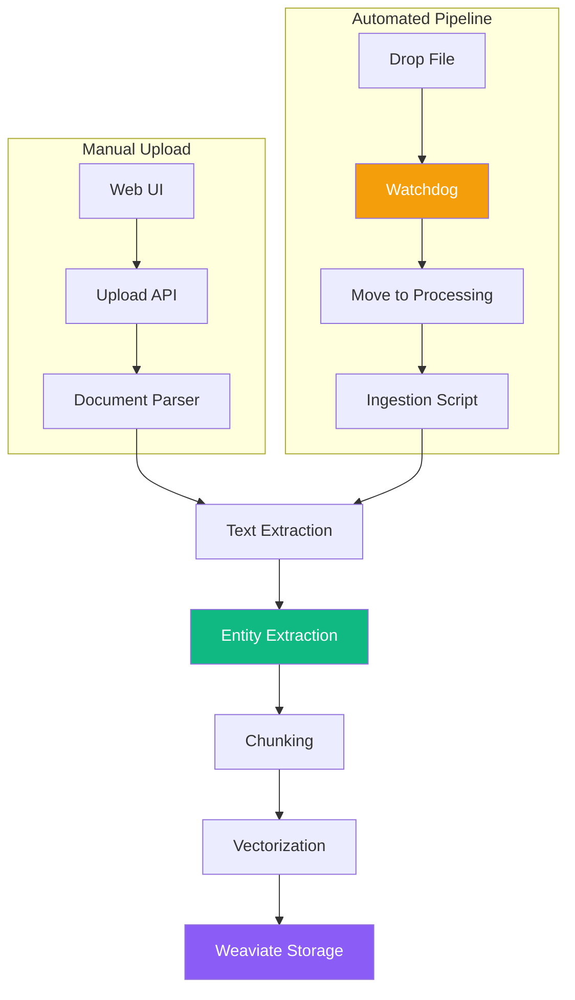
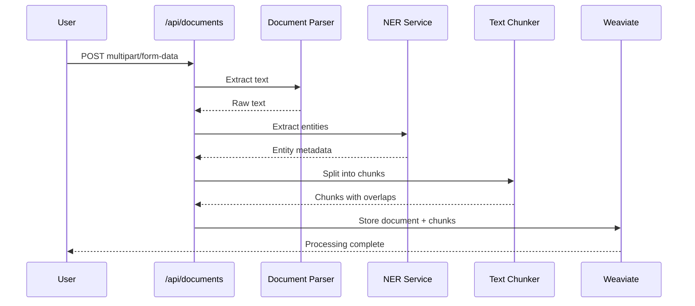
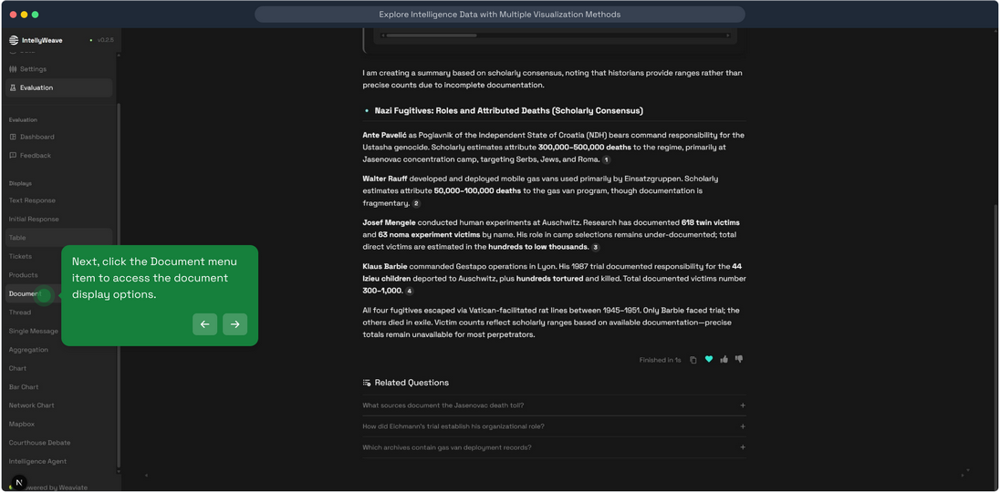
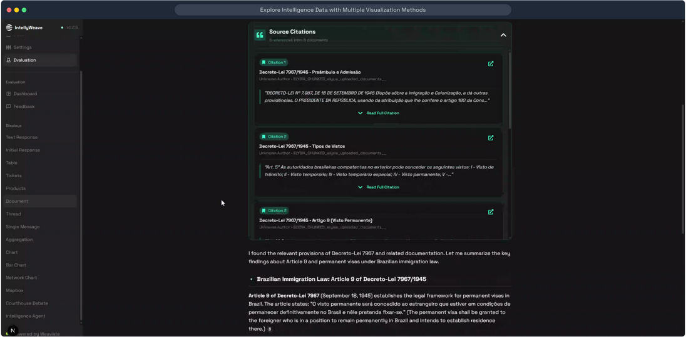
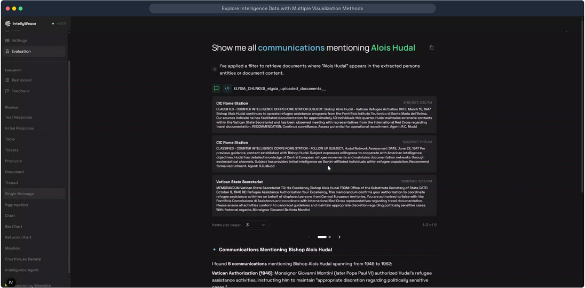
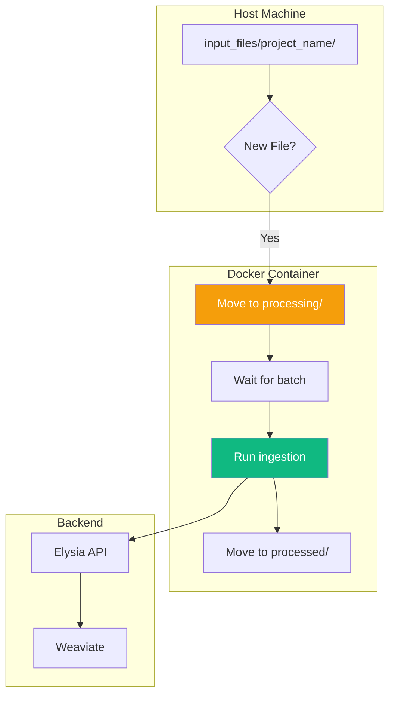

# Document Processing & Ingestion Pipeline

**Complete document processing from upload through entity extraction to Weaviate storage, including automated watchdog-based ingestion.**

## What It Does

IntellyWeave provides two document ingestion methods:

1. **Web Upload** - Manual upload through the UI with real-time processing
2. **Pipeline Watchdog** - Automated file monitoring that ingests documents dropped into watched directories



## Supported File Types

| Format | Extension | Parser |
|--------|-----------|--------|
| PDF | `.pdf` | pypdf |
| Plain Text | `.txt` | Native |
| Markdown | `.md` | Native |
| HTML | `.html` | BeautifulSoup |
| Word Document | `.docx` | python-docx |
| Email | `.eml` | email.parser |
| Mailbox | `.mbox` | mailbox |

## Use When

- You need to analyze documents in IntellyWeave
- You want automated document ingestion from a folder
- You're setting up batch processing workflows
- You need to integrate with external document sources

## Prerequisites

- IntellyWeave backend running
- Weaviate database running (local or cloud)
- Docker (for pipeline watchdog)
- At least one LLM provider configured (for entity extraction)

---

## Method 1: Web UI Upload

### How to Upload

1. Open IntellyWeave:
   - **Development mode**: `http://localhost:3000`
   - **Production mode**: `http://localhost:8000`
2. Navigate to the **Documents** tab
3. Click **Upload** and select one or more files
4. Wait for processing to complete

### Processing Pipeline



### Visual Presentation

#### Document Menu



*Access uploaded documents from the sidebar menu.*

#### Document List



*Browse all uploaded documents with metadata.*

#### Document Detail



*View document content with extracted entities and chunk information.*

---

## Method 2: Pipeline Watchdog (Automated Ingestion)

The **pipeline-watchdog** is a Docker container that monitors directories for new files and automatically ingests them.

### Architecture



### Directory Structure

Each project has a specific folder structure:

```text
backend/pipeline/input_files/
└── your_project/              # Project directory
    ├── processing/            # Files being processed (auto-created)
    ├── processed/             # Completed files (auto-created)
    └── your_document.pdf      # Drop files here
```

**Workflow:**
1. Drop file into project root (`your_project/`)
2. Watchdog detects file, moves to `processing/`
3. Ingestion runs on files in `processing/`
4. Completed files moved to `processed/`

### Setup

#### 1. Create Project Directory

```bash
mkdir -p backend/pipeline/input_files/my_project/{processing,processed}
```

#### 2. Configure Environment

Copy and edit the pipeline environment file:

```bash
cp backend/pipeline/.env.example backend/pipeline/.env
nano backend/pipeline/.env
```

**Required Configuration:**

```bash
# Logging level (DEBUG, INFO, WARNING, ERROR)
LOGGING_LEVEL=INFO

# Elysia backend API URL
ELYSIA_API_URL=http://localhost:8000

# Directory to watch (inside container: /app/data)
PIPELINE_DATA_DIR=/app/data

# User ID for document uploads (get from Elysia user registration)
PIPELINE_USER_ID=your-user-id-here

# Batch processing wait time (seconds to wait for more files)
BATCH_WAIT_SECONDS=4
```

#### 3. Start the Watchdog

```bash
docker compose up -d pipeline-watchdog
```

#### 4. Monitor Logs

```bash
docker compose logs -f pipeline-watchdog
```

**Expected startup output:**

```
================================================================================
COLLECTION-BASED DOCUMENT INGESTION PIPELINE
================================================================================
Logging level: INFO
Data directory: /app/data
Supported extensions: .pdf, .txt, .md, .html, .docx, .eml, .mbox
Batch wait time: 4s
================================================================================
Waiting for services to be ready...
Found 1 projects:
  - my_project
Watching: my_project/ (root only)
Watchdog started. Monitoring project directories...
```

### Ingesting Documents

#### Drop a File

```bash
cp /path/to/document.pdf backend/pipeline/input_files/my_project/
```

#### Watch the Logs

```text
New file detected in project root: document.pdf (125432 bytes)
Moved document.pdf → processing/
Starting ingestion for 1 files
Running Elasticsearch + Weaviate ingestion...
Ingestion completed successfully
Moved document.pdf → processed/
Pipeline completed successfully!
```

#### Batch Processing

Multiple files dropped within `BATCH_WAIT_SECONDS` (default: 4) are processed together:

```bash
# Drop multiple files quickly
cp doc1.pdf doc2.pdf doc3.pdf backend/pipeline/input_files/my_project/
```

```
Added doc1.pdf to pending batch. Total pending: 1
Added doc2.pdf to pending batch. Total pending: 2
Added doc3.pdf to pending batch. Total pending: 3
Processing batch of 3 files: ['doc1.pdf', 'doc2.pdf', 'doc3.pdf']
```

### Docker Compose Configuration

The pipeline-watchdog service is defined in `docker-compose.yaml`:

```yaml
services:
  pipeline-watchdog:
    build:
      context: ./backend/pipeline
      dockerfile: Dockerfile
    container_name: pipeline-watchdog
    env_file:
      - ./backend/pipeline/.env
    volumes:
      - ./backend/pipeline/input_files:/app/data
    restart: unless-stopped
    network_mode: host  # Access Elysia on localhost:8000
```

**Key points:**
- Volume mounts `input_files` to `/app/data` in container
- Uses host networking to reach Elysia backend
- Auto-restarts unless explicitly stopped

---

## Document Storage in Weaviate

### Collections

| Collection | Purpose |
|------------|---------|
| `ELYSIA_UPLOADED_DOCUMENTS` | Original document metadata |
| `ELYSIA_CHUNKED_*` | Document chunks with entity metadata |

### Document Schema

```json
{
  "uuid": "document-uuid",
  "title": "Document Title",
  "author": "Author Name",
  "date": "2024-01-15",
  "content": "Full document text...",
  "category": "Intelligence Report",
  "collection_name": "ELYSIA_UPLOADED_DOCUMENTS"
}
```

### Chunk Schema

```json
{
  "uuid": "chunk-uuid",
  "chunk_text": "Chunk content...",
  "document_uuid": "parent-document-uuid",
  "chunk_index": 0,
  "person": ["Klaus Barbie", "Josef Mengele"],
  "organization": ["Vatican", "CIA"],
  "location": ["Buenos Aires", "Rome"],
  "date": ["1945", "1951"],
  "event": [],
  "law": [],
  "cryptonym": []
}
```

---

## Chunking Configuration

Documents are split into overlapping chunks for better retrieval:

```python
# Default chunking parameters
CHUNK_SIZE = 512      # Characters per chunk
CHUNK_OVERLAP = 50    # Overlap between chunks
```

### Why Chunking?

- Vector embeddings work best on focused content
- Smaller chunks enable precise retrieval
- Overlap preserves context at boundaries

---

## Architecture

### Backend Structure

```
backend/
├── elysia/
│   ├── api/
│   │   ├── routes/
│   │   │   └── documents.py        # Upload endpoint
│   │   └── services/
│   │       ├── document.py         # Document processing
│   │       └── ner_service.py      # Entity extraction
│   └── util/
│       └── document_parser.py      # File parsing
└── pipeline/
    ├── Dockerfile                   # Watchdog container
    ├── .env.example                 # Configuration template
    ├── automation/
    │   └── watchdog_ingestion.py   # File watcher
    └── ingestion/
        └── ingest_elastic_weaviate.py  # Ingestion logic
```

### Frontend Structure

```
frontend/app/components/chat/displays/
└── Document/
    ├── DocumentDisplay.tsx    # Document list
    ├── DocumentView.tsx       # Document detail
    └── SourcesDisplay.tsx     # Source citations
```

---

## Troubleshooting

### Upload Fails with "Processing Error"

**Cause:** Document parsing failed or unsupported format.

**Solution:**
- Check file is not corrupted
- Verify file extension matches content
- Check backend logs for specific error

### Watchdog Not Detecting Files

**Cause:** Wrong directory structure or permissions.

**Solution:**
- Ensure `processing/` subdirectory exists
- Check file permissions in mounted volume
- Verify watchdog container is running

### "User ID not found" Error

**Cause:** `PIPELINE_USER_ID` not set or invalid.

**Solution:**
1. Register user in Elysia
2. Get user ID from database or API
3. Update `backend/pipeline/.env`

### Slow Processing

**Cause:** Large files or many entities to extract.

**Solution:**
- GLiNER extraction can take time for large docs
- Check batch settings for multiple files
- Monitor with `docker compose logs -f`

### Weaviate Connection Error

**Cause:** Weaviate not running or wrong URL.

**Solution:**
```bash
# Check Weaviate is running
docker compose ps weaviate

# Verify connection
curl http://localhost:8080/v1/.well-known/ready
```

---

## Performance

| Operation | Typical Time |
|-----------|-------------|
| PDF parsing (10 pages) | 1-3 seconds |
| Entity extraction | 2-10 seconds |
| Chunking | < 1 second |
| Weaviate storage | 1-2 seconds |
| **Total (small doc)** | **5-15 seconds** |

---

## See Also

- [Entity Extraction](../entity-extraction/) - GLiNER NER details
- [Getting Started](../../getting-started/) - Initial setup
- [API Reference](../../reference/api-endpoints.md) - Upload API details
