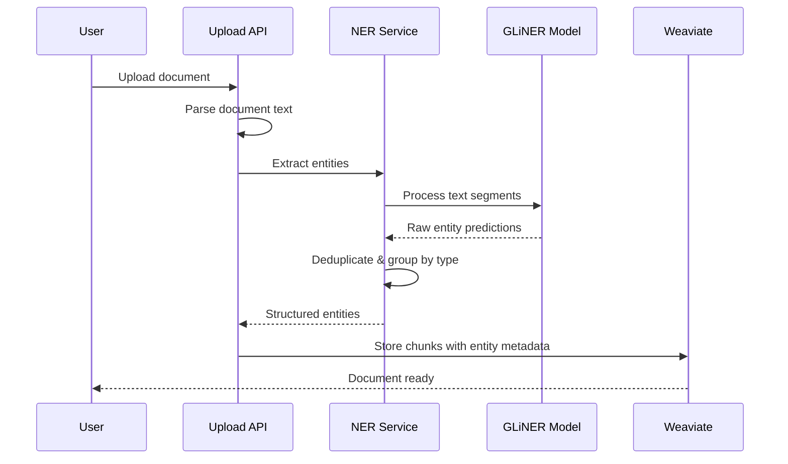

# Entity Extraction (GLiNER)

**Zero-shot named entity recognition that automatically extracts persons, organizations, locations, events, dates, laws, and cryptonyms from documents.**

## What It Does

IntellyWeave uses **GLiNER** (Generalist and Lightweight Named Entity Recognition) to automatically extract structured entities from uploaded documents. Unlike traditional NER systems that require training, GLiNER performs zero-shot extraction - it recognizes entities without specific training data.


## Entity Types

IntellyWeave extracts **7 entity types** optimized for OSINT and intelligence analysis:

| Entity Type | Description | Examples |
|-------------|-------------|----------|
| **person** | Individual names | Klaus Barbie, Adolf Eichmann |
| **organization** | Groups, agencies, institutions | CIA, Vatican, Mossad |
| **location** | Geographic places | Buenos Aires, Vatican City |
| **date** | Temporal references | January 1945, 1960s |
| **event** | Historical happenings | World War II, Operation Paperclip |
| **law** | Legal frameworks | Geneva Convention, Executive Order 12333 |
| **cryptonym** | Codenames and aliases | PBSUCCESS, MKULTRA |

## Use When

- Uploading documents for the first time
- You need structured metadata for search and filtering
- Building intelligence profiles from document collections
- Visualizing entity relationships on maps or network graphs
- Cross-referencing entities across multiple documents

## Prerequisites

- IntellyWeave backend running
- GLiNER optional dependency installed
- At least one document to process

## Installation

GLiNER is an **optional dependency** that adds entity extraction capabilities:

```bash
cd backend
source .venv/bin/activate

# Install CPU-only PyTorch first (smaller download, sufficient for NER)
pip install torch --index-url https://download.pytorch.org/whl/cpu

# Install GLiNER dependency
pip install -e ".[ner]"
```

**First-run note:** The GLiNER model (`urchade/gliner_multi-v2.1`, ~500MB) downloads from HuggingFace on first document upload.

## How It Works

### Processing Pipeline



### Text Segmentation

GLiNER has a token limit (~384 tokens). For longer documents, IntellyWeave automatically:

1. Splits text at sentence boundaries
2. Processes each segment independently
3. Merges and deduplicates results

```python
# Automatic segmentation for long documents
if len(text) > max_tokens_per_segment * 4:
    segments = self._split_text_into_segments(text, max_chars)
    for segment in segments:
        entities.extend(model.predict_entities(segment, labels))
```

### Entity Storage

Extracted entities are stored as metadata arrays on document chunks in Weaviate:

```json
{
  "chunk_text": "Klaus Barbie was smuggled through the Vatican rat line...",
  "person": ["Klaus Barbie"],
  "organization": ["Vatican", "CIC"],
  "location": ["Milan", "Buenos Aires"],
  "date": ["1951"],
  "event": [],
  "law": [],
  "cryptonym": []
}
```

## Visual Presentation

### Entity Extractor Agent Output


*The Entity Extractor agent displays extracted entities with confidence scores, descriptions, and source references.*

### Entity Output Structure

Each extracted entity includes:

```typescript
{
  name: "Klaus Barbie",
  type: "person",
  description: "Nazi war criminal known as 'Butcher of Lyon'...",
  assessment: "Key figure in escape network operations",
  confidence: 0.95,
  reasoning: "Source explicitly names him as smuggled via Milan's rat line",
  source_refs: ["chunk_uuid_1", "chunk_uuid_2"]
}
```

## Configuration

### Default Entity Labels

The NER service uses these labels by default:

```python
DEFAULT_LABELS = ["location", "person", "organization", "date", "law", "event"]
```

### Adding Custom Labels

You can customize labels by modifying the extraction call:

```python
ner_service = NamedEntityRecognitionService()
entities = ner_service.extract_entities(
    text=document_text,
    labels=["person", "organization", "location", "cryptonym", "weapon"]
)
```

### Confidence Threshold

GLiNER uses a confidence threshold of **0.5** by default:

```python
entities = model.predict_entities(text, labels, threshold=0.5)
```

## Architecture

### Backend Structure

```
backend/elysia/api/
├── services/
│   └── ner_service.py          # NamedEntityRecognitionService
├── utils/
│   └── ner.py                  # Utility functions
└── routes/
    └── documents.py            # Upload endpoint with NER integration
```

### Key Components

| Component | File | Purpose |
|-----------|------|---------|
| **NamedEntityRecognitionService** | `services/ner_service.py` | Main NER processing |
| **GLiNER Model** | HuggingFace | `urchade/gliner_multi-v2.1` |
| **Document Upload** | `routes/documents.py` | Triggers entity extraction |

### Model Details

| Property | Value |
|----------|-------|
| Model | `urchade/gliner_multi-v2.1` |
| Size | ~500MB |
| Token limit | ~384 tokens per segment |
| Languages | Multilingual (EN, DE, ES, FR, etc.) |
| Loading | Lazy-loaded on first use |

## Troubleshooting

### GLiNER Not Installed

**Error:** `WARNING: GLiNER model not available - skipping entity extraction`

**Solution:**
```bash
cd backend
source .venv/bin/activate
pip install torch --index-url https://download.pytorch.org/whl/cpu
pip install -e ".[ner]"
```

### Model Download Hangs

**Cause:** First-time download from HuggingFace (~500MB).

**Solution:** Wait for download to complete. Check network connection. Set `HF_TOKEN` if accessing gated models.

### Empty Entity Results

**Cause:** Document has no recognizable entities or text is too short.

**Solution:**
- Verify document contains relevant content
- Check logs for extraction errors
- Ensure text extraction succeeded

### High Memory Usage

**Cause:** GLiNER model loaded multiple times.

**Solution:** The service uses singleton pattern - model loads once per process. Restart backend if memory issues persist.

### Truncated Entities in Long Documents

**Cause:** Default segmentation may miss context.

**Solution:** The service automatically segments. Check logs for segment count:
```
INFO: NER splitting long text into 5 segments for processing
```

## Performance

| Operation | Typical Time |
|-----------|-------------|
| Model loading (first time) | 5-15 seconds |
| Model loading (cached) | 1-3 seconds |
| Entity extraction (short doc) | 0.5-2 seconds |
| Entity extraction (long doc) | 2-10 seconds |

## See Also

- [Intelligence Analysis](../intelligence-analysis/) - Uses extracted entities
- [Geospatial Mapping](../geospatial-mapping/) - Visualizes location entities
- [Network Analysis](../network-analysis/) - Builds entity relationship graphs
- [Document Processing](../document-processing/) - Full upload pipeline
