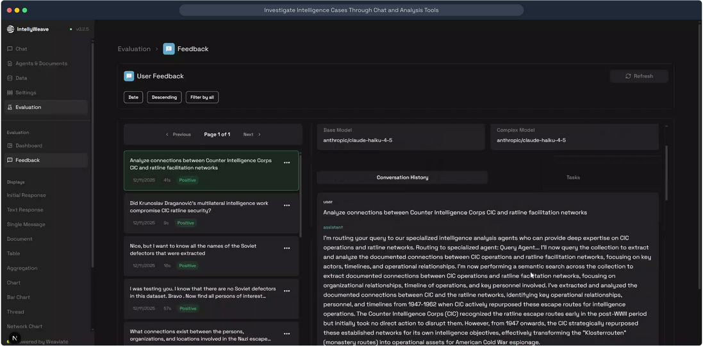
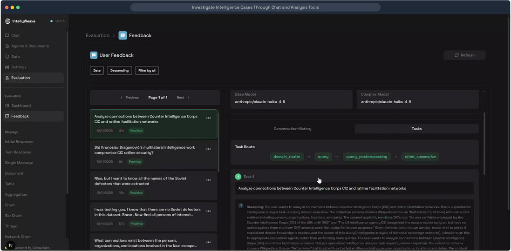
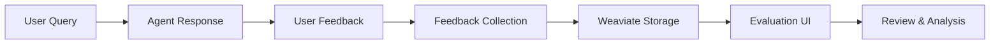

# Evaluation & Feedback System

**Review agent responses, collect user feedback, and analyze task routing decisions through the integrated evaluation interface.**

## What It Does

The Evaluation system provides tools for:

- **User Feedback Collection** - Capture positive/negative ratings on agent responses
- **Conversation Review** - Examine full conversation history for each query
- **Task Route Visualization** - See how queries were routed through the agent pipeline
- **Model Comparison** - Track which models (Base/Complex) handled each request
- **Feedback Analytics** - Filter and sort feedback by date, sentiment, and type

## Use When

- Reviewing agent response quality
- Debugging unexpected routing decisions
- Collecting training data for model improvement
- Analyzing user satisfaction patterns
- Auditing agent behavior on specific queries

## Prerequisites

- IntellyWeave running with feedback collection enabled
- Existing conversations with user feedback
- Access to Evaluation menu in sidebar

---

## Feedback Interface

### Conversation History View



*Evaluation > Feedback page showing user feedback list (left) with conversation detail (right). Each feedback item shows the query, timestamp, response time, and sentiment (Positive/Negative). The detail panel displays Base Model and Complex Model used, with tabs for Conversation History and Tasks.*

### Key UI Elements

| Element | Location | Purpose |
|---------|----------|---------|
| **Feedback List** | Left panel | Browse all feedback with pagination |
| **Sentiment Badge** | Each item | Green (Positive) or Red (Negative) |
| **Response Time** | Each item | Seconds to generate response |
| **Model Info** | Top right | Base Model and Complex Model used |
| **Conversation Tab** | Detail panel | Full user/assistant exchange |
| **Tasks Tab** | Detail panel | Task routing visualization |

---

## Task Route Visualization



*Tasks tab showing the routing pipeline for a query. The Task Route displays the sequence: domain_router → query → query_postprocessing → cited_summarize. Below, Task 1 expands to show the Reasoning section explaining why this route was selected.*

### Task Route Components

```text
domain_router → query → query_postprocessing → cited_summarize
```

| Stage | Purpose |
|-------|---------|
| **domain_router** | Analyze query intent and select appropriate agent |
| **query** | Execute the main query against collections |
| **query_postprocessing** | Refine results, extract relevant passages |
| **cited_summarize** | Generate response with citations |

### Reasoning Panel

Each task includes a **Reasoning** section showing:

- Query classification analysis
- Collection schema detection
- Domain expertise matching
- Route selection justification

---

## Feedback Controls

### Filtering Options

| Filter | Options |
|--------|---------|
| **Date** | Sort by feedback date |
| **Order** | Ascending / Descending |
| **Sentiment** | All / Positive / Negative |

### Pagination

- **Page Size**: 20 items per page
- **Navigation**: Previous/Next arrows
- **Page Indicator**: "Page 1 of N"

---

## Data Flow



---

## Component Architecture

```text
frontend/app/
├── pages/
│   ├── EvalPage.tsx          # Evaluation dashboard container
│   └── FeedbackPage.tsx      # Feedback list and detail
└── components/
    └── evaluation/
        └── FeedbackDetails.tsx   # Conversation + Tasks detail view
```

---

## Use Cases

### Quality Assurance

1. Navigate to **Evaluation > Feedback**
2. Filter by **Negative** sentiment
3. Review conversation to identify issues
4. Check **Task Route** for routing problems

### Model Performance Analysis

1. Compare response times across queries
2. Note which model (Base/Complex) was used
3. Correlate model choice with user satisfaction

### Route Debugging

1. Find query with unexpected results
2. Open **Tasks** tab
3. Review **Reasoning** section
4. Identify where routing went wrong

---

## Troubleshooting

| Issue | Cause | Solution |
|-------|-------|----------|
| No feedback showing | Collection empty | Generate conversations and provide feedback |
| Missing task details | Tasks not recorded | Check backend logging configuration |
| Slow loading | Large feedback dataset | Use filters to narrow results |
| Reasoning truncated | Long analysis text | Scroll within Reasoning panel |

---

## See Also

- [Intelligence Analysis Guide](../intelligence-analysis/index.md)
- [Agents & Domain Router](../agents/index.md)
- [LLM Configuration](../llm-configuration/index.md)

---

*Screenshots from IntellyWeave v0.2.5 demo: "Investigate Intelligence Cases Through Chat and Analysis Tools"*
*Source: [Supademo](https://app.supademo.com/demo/cmj38xuzf1j6dv3e5tcp0oi4l)*
