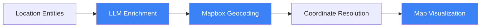
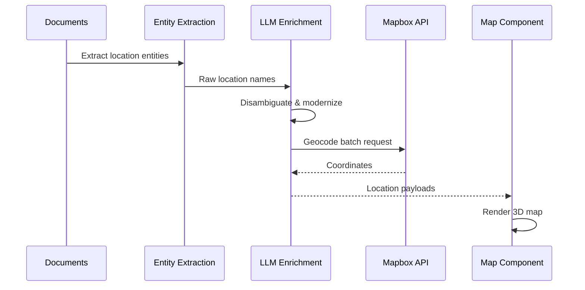
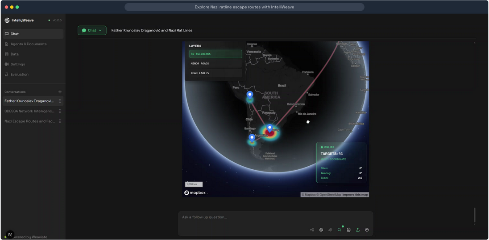
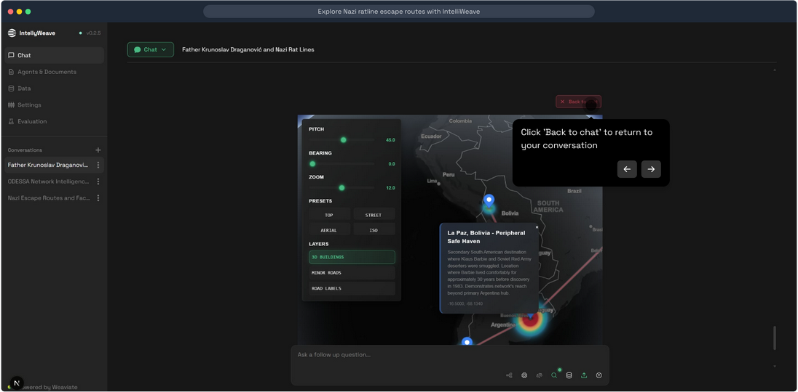
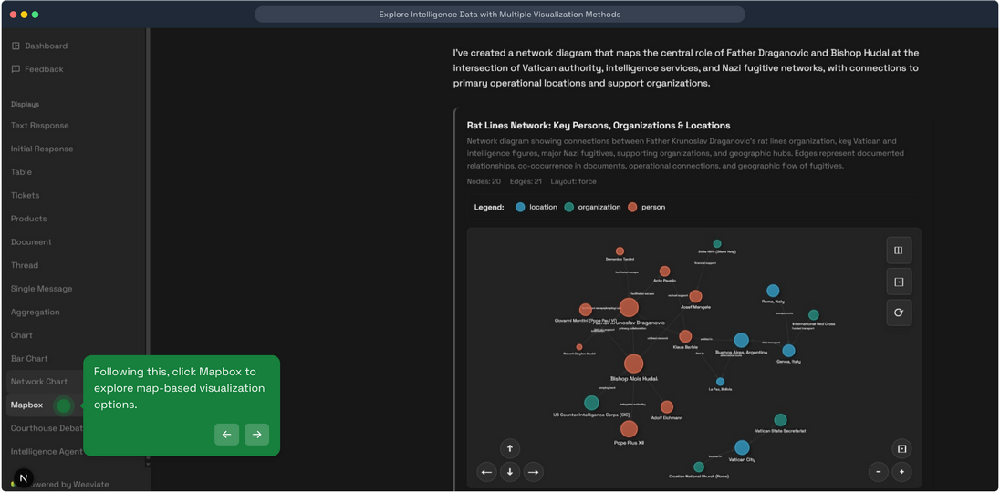

# Geospatial Mapping

**Interactive 3D maps that visualize location entities, routes, and geographic intelligence using Mapbox GL.**

## What It Does

IntellyWeave's geospatial mapping system transforms location entities extracted from documents into interactive map visualizations. It combines:

- **Location enrichment** - LLM-powered disambiguation of historical and ambiguous place names
- **Geocoding** - Coordinate resolution via Mapbox Geocoding API v6
- **Visualization** - Interactive 3D maps with markers, routes, and heatmaps



## Use When

- You have documents with geographic references
- You need to visualize escape routes, travel patterns, or operational areas
- You're analyzing spatial relationships between entities
- You want to understand geographic concentration of events
- You need to disambiguate historical location names

## Prerequisites

- IntellyWeave backend running
- Mapbox access token configured
- Documents with location entities extracted
- Anthropic API key (for location enrichment)

## Configuration

### Backend Configuration

Add to `backend/.env`:

```bash
# Mapbox API token for geocoding
MAPBOX_ACCESS_TOKEN=pk.your-mapbox-token-here

# Anthropic API key for location enrichment
ANTHROPIC_API_KEY=sk-ant-your-key-here
```

### Frontend Configuration

Add to `frontend/.env.local`:

```bash
# Mapbox token for map rendering
NEXT_PUBLIC_MAPBOX_ACCESS_TOKEN=pk.your-mapbox-token-here
```

**Get a Mapbox token:** [account.mapbox.com/access-tokens](https://account.mapbox.com/access-tokens/)

## How It Works

### Location Processing Pipeline



### Location Enrichment

The `GeocodingService` uses Claude Haiku to:

1. **Disambiguate** historical location names (e.g., "American occupation zone" → "Salzburg, Austria")
2. **Modernize** outdated place names
3. **Add context** for better geocoding accuracy
4. **Filter** country-level locations (only specific places returned)

**Enrichment prompt extracts:**

```json
{
  "locationName": "Buenos Aires, Argentina",
  "locationType": "City",
  "description": "Capital city, major destination for Nazi escape routes",
  "country": "Argentina"
}
```

### Geocoding

Uses **Mapbox Geocoding API v6** with batch processing:

```python
# Batch geocoding request
url = "https://api.mapbox.com/search/geocode/v6/batch"
queries = [
    {"q": "Buenos Aires, Argentina", "types": "locality,place", "limit": 1}
]
```

**Supported location types:**
- `locality` - Towns, villages
- `place` - Cities
- `district` - Administrative districts
- `region` - States, provinces

## Visual Presentation

### Geospatial Analyst Output


*The Geospatial Analyst agent displays enriched locations with coordinates and geographic context.*

### Map Visualization



*Interactive 3D map showing entity locations and escape routes across South America.*

### Location Details



*Detailed location view with entity information and geographic context.*

### Map View Access



*Access the map visualization from the sidebar to see all geocoded locations.*

## Data Structures

### MapPayload (Frontend)

```typescript
type MapPayload = {
  name: string;           // Location display name
  latitude: number;       // Decimal latitude
  longitude: number;      // Decimal longitude
  route?: number[][];     // Array of [lon, lat] for route paths
  description?: string;   // Location context
  locationType?: string;  // Town, City, District, Region, Place
  weight?: number;        // Heatmap weight
};
```

### Geocoded Location (Backend)

```python
{
    "locationName": "Vatican City",
    "locationType": "City",
    "description": "Primary hub for rat line operations",
    "country": "Vatican",
    "coordinates": [12.4534, 41.9029],
    "latitude": 41.9029,
    "longitude": 12.4534
}
```

## Architecture

### Backend Structure

```
backend/elysia/
├── api/services/
│   └── geocoding_service.py    # GeocodingService
├── agents/
│   └── geo_transformer.py      # GeospatialTransformationTool
└── tools/intelligence/
    └── geospatial_agent.py     # Geospatial analysis agent
```

### Frontend Structure

```
frontend/app/components/chat/displays/
└── Map/
    ├── MapView.tsx             # Main map component
    └── FullscreenMapModal.tsx  # Fullscreen map overlay
```

### Key Components

| Component | File | Purpose |
|-----------|------|---------|
| **GeocodingService** | `api/services/geocoding_service.py` | Location enrichment & geocoding |
| **GeospatialTransformationTool** | `agents/geo_transformer.py` | Decision tree integration |
| **GeospatialAgent** | `tools/intelligence/geospatial_agent.py` | Intelligence orchestrator phase |
| **MapView** | `Map/MapView.tsx` | 3D map rendering |

## Features

### Route Visualization

Routes can be displayed connecting locations:

```typescript
{
  name: "Vatican to Buenos Aires",
  latitude: -34.6037,
  longitude: -58.3816,
  route: [
    [12.4534, 41.9029],   // Vatican City [lon, lat]
    [-58.3816, -34.6037]  // Buenos Aires [lon, lat]
  ]
}
```

### Heatmap Weighting

Locations can have weights for heatmap visualization:

```typescript
{
  name: "Milan",
  latitude: 45.4642,
  longitude: 9.1900,
  weight: 10  // Higher weight = more prominent
}
```

### 3D Controls

The Mapbox GL map supports:
- **Pitch** - Tilt the map for 3D perspective
- **Bearing** - Rotate the map
- **Zoom** - From street level to global view
- **Navigation controls** - Built-in zoom and compass

## Troubleshooting

### Map Not Displaying

**Cause:** Mapbox token not configured or invalid.

**Solution:**
1. Verify `NEXT_PUBLIC_MAPBOX_ACCESS_TOKEN` in `frontend/.env.local`
2. Check token is valid at Mapbox dashboard
3. Ensure token has correct scopes

### Empty Geocoding Results

**Cause:** Location names too ambiguous or historical.

**Solution:**
- Location enrichment should disambiguate automatically
- Check logs for enrichment output
- Verify Anthropic API key is set

### Slow Geocoding

**Cause:** Many locations processed sequentially.

**Solution:** The service uses batch geocoding by default. Check logs:
```
[PERFORMANCE] Batch geocoding completed in 2.35s (15/18 successful)
```

### Invalid Coordinates

**Cause:** Geocoding returned no results for a location.

**Solution:**
- Check if location is too generic (countries are filtered)
- Verify location exists in Mapbox database
- Try more specific location names

### Country-Level Locations Filtered

**Expected behavior:** The enrichment prompt explicitly filters out country-level locations:

```
- locationType must be EXACTLY ONE of: Town, City, District, Region, Place
- Do NOT return Country-level locations
```

## Performance

| Operation | Typical Time |
|-----------|-------------|
| Location enrichment (batch of 10) | 2-5 seconds |
| Geocoding (batch of 10) | 1-2 seconds |
| Map rendering | < 1 second |

## See Also

- [Entity Extraction](../entity-extraction/) - Source of location entities
- [Intelligence Analysis](../intelligence-analysis/) - Geospatial phase
- [Network Analysis](../network-analysis/) - Related visualization
- [Agents Documentation](../agents/) - GeospatialTransformationTool details
