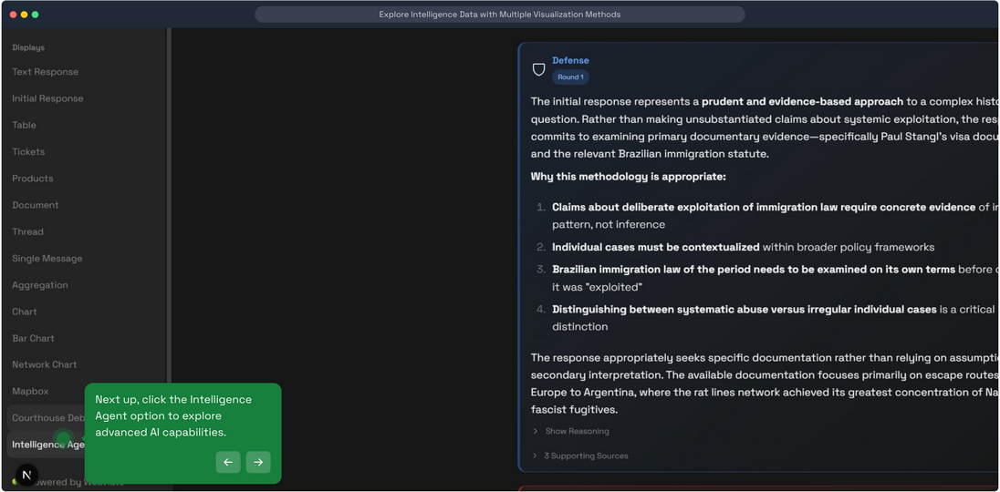
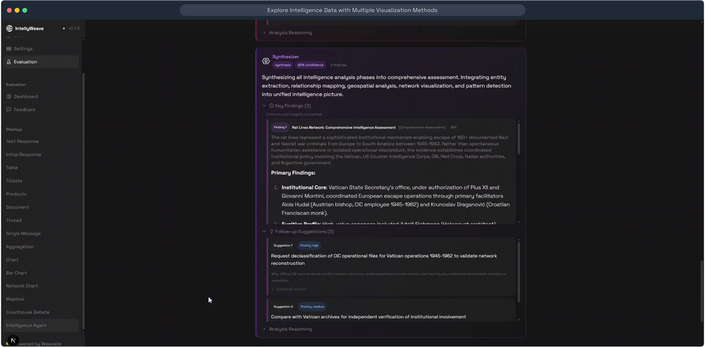
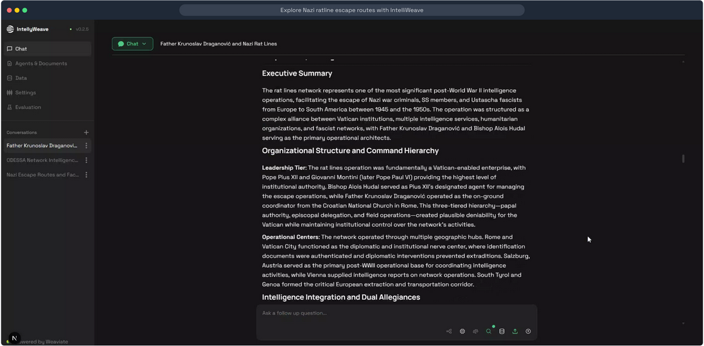
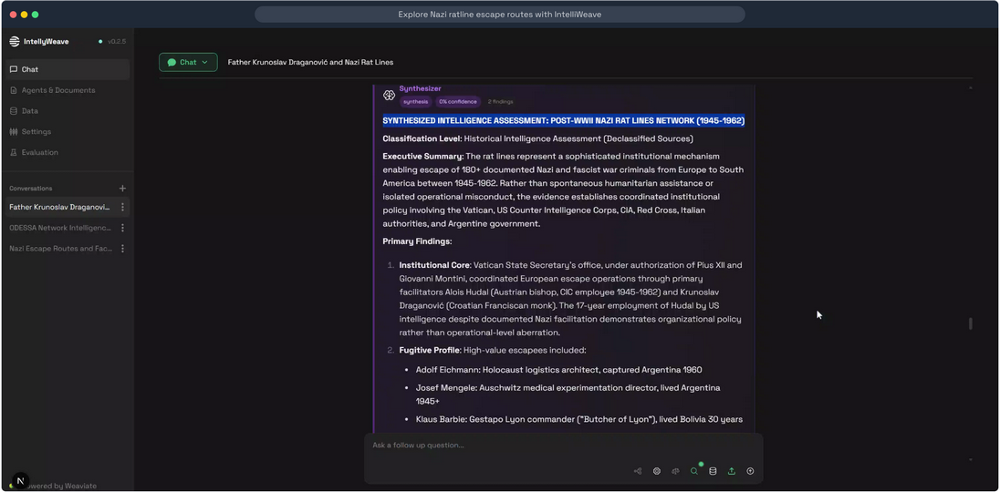
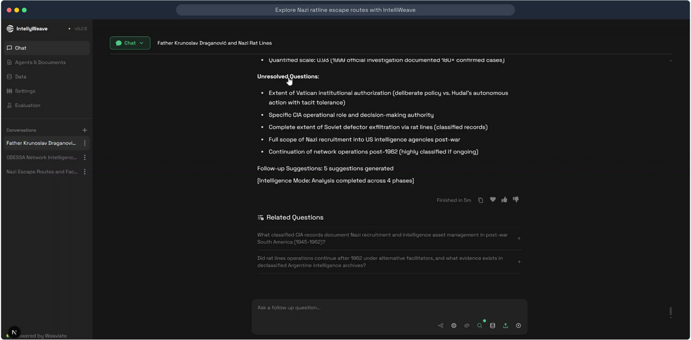
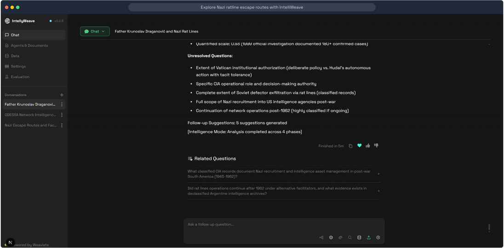

# Intelligence Analysis

**Multi-agent orchestrated analysis that transforms document collections into structured intelligence through six specialized phases.**

## What It Does

The Intelligence Orchestrator coordinates six specialized AI agents to perform comprehensive intelligence analysis:

```
Query → Entity Extraction → Relationship Mapping → Geospatial Analysis → Network Analysis → Pattern Detection → Synthesis
```

Unlike simple document search, this system:

- **Extracts entities** from GLiNER metadata (persons, organizations, locations, dates, events, laws, cryptonyms)
- **Maps relationships** between entities based on document co-occurrences
- **Visualizes geography** with interactive 3D maps showing locations and routes
- **Analyzes networks** using graph theory to identify central nodes and clusters
- **Detects patterns** across institutional, behavioral, geographic, and temporal dimensions
- **Synthesizes findings** into a comprehensive intelligence assessment with confidence scores

## Use When

- You need to understand the full picture from a document collection
- Simple queries aren't revealing hidden connections
- You want entity relationships visualized on maps and network graphs
- You're investigating complex networks of people, organizations, and locations
- You need multi-perspective analysis with confidence scoring

## Prerequisites

- Documents uploaded and processed in IntellyWeave
- GLiNER entity extraction enabled (for best results)
- At least one LLM provider configured

## How to Trigger

Ask IntellyWeave to run a full intelligence analysis:

```
Run a full intelligence analysis
```

Or be more specific:

```
Run a full intelligence analysis about the network structure and persons of interest.
```

The system will automatically:
1. Retrieve relevant documents from Weaviate
2. Execute all six analysis phases
3. Display results as they complete

## The Six Phases

| Phase | Agent | Purpose | Output |
|-------|-------|---------|--------|
| 1 | **Entity Extractor** | Extract and enrich entities from GLiNER metadata | Persons, organizations, locations with context |
| 2 | **Relationship Mapper** | Map connections between entities | Relationship clusters with strength scores |
| 3 | **Geospatial Analyst** | Analyze geographic patterns | Map-ready locations with routes |
| 4 | **Network Analyst** | Graph theory analysis | Network structures, centrality metrics |
| 5 | **Pattern Detector** | Identify recurring patterns | Institutional, behavioral, temporal patterns |
| 6 | **Synthesizer** | Integrate all findings | Comprehensive assessment with recommendations |

## Visual Presentation

### Access Intelligence Agent



*Click **Intelligence Agent** in the sidebar to launch the 6-phase orchestrated analysis.*

### Analysis Interface



*Intelligence agent analysis displaying comprehensive assessment with findings, confidence scores, and suggestions.*

Each agent's output is displayed with distinct visual styling:

| Agent | Color | Icon |
|-------|-------|------|
| Entity Extractor | Green | Magnifying Glass |
| Relationship Mapper | Orange | Map |
| Geospatial Analyst | Blue | Globe |
| Network Analyst | Indigo | Graph |
| Pattern Detector | Pink | Sparkle |
| Synthesizer | Purple | Brain |

## Example Output Structure

Each agent produces:

```typescript
{
  agent_role: "extractor" | "mapper" | "geospatial" | "network" | "pattern" | "synthesizer",
  content: "Summary of what was found",
  findings: [
    {
      name: "Entity or pattern name",
      type: "Classification",
      description: "What this finding represents",
      assessment: "Why it matters to the analysis",
      confidence: 0.95,
      reasoning: "Evidence from sources"
    }
  ],
  reasoning: "How the agent arrived at these findings",
  confidence_score: 0.92,
  suggestions: [
    {
      text: "Recommended follow-up action",
      query: "Suggested query to run",
      priority: "high" | "medium" | "low"
    }
  ]
}
```

## Integration with Visualizations

The Intelligence Orchestrator integrates with IntellyWeave's visualization systems:

### Geospatial Findings

Geospatial agent findings include coordinates that can be viewed on maps:

```typescript
{
  name: "Vatican City - Rat Line Hub",
  latitude: 41.9029,
  longitude: 12.4534,
  route: [[12.4534, 41.9029], [12.4767, 41.8999]],
  weight: 10
}
```

Click "View All Locations" to see findings on an interactive 3D map.

### Network Findings

Network agent findings describe graph structures:

```typescript
{
  name: "Vatican-CIC Rat Lines Network",
  type: "Organizational Network",
  description: "Primary institutional structure facilitating escape operations"
}
```

## Confidence Scoring

Each phase produces a confidence score (0.0-1.0):

| Score Range | Interpretation |
|-------------|----------------|
| 0.90-1.00 | High confidence - strong documentary evidence |
| 0.75-0.89 | Moderate confidence - consistent patterns |
| 0.50-0.74 | Low confidence - limited evidence |
| < 0.50 | Speculative - requires verification |

## Synthesizer Output Examples

### Executive Summary



*The Synthesizer generates an Executive Summary covering organizational structure, command hierarchy, leadership tiers, and operational centers.*

### Synthesized Assessment



*Complete intelligence assessment with primary findings, institutional analysis, and fugitive profiles.*

### Unresolved Questions



*The analysis identifies unresolved questions requiring further investigation and generates follow-up suggestions.*

### User Feedback



*Users can provide feedback on analysis quality. The system shows completion time for the full 6-phase analysis.*

## Follow-up Suggestions

Each agent provides actionable suggestions for deeper analysis:

```typescript
{
  text: "Cross-reference Vatican diplomatic interventions with escape timelines",
  query: "Retrieve diplomatic correspondence 1945-1950",
  reasoning: "Would clarify extent of institutional involvement",
  priority: "high"
}
```

## Architecture

### Backend

```
backend/elysia/tools/intelligence/
├── intelligence_orchestrator.py   # Main coordination logic
├── extractor_agent.py             # Phase 1: Entity extraction
├── mapper_agent.py                # Phase 2: Relationship mapping
├── geospatial_agent.py            # Phase 3: Geographic analysis
├── network_agent.py               # Phase 4: Network analysis
├── pattern_agent.py               # Phase 5: Pattern detection
├── synthesizer_agent.py           # Phase 6: Synthesis
└── objects.py                     # Data structures and types
```

### Frontend

```
frontend/app/components/chat/displays/Intelligence/
└── IntelligenceAgentMessage.tsx   # Renders agent outputs
```

## Troubleshooting

### No Entities Extracted

**Cause:** GLiNER not installed or documents lack entity-rich content.

**Solution:**
```bash
cd backend
source .venv/bin/activate
pip install -e ".[ner]"
```

### Analysis Times Out

**Cause:** Too many documents or complex query.

**Solution:** Run analysis on a smaller document subset first.

### Empty Geospatial Results

**Cause:** Documents don't contain location entities.

**Solution:** Verify documents include geographic references.

### Low Confidence Scores

**Cause:** Limited documentary evidence for assertions.

**Solution:** Upload additional supporting documents.

## See Also

- [Phases Documentation](phases.md) - Detailed phase-by-phase breakdown
- [Entity Extraction](../entity-extraction/) - GLiNER entity extraction details
- [Rat Lines Demo](../../demos/rat-lines/) - Full demo using Intelligence Orchestrator
- [Courthouse Debate](../courthouse-debate/) - Alternative multi-agent system for adversarial analysis
