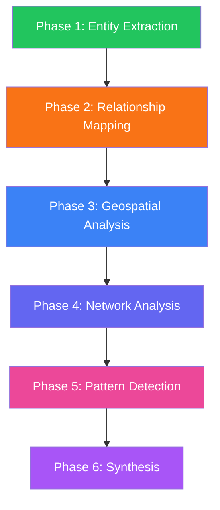

# Intelligence Analysis Phases

**Detailed documentation of each phase in the Intelligence Orchestrator workflow.**

## Overview

The Intelligence Orchestrator executes six sequential phases, each handled by a specialized agent:



Each phase builds on the previous, creating a comprehensive intelligence picture.

---

## Phase 1: Entity Extraction

**Agent:** Entity Extractor
**Color:** Green
**Icon:** Magnifying Glass

### Purpose

Extract and enrich entities from GLiNER metadata stored in document chunks. The agent doesn't re-run GLiNER—it reads pre-extracted entities and adds intelligence context.

### Process

1. **Read GLiNER metadata** from source documents
2. **Aggregate entities** by type (persons, organizations, locations, dates, events, laws)
3. **Sample source content** for contextual understanding
4. **Enrich with LLM** to add descriptions, assessments, and relevance scoring
5. **Find source references** linking entities to specific documents
6. **Identify co-occurrences** between entities

### Entity Types

| Type | Description | Examples |
|------|-------------|----------|
| **person** | Named individuals | Adolf Eichmann, Alois Hudal |
| **organization** | Groups, agencies, companies | Vatican, CIC, ODESSA |
| **location** | Geographic places | Rome, Buenos Aires, Genoa |
| **date** | Time references | May 1945, 1962 |
| **event** | Specific occurrences | World War II, Nuremberg Trials |
| **law** | Legal references | Decreto-Lei 7967/1945 |
| **cryptonym** | Code names | ODESSA, Operation Paperclip |

### Output Structure

```typescript
{
  name: "Alois Hudal",
  type: "person",
  description: "Austrian bishop and Vatican official serving as primary facilitator of Nazi escape routes",
  assessment: "Critical to rat lines operations - direct organizer of escape logistics",
  confidence: 0.95,
  reasoning: "Source explicitly identifies him as obtaining visas and working for CIC until 1962",
  source_refs: ["query_ELYSIA_CHUNKED_0_0", "query_ELYSIA_CHUNKED_0_1"],
  aliases: ["Goldener Priester", "Golden Priest"],
  co_occurrences: ["Vatican", "Klaus Barbie", "Rome"]
}
```

### Backend Implementation

```python
# backend/elysia/tools/intelligence/extractor_agent.py
class ExtractorAgent:
    async def extract(self, context: IntelligenceContext) -> IntelligenceMessage:
        # 1. Extract GLiNER entities from sources
        gliner_entities = self._extract_gliner_entities(context.initial_sources)

        # 2. Use LLM to enrich entities
        result = self.chain(
            query=context.initial_query,
            gliner_entities=gliner_entities,
            source_content_sample=sample_content,
        )

        # 3. Return structured findings
        return IntelligenceMessage(
            agent_role=IntelligenceRole.EXTRACTOR,
            content=f"Extracted {len(findings)} entities",
            findings=structured_findings,
            ...
        )
```

---

## Phase 2: Relationship Mapping

**Agent:** Relationship Mapper
**Color:** Orange
**Icon:** Map

### Goal

Establish connections between extracted entities based on document co-occurrences, institutional affiliations, and contextual relationships.

### Relationship Types

| Type | Description | Example |
|------|-------------|---------|
| **Person-to-Organization** | Membership, employment | Hudal → Vatican |
| **Person-to-Person** | Collaboration, hierarchy | Hudal ↔ Draganovic |
| **Organization-to-Organization** | Partnership, coordination | Vatican ↔ CIC |
| **Geographic Pattern** | Routing, corridors | Rome → Genoa |

### Relationship Output

```typescript
{
  name: "Hudal-CIC Employment",
  type: "Person-to-Organization",
  description: "Hudal worked directly for US Army Counter Intelligence Corps until 1962",
  assessment: "17-year employment demonstrates institutional policy rather than aberration",
  confidence: 0.95,
  reasoning: "Source explicitly states CIC employment until 1962",
  relationship_type: "employment",
  directionality: "unidirectional_cic_to_hudal",
  strength: 0.95,
  temporal_aspects: {
    relationship_initiation: "1945",
    operational_period: "1945-1962"
  }
}
```

### Relationship Attributes

| Attribute | Description |
|-----------|-------------|
| **directionality** | `bidirectional` or `unidirectional_X_to_Y` |
| **strength** | 0.0-1.0 relationship confidence |
| **temporal_aspects** | When relationship existed |
| **operational_scope** | What the relationship involved |

---

## Phase 3: Geospatial Analysis

**Agent:** Geospatial Analyst
**Color:** Blue
**Icon:** Globe

### Objective

Analyze geographic patterns and generate map-ready location data with routes and weights.

### Features

- Extract coordinates for locations
- Calculate location weights (importance)
- Generate route paths between locations
- Identify geographic corridors and patterns

### Location Output

```typescript
{
  name: "Vatican City - Rat Line Hub",
  type: "Operational Location",
  description: "Sovereign state serving as institutional core of European escape network",
  assessment: "Critical operational nexus with extraterritorial status",
  confidence: 0.95,
  latitude: 41.9029,
  longitude: 12.4534,
  route: [
    [12.4534, 41.9029],  // [longitude, latitude]
    [12.4767, 41.8999]
  ],
  weight: 10
}
```

### Map Integration

Geospatial findings are rendered on Mapbox GL maps:

- **Markers** positioned at coordinates
- **Routes** drawn between connected locations
- **Weights** affect marker size/prominence
- **3D terrain** provides geographic context

### Frontend Rendering

```tsx
// IntelligenceAgentMessage.tsx
const geospatialLocations = useMemo<MapPayload[]>(() => {
  return parsedFindings
    .filter(entry => entry.kind === "structured")
    .map(entry => transformToMapPayload(entry.data))
    .filter(Boolean);
}, [parsedFindings]);

// "View All Locations" button opens fullscreen map modal
<Button onClick={handleViewAllLocations}>
  View All Locations ({geospatialLocations.length})
</Button>
```

---

## Phase 4: Network Analysis

**Agent:** Network Analyst
**Color:** Indigo
**Icon:** Graph

### Function

Apply graph theory algorithms to understand network structure, identify key nodes, and detect clusters.

### Analysis Methods

| Method | Purpose |
|--------|---------|
| **Centrality measures** | Identify most connected/influential nodes |
| **Community detection** | Find clusters within the network |
| **Influence pathway tracing** | Map how influence flows |
| **Link prediction** | Suggest possible undocumented connections |

### Network Output

```typescript
{
  name: "Vatican-CIC Rat Lines Network",
  type: "Organizational Network",
  description: "Primary institutional structure facilitating Nazi war criminal escapes",
  assessment: "Core institutional mechanism enabling post-WWII fugitive protection",
  confidence: 0.95,
  reasoning: "Direct evidence: Hudal identified as CIC employee; Vatican officials provided operational competencies"
}
```

### Network Patterns Identified

| Pattern | Description |
|---------|-------------|
| **Hub nodes** | Entities with many connections (Hudal, Vatican) |
| **Bridges** | Entities connecting otherwise separate clusters |
| **Clusters** | Groups of tightly connected entities |
| **Periphery** | Loosely connected entities |

---

## Phase 5: Pattern Detection

**Agent:** Pattern Detector
**Color:** Pink
**Icon:** Sparkle

### Mission

Identify recurring patterns and anomalies across institutional, behavioral, geographic, and temporal dimensions.

### Pattern Categories

| Category | Description | Example |
|----------|-------------|---------|
| **Institutional** | Organizational behaviors | Vatican-CIC systematic partnership |
| **Behavioral** | Actor behaviors | Intelligence prioritization of high-value targets |
| **Geographic** | Spatial patterns | Rome-Genoa-Buenos Aires routing |
| **Operational** | Process patterns | Multi-layered documentation system |
| **Temporal** | Time-based patterns | 17-year operational persistence |

### Pattern Output

```typescript
{
  name: "Institutional Partnership Pattern",
  type: "Organizational Pattern",
  description: "Systematic partnership between Vatican and US Counter Intelligence Corps",
  assessment: "Organized institutional policy, not spontaneous assistance",
  confidence: 0.95,
  reasoning: "180+ Nazi perpetrators reaching Argentina confirms scale inconsistent with sporadic action"
}
```

### Pattern Confidence Indicators

| Indicator | Meaning |
|-----------|---------|
| **Frequency** | How often pattern appears |
| **Consistency** | How uniform across instances |
| **Documentation** | How well-evidenced in sources |
| **Temporal span** | How long pattern persisted |

---

## Phase 6: Synthesis

**Agent:** Synthesizer
**Color:** Purple
**Icon:** Brain

### Role

Integrate findings from all previous phases into a comprehensive intelligence assessment with strategic implications and recommended follow-up actions.

### Synthesis Components

1. **Entity integration** - Connect Phase 1 entities across all contexts
2. **Relationship confirmation** - Validate Phase 2 mappings
3. **Geographic intelligence** - Synthesize Phase 3 spatial patterns
4. **Network conclusions** - Draw from Phase 4 graph analysis
5. **Pattern implications** - Apply Phase 5 insights
6. **Strategic assessment** - Higher-level conclusions

### Assessment Output

```typescript
{
  name: "Rat Lines Network: Comprehensive Intelligence Assessment",
  type: "Comprehensive Assessment",
  description: "The rat lines represent a sophisticated institutional mechanism enabling escape of 180+ documented Nazi war criminals from Europe to South America between 1945-1962",
  assessment: "**Primary Findings:**\n\n1. **Institutional Core**: Vatican coordinated European operations...\n\n2. **Fugitive Profile**: High-value escapees included...\n\n3. **Operational Geography**: Rome-Genoa-Buenos Aires corridor...",
  confidence: 0.92,
  reasoning: "Synthesis integrates 32 entities, 16 relationship clusters, 14 geographic findings, network structure, and 7 operational patterns"
}
```

### Strategic Assessment

The synthesizer provides higher-level intelligence conclusions:

```typescript
{
  name: "Strategic Intelligence Implications",
  type: "Strategic Assessment",
  description: "Rat lines were not humanitarian rescue but coordinated Cold War-motivated protection",
  assessment: "Reveals systemic prioritization of Cold War objectives over international justice",
  confidence: 0.88
}
```

### Follow-up Recommendations

Each phase produces suggestions; the synthesizer prioritizes the most valuable:

```typescript
{
  text: "Request declassification of CIC operational files 1945-1962",
  query: "Submit FOIA request to US National Archives for CIC Vatican records",
  reasoning: "Would confirm network structure and reveal undocumented members",
  priority: "high",
  details: {
    target_archives: ["US National Archives RG 319", "CIA CREST database"],
    search_terms: ["Counter Intelligence Corps Vatican", "rat lines operations"]
  }
}
```

---

## Phase Execution Flow

### Orchestrator Logic

```python
# backend/elysia/tools/intelligence/intelligence_orchestrator.py

async def __call__(self, ...):
    # Initialize agents
    extractor = ExtractorAgent(base_lm=complex_lm)
    mapper = MapperAgent(base_lm=base_lm)
    geospatial = GeospatialAgent(base_lm=base_lm, client_manager=client_manager)
    network = NetworkAgent(base_lm=base_lm)
    pattern = PatternAgent(base_lm=base_lm)
    synthesizer = SynthesizerAgent(base_lm=base_lm)

    # Phase 1: Entity Extraction
    yield Status("Phase 1: Entity Extraction...")
    entity_msg = await extractor.extract(analysis_context)
    analysis_context.extracted_entities = entity_msg.findings
    yield entity_msg

    # Phase 2: Relationship Mapping
    yield Status("Phase 2: Relationship Mapping...")
    mapper_msg = await mapper.map(analysis_context)
    yield mapper_msg

    # Phase 3: Geospatial Analysis
    yield Status("Phase 3: Geospatial Analysis...")
    geospatial_msg = await geospatial.analyze(analysis_context)
    yield geospatial_msg

    # Phase 4: Network Analysis
    yield Status("Phase 4: Network Analysis...")
    network_msg = await network.analyze(analysis_context)
    yield network_msg

    # Phase 5: Pattern Detection
    yield Status("Phase 5: Pattern Detection...")
    pattern_msg = await pattern.analyze(analysis_context)
    yield pattern_msg

    # Phase 6: Synthesis
    yield Status("Phase 6: Synthesis...")
    synthesis_msg = await synthesizer.evaluate(analysis_context)
    yield synthesis_msg
```

### Error Handling

Each phase has individual error handling:

```python
try:
    entity_msg = await extractor.extract(analysis_context)
    yield entity_msg
except Exception as e:
    yield Error(
        error_message="Entity extraction phase failed",
        feedback=f"Failed to extract entities: {str(e)}. Analysis continues with empty entity data."
    )
    analysis_context.extracted_entities = []
```

### Context Passing

Each phase adds to the shared `IntelligenceContext`:

```python
@dataclass
class IntelligenceContext:
    initial_query: str
    initial_response: str
    initial_sources: List[Dict[str, Any]]
    analysis_history: List[IntelligenceMessage]
    current_phase: str
    extracted_entities: List[Dict[str, Any]]  # Set by Phase 1
    relationship_map: Dict[str, Any]           # Set by Phase 2
    visualizations: List[Dict[str, Any]]       # Set by Phases 3-4
```

---

## See Also

- [Intelligence Analysis Overview](index.md) - Main guide
- [Entity Extraction](../entity-extraction/) - GLiNER entity extraction
- [Courthouse Debate](../courthouse-debate/) - Alternative multi-agent approach
- [Rat Lines Demo](../../demos/rat-lines/) - Full example using this system
