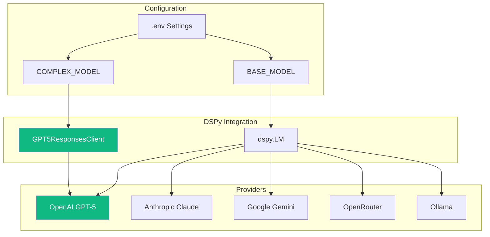
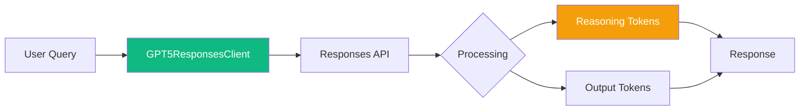
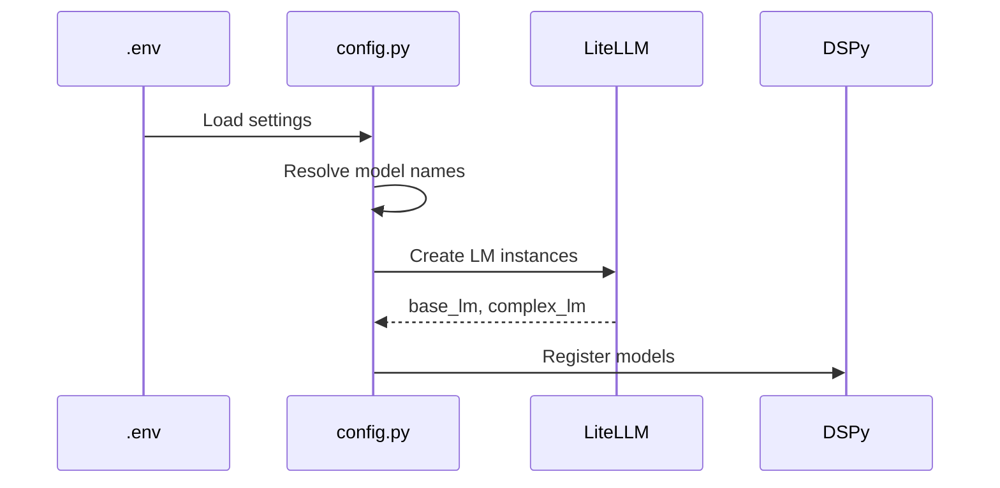

# LLM Configuration

**Multi-provider LLM support with GPT-5 Responses API integration, reasoning controls, and model selection.**

## What It Does

IntellyWeave supports multiple LLM providers through a unified configuration system:

- **GPT-5 Models** - Native Responses API with reasoning effort and verbosity controls
- **OpenAI** - GPT-4o, GPT-4o-mini, and other chat models
- **Anthropic** - Claude Sonnet 4, Claude Haiku
- **Google** - Gemini models
- **OpenRouter** - Multi-provider gateway to 100+ models
- **Local Models** - Ollama integration



## Use When

- Setting up IntellyWeave for the first time
- Switching between LLM providers
- Configuring GPT-5 reasoning parameters
- Optimizing for cost vs. quality tradeoffs

## Prerequisites

- At least one LLM provider API key
- `backend/.env` file created from `.env.example`

---

## Quick Setup

### Minimum Configuration

Add to `backend/.env`:

```bash
# OpenAI (most common)
OPENAI_API_KEY=sk-proj-your-key-here

# Default models
BASE_MODEL=gpt-4o-mini
COMPLEX_MODEL=gpt-4o
```

---

## Model Configuration

### Two-Tier Model System

IntellyWeave uses two model tiers:

| Model | Purpose | Default |
|-------|---------|---------|
| **BASE_MODEL** | Simple queries, routing, summarization | `gpt-4o-mini` |
| **COMPLEX_MODEL** | Complex reasoning, analysis, multi-agent | `gpt-4o` |

```bash
# Fast and cheap for simple tasks
BASE_MODEL=gpt-4o-mini

# Powerful for complex analysis
COMPLEX_MODEL=gpt-4o
```

### Model Selection Examples

**Cost-Optimized:**

```bash
BASE_MODEL=gpt-4o-mini
COMPLEX_MODEL=gpt-4o-mini
```

**Quality-Optimized:**

```bash
BASE_MODEL=gpt-4o
COMPLEX_MODEL=gpt-5
```

**Anthropic Setup:**

```bash
BASE_MODEL=claude-haiku-4-5
COMPLEX_MODEL=claude-sonnet-4-5
```

**OpenRouter Multi-Provider:**

```bash
BASE_MODEL=openrouter/anthropic/claude-haiku-4-5
COMPLEX_MODEL=openrouter/openai/gpt-4o
BASE_PROVIDER=openrouter
MODEL_API_BASE=https://api.openrouter.ai/api/v1
```

---

## GPT-5 Integration

### GPT-5 Responses API

IntellyWeave includes a custom client for GPT-5's Responses API with advanced features:



### Configuration

```bash
# GPT-5 Models
COMPLEX_MODEL=gpt-5
# or gpt-5-mini, gpt-5-nano

# Reasoning controls
GPT5_REASONING_EFFORT=medium   # minimal, low, medium, high
GPT5_TEXT_VERBOSITY=low        # low, medium, high
```

### Reasoning Effort Levels

| Level | Description | Use Case |
|-------|-------------|----------|
| **minimal** | Quick responses, limited reasoning | Simple questions |
| **low** | Basic reasoning | Standard queries |
| **medium** | Balanced (default) | Most analysis |
| **high** | Deep reasoning | Complex intelligence analysis |

### Verbosity Levels

| Level | Description |
|-------|-------------|
| **low** | Concise responses |
| **medium** | Balanced detail |
| **high** | Comprehensive explanations |

### GPT-5 Client Usage

The client integrates with DSPy:

```python
from elysia.util.gpt5_client import GPT5ResponsesClient

# Create GPT-5 client
gpt5 = GPT5ResponsesClient(
    model="gpt-5",
    reasoning_effort="medium",
    text_verbosity="low",
    max_tokens=4096,
    api_key=os.getenv("OPENAI_API_KEY")
)

# Use with DSPy
with dspy.settings.context(lm=gpt5):
    result = chain(query=user_query)
```

### GPT-5 Pricing

| Component | Price per 1M tokens |
|-----------|---------------------|
| Input tokens | $15.00 |
| Reasoning tokens | $15.00 |
| Output tokens | $120.00 |

The client automatically calculates and logs costs:

```text
GPT-5 response tokens: in=1500 reason=850 out=320 cost=$0.0624
```

---

## Provider Configuration

### OpenAI

```bash
OPENAI_API_KEY=sk-proj-your-key-here
BASE_MODEL=gpt-4o-mini
COMPLEX_MODEL=gpt-4o
```

### Anthropic

```bash
ANTHROPIC_API_KEY=sk-ant-your-key-here
BASE_MODEL=claude-haiku-4-5
COMPLEX_MODEL=claude-sonnet-4-5
```

### Google Gemini

```bash
GEMINI_API_KEY=your-gemini-key
BASE_MODEL=gemini-2.0-flash-001
COMPLEX_MODEL=gemini-2.0-flash-001
```

### OpenRouter (Recommended for Multi-Provider)

```bash
OPENROUTER_API_KEY=sk-or-your-key-here
BASE_MODEL=openrouter/anthropic/claude-haiku-4-5
COMPLEX_MODEL=openrouter/openai/gpt-4o
BASE_PROVIDER=openrouter
MODEL_API_BASE=https://api.openrouter.ai/api/v1
```

### Ollama (Local Models)

```bash
# No API key needed
BASE_MODEL=ollama/llama3
COMPLEX_MODEL=ollama/llama3:70b
MODEL_API_BASE=http://localhost:11434
```

---

## Architecture

### Backend Structure

```text
backend/elysia/
├── config.py                    # Settings and model loading
├── util/
│   └── gpt5_client.py          # GPT-5 Responses API client
└── tree/
    └── tree.py                 # Uses configured models
```

### Configuration Loading



### Key Components

| Component | File | Purpose |
|-----------|------|---------|
| **Settings** | `config.py` | Environment configuration |
| **load_base_lm()** | `config.py` | Load BASE_MODEL |
| **load_complex_lm()** | `config.py` | Load COMPLEX_MODEL |
| **GPT5ResponsesClient** | `util/gpt5_client.py` | GPT-5 Responses API |

---

## DSPy Integration

IntellyWeave uses DSPy for LLM orchestration:

```python
import dspy

# Default LM context
with dspy.settings.context(lm=base_lm):
    result = simple_chain(query=query)

# Complex LM for analysis
with dspy.settings.context(lm=complex_lm):
    result = analysis_chain(query=query)
```

### Chain of Thought

For complex reasoning:

```python
class AnalysisSignature(dspy.Signature):
    """Analyze the document and extract findings."""
    document: str = dspy.InputField()
    findings: List[Dict] = dspy.OutputField()

chain = dspy.ChainOfThought(AnalysisSignature)
```

---

## Troubleshooting

### "API Key Not Set"

**Cause:** Missing or invalid API key.

**Solution:**

```bash
# Check key is set
echo $OPENAI_API_KEY

# Verify in .env
grep OPENAI_API_KEY backend/.env
```

### "Model Not Found"

**Cause:** Invalid model name or provider not configured.

**Solution:**

```bash
# OpenAI models
BASE_MODEL=gpt-4o-mini  # Not gpt-4-turbo-mini

# OpenRouter requires prefix
BASE_MODEL=openrouter/openai/gpt-4o
```

### Rate Limiting

**Cause:** Too many requests to provider.

**Solution:**

- Use OpenRouter for higher limits
- Configure `CLIENT_TIMEOUT` in .env
- Implement request queuing

### GPT-5 Context Exceeded

**Cause:** Input too long for 400K context window.

**Solution:**

- Chunking is automatic for documents
- Reduce query complexity
- Use lower `max_tokens` for output

### Cost Unexpectedly High

**Cause:** Using expensive models for simple tasks.

**Solution:**

```bash
# Use cheap model for routing
BASE_MODEL=gpt-4o-mini

# Expensive model only for analysis
COMPLEX_MODEL=gpt-5
```

---

## Performance

| Model | Typical Response Time | Cost/1K tokens |
|-------|----------------------|----------------|
| gpt-4o-mini | 1-3 seconds | $0.00015 |
| gpt-4o | 3-8 seconds | $0.0025 |
| gpt-5 | 5-15 seconds | $0.015+ |
| claude-haiku | 1-3 seconds | $0.00025 |
| claude-sonnet | 3-8 seconds | $0.003 |

---

## See Also

- [Environment Variables Reference](../../reference/environment-variables.md) - Full .env reference
- [Decision Tree Architecture](../../architecture/decision-tree.md) - How models are used
- [Getting Started](../../getting-started/) - Initial setup
