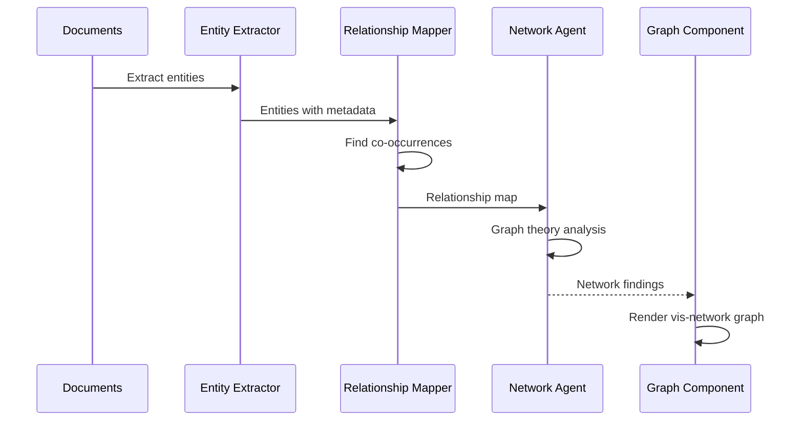
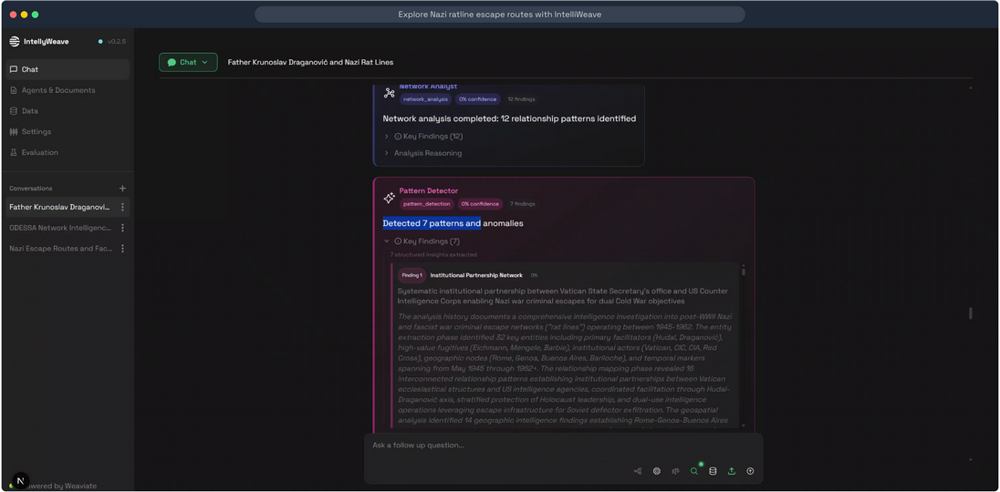
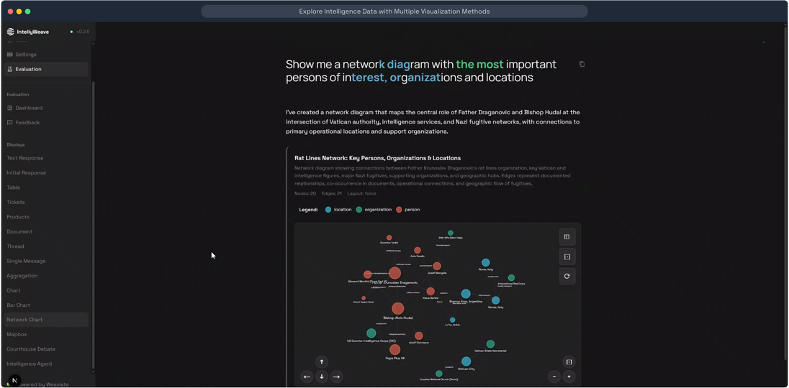
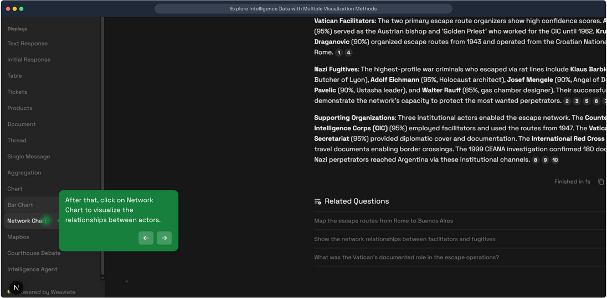
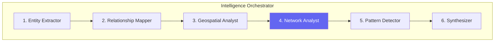

# Network Analysis

**Interactive relationship graphs that visualize connections between entities using vis-network with physics-based layouts.**

## What It Does

IntellyWeave's network analysis system transforms entity relationships into interactive graph visualizations. It combines:

- **Relationship mapping** - AI-powered identification of entity connections from document co-occurrences
- **Graph theory analysis** - Identification of central nodes, clusters, and patterns
- **Interactive visualization** - Physics-based graph layouts with drag-and-drop interaction


## Use When

- You need to visualize relationships between people, organizations, and places
- You're investigating hidden connections in document collections
- You want to identify central figures or organizations
- You need to understand network structures and clusters
- You're building intelligence link analysis

## Prerequisites

- IntellyWeave backend running
- Documents with entities extracted
- At least one LLM provider configured

## How It Works

### Network Analysis Pipeline



### Relationship Detection

The **Relationship Mapper** agent identifies connections through:

1. **Document co-occurrence** - Entities mentioned together in same chunks
2. **Contextual analysis** - LLM analysis of relationship nature
3. **Strength scoring** - Frequency and proximity of mentions

### Network Analysis

The **Network Agent** performs graph theory analysis:

- **Centrality metrics** - Identifies most connected nodes
- **Cluster detection** - Groups of related entities
- **Pattern recognition** - Recurring relationship structures

## Visual Presentation

### Network Pattern Analysis



*The Network Agent displays text-based network intelligence findings with pattern descriptions and confidence scores.*

### Network Graph Visualization



*Interactive vis-network graph showing entity relationships with physics-based layout.*

### Accessing Network View



*Access the network visualization from the sidebar to explore entity relationships.*

## Data Structures

### NetworkPayload (Frontend)

```typescript
type NetworkPayload = {
  title: string;           // Graph title
  description: string;     // Graph description
  nodes: NetworkNode[];    // Array of nodes
  edges: NetworkEdge[];    // Array of edges
  layout?: "hierarchical" | "random" | "circle" | "grid" | "force";
  layout_direction?: string;
  layout_sort?: string;
};

type NetworkNode = {
  id: string;              // Unique node identifier
  label: string;           // Display label
  type?: string;           // Entity type (person, org, location)
  color?: string;          // Node color
  size?: number;           // Node size
  group?: string;          // Grouping for clustering
  tooltip?: string;        // Hover text
  meta?: Record<string, unknown>;
};

type NetworkEdge = {
  id?: string;             // Edge identifier
  from_node: string;       // Source node ID
  to_node: string;         // Target node ID
  label?: string;          // Edge label
  strength?: number;       // Connection strength 0-1
  weight?: number;         // Visual weight
  directed?: boolean;      // Arrow direction
  tooltip?: string;        // Hover text
};
```

### Network Finding (Backend)

```python
{
    "name": "Vatican-CIC Intelligence Network",
    "type": "Organizational Network",
    "description": "Primary institutional structure facilitating escape operations",
    "assessment": "Central to rat line coordination with multiple connection points",
    "confidence": 0.92,
    "reasoning": "Document co-occurrences show repeated Vatican-CIC coordination"
}
```

## Architecture

### Backend Structure

```
backend/elysia/tools/intelligence/
├── network_agent.py           # NetworkAgent - graph theory analysis
├── mapper_agent.py            # MapperAgent - relationship detection
└── objects.py                 # IntelligenceMessage types
```

### Frontend Structure

```
frontend/app/components/chat/displays/
└── ChartTable/
    └── NetworkDisplay.tsx     # vis-network rendering
```

### Key Components

| Component | File | Purpose |
|-----------|------|---------|
| **NetworkAgent** | `tools/intelligence/network_agent.py` | Text-based network analysis |
| **MapperAgent** | `tools/intelligence/mapper_agent.py` | Relationship detection |
| **NetworkDisplay** | `ChartTable/NetworkDisplay.tsx` | vis-network rendering |

## Analysis Capabilities

### Network Agent Output

The NetworkAgent provides **text-based intelligence findings**, not raw graph data:

```python
class NetworkAnalysisSignature(dspy.Signature):
    """Analyze intelligence relationship networks..."""

    network_findings: List[Dict] = dspy.OutputField(
        desc="""List of network intelligence findings:
        - name: Network pattern name
        - type: Category (Network Structure, Person-to-Person, etc.)
        - description: What the network represents
        - assessment: Why it's significant
        - confidence: 0.0-1.0
        - reasoning: Evidence supporting this finding"""
    )
```

### Finding Types

| Type | Description |
|------|-------------|
| **Network Structure** | Overall network topology |
| **Person-to-Person** | Direct interpersonal connections |
| **Organizational Network** | Institutional relationships |
| **Adversary Network** | Opposing or competing networks |

## vis-network Features

### Physics-Based Layout

The graph uses **ForceAtlas2** physics simulation:

- Nodes repel each other naturally
- Edges act as springs
- Related nodes cluster together
- Interactive drag-and-drop repositioning

### Layout Options

| Layout | Description |
|--------|-------------|
| `force` | Physics-based (default) |
| `hierarchical` | Tree-like structure |
| `circle` | Nodes arranged in circle |
| `grid` | Regular grid pattern |
| `random` | Random positioning |

### Node Styling

Nodes can be styled by entity type:

```typescript
// Color by entity type
const nodeColors = {
  person: "#ef4444",      // Red
  organization: "#3b82f6", // Blue
  location: "#10b981",     // Green
};
```

### Fullscreen Mode

Click the fullscreen button to expand the network graph for detailed analysis.

## Integration with Intelligence Analysis

Network Analysis is **Phase 4** of the 6-phase Intelligence Orchestrator:



The Network Agent receives:
- `extracted_entities` from Phase 1
- `relationship_map` from Phase 2

And produces text-based network intelligence findings.

## Troubleshooting

### Graph Not Rendering

**Cause:** No network data in response or vis-network library issue.

**Solution:**
- Verify entities and relationships were extracted
- Check browser console for vis-network errors
- Ensure documents contain multiple related entities

### Too Many Nodes

**Cause:** Large document collections produce dense graphs.

**Solution:**
- Filter by entity type
- Focus on specific relationship types
- Use hierarchical layout for cleaner structure

### Disconnected Nodes

**Cause:** Entities without detected relationships.

**Solution:**
- Expected behavior for isolated entities
- Run on documents with more entity overlap
- Check relationship mapping logs

### Slow Rendering

**Cause:** Large graphs with many nodes/edges.

**Solution:**
- Physics simulation can be CPU-intensive
- Try hierarchical or grid layout
- Filter to subset of entities

## Performance

| Operation | Typical Time |
|-----------|-------------|
| Relationship mapping | 2-5 seconds |
| Network analysis | 3-8 seconds |
| Graph rendering (<100 nodes) | < 1 second |
| Graph rendering (>500 nodes) | 2-5 seconds |

## See Also

- [Entity Extraction](../entity-extraction/) - Source of entities
- [Intelligence Analysis](../intelligence-analysis/) - Full 6-phase analysis
- [Geospatial Mapping](../geospatial-mapping/) - Geographic visualization
- [Visualization](../visualization/) - Other chart types
