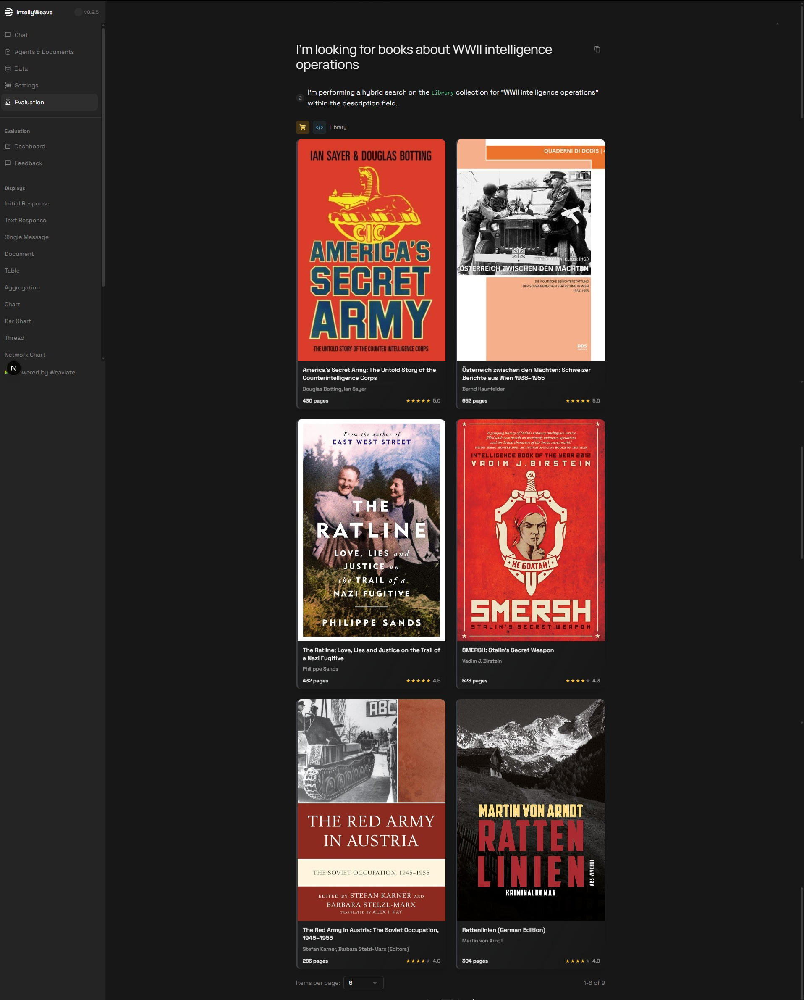

# Product Display Component

**Displays product recommendations with cover images, ratings, and purchase options. Optimized for book recommendations in intelligence research contexts.**

## What It Does

The ProductDisplay component renders product cards in a paginated horizontal grid. Each product shows:

- Cover image with lazy loading
- Title and author/brand
- Star rating (1-5 scale)
- Page count (books) or price (products)
- Expandable detail view with metadata and purchase links

## Use When

- Displaying book recommendations after intelligence analysis
- Showing research material suggestions
- Presenting product catalogs with ratings
- Any context requiring visual product cards with purchase CTAs

## Prerequisites

- IntellyWeave frontend running
- ProductPayload data from backend (typically via intelligence agent)
- Book cover images accessible via URL

---

## Product List View



*ProductDisplay showing intelligence history books in a 6-item grid with covers, titles, authors, page counts, and star ratings. Pagination shows "1-6 of 9" with navigation arrows.*

### Visual Elements

| Element | Location | Description |
|---------|----------|-------------|
| Cover image | Card top | 2:3 aspect ratio, lazy-loaded with skeleton |
| Title | Below image | 2-line max, truncated |
| Author/Brand | Below title | Single line, truncated |
| Page count | Bottom left | For books (or price for products) |
| Star rating | Bottom right | 5-star scale with numeric value |

---

## Pagination


*ProductDisplay showing page 2 (7-9 of 9) with remaining books including NKVD/KGB history title.*

### Pagination Features

- **Items per page**: 6 (configurable via `DisplayPagination`)
- **Layout**: Horizontal scroll with page indicators
- **Navigation**: Arrow buttons + page dots
- **Animation**: Framer Motion staggered card reveal

---

## Data Structure

### ProductPayload Type

```typescript
export type ProductPayload = DefaultResultPayload & {
  // Core fields
  name?: string;
  description?: string;
  image?: string;
  rating?: number;
  price?: number;

  // Book-specific fields
  author?: string;
  publisher?: string;
  year?: number;
  pages?: number;
  isbn_10?: string;
  isbn_13?: string;
  series?: string;
  buy_link?: string;
  language?: string;

  // General product fields
  brand?: string;
  category?: string;
  subcategory?: string;
  collection?: string;
  colors?: string[];
  sizes?: string[];
  tags?: string[];
  url?: string;
};
```

### Book Detection

The component auto-detects books by checking for the `author` field:

```typescript
const isBook = Boolean(product.author);
```

When `isBook` is true:
- Shows author instead of brand
- Shows page count instead of price
- Enables book-specific metadata (publisher, ISBN, series)
- Shows "Buy Now" CTA linking to `buy_link`

---

## Component Architecture

```
frontend/app/components/chat/displays/Product/
├── ProductDisplay.tsx   # Container with pagination
├── ProductCard.tsx      # Grid card (list view)
└── ProductView.tsx      # Expanded detail view
```

### Component Flow


---

## Tag Color System

ProductView applies semantic colors to tags:

| Tag Category | Color | Example Tags |
|--------------|-------|--------------|
| Historical periods | Amber | WWII, Cold War, Post-war |
| Intelligence topics | Blue | Intelligence, Espionage, Secret |
| Research types | Green | OSINT, Research, Analysis |
| Military | Red | Military, Operation, Combat |
| Geopolitical | Purple | Soviet, Russia, Diplomatic |
| Default | Slate | Any other tag |

---

## Styling Features

### Card Design System

- **Border**: Left accent bar (`border-l-4`)
- **Background**: Gradient with transparency (`from-gray-500/10`)
- **Effects**: Backdrop blur, shadow on hover
- **Animation**: Scale up on hover, staggered reveal

### Book Cover Handling

- **Aspect ratio**: 2:3 (standard book cover)
- **Fallback**: Camera icon placeholder on load error
- **Loading**: Skeleton animation while fetching
- **Hover**: Subtle scale-up effect

---

## Troubleshooting

| Issue | Cause | Solution |
|-------|-------|----------|
| No products displayed | Empty array | Verify backend returns products |
| Missing cover images | Invalid image URL | Check `product.image` URL accessibility |
| Wrong metadata shown | Book vs product detection | Ensure `author` field set for books |
| Buy link not working | Missing `buy_link` | Add `buy_link` URL to ProductPayload |
| Tags not colored | Unknown tag | Add tag pattern to `getTagColor()` |

---

## See Also

- [Intelligence Analysis Guide](../intelligence-analysis/index.md)
- [Ticket Display Guide](../ticket-display/index.md)
- [ProductPayload Type Definition](../../../frontend/app/types/displays.ts)

---

*Screenshots from IntellyWeave v0.2.5 demo: "Investigate Intelligence Cases Through Chat and Analysis Tools"*
*Source: [Supademo](https://app.supademo.com/demo/cmj38xuzf1j6dv3e5tcp0oi4l)*
