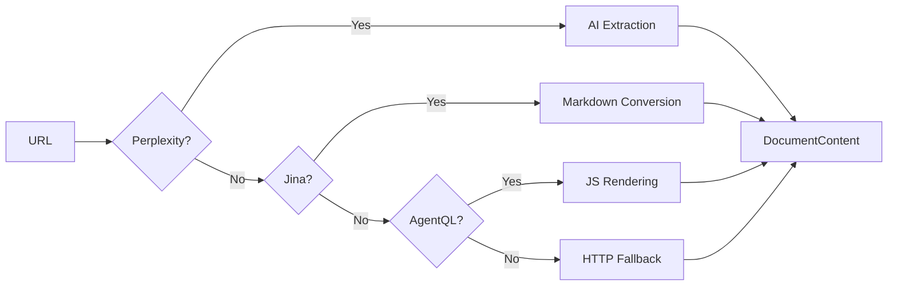

# Document Reader Service

**Multi-reader cascade that extracts content from URLs using Perplexity, Jina, AgentQL, and HTTP with intelligent fallback and context-aware extraction.**

## What It Does

The Document Reader Service provides a unified interface for reading web content:



Key capabilities:

- **Multi-reader cascade** - Tries readers in order until content extracted
- **Perplexity URL reading** - No size limits, intelligent summarization
- **Context-aware extraction** - Research domain guides what to extract
- **PDF intelligence** - Aryn SDK for context-aware schema extraction
- **Preflight access check** - Skips readers for inaccessible URLs

## Use When

- Reading web pages in the Case Officer workflow
- Extracting content from URLs discovered by Quartermaster
- Processing PDFs with investigation context
- Need reliable fallback when primary readers fail

## Prerequisites

At least one reader API key configured:

| Reader | Variable | Best For |
|--------|----------|----------|
| Perplexity | `PERPLEXITY_API_KEY` | Large documents, intelligent extraction |
| Jina | `JINA_API_KEY` | Articles, web pages |
| AgentQL | `AGENTQL_API_KEY` | JavaScript-heavy sites |
| HTTP | (none) | Simple pages (always available) |

For PDF intelligence:

| Service | Variable | Description |
|---------|----------|-------------|
| Aryn | `ARYN_API_KEY` | Context-aware PDF extraction |

## Architecture

```
backend/elysia/api/services/
└── document_reader_service.py   # Multi-reader cascade + Aryn PDF

Uses:
├── perplexity SDK               # AsyncPerplexity client
├── Jina Reader API              # r.jina.ai endpoint
├── AgentQL API                  # AI web extraction
├── httpx                        # HTTP fallback
└── aryn_sdk                     # PDF partitioning
```

## Reader Cascade

### Priority Order

1. **Perplexity** (if `PERPLEXITY_API_KEY` set) - Best for research
2. **Jina** (if `JINA_API_KEY` set) - Fast markdown conversion
3. **AgentQL** (if `AGENTQL_API_KEY` set) - JavaScript rendering
4. **HTTP** (always available) - Simple fallback

### Cascade Behavior

```python
async def read_url(
    self,
    url: str,
    extraction_prompt: Optional[str] = None,
    preferred_reader: Optional[str] = None,
    timeout: Optional[int] = None,
    research_domain: Optional[str] = None,  # For context-aware extraction
) -> DocumentContent:
```

- **Tries each reader** until content is successfully extracted
- **Logs cascade progress** for debugging
- **Returns first success** with reader metadata

## Perplexity URL Reader

### Why Perplexity First?

| Advantage | Description |
|-----------|-------------|
| No size limits | Can read any document size |
| Intelligent extraction | Summarizes while preserving key content |
| Research context | Uses domain-specific extraction prompts |
| Built-in summarization | Avoids context saturation |

### How It Works

```python
async def _read_with_perplexity(
    self, url: str, timeout: int, research_domain: Optional[str] = None
) -> Dict[str, Any]:
    # Get domain-specific extraction prompt
    domain_focus = DOMAIN_FOCUS.get(research_domain, DOMAIN_FOCUS["GENERAL"])

    response = await client.chat.completions.create(
        model="sonar-pro",
        messages=[
            {"role": "system", "content": extraction_prompt},
            {"role": "user", "content": f"Analyze: {url}"}
        ],
        web_search_options={"search_context_size": "high"},
        max_tokens=4096,
        temperature=0.1,
    )
```

### Domain-Specific Extraction

The extraction prompt changes based on `research_domain`:

| Domain | Focus Entities |
|--------|----------------|
| `INTELLIGENCE` | Operations, agencies, codenames, personnel |
| `HISTORICAL_RESEARCH` | Events, dates, locations, individuals |
| `HUMAN_RIGHTS` | Victims, perpetrators, incidents, legal |
| `GENEALOGY` | Names, birth/death dates, relationships |
| `LEGAL` | Parties, case numbers, courts, citations |
| `JOURNALISM` | Sources, events, quotes, dates |
| `ACADEMIC` | Authors, institutions, citations, findings |
| `GENERAL` | Key entities, facts, and evidence |

### Output Limiting

Perplexity extraction is limited to **3000 words** to preserve context budget:

```
Maximum 3000 words to preserve context budget.
```

### Preflight Access Check

Before trying Perplexity, we check URL accessibility:

```python
preflight = await self.check_content_size(url, timeout=10)

if not preflight.is_accessible:
    # Skip Perplexity for 403, 401, etc.
    readers = [r for r in readers if r[0] != "Perplexity"]
```

This avoids wasting Perplexity tokens on inaccessible URLs.

## Jina Reader

### Capabilities

- Converts web pages to clean markdown
- Handles most standard HTML
- Fast and reliable
- Good for articles and blog posts

### Usage

```python
async def _read_with_jina(self, url: str, timeout: int) -> Dict[str, Any]:
    async with httpx.AsyncClient() as client:
        response = await client.get(
            f"https://r.jina.ai/{url}",
            headers={"Authorization": f"Bearer {api_key}"},
        )
```

## AgentQL Reader

### Capabilities

- Renders JavaScript before extraction
- Uses AI to identify main content
- Handles SPAs and dynamic sites
- Best for complex web apps

### Usage

```python
async def _read_with_agentql(
    self, url: str, extraction_prompt: Optional[str], timeout: int
) -> Dict[str, Any]:
    # AgentQL renders and extracts via AI
```

## HTTP Fallback

### Capabilities

- Always available (no API key needed)
- Direct HTTP fetch with basic parsing
- Good for simple HTML pages
- Limited compared to AI readers

### Limitations

- No JavaScript rendering
- Basic HTML parsing only
- May miss dynamic content

## PDF Intelligence with Aryn

### Setup

```bash
ARYN_API_KEY=your-aryn-api-key
```

### How It Works

```python
def read_pdf_preview(
    self,
    pdf_url_or_path: str,
    investigation_query: Optional[str] = None,
    research_domain: Optional[str] = None,
    research_language: Optional[str] = None,  # For OCR
    pages: Optional[List[int]] = None,  # Default: [1, 2]
) -> Dict[str, Any]:
```

### Features

| Feature | Description |
|---------|-------------|
| Context-aware extraction | Uses investigation query to guide extraction |
| AI-inferred schema | Returns structured metadata tailored to research |
| OCR language support | Passes language hint for non-English PDFs |
| Page selection | Preview first N pages |

### Language Support for OCR

```python
ISO_TO_LANGUAGE_NAME = {
    "en": "english", "de": "german", "fr": "french",
    "es": "spanish", "it": "italian", "pt": "portuguese",
    "ru": "russian", "ja": "japanese", "zh": "chinese",
    # ... more languages
}
```

### Response Schema

Aryn returns AI-inferred properties:

```json
{
  "title": "Document Title",
  "snippet": "Key content summary...",
  "elements": [...],
  "page_count": 5,
  "suggested_schema": {
    "properties": [
      {"name": "document_type", "examples": ["Memorandum"]},
      {"name": "key_entities", "properties": [
        {"name": "agencies", "examples": ["CIA", "CIC"]}
      ]}
    ]
  }
}
```

## Configuration

### Environment Variables

| Variable | Required | Description |
|----------|----------|-------------|
| `PERPLEXITY_API_KEY` | Recommended | Perplexity AI for URL reading |
| `JINA_API_KEY` | Optional | Jina Reader for markdown |
| `AGENTQL_API_KEY` | Optional | AgentQL for JS sites |
| `ARYN_API_KEY` | Optional | Aryn for PDF intelligence |

### Timeouts

Default timeout is 30 seconds, configurable per-call:

```python
content = await reader.read_url(url, timeout=60)
```

## Output Structure

```python
@dataclass
class DocumentContent:
    success: bool
    title: str
    content: str
    metadata: Dict[str, Any]  # Includes reader, is_summarized, etc.

    @property
    def estimated_tokens(self) -> int:
        return len(self.content) // 4
```

## Troubleshooting

### All Readers Failing

**Cause**: URL is inaccessible or blocking automated access.

**Solution**:
1. Check if URL is accessible in browser
2. Review preflight logs: `[DOC_READER] Skipping Perplexity...`
3. Try a different URL from the same source

### Perplexity Returning Generic Content

**Cause**: URL blocked or redirecting.

**Solution**:
1. Check preflight access check logs
2. Verify URL doesn't require authentication
3. Use Jina as preferred reader for that source

### PDF Preview Not Working

**Cause**: `ARYN_API_KEY` not configured or PDF inaccessible.

**Solution**:
1. Verify `ARYN_API_KEY` in `.env`
2. Check if PDF URL is publicly accessible
3. Look for `[ARYN]` entries in logs

### Wrong OCR Language

**Cause**: `research_language` not passed or unmapped.

**Solution**:
1. Verify Quartermaster detected correct language
2. Check `ISO_TO_LANGUAGE_NAME` mapping
3. Add missing language mapping if needed

## See Also

- [Case Officer Agent](../../archive-research/agents/case-officer.md) - Uses this service
- [Sofia Service](../sofia-search/index.md) - Search provider cascade
- [Archive Research Guide](../../archive-research/index.md) - Full workflow
- [Environment Variables](../../../reference/environment-variables.md) - API key reference
