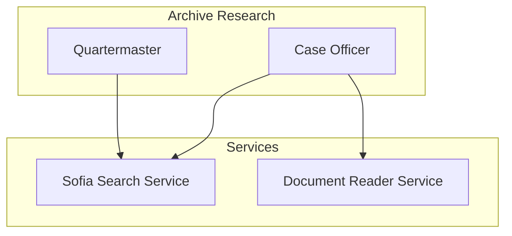

# Backend Services

**Core services that power IntellyWeave's search, document reading, and content extraction capabilities.**

## Overview

IntellyWeave uses a service-oriented architecture for search and content extraction:



## Available Services

| Service | Purpose | Documentation |
|---------|---------|---------------|
| [Sofia Search](sofia-search/index.md) | Multi-provider search cascade | Search via Perplexity, SearXNG, Serper, Tavily |
| [Document Reader](document-reader/index.md) | URL content extraction | Read via Perplexity, Jina, AgentQL, HTTP |

## Service Architecture

### Sofia Search Service

Provides unified search across multiple providers:

- **Provider cascade** - Tries providers in order until results found
- **Perplexity SDK** - Native integration with API-level domain filtering
- **Dual search** - Curated + open discovery in parallel

**Used by**: Quartermaster (discovery), Case Officer (expansion)

### Document Reader Service

Extracts content from URLs with intelligent fallback:

- **Multi-reader cascade** - Perplexity, Jina, AgentQL, HTTP
- **Context-aware extraction** - Research domain guides extraction
- **PDF intelligence** - Aryn SDK for structured extraction

**Used by**: Case Officer (source reading)

## Configuration

Both services require API keys for their providers:

### Search Providers

```bash
# At least one required for search
PERPLEXITY_API_KEY=pplx-...   # Recommended
SERPER_API_KEY=...             # Alternative
TAVILY_API_KEY=tvly-...        # Alternative
SEARXNG_API_URL=http://...     # Self-hosted alternative
```

### Document Readers

```bash
# At least one recommended for reading
PERPLEXITY_API_KEY=pplx-...   # Best: no size limits
JINA_API_KEY=jina_...          # Fast markdown
AGENTQL_API_KEY=...            # JS-heavy sites

# Optional: PDF intelligence
ARYN_API_KEY=...               # Context-aware PDF
```

## Cascade Philosophy

Both services use a **cascade pattern**:

1. **Check availability** - Which providers have API keys?
2. **Try in priority** - Most capable first
3. **Return first success** - Stop on first good result
4. **Log for debugging** - Track which provider succeeded

This ensures:
- **Graceful degradation** - Always some provider available
- **Optimal results** - Best provider used when available
- **Resilience** - Failures don't block the workflow

## See Also

- [Quartermaster Agent](../archive-research/agents/quartermaster.md) - Uses both services
- [Case Officer Agent](../archive-research/agents/case-officer.md) - Uses both services
- [Archive Research Guide](../archive-research/index.md) - Full workflow
- [Environment Variables](../../reference/environment-variables.md) - All API keys
