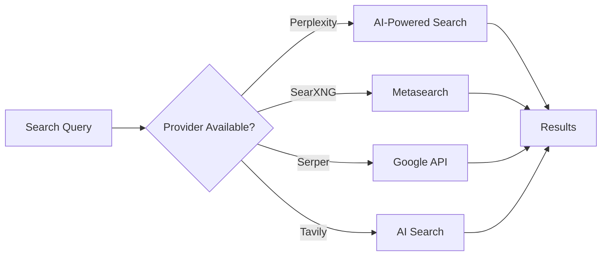

# Sofia Search Service

**Multi-provider search cascade with Perplexity SDK integration, API-level domain filtering, and intelligent result aggregation for archive research.**

## What It Does

Sofia (Search Orchestration for Intelligence Analysis) provides unified search across multiple providers:



Key capabilities:

- **Provider cascade** - Tries providers in order until results found
- **Perplexity SDK** - Native integration with proper parameters
- **API-level domain filtering** - `search_domain_filter` for curated archives
- **Dynamic model selection** - `sonar`, `sonar-pro`, `sonar-deep-research`
- **Search modes** - `web` or `academic` for scholarly sources

## Use When

- Quartermaster needs to discover archive sources
- Case Officer needs to expand investigation
- Any tool needs multi-provider search with fallback

## Prerequisites

At least one search provider configured:

| Provider | Variable | Best For |
|----------|----------|----------|
| Perplexity | `PERPLEXITY_API_KEY` | AI research with reasoning |
| SearXNG | `SEARXNG_API_URL` | Self-hosted privacy search |
| Serper | `SERPER_API_KEY` | Google Search API |
| Tavily | `TAVILY_API_KEY` | AI-optimized search |

## Architecture

```
backend/elysia/api/services/
└── sofia_service.py             # Multi-provider cascade

Uses:
├── perplexity SDK (AsyncPerplexity)  # Official Perplexity client
├── SearXNG API                        # Self-hosted metasearch
├── Serper API                         # Google Search wrapper
└── Tavily API                         # AI search service
```

## Provider Cascade

### How It Works

```python
async def advanced_search(
    self,
    query: str,
    include_domains: Optional[List[str]] = None,
    exclude_domains: Optional[List[str]] = None,
    max_results: int = 50,
    system_prompt: Optional[str] = None,
    preferred_provider: Optional[str] = None,
    # Perplexity-specific:
    model: str = "sonar",
    temperature: float = 0.2,
    search_context_size: Literal["low", "medium", "high"] = "high",
    use_domain_filter: bool = False,
    search_mode: Optional[Literal["web", "academic"]] = None,
) -> SofiaSearchResponse:
```

### Cascade Behavior

1. **Build provider list** - Only providers with configured API keys
2. **Try each provider** - In priority order
3. **Return first success** - Provider with results wins
4. **Filter results** - Apply domain include/exclude filters

### Priority Order

1. Perplexity (if `PERPLEXITY_API_KEY`)
2. SearXNG (if `SEARXNG_API_URL`)
3. Serper (if `SERPER_API_KEY`)
4. Tavily (if `TAVILY_API_KEY`)

## Perplexity Integration

### SDK Usage

Sofia uses the official Perplexity SDK:

```python
from perplexity import AsyncPerplexity

client = AsyncPerplexity(api_key=api_key, timeout=timeout)

response = await client.chat.completions.create(
    model=model,
    messages=[
        {"role": "system", "content": system_prompt},
        {"role": "user", "content": query},
    ],
    max_tokens=1024,
    temperature=temperature,
    web_search_options={"search_context_size": search_context_size},
    search_domain_filter=domain_filter,  # API-level filtering
    search_mode=search_mode,  # "web" or "academic"
)
```

### Available Parameters

| Parameter | Type | Description |
|-----------|------|-------------|
| `model` | str | `sonar`, `sonar-pro`, `sonar-deep-research` |
| `temperature` | float | Response randomness (0.0-1.0) |
| `search_context_size` | str | `low`, `medium`, `high` |
| `search_domain_filter` | List[str] | Max 20 domains to include |
| `search_mode` | str | `web` or `academic` |

### Model Selection

| Model | Use Case | Speed | Depth |
|-------|----------|-------|-------|
| `sonar` | Initial discovery, fast searches | Fast | Basic |
| `sonar-pro` | Research, complex queries | Medium | Deep |
| `sonar-deep-research` | Comprehensive investigation | Slow | Very Deep |

### API-Level Domain Filtering

**Critical insight**: System prompts do NOT affect Perplexity's web search. Domain priorities must use API parameters.

```python
# WRONG: Domain hints in system prompt (doesn't work)
system_prompt = "Focus on cia.gov, archives.gov..."  # Ignored by search

# CORRECT: API-level filtering
search_domain_filter = ["cia.gov", "archives.gov", "nara.gov"]  # Works!
```

**Limit**: Maximum 20 domains per API call.

### Search Modes

| Mode | Description | Best For |
|------|-------------|----------|
| `web` | Standard web search | General research |
| `academic` | Scholarly sources priority | Academic research |

## Dual Search Pattern

The Quartermaster uses dual parallel search:

```python
async def _execute_dual_search(self, query, curated_domains):
    # Search 1: Curated archives (API-level filter)
    curated_task = sofia_service.advanced_search(
        query=query,
        include_domains=curated_domains[:20],
        use_domain_filter=True,  # Enables search_domain_filter
    )

    # Search 2: Open discovery (no filter)
    open_task = sofia_service.advanced_search(
        query=query,
        use_domain_filter=False,  # Open search
    )

    # Execute in parallel
    curated, open = await asyncio.gather(curated_task, open_task)
```

### Why Dual Search?

| Search | Purpose | Trade-off |
|--------|---------|-----------|
| Curated | Guarantee authoritative archives | May miss new sources |
| Open | Discover unexpected sources | May include low-quality |

Both are merged with deduplication, giving best of both.

## Result Structure

```python
@dataclass
class SofiaSearchResult:
    title: str
    url: str
    content: str  # Snippet or summary
    score: float  # 0.0-1.0
    category: str

@dataclass
class SofiaSearchResponse:
    results: List[SofiaSearchResult]
    query: str
    number_of_results: int
    filtered_search: bool
    provider: Optional[str]
```

## Domain Filtering

### Include Domains

Limit results to specific domains:

```python
response = await sofia_service.advanced_search(
    query="intelligence operations Austria 1945",
    include_domains=["cia.gov", "archives.gov", "oesta.gv.at"],
    use_domain_filter=True,  # Use API-level filtering
)
```

### Exclude Domains

Remove domains from results (post-filter, not API-level):

```python
response = await sofia_service.advanced_search(
    query="intelligence operations Austria 1945",
    exclude_domains=["wikipedia.org", "reddit.com"],
)
```

## Configuration

### Environment Variables

| Variable | Required | Description |
|----------|----------|-------------|
| `PERPLEXITY_API_KEY` | Recommended | Perplexity AI search |
| `SEARXNG_API_URL` | Optional | Self-hosted SearXNG |
| `SERPER_API_KEY` | Optional | Serper Google API |
| `TAVILY_API_KEY` | Optional | Tavily AI search |

### Check Available Providers

```python
providers = sofia_service._get_available_providers()
# Returns: [("Perplexity", func), ("Serper", func), ...]
```

## Usage Examples

### Basic Search

```python
from elysia.api.services.sofia_service import get_sofia_service

sofia = get_sofia_service()

response = await sofia.advanced_search(
    query="Klaus Barbie post-war activities",
    max_results=20,
)

for result in response.results:
    print(f"{result.title}: {result.url}")
```

### Research Search with Domain Filter

```python
response = await sofia.advanced_search(
    query="CIC operations Austria 1945-1946",
    include_domains=["cia.gov", "archives.gov"],
    use_domain_filter=True,
    model="sonar-pro",
    search_context_size="high",
)
```

### Academic Search

```python
response = await sofia.advanced_search(
    query="rat lines Vatican escape routes historiography",
    search_mode="academic",
    model="sonar-pro",
)
```

## Troubleshooting

### No Results Returned

**Cause**: No providers configured or all failed.

**Solution**:
1. Verify at least one API key is set
2. Check logs for provider errors
3. Test API key validity

### Domain Filter Not Working

**Cause**: Using system prompt instead of API parameter.

**Solution**:
1. Use `use_domain_filter=True` with `include_domains`
2. Verify domains are in correct format (no `https://`)
3. Maximum 20 domains per call

### Wrong Provider Used

**Cause**: Preferred provider not available.

**Solution**:
1. Set `preferred_provider` parameter
2. Verify that provider's API key is configured
3. Check cascade priority order

### Results Not Relevant

**Cause**: Query too broad or model too basic.

**Solution**:
1. Use `sonar-pro` for research queries
2. Add domain context with `include_domains`
3. Use `search_context_size="high"`

## See Also

- [Quartermaster Agent](../../archive-research/agents/quartermaster.md) - Uses Sofia for discovery
- [Case Officer Agent](../../archive-research/agents/case-officer.md) - Uses Sofia for expansion
- [Document Reader Service](../document-reader/index.md) - Reads found URLs
- [Environment Variables](../../../reference/environment-variables.md) - API key reference
