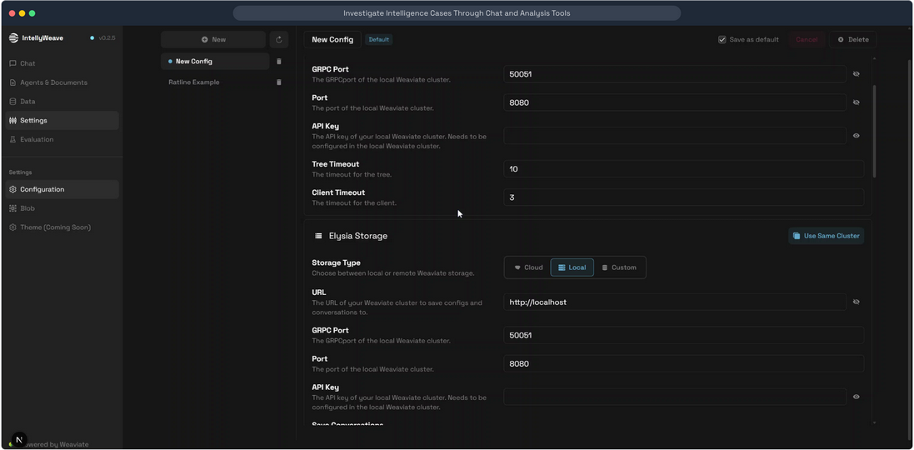

# Settings & Configuration

**Manage Weaviate connections, Elysia storage, agent behavior, LLM models, and API keys through a unified configuration interface.**

## What It Does

The Settings page provides centralized configuration management for:

- **Weaviate Connection** - Database connection settings (ports, API keys, timeouts)
- **Elysia Storage** - Conversation and config storage (Cloud, Local, or Custom)
- **Agent Behavior** - Decision tree and routing parameters
- **LLM Models** - Provider and model selection for different tasks
- **API Keys** - Secure management of provider credentials

## Use When

- Setting up IntellyWeave for the first time
- Switching between Weaviate instances (local/cloud/custom)
- Configuring LLM providers and models
- Managing multiple configuration profiles
- Importing settings from `.env` files

## Prerequisites

- IntellyWeave frontend running
- Weaviate instance available (local, WCD, or custom)
- API keys for desired LLM providers

---

## Configuration Interface



*Settings page showing Weaviate connection and Elysia Storage configuration. The sidebar lists saved config profiles ("New Config", "Ratline Example"). Main form shows connection ports, API key fields, timeouts, and storage type toggle (Cloud/Local/Custom).*

---

## Configuration Sections

### Weaviate Connection

| Setting | Description | Default |
|---------|-------------|---------|
| **GRPC Port** | gRPC port for Weaviate cluster | `50051` |
| **Port** | HTTP port for Weaviate cluster | `8080` |
| **API Key** | Authentication key for Weaviate Cloud | (empty for local) |
| **Tree Timeout** | Decision tree evaluation timeout (seconds) | `10` |
| **Client Timeout** | Weaviate client timeout (seconds) | `3` |

### Elysia Storage

Storage for conversations and configurations:

| Mode | Description | URL Format |
|------|-------------|------------|
| **Cloud** | Weaviate Cloud Services | `https://your-cluster.weaviate.cloud` |
| **Local** | Local Weaviate instance | `http://localhost` |
| **Custom** | Self-hosted Weaviate | Custom URL |

**"Use Same Cluster"** button copies Weaviate connection values to storage settings.

### Models Section

Configure LLM models for different tasks:

| Model Role | Purpose |
|------------|---------|
| **Base Model** | General queries, routing |
| **Complex Model** | Multi-agent debates, synthesis |
| **Fast Model** | Quick responses, simple tasks |

### API Keys Section

Secure storage for provider credentials:

- OpenAI
- Anthropic
- Google (Gemini)
- OpenRouter
- Cohere
- Mistral
- And more...

---

## Configuration Profiles

### Creating a New Profile

1. Click **"New"** in the sidebar
2. Enter a descriptive name
3. Configure settings
4. Check **"Save as default"** if desired
5. Click **Save**

### Switching Profiles

1. Select profile from sidebar list
2. Settings load automatically
3. Make changes and save

### Importing from .env

1. Click **Import** button
2. Select `.env` file
3. Review imported values
4. Save configuration

---

## Component Architecture

```
frontend/app/components/configuration/
├── ConfigSidebar.tsx           # Profile list/selection
├── ConfigNameEditor.tsx        # Profile name editing
├── ConfigActions.tsx           # Save/Cancel/Delete buttons
├── EnvImportModal.tsx          # .env file import
└── sections/
    ├── WeaviateSection.tsx     # Weaviate connection
    ├── StorageSection.tsx      # Elysia storage
    ├── AgentSection.tsx        # Agent behavior
    ├── ModelsSection.tsx       # LLM model selection
    └── ApiKeysSection.tsx      # API key management
```

---

## Troubleshooting

| Issue | Cause | Solution |
|-------|-------|----------|
| Connection timeout | Wrong port or unreachable host | Verify Weaviate is running and ports are correct |
| API key invalid | Incorrect or expired key | Re-enter key, check provider dashboard |
| Config won't save | Validation error | Check required fields are filled |
| Can't switch storage | Active conversations | Close active chats before switching |

---

## See Also

- [LLM Configuration Guide](../llm-configuration/index.md)
- [Document Processing Guide](../document-processing/index.md)
- [Backend Architecture](../../architecture/backend.md)

---

*Screenshots from IntellyWeave v0.2.5 demo: "Investigate Intelligence Cases Through Chat and Analysis Tools"*
*Source: [Supademo](https://app.supademo.com/demo/cmj38xuzf1j6dv3e5tcp0oi4l)*
