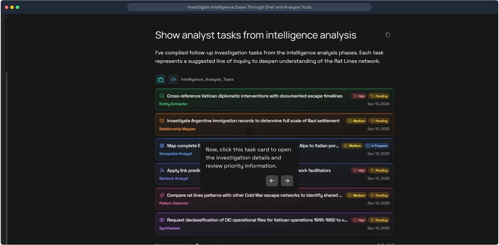
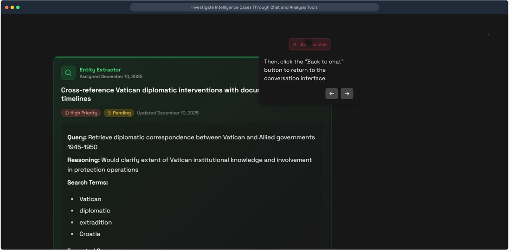
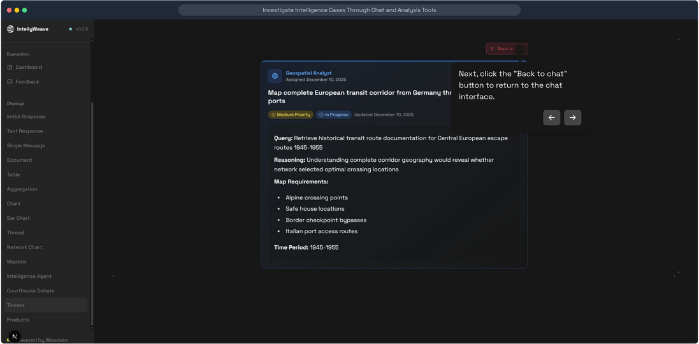
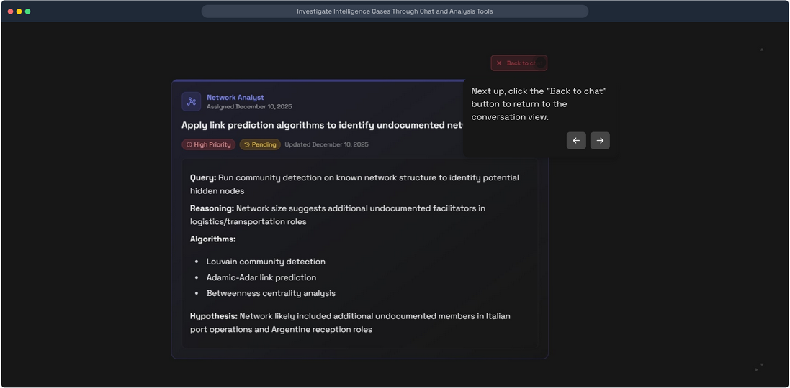
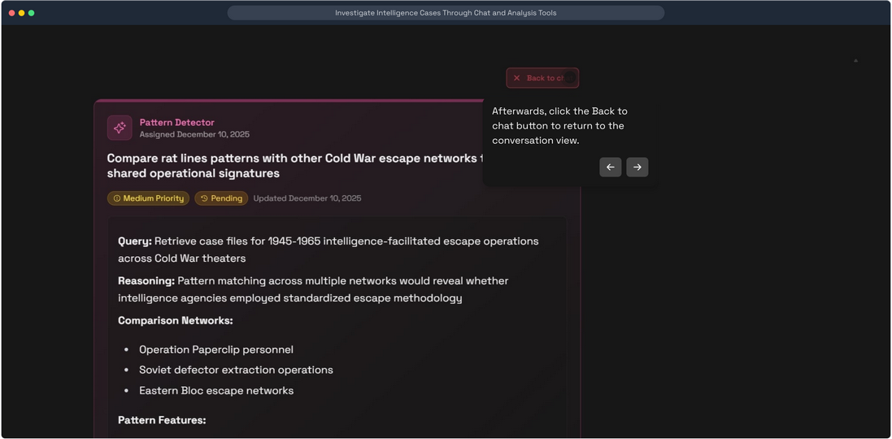
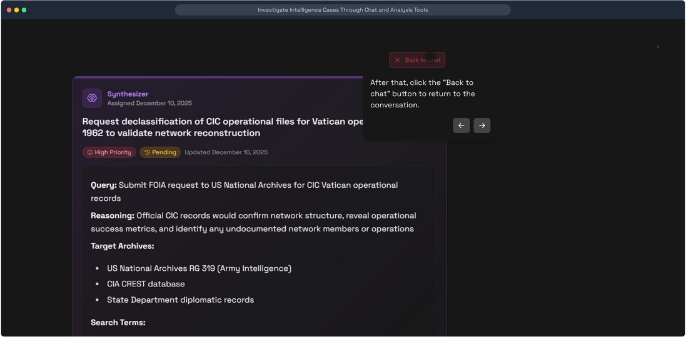
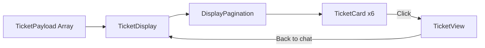

# Ticket Display Component

**Displays investigation tasks generated by intelligence analysis, organized by agent role and priority level.**

## What It Does

The TicketDisplay component renders follow-up investigation tasks from IntellyWeave's intelligence analysis pipeline. Each task is assigned to a specialized agent role and includes:

- Priority level (High, Medium, Low)
- Status tracking (Pending, In Progress, Completed)
- Detailed investigation requirements
- Color-coded agent identification

## Use When

- Displaying follow-up tasks after intelligence analysis completes
- Managing investigation workflows with priority-based organization
- Tracking task status across multiple agent roles
- Presenting GitHub issues in a secondary fallback mode

## Prerequisites

- IntellyWeave frontend running
- Intelligence analysis completed (generates `TicketPayload` data)
- Weaviate collection with task data

---

## Task List Overview


*TicketDisplay showing 7 investigation tasks organized by agent role with color-coded cards, priority badges, and status indicators. Tasks are paginated (6 per page).*

The component displays tasks in a paginated grid. Each card shows:
- Agent role icon and name (color-coded)
- Task title
- Priority badge (High = red, Medium = yellow)
- Status badge (Pending, In Progress, Completed)
- Assignment date

---

## Agent Role Styling



*All six agent roles with distinct color schemes: Entity Extractor (green), Relationship Mapper (orange), Geospatial Analyst (blue), Network Analyst (indigo), Pattern Detector (pink), Synthesizer (purple).*

### Agent Role Reference

| Agent Role | Color | Icon | Purpose |
|------------|-------|------|---------|
| **Entity Extractor** | Green | Magnifying glass | Identify entities from documents |
| **Relationship Mapper** | Orange | Map trifold | Map connections between entities |
| **Geospatial Analyst** | Blue | Globe | Geographic location analysis |
| **Network Analyst** | Indigo | Graph | Network structure analysis |
| **Pattern Detector** | Pink | Sparkle | Cross-reference patterns |
| **Synthesizer** | Purple | Brain | Combine findings into assessments |

---

## Task Detail Views

Clicking a task card opens the detailed TicketView with full investigation requirements.

### Entity Extractor Task



*Entity Extractor task showing Vatican diplomatic cross-referencing requirements. Green accent styling with High Priority badge.*

**Key elements:**
- Green gradient background and border
- Query specification
- Reasoning explanation
- Search terms list

### Geospatial Analyst Task



*Geospatial Analyst task for mapping European transit corridors. Blue accent styling with "In Progress" status.*

**Key elements:**
- Blue gradient background
- Map requirements (Alpine crossing points, safe houses, border checkpoints)
- Time period specification
- Medium Priority with In Progress status

### Network Analyst Task



*Network Analyst task for link prediction algorithms. Indigo accent styling with algorithm specifications.*

**Key elements:**
- Indigo gradient background
- Algorithm list (Louvain community detection, Adamic-Adar, Betweenness centrality)
- Hypothesis statement
- High Priority badge

### Pattern Detector Task



*Pattern Detector task comparing Cold War escape networks. Pink accent styling with comparison methodology.*

**Key elements:**
- Pink gradient background
- Comparison networks (Operation Paperclip, Soviet defector operations, Eastern Bloc)
- Pattern features to identify
- Medium Priority badge

### Synthesizer Task



*Synthesizer task for declassification requests. Purple accent styling with archive targeting.*

**Key elements:**
- Purple gradient background
- Target archives (US National Archives RG 319, CIA CREST, State Department)
- Search terms specification
- High Priority badge

---

## Data Structure

### TicketPayload Type

```typescript
export type TicketPayload = DefaultResultPayload & {
  updated_at: string;
  title: string;
  subtitle?: string;
  content: string;
  created_at: string;
  author: string;
  url: string;
  status: string;
  id: string;
  tags?: string[];
  comments: number | string[];
  // Analyst task fields
  priority?: "high" | "medium" | "low";
  agent_role?: "extractor" | "mapper" | "geospatial" | "network" | "pattern" | "synthesizer";
};
```

### Status Values

| Status | Badge Color | Use Case |
|--------|-------------|----------|
| `pending` | Amber | Task awaiting action |
| `in_progress` | Blue | Task currently being worked |
| `completed` | Green | Task finished |
| `open` | Accent | GitHub issue (fallback mode) |
| `closed` | Red | GitHub issue closed |

---

## Component Architecture

```
frontend/app/components/chat/displays/Ticket/
├── TicketDisplay.tsx   # Main container with pagination
├── TicketCard.tsx      # Individual task card (list view)
└── TicketView.tsx      # Detailed task view (expanded)
```

### Component Flow



---

## Troubleshooting

| Issue | Cause | Solution |
|-------|-------|----------|
| No tasks displayed | Empty `tickets` array | Verify intelligence analysis completed |
| Missing agent colors | `agent_role` not set | Check payload includes agent_role field |
| Wrong status badge | Invalid status value | Use valid status: pending, in_progress, completed |
| Pagination not working | Less than 6 items | Normal behavior - pagination shows at 7+ items |

---

## See Also

- [Intelligence Analysis Guide](../intelligence-analysis/index.md)
- [Display Component Overview](../displays-overview/index.md)
- [TicketPayload Type Definition](../../../frontend/app/types/displays.ts)

---

*Screenshots from IntellyWeave v0.2.5 demo: "Investigate Intelligence Cases Through Chat and Analysis Tools"*
