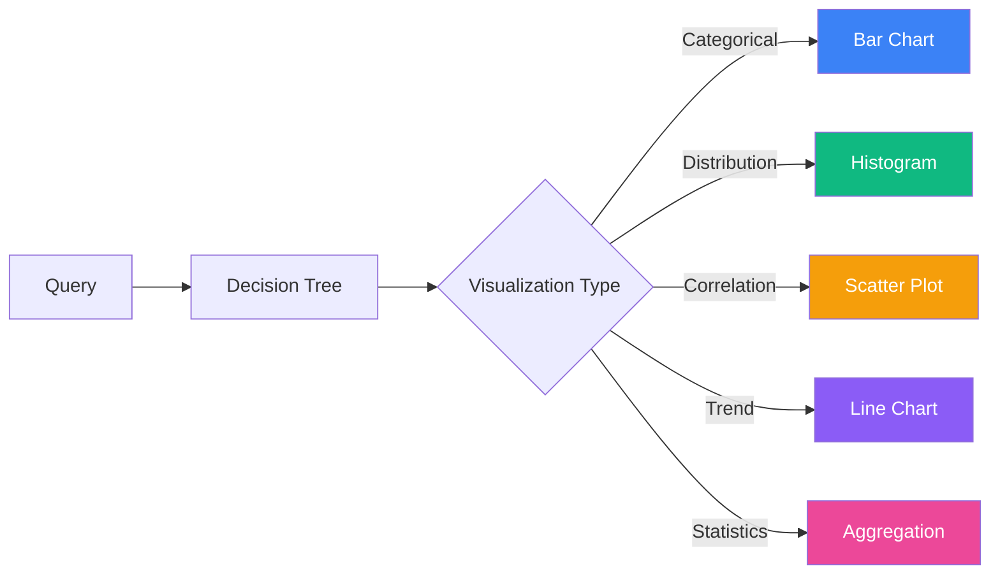
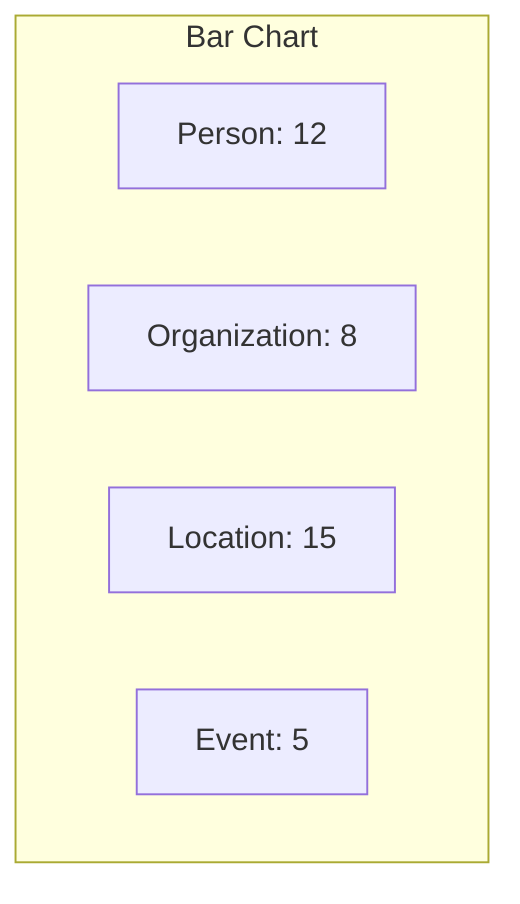
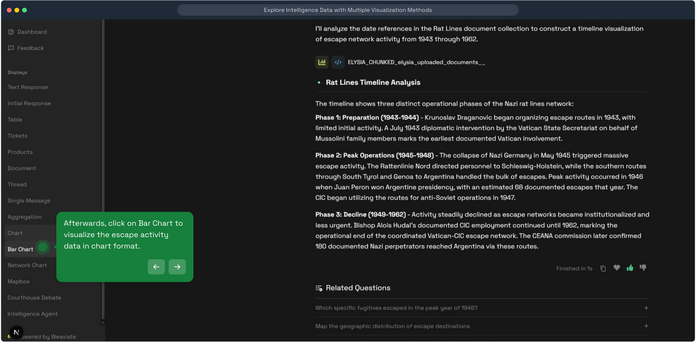
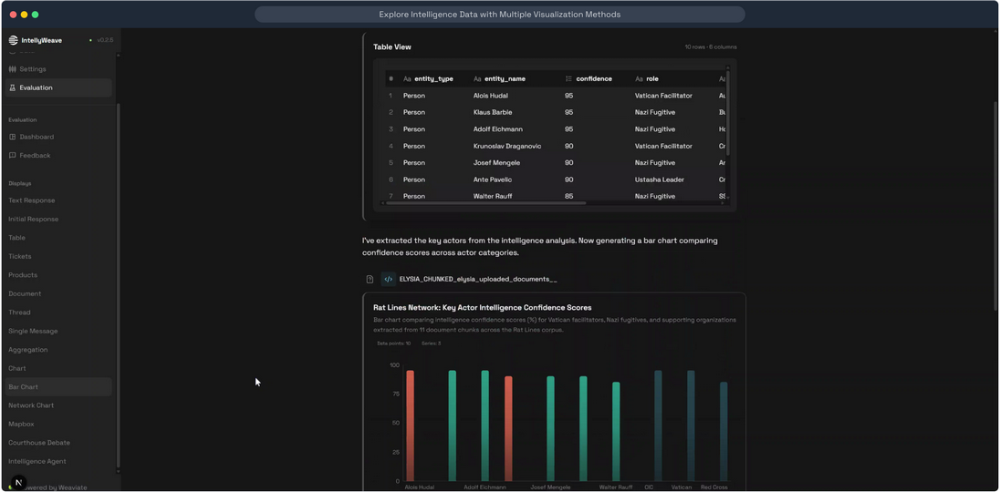
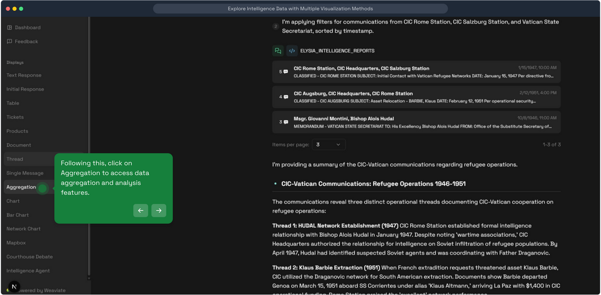
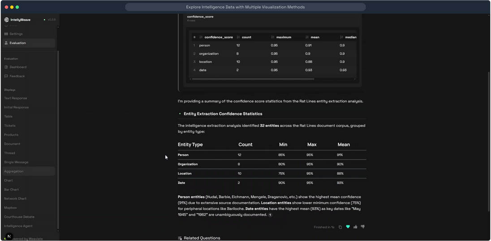

# Data Visualization

**Charts, aggregations, and data displays for analyzing intelligence data through bar charts, histograms, scatter plots, line charts, and aggregation tables.**

## What It Does

IntellyWeave provides multiple visualization types for data analysis:

- **Bar Charts** - Categorical comparisons
- **Histograms** - Distribution analysis
- **Scatter Plots** - Correlation visualization
- **Line Charts** - Time series and trends
- **Aggregation Tables** - Grouped statistics
- **Network Graphs** - Relationship visualization (see [Network Analysis](../network-analysis/))
- **Maps** - Geographic visualization (see [Geospatial Mapping](../geospatial-mapping/))



## Use When

- You need to visualize patterns in extracted data
- You want to compare entity frequencies
- You're analyzing distributions (confidence scores, dates, etc.)
- You need aggregated statistics from Weaviate
- You want to identify trends over time

## Prerequisites

- IntellyWeave backend running
- Documents uploaded with data to visualize
- At least one LLM provider configured

---

## Chart Types

### Bar Chart

Displays categorical data with rectangular bars.

**Best for:** Comparing quantities across categories



#### Data Structure

```typescript
type BarPayload = {
  title: string;
  description: string;
  x_axis_label: string;
  y_axis_label: string;
  data: {
    x_labels: string[] | number[];
    y_values: { [key: string]: number[] | string[] };
  };
};
```

#### Example

```json
{
  "title": "Entity Types Distribution",
  "description": "Count of extracted entities by type",
  "x_axis_label": "Entity Type",
  "y_axis_label": "Count",
  "data": {
    "x_labels": ["Person", "Organization", "Location", "Date"],
    "y_values": {
      "Count": [32, 18, 24, 15]
    }
  }
}
```

### Visual Presentation

#### Bar Chart View



*Access chart visualizations from the sidebar.*



*Bar chart showing entity distribution across categories.*

---

### Histogram

Displays distribution of continuous data across bins.

**Best for:** Understanding value distributions

#### Data Structure

```typescript
type HistogramPayload = {
  title: string;
  description: string;
  data: {
    [key: string]: {
      distribution: number[] | string[];
    };
  };
};
```

#### Example

```json
{
  "title": "Confidence Score Distribution",
  "description": "Distribution of entity confidence scores",
  "data": {
    "Confidence": {
      "distribution": [0.85, 0.92, 0.78, 0.95, 0.88, 0.91, 0.76, 0.89]
    }
  }
}
```

---

### Scatter Plot

Displays relationship between two variables.

**Best for:** Identifying correlations and outliers

#### Data Structure

```typescript
type ScatterOrLinePayload = {
  title: string;
  description: string;
  x_axis_label: string;
  y_axis_label: string;
  data: {
    x_axis: { value: number | string; label: string | null }[];
    y_axis: {
      label: string;
      kind: "scatter" | "line";
      data_points: { value: number | string; label: string | null }[];
    }[];
    normalize_y_axis: boolean;
  };
};
```

#### Example

```json
{
  "title": "Entity Confidence vs Frequency",
  "x_axis_label": "Mention Frequency",
  "y_axis_label": "Confidence Score",
  "data": {
    "x_axis": [
      { "value": 5, "label": "Low" },
      { "value": 12, "label": "Medium" },
      { "value": 25, "label": "High" }
    ],
    "y_axis": [{
      "label": "Confidence",
      "kind": "scatter",
      "data_points": [
        { "value": 0.75, "label": null },
        { "value": 0.88, "label": null },
        { "value": 0.95, "label": null }
      ]
    }],
    "normalize_y_axis": false
  }
}
```

---

### Line Chart

Displays trends over continuous values (often time).

**Best for:** Time series and trend analysis

Uses the same `ScatterOrLinePayload` structure with `kind: "line"`.

#### Example

```json
{
  "title": "Events Timeline",
  "x_axis_label": "Year",
  "y_axis_label": "Event Count",
  "data": {
    "x_axis": [
      { "value": "1945", "label": null },
      { "value": "1946", "label": null },
      { "value": "1947", "label": null }
    ],
    "y_axis": [{
      "label": "Events",
      "kind": "line",
      "data_points": [
        { "value": 15, "label": null },
        { "value": 23, "label": null },
        { "value": 18, "label": null }
      ]
    }],
    "normalize_y_axis": false
  }
}
```

---

### Aggregation Display

Shows grouped statistics from Weaviate aggregate queries.

**Best for:** Summary statistics and grouped counts

#### Visual Presentation



*Access aggregation view from the sidebar.*



*Aggregation table showing grouped statistics.*

#### Data Structure

```typescript
type AggregationPayload = {
  num_items: number;
  collections: AggregationData[];
};

type AggregationData = {
  [key: string]: AggregationCollection;
};

type AggregationCollection = {
  [key: string]: AggregationField;
};

type AggregationField = {
  type: "text" | "number";
  values: AggregationValue[];
  groups?: { [key: string]: AggregationCollection };
};

type AggregationValue = {
  value: string | number;
  field: string | null;
  aggregation: "count" | "sum" | "avg" | "minimum" | "maximum" | "mean";
};
```

#### Example

```json
{
  "num_items": 156,
  "collections": [{
    "ELYSIA_CHUNKED_documents": {
      "person": {
        "type": "text",
        "values": [
          { "value": 32, "field": "person", "aggregation": "count" }
        ]
      },
      "organization": {
        "type": "text",
        "values": [
          { "value": 18, "field": "organization", "aggregation": "count" }
        ]
      }
    }
  }]
}
```

---

## Backend Visualization Tools

### Visualise Tool

The visualization tool generates chart payloads using DSPy signatures:

```python
# backend/elysia/tools/visualisation/visualise.py

class VisualiseTool(Tool):
    """Generates chart data from query results"""

    async def __call__(self, query, data, chart_type):
        # Uses DSPy to determine appropriate visualization
        # Returns structured payload for frontend rendering
```

### Linear Regression

Statistical analysis tool for trend detection:

```python
# backend/elysia/tools/visualisation/linear_regression.py

class LinearRegressionTool:
    """Performs linear regression on numeric data"""
```

---

## Architecture

### Backend Structure

```
backend/elysia/tools/visualisation/
├── visualise.py           # Main visualization tool
├── linear_regression.py   # Statistical analysis
├── objects.py            # Visualization data types
├── prompt_templates.py   # DSPy prompts
└── util.py               # Helper functions
```

### Frontend Structure

```
frontend/app/components/chat/displays/ChartTable/
├── AggregationDisplay.tsx    # Aggregation tables
├── BarDisplay.tsx            # Bar charts
├── HistogramDisplay.tsx      # Histograms
├── ScatterOrLineDisplay.tsx  # Scatter/line charts
└── NetworkDisplay.tsx        # Network graphs
```

### Key Components

| Component | File | Purpose |
|-----------|------|---------|
| **VisualiseTool** | `tools/visualisation/visualise.py` | Generate chart data |
| **AggregateTool** | `tools/retrieval/aggregate.py` | Weaviate aggregations |
| **BarDisplay** | `ChartTable/BarDisplay.tsx` | Bar chart rendering |
| **AggregationDisplay** | `ChartTable/AggregationDisplay.tsx` | Table rendering |

---

## Triggering Visualizations

Visualizations are triggered by:

1. **Natural language queries** - "Show me a bar chart of entity types"
2. **Decision tree routing** - Automatic selection based on data
3. **Aggregate queries** - Statistics from Weaviate

### Example Queries

```
Show a bar chart of entity types extracted.
```

```
What is the distribution of confidence scores?
```

```
Plot the timeline of events mentioned.
```

```
Show aggregated counts by document.
```

---

## Customization

### Chart Colors

Charts use Tailwind CSS colors by default:

```typescript
const chartColors = {
  primary: "#3b82f6",   // Blue
  secondary: "#10b981", // Green
  accent: "#f59e0b",    // Amber
  danger: "#ef4444",    // Red
};
```

### Responsive Design

All charts are responsive and adapt to container size.

---

## Troubleshooting

### Chart Not Rendering

**Cause:** Missing or malformed payload data.

**Solution:**
- Check backend logs for visualization errors
- Verify data structure matches expected type
- Ensure numeric values are not strings

### Empty Aggregation Results

**Cause:** No data matches the aggregation query.

**Solution:**
- Verify documents are indexed in Weaviate
- Check collection name is correct
- Try broader aggregation criteria

### Incorrect Chart Type

**Cause:** Decision tree selected wrong visualization.

**Solution:**
- Be more explicit in query ("show as bar chart")
- Check if data is appropriate for desired chart type

---

## Performance

| Operation | Typical Time |
|-----------|-------------|
| Aggregation query | 0.5-2 seconds |
| Chart data generation | 0.5-1 second |
| Frontend rendering | < 0.5 seconds |

---

## See Also

- [Network Analysis](../network-analysis/) - Network graph visualization
- [Geospatial Mapping](../geospatial-mapping/) - Map visualization
- [Intelligence Analysis](../intelligence-analysis/) - Uses visualizations
- [API Reference](../../reference/api-endpoints.md) - Query endpoints
