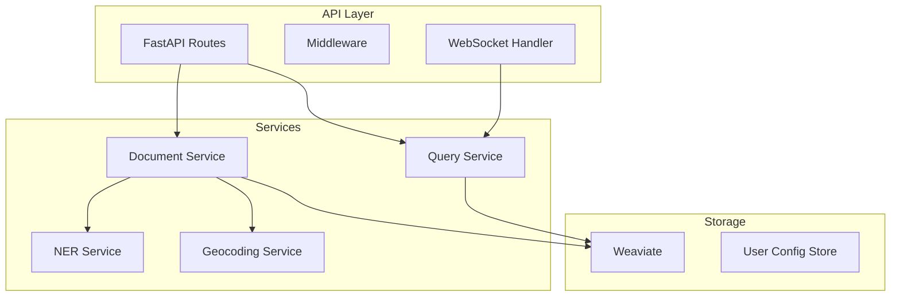

# API Reference

**REST API endpoints for IntellyWeave document management, queries, and system operations.**

## Base URL

```
http://localhost:8000/api
```

## Authentication

Currently, IntellyWeave uses API key authentication for external LLM providers. Internal API endpoints do not require authentication in development mode.

---

## Documents API

### Upload Document

Upload a document for processing and indexing.

```
POST /api/documents/upload
```

**Content-Type:** `multipart/form-data`

**Parameters:**

| Parameter | Type | Required | Description |
|-----------|------|----------|-------------|
| `file` | File | Yes | Document file (PDF, TXT, MD, DOCX, HTML) |
| `user_id` | string | Yes | User identifier |
| `collection` | string | No | Target collection name |

**Request Example:**

```bash
curl -X POST http://localhost:8000/api/documents/upload \
  -F "file=@document.pdf" \
  -F "user_id=user123"
```

**Response:**

```json
{
  "status": "success",
  "document_id": "uuid-here",
  "chunks_created": 45,
  "entities_extracted": {
    "person": 12,
    "organization": 8,
    "location": 15
  }
}
```

---

### List Documents

Get all documents for a user.

```
GET /api/documents
```

**Parameters:**

| Parameter | Type | Required | Description |
|-----------|------|----------|-------------|
| `user_id` | string | Yes | User identifier |
| `collection` | string | No | Filter by collection |

**Response:**

```json
{
  "documents": [
    {
      "uuid": "doc-uuid",
      "title": "Document Title",
      "author": "Author Name",
      "date": "2024-01-15",
      "category": "Intelligence Report",
      "chunk_count": 45
    }
  ],
  "total": 10
}
```

---

### Get Document

Get a specific document by ID.

```
GET /api/documents/{document_id}
```

**Response:**

```json
{
  "uuid": "doc-uuid",
  "title": "Document Title",
  "author": "Author Name",
  "date": "2024-01-15",
  "content": "Full document text...",
  "category": "Intelligence Report",
  "chunk_spans": [
    { "start": 0, "end": 512, "uuid": "chunk-uuid-1" },
    { "start": 462, "end": 974, "uuid": "chunk-uuid-2" }
  ],
  "collection_name": "ELYSIA_UPLOADED_DOCUMENTS"
}
```

---

### Delete Document

Delete a document and its chunks.

```
DELETE /api/documents/{document_id}
```

**Response:**

```json
{
  "status": "success",
  "deleted_chunks": 45
}
```

---

## Query API

### Execute Query

Run a natural language query against the document collection.

```
POST /api/query
```

**Content-Type:** `application/json`

**Request Body:**

```json
{
  "query": "What organizations are mentioned?",
  "user_id": "user123",
  "collection_names": ["ELYSIA_UPLOADED_DOCUMENTS"],
  "max_results": 10
}
```

**Response:**

```json
{
  "query_id": "query-uuid",
  "response": "The documents mention several organizations...",
  "sources": [
    {
      "uuid": "chunk-uuid",
      "text": "Source text excerpt...",
      "score": 0.92
    }
  ],
  "metadata": {
    "processing_time_ms": 1234,
    "model_used": "gpt-4o"
  }
}
```

---

### WebSocket Query

Real-time query with streaming responses.

```
WebSocket /api/ws/query
```

**Connect:**

```javascript
const ws = new WebSocket('ws://localhost:8000/api/ws/query');

ws.send(JSON.stringify({
  type: 'query',
  query: 'Run a full intelligence analysis',
  user_id: 'user123'
}));

ws.onmessage = (event) => {
  const message = JSON.parse(event.data);
  // Handle streaming response
};
```

**Message Types:**

| Type | Description |
|------|-------------|
| `text` | Text response chunk |
| `intelligence_extractor` | Entity extraction results |
| `intelligence_mapper` | Relationship mapping results |
| `intelligence_geospatial` | Geospatial analysis results |
| `intelligence_network` | Network analysis results |
| `intelligence_pattern` | Pattern detection results |
| `intelligence_synthesizer` | Final synthesis |
| `courthouse_defense` | Defense agent argument |
| `courthouse_prosecution` | Prosecution agent argument |
| `courthouse_judge` | Judge verdict |

---

## Collections API

### List Collections

Get all Weaviate collections.

```
GET /api/collections
```

**Response:**

```json
{
  "collections": [
    {
      "name": "ELYSIA_UPLOADED_DOCUMENTS",
      "object_count": 156,
      "properties": ["title", "author", "date", "content"]
    },
    {
      "name": "ELYSIA_CHUNKED_elysia_uploaded_documents__",
      "object_count": 1250,
      "properties": ["chunk_text", "person", "organization", "location"]
    }
  ]
}
```

---

### Get Collection Schema

Get schema for a specific collection.

```
GET /api/collections/{collection_name}/schema
```

**Response:**

```json
{
  "name": "ELYSIA_UPLOADED_DOCUMENTS",
  "properties": [
    { "name": "title", "data_type": "text" },
    { "name": "author", "data_type": "text" },
    { "name": "content", "data_type": "text" },
    { "name": "person", "data_type": "text[]" },
    { "name": "organization", "data_type": "text[]" }
  ],
  "vectorizer": "text2vec-openai"
}
```

---

## Agents API

### List Custom Agents

Get all custom agents for a user.

```
GET /api/agents
```

**Parameters:**

| Parameter | Type | Required | Description |
|-----------|------|----------|-------------|
| `user_id` | string | Yes | User identifier |

**Response:**

```json
{
  "agents": [
    {
      "agent_id": "agent-uuid",
      "agent_name": "Cold War Expert",
      "agent_description": "Specializes in Cold War era intelligence",
      "document_id": "knowledge-base-doc-uuid",
      "created_at": "2024-01-15T10:30:00Z"
    }
  ]
}
```

---

### Create Custom Agent

Create a new custom agent with knowledge base.

```
POST /api/agents
```

**Request Body:**

```json
{
  "user_id": "user123",
  "agent_name": "Cold War Expert",
  "agent_description": "Specializes in Cold War era intelligence analysis",
  "system_prompt": "You are an expert in Cold War history...",
  "document_id": "knowledge-base-doc-uuid"
}
```

**Response:**

```json
{
  "status": "success",
  "agent_id": "new-agent-uuid"
}
```

---

### Delete Custom Agent

Delete a custom agent.

```
DELETE /api/agents/{agent_id}
```

**Response:**

```json
{
  "status": "success"
}
```

---

## Feedback API

### Submit Feedback

Submit user feedback on a response.

```
POST /api/feedback
```

**Request Body:**

```json
{
  "query_id": "query-uuid",
  "user_id": "user123",
  "rating": "positive",
  "comment": "Very helpful analysis"
}
```

**Rating Values:** `positive`, `negative`, `neutral`

**Response:**

```json
{
  "status": "success",
  "feedback_id": "feedback-uuid"
}
```

---

## User Config API

### Get User Configuration

Get user preferences and settings.

```
GET /api/user/config
```

**Parameters:**

| Parameter | Type | Required | Description |
|-----------|------|----------|-------------|
| `user_id` | string | Yes | User identifier |

**Response:**

```json
{
  "user_id": "user123",
  "preferences": {
    "default_model": "gpt-4o",
    "response_style": "detailed",
    "auto_geocode": true
  },
  "api_keys": {
    "openai": "configured",
    "anthropic": "not_configured"
  }
}
```

---

### Update User Configuration

Update user preferences.

```
PUT /api/user/config
```

**Request Body:**

```json
{
  "user_id": "user123",
  "preferences": {
    "default_model": "gpt-5",
    "response_style": "concise"
  }
}
```

---

## Tree Config API

### Get Decision Tree Configuration

Get the current decision tree configuration.

```
GET /api/tree/config
```

**Response:**

```json
{
  "max_iterations": 10,
  "default_tools": ["query", "aggregate", "text"],
  "enabled_features": {
    "intelligence_orchestrator": true,
    "courthouse_debate": true,
    "custom_agents": true
  }
}
```

---

## Health Check

### System Health

Check if the system is healthy.

```
GET /api/health
```

**Response:**

```json
{
  "status": "healthy",
  "weaviate": "connected",
  "llm_providers": {
    "openai": "available",
    "anthropic": "available"
  }
}
```

---

## Error Responses

All endpoints return errors in this format:

```json
{
  "error": {
    "code": "ERROR_CODE",
    "message": "Human readable error message",
    "details": {}
  }
}
```

**Common Error Codes:**

| Code | HTTP Status | Description |
|------|-------------|-------------|
| `INVALID_REQUEST` | 400 | Malformed request |
| `NOT_FOUND` | 404 | Resource not found |
| `UNAUTHORIZED` | 401 | Authentication required |
| `RATE_LIMITED` | 429 | Too many requests |
| `INTERNAL_ERROR` | 500 | Server error |

---

## Rate Limiting

Default rate limits:

| Endpoint | Limit |
|----------|-------|
| Document upload | 10/minute |
| Queries | 60/minute |
| All other endpoints | 120/minute |

---

## API Architecture



---

## See Also

- [Getting Started](../getting-started/) - Initial setup
- [Document Processing](../guides/document-processing/) - Upload pipeline
- [Agents Documentation](../guides/agents/) - Custom agents
